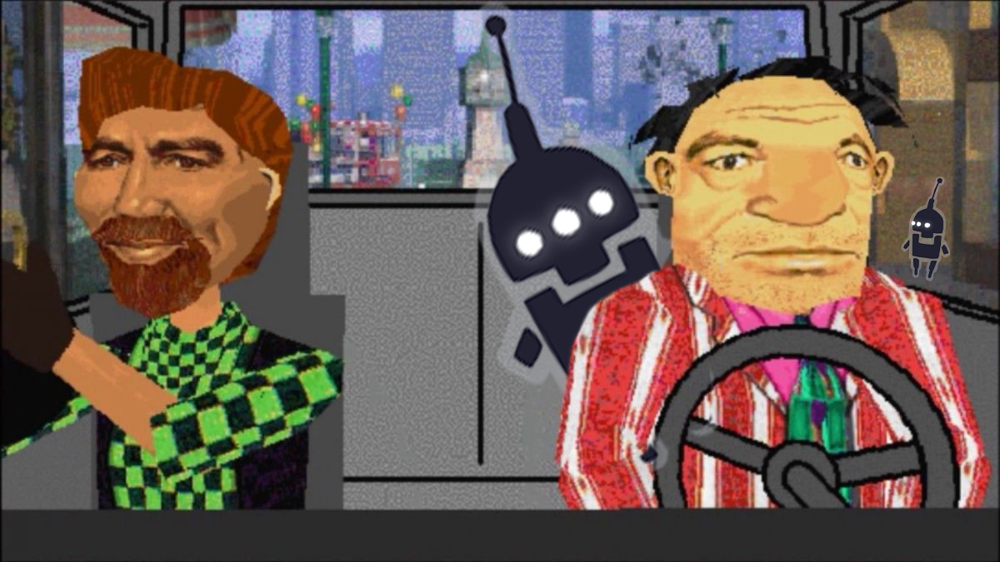

Twitter user <a href="https://twitter.com/Foone">foone</a> has posted some exciting news! <a href="https://twitter.com/aerobatic">Jeremy Elliot San</a>, better known as Jez, (former CEO of <a href="https://en.wikipedia.org/wiki/Argonaut_Games">Argonaut Games</a>) gave permission to publish the source code for the BR (Blazing Render) Engine), which was used in projects like 3D Movie Maker, Croc: Legend of the Gobbos and the first two Carmageddon games.

The story began when foone tweeted asking Microsoft to publish the source code of 3D Movie Maker so that the program and its code could be improvable and extensible. Jez himself got in touch and stated that the rights to BRender belong to him, and that he would be happy to make the source codes publicly available, but he did not have it anymore. Foone responded Jez, that they could coordinate him with whoever had the source code. Microsoft’s <a href="https://twitter.com/shanselman">Scott Hanselman</a> also volunteered to help.

Foone ended up with several versions of the source code: one from 3D Movie Maker and others from some games. But having the code is not enough – you always need permission to publish it, which was soon received.

Foone wrote a letter to THQ Nordic. “From what I understand, the major stumbling block to open sourcing Carmageddon 1 &amp; 2 was the BRender engine licensing, and now that it’s open source… maybe that can happen too!”

At the moment, several versions of the engine are freely available, each of them configured for a specific game. If you are interested, please follow the links below:

<a href="https://github.com/foone/BRender-v1.3.2">https://github.com/foone/BRender-v1.3.2</a>

<a href="https://floppy.foone.org/w/BRender">https://floppy.foone.org/w/BRender</a>

