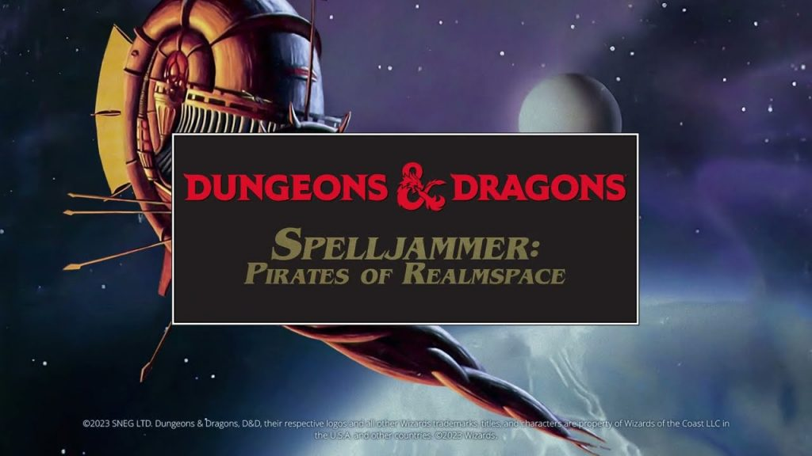
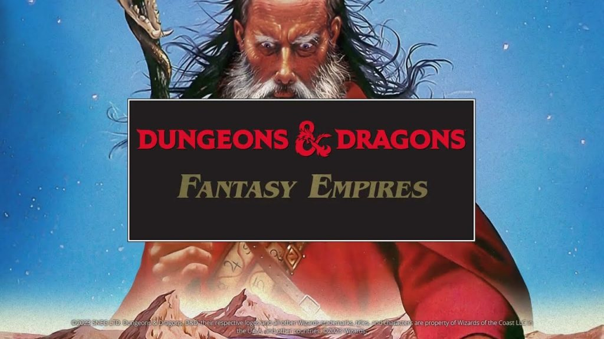

D&amp;D games collection has been updated with eight new adventures!

If you liked <a href="https://generalarcade.com/project/dungeons-dragons-gold-box-classics/">Dungeons &amp; Dragons: Gold Box Classics</a> and classic D&amp;D games in general, then don’t miss the following games!

<strong>Silver Box Classics</strong> collection includes 4 games: 

<strong>Heroes of the Lance</strong>: Discover the world of Krynn in this D&amp;D epic. Control the Companions of the Lance (they aren’t Heroes until they succeed!) in their quest to recover the Disks of Mishakal. Only this can defeat the Queen of Darkness and restore the balance between Good and Evil.

<strong>Dragons of Flame</strong>: Takhisis, Queen of Darkness, and her Draconian hordes have overrun much of the homeland Krynn, even the elven armies of Qualinost, valiant in their resistance to this evil power, struggle on the edge of defeat. It is only the returning Companions of the Lance that can halt this wave of tyranny before Krynn is consumed by evil. Freed from captivity by an elven assault column, the Companions under the guiding direction of the cleric Goldmoon and bolstered by their success at recovering the mystical Disks of Mishakal, can once again restore a belief in the gods and unify the inhabitants of Krynn against the power of Takhisis. Rescue slaves held by the ravaging Dragonarmies in the foul fortress of Pax Tharkas.

<strong>War of the Lance</strong>: That’s the first D&amp;D computer wargame. Prepare for fierce battles and all-out war when the forces of Whitestone clash against the evil Highlord Dragonarmies. The prize: absolute rule over all Ansalon on the Dragonlance game world of Krynn. Send forth your diplomats to forge treaties and gain the allies that will swell the numbers of your troops. When words fail, armies of human, draconians, ogres, dwarves, elves, dragons, and other creatures may prove more persuasive.

<strong>Shadow Sorcerer</strong>: Shadow Sorcerer is a tie-in with the Dragonlance series of novels. The player controls a party of four adventurers that have just rescued 800 slaves and must shepherd them through the wilderness before the evil Dragon army catches up with them. There are three levels to the game: – Strategic, where the player must move the refugees safely through the wilderness. – Tactical, where the party explores dungeons and other areas of interest, searching for information and treasure to assist the escape. – Political, where the players must deal with the refugee leaders and convince them to continue following the party. All three take place in real-time with the evil dragons constantly on the adventurers’ heels slowly picking off the escapees.

Each of these gaming gems brings its own unique flare and adventure for you to enjoy, ranging from platform to real-time combat experience.

<a href="https://store.steampowered.com/app/2344020/Silver_Box_Classics/">Steam</a> / <a href="https://www.gog.com/en/game/silver_box_classics">GOG</a>

<figure class="wp-block-image size-large"></figure>

<strong>Spelljammer: Pirates of Realmspace:</strong> SOLAR WINDS CARESS your face as mystic powers propel the majestic galleon through the atmosphere and into the ether of Realmspace. Gazing beyond the deck, you are overwhelmed by the beauty of the receding planet Toril, home of the Forgotten Realms. “Ship insight!” a lookout calls. The dreaded snail silhouette of a neogi warship eclipses the planet and rapidly closes to attack. You turn the massive ship toward the intruder and call out to your officers and crew, “Man your station! Enemy off the port bow!”

Captain your own Spelljammer ship in PIRATES OF REALMSPACE. Recruit officers and crew to man your magical ship. Soar into the ether and explore the planets of Realmspace.

Embark on adventurous missions – deliver precious cargo, pursue pirates – to build your reputation as a Spelljammer captain. Ultimately, discover the terrible conspiracy that threatens to conquer Realmspace itself!

<a href="https://store.steampowered.com/app/2350550/Spelljammer_Pirates_of_Realmspace/">Steam</a> / <a href="https://www.gog.com/en/game/spelljammer_pirates_of_realmspace">GOG</a>

<figure class="wp-block-image size-large"></figure>

<strong>Fantasy Empires:</strong> Forge your own empire in this D&amp;D game – the first to feature a computer DUNGEON MASTER who mediates all elements of the game play.

This exciting game lets you face one to four adversaries chosen from among 20 computer-controlled opponents. Interact with fantastic races, including humans, elves, orcs, dwarves, humanoids, and the undead. Command dozens of troop types. Deploy special forces. Send your heroes on quests and construct a variety of buildings and fortifications. Extensive character interaction, utilizing AI and Neural Network technology throughout the game (already back in 1993!), provides for diplomatic tactics. When combat occurs, the screen switches from a strategic map to a tactical display that shows real-time action in one of the most spectacular overhead perspectives yet!

<a href="https://store.steampowered.com/app/2350530/Fantasy_Empires/">Steam</a> / <a href="https://www.gog.com/en/game/fantasy_empires">GOG</a>

<figure class="wp-block-image size-large"></figure>

<strong>DragonStrike:</strong> This FIRST-EVER dragon combat simulator lets you fly the mighty dragons of Krynn into fierce combat!

The War of the Lance has begun! The vile Dragon armies are on the rampage and evil dragons cast long, dark shadows across the lands of Ansalon. All hope for victory lies with the Solamnic Knights, those brave fighters who ride into aerial combat on the backs of their trusty powerful steeds — the good dragons of Krynn.

But time is short and Evil is spreading. To the skies brave knight — and victory!

<a href="https://store.steampowered.com/app/2350520/DragonStrike/">Steam</a> / <a href="https://www.gog.com/en/game/dragonstrike">GOG</a>

<figure class="wp-block-image size-large"></figure>

<strong>DeathKeep:</strong> An evil Necromancer has escaped from his icy prison and is wreaking havoc upon the surrounding lands. Journey to a bleak, frozen wasteland and put an end to the terror!

You have 3 characters to choose from: a male fighter dwarf, a male half-elf fighter mage, or a female elf mage, each of which give a unique flair to the game. Watch the mood of the game intensify as the cinematics change according to the active character. This is the nostalgia dungeon delving at its best – fast, furious, and fun.

<a href="https://store.steampowered.com/app/2350540/DeathKeep/">Steam</a> / <a href="https://www.gog.com/en/game/deathkeep">GOG</a>

