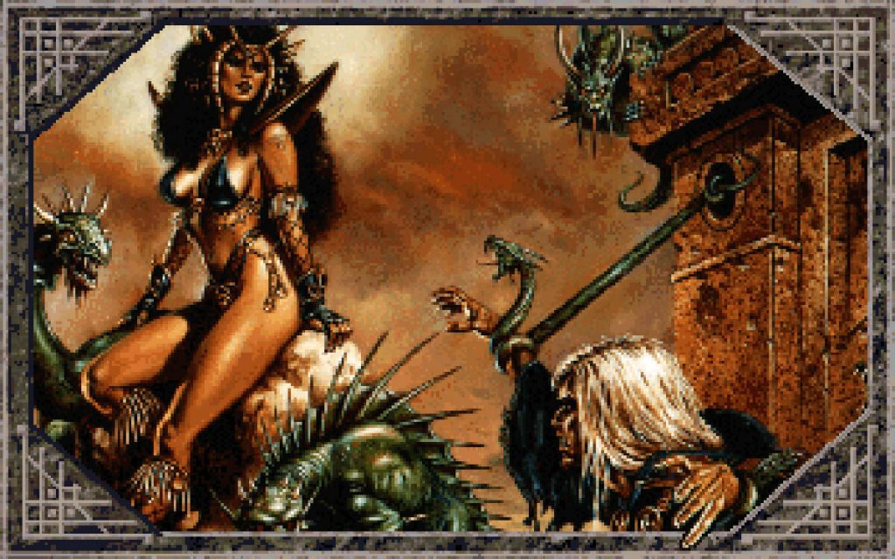
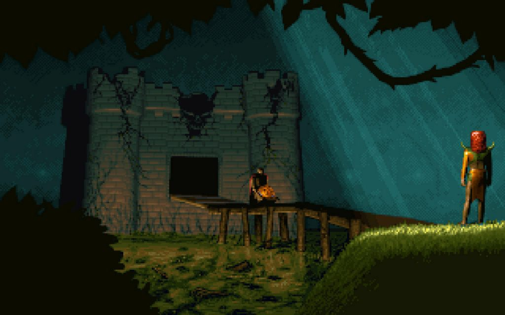

Dungeons &amp; Dragons Gold Box Classics has finally been <a href="https://store.steampowered.com/bundle/24494/Gold_Box_Classics/" rel="noreferrer noopener" target="_blank">released on Steam</a> bringing to life many of D&amp;D’s most iconic monsters, heroes, and villains!

The Forgotten Realms world of Dungeons &amp; Dragons has been home to many a hero and imagination since its publication, producing adventures and stories to be retold and enjoyed for years to come.

<figure class="wp-block-image size-large"></figure>

The “Gold Box Classic” release combines all three Collections on The Forgotten Realms Archives, including such famous titles as The Eye of the Beholder, Pool of Radiance, Curse of the Azure Bonds, Menzoberranzan and many others as well as Ravenloft, Krynn and Dark Sun series.

And there is more! Apart from the actual Gold Box Classic we strongly recommend you to play attention to remarkable kingdom simulator <a href="https://store.steampowered.com/app/1904650/Dungeons__Dragons__Stronghold_Kingdom_Simulator/" rel="noreferrer noopener" target="_blank">Stronghold: Kingdom Simulator</a> and try yourself as an outcast, betrothed to the caliph’s daughter and the son of a sultan whose once mighty clan has been dishonored, in <a href="https://store.steampowered.com/app/1904640/Dungeons__Dragons__AlQadim_The_Genies_Curse/" rel="noreferrer noopener" target="_blank">Al-Qadim: The Genie’s Curse</a>!

<figure class="wp-block-image size-large"></figure>

Initially, the project’s goal was to release Gold Box on Steam. Original games had several bugs that were fixed in the process, and General Arcade specialista also added handy PDFs to the packages made. After it was decided to make a custom game launcher on Qt.

Launcher makes it easier for players to access necessary documentation (Journals, Manuals, Cluebooks, etc). It also provides a simple interface for selecting game language, changing resolution, enabling Gold Box Companion, launching internal game settings, dosbox settings and resetting in-game progress. And of course, import progress copies characters from past games in the series, allowing you to continue playing as them.

<figure class="wp-block-image size-large"></figure>
<figure class="wp-block-image size-large"></figure>

