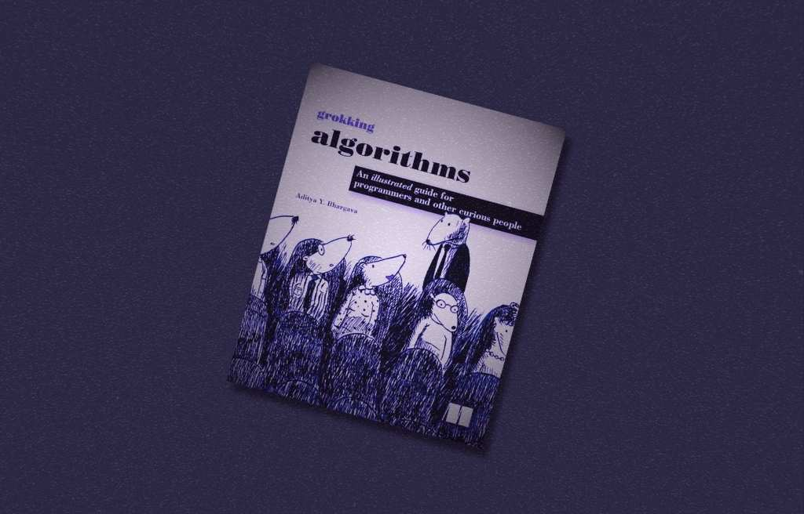
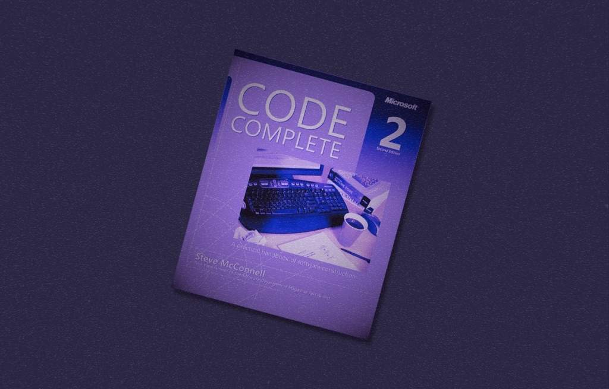
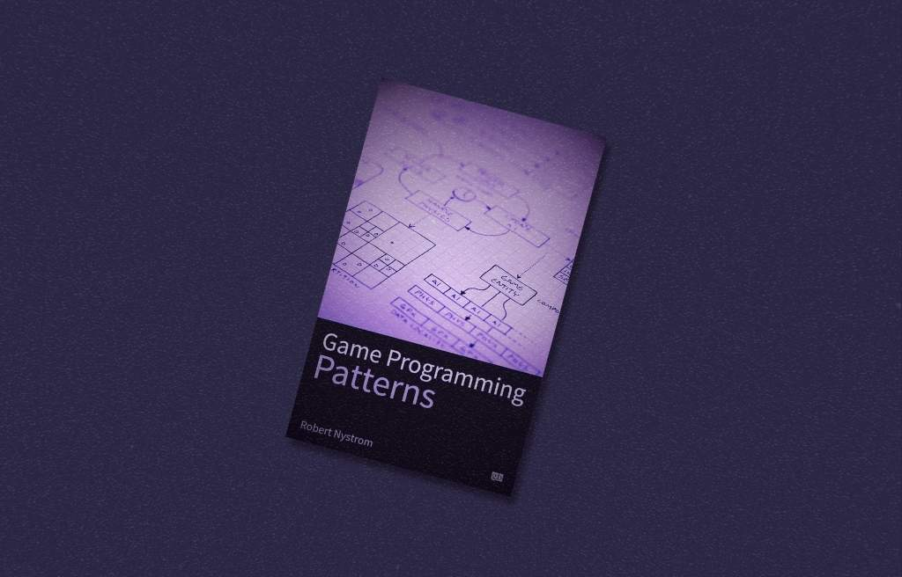
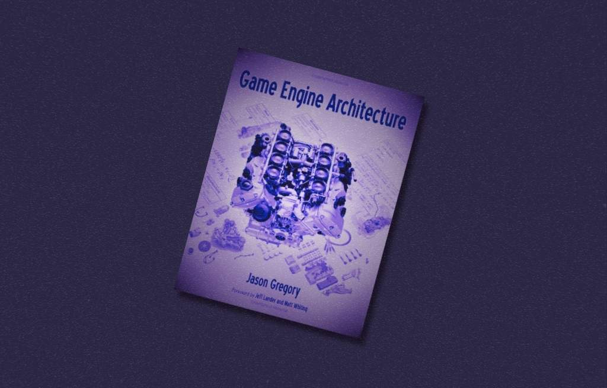
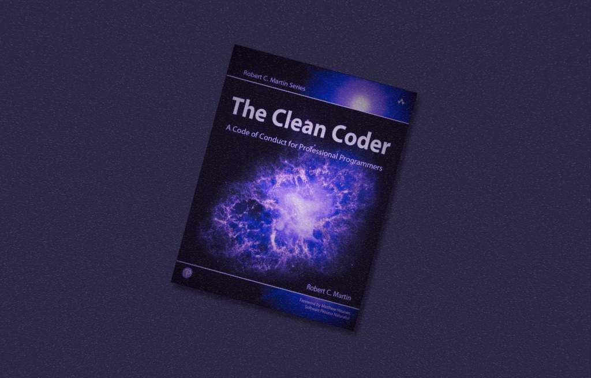

*Some great programming books recommended by our former team member Aleksandr Novikov which are perfect for those short on inspiration and time.*

[Grokking Algorithms](https://www.adit.io/posts/2016-05-25-Grokking-Algorithms-Is-Out.html) *by Aditya Y. Bhargava*

This was one of my first programming books. It’s an easy and fun read to grasp basic data structures and algorithms.

[Code Complete](https://stevemcconnell.com/books/) *by Steve McConnell*

A classic that demonstrates good coding practices, no matter the language. I’ve re-read it multiple times (though selectively).

[Game Programming Patterns](https://gameprogrammingpatterns.com/) *by Robert Nystrom*

This book illustrates the application of programming patterns specifically in game development. It’s written in simple language and is quite easy to follow.

[Game Engine Architecture](https://www.gameenginebook.com/) *by Jason Gregory*

A comprehensive guide packed with knowledge about systems used in game engines.

[The Clean Coder: A Code of Conduct for Professional Programmers](http://cleancoder.com/files/cleanCodeCourse.md) *by Robert C. Martin*

A great read for developing soft skills for developers, authored by the renowned Uncle Bob.
