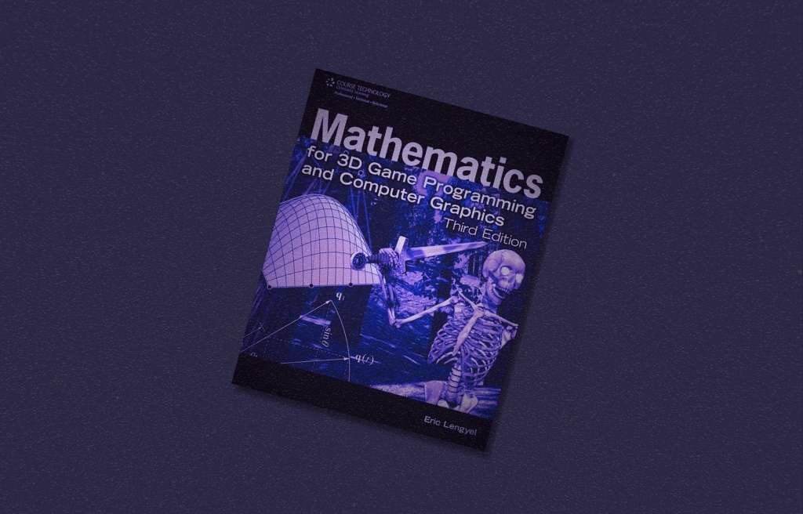
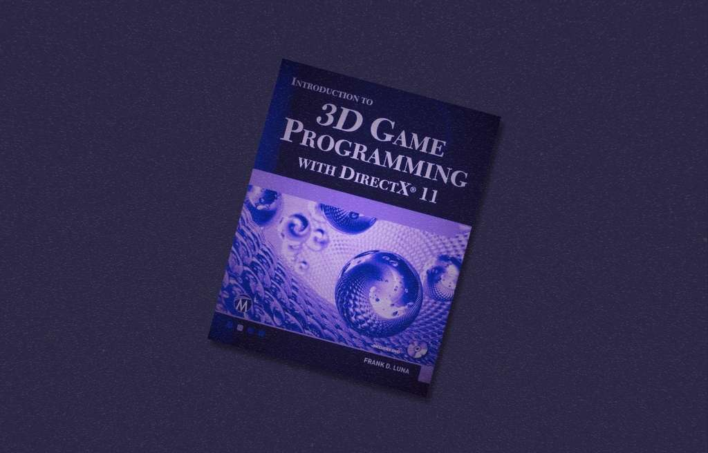
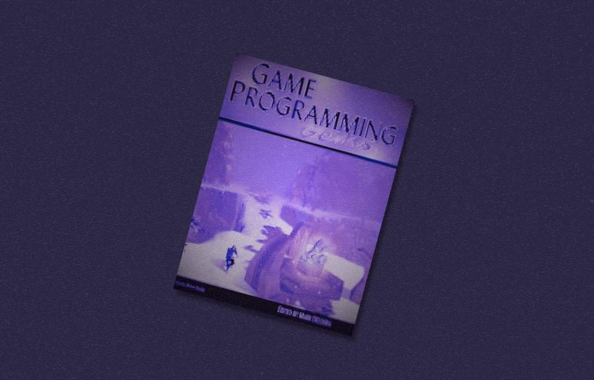
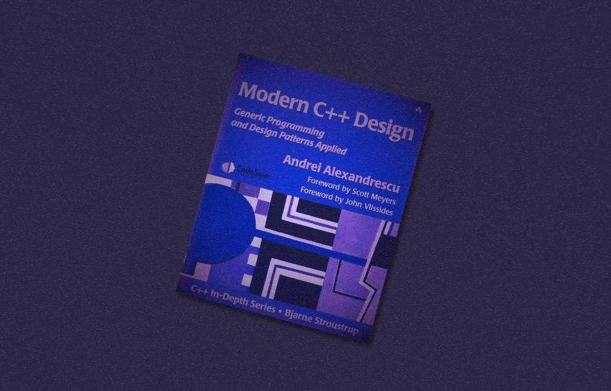
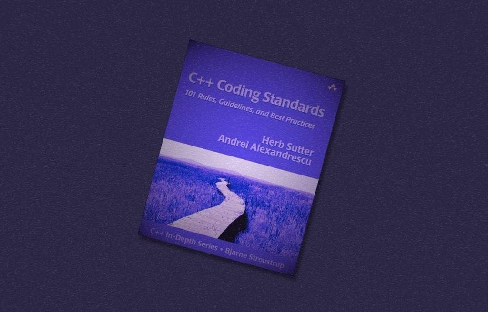
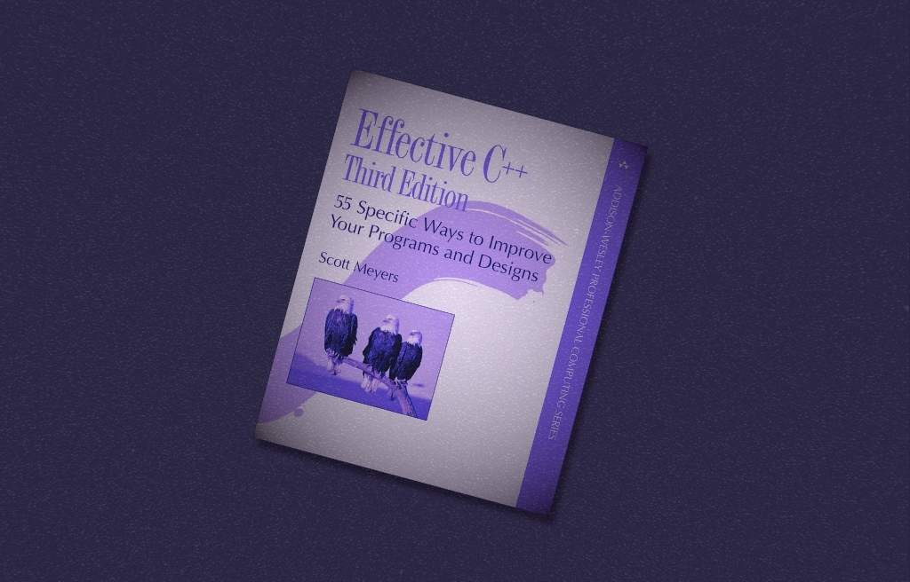
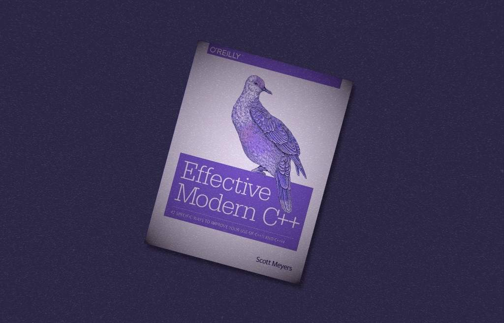

*Our team of experts are committed to continuous learning and knowledge sharing. One of our Software Engineers, Denis, has a unique approach to programming that focuses on simplicity and strategic problem-solving. He believes that understanding how people think is essential in programming, as it begins in the mind rather than on a computer. While technical skills like programming languages and mathematical methods are important, the core of programming lies in the mental process and problem-solving abilities. Drawing from years of experience and a passion for mentoring, Denis has curated a list of best programming books that  act as essential resources for those looking to advance their programming skills, especially in game development and C++ programming.*

**Denis R.: A Comprehensive Guide for Aspiring and Experienced Programmers**

**[Hacker’s Delight (2nd Edition)](https://ptgmedia.pearsoncmg.com/images/9780321842688/samplepages/0321842685.pdf)** *by Henry S. Warren*

“Hacker’s Delight” is an essential read for anyone seeking to deepen their knowledge of programming and computer science. This comprehensive guide to bitwise operations fills a crucial gap often overlooked in standard programming courses, offering valuable insights into low-level programming, optimization, and the fundamental workings of computers. It presents a diverse collection of programming tricks and techniques that are intellectually stimulating and practically applicable, particularly in the game development industry.

Covering a broad spectrum of topics from basic arithmetic operations and data compression to advanced cryptography coupled with prime number generation. It serves as a valuable reference for both beginners and experienced programmers.

**[Mathematics for 3D Game Programming and Computer Graphics (3rd Edition)](https://terathon.com/lengyel/)** *by Eric Lengyel*

This read provides a solid mathematical foundation for understanding 3D graphics and game programming. Focusing on the practical application of mathematical concepts such as vectors, matrices, transformations, and quaternions (which are crucial to working with 3D games) in real-world game development and computer graphics, the book simplifies complex mathematical concepts, making them accessible to a wide audience.

The book dives into the real-world application of mathematical concepts in game development and computer graphics. By breaking down complex math into step-by-step explanations, it makes these concepts accessible even if you’re not a math whiz. It’s like a bridge between theory and practice, making sure you get it!

**[Introduction to 3D Game Programming with DirectX 11 (Pap/DVD Edition)](https://www.d3dcoder.net/d3d11.htm)** *by Frank Luna*

I think this book stands out as an excellent resource for learning DirectX 11. With in-depth coverage of the API, this book is essential for anyone interested in game development. Written in simple language to make complex concepts easy to understand, it expertly guides readers through the entire process of 3D game programming, utilizing a hands-on approach with numerous examples and exercises to reinforce learning. This strong emphasis on practical application helps reinforce understanding and cultivate confidence in applying the concepts.

**[Game Programming Gems (GAME PROGRAMMING GEMS SERIES)](https://www.satori.org/game-programming-gems/)** *by Mark DeLoura*

This entire series is a compilation of articles and techniques from industry experts, serving as a valuable resource for developers working on different aspects of game development. It encompasses a wide range of topics such as graphics, AI, physics, networking, and optimization, making it an invaluable resource for developers involved in various aspects of game development.

The “Gems” series is recognized for providing practical, ready-to-use solutions to common programming challenges, the series offers valuable tips and tricks shared by professionals which saves time and effort of fellow developers.

**[Modern C++ Design: Generic Programming and Design Patterns Applied (1st Edition)](https://elhacker.info/manuales/Lenguajes%20de%20Programacion/C++/%5BAddison%20Wesley%5D%20Andrei%20Alexandrescu%20-%20Modern%20C++%20Design%20Generic%20Programming%20and%20Design%20Patterns%20Applied.pdf)** *by Andrei Alexandrescu*

This book is mainly focused on implementing design patterns using generic programming techniques. It provides valuable insights into writing flexible, reusable, and efficient code, making it an indispensable resource for C++ developers.

**[C++ Coding Standards: 101 Rules, Guidelines, and Best Practices 1st Edition](http://www.gotw.ca/publications/c++cs.htm)** *by Herb Sutter and Andrei Alexandrescu*

This read shares the best ways to write C++ code from experienced software engineers. The rules are explained clearly, so developers can use them right away in their own projects. By following the coding standards in this book, teams can keep their codebases consistent. It’s helpful for beginners who want to write better codes and for experienced developers looking for advanced tips and techniques.

**[Game Engine Architecture (3rd Edition)](https://generalarcade.com/best-programming-books-1-algorithms-coding-practices-gamedev/)** *by Jason Gregory*

This book provides a comprehensive exploration of game engine architecture and design. It offers thorough explanations of intricate systems and algorithms, enabling readers to grasp the fundamental principles underlying game engine architecture. Packed with diagrams, code snippets, and illustrations, the book effectively simplifies complex concepts.

Even better, the third edition has been meticulously updated to incorporate the most recent advancements in game development technology and practices. It also encompasses the best practices in game engine development, encompassing everything from software engineering principles to performance optimization techniques.

**[Effective C++: 55 Specific Ways to Improve Your Programs and Designs (3rd Edition)](https://www.aristeia.com/books.html)** *by Scott Meyers*

This book delves into modern C++ techniques and idioms, aiding developers in crafting new code and understanding legacy code. With its structure consisting of concise, focused chapters, each dedicated to a specific guideline, it provides clear explanations and real-world examples to support each best practice, making it effortless to implement these principles into one’s own code. This resource effectively identifies and rectifies common mistakes and misconceptions in C++ programming, empowering developers to steer clear of these pitfalls in their work, thereby reducing bugs and streamlining the development process. By showcasing best practices in C++ development, it guides programmers in embracing a professional approach, facilitating the creation of higher-quality, more reliable, and easily maintainable code.

**[Effective Modern C++: 42 Specific Ways to Improve Your Use of C++11 and C++14 (1st Edition)](https://www.aristeia.com/books.html)** *by Scott Meyers*

This particular book effectively bridges the gap between old and new C++ standards. Like the previous books, it presents advice in the form of specific guidelines, each addressing a common problem or best practice. These guidelines assist developers in crafting code that is not only more efficient but also safer and easier to maintain. The book offers comprehensive explanations of C++ features, aiding developers in understanding how to use them effectively and avoid common pitfalls.
