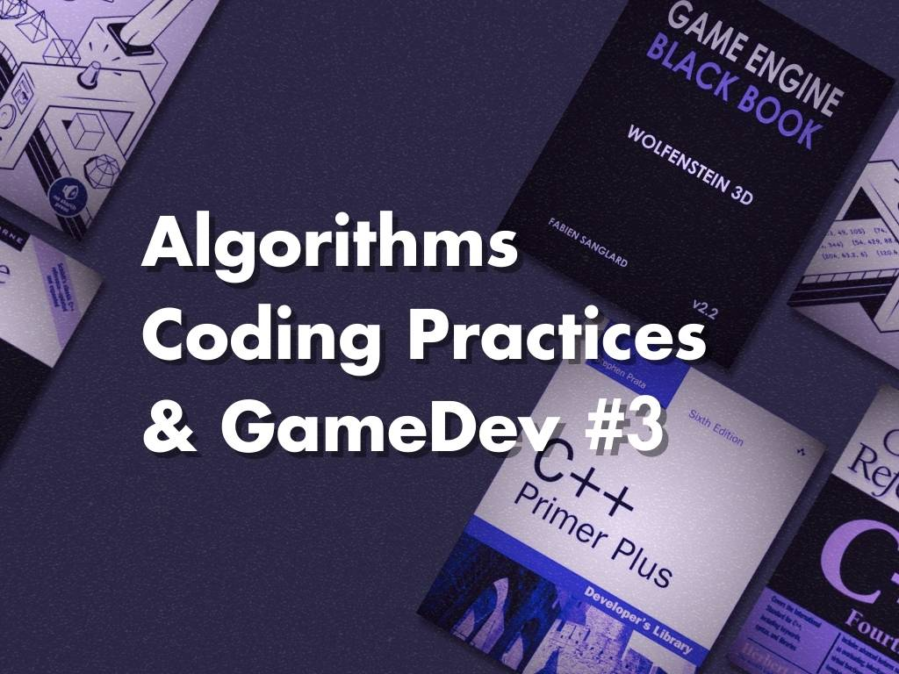
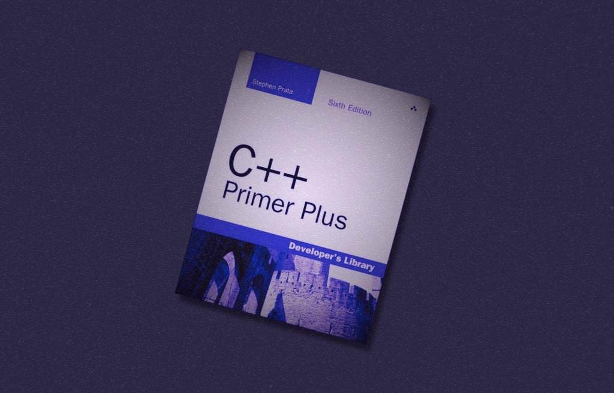
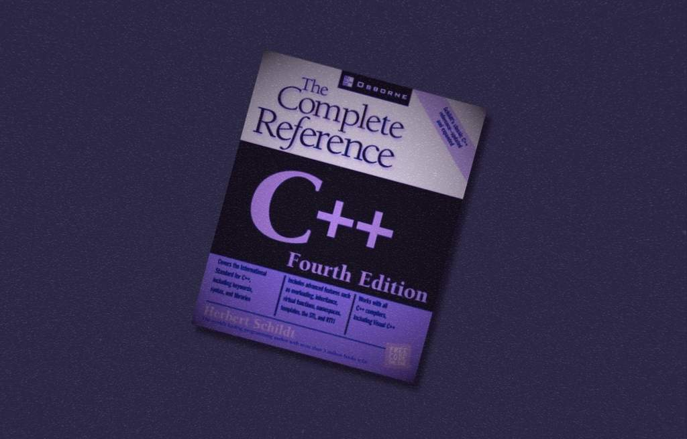
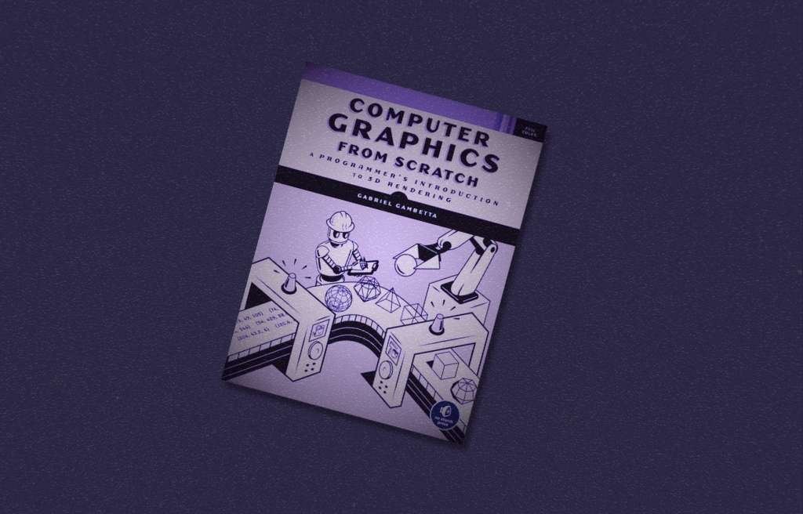

<em>Our dedicated professionals at General Arcade are always looking to expand their skills while sharing their insights with others. Dmitrii S., one of our exceptionally skilled software engineers, emphasizes the importance of mastering programming fundamentals and honing problem-solving abilities for coders.</em>

 <em>To support this journey, Dmitrii has shared some of his favorite programming books for both newcomers and experienced talents to explore and enhance their knowledge.</em>

<h3 id="h-dmitrii-s-a-comprehensive-guide-for-aspiring-and-experienced-programmers"><strong>Dmitrii S.: A Comprehensive Guide for Aspiring and Experienced Programmers</strong></h3>

I have been working at General Arcade for almost six years, during which I’ve had the opportunity to port and remaster games across multiple platforms, including PC, Nintendo Switch, Xbox Series X/S, and PlayStation 5. These games varied in complexity — some were built using well-known engines like GameMaker Studio and Unity, but many relied on custom C++ engines. Each project presented a unique set of challenges. For instance, I frequently needed to interpret and translate game scripting languages into C++, reconcile differences between various versions of these languages, emulate GameMaker’s graphical API within Unity, implement legacy DirectX functionality using newer versions, and adapt PC mouse input for gamepads in games that were not originally designed for them. These tasks required a deep understanding of programming fundamentals and creative problem-solving.

 I’m not alone — many colleagues share similarly varied technical journeys. In our field, mastering the basics and honing general problem-solving skills is essential due to the unpredictable and broad nature of our work. On that note, we’ve already shared a few articles with book recommendations from our team, but there’s always more to explore, and we’d like to further contribute to that collection.

<h6 id="h-c-primer-plus-by-stephen-prata"><strong><a href="https://www.amazon.com/Primer-Plus-6th-Developers-Library/dp/0321776402">C++ Primer Plus</a> by Stephen Prata</strong></h6>
<figure class="wp-block-image size-large is-style-default"></figure>

This was the book that started my journey with C++. It not only laid out the fundamental concepts but also provided practical examples and activities that helped reinforce my understanding. I found myself returning to it repeatedly for explanations and solutions. Before the era of instant Internet searches for quick information, this book was an essential guide that helped me build a solid foundation in programming. Even today, it continues to be a fantastic resource for anyone aiming to grasp C++ deeply, regardless of whether you’re just starting out or looking to refresh your knowledge—an initial step on a long, rewarding journey.

<h6 id="h-c-the-complete-reference-by-herbert-schildt"><strong><a href="https://herbschildt.com/">C++ The Complete Reference</a> by Herbert Schildt</strong></h6>
<figure class="wp-block-image size-large"></figure>

In many ways, this book closely resembles Stephen Prata’s. I used it to double-check and reinforce concepts. At times, I found myself reading the same content in both, which was a great way to drill important ideas into my mind. It’s a thorough reference for C++, covering everything from the basics to more advanced features. For those who prefer a different approach or writing style, Schildt’s book offers a solid alternative.

<h6 id="h-game-engine-black-book-wolfenstein-3d-by-fabien-sanglard"><strong><a href="https://generalarcade.com/game-engine-black-book-wolfenstein-3d/">Game Engine Black Book: Wolfenstein 3D</a> by Fabien Sanglard</strong></h6>
<figure class="wp-block-image size-large"></figure>

This book dives deep into the technical challenges of developing early games like Wolfenstein 3D. It shows the creative tricks that developers of earlier times utilized. There’s a lot of low-level programming here, and it’s a great motivator for understanding the foundations of game development. Be prepared—this one gets into assembly language and other complex topics, but it’s fascinating to see how much they accomplished with limited resources. In today’s world, where tools and resources are abundant, it’s inspiring to reflect on the potential of individual developers, which has evolved significantly over the years.

<h6 id="h-computer-graphics-from-scratch-by-gabriel-gambetta"><strong><a href="https://www.gabrielgambetta.com/computer-graphics-from-scratch/index.html">Computer Graphics from Scratch</a> by Gabriel Gambetta</strong></h6>
<figure class="wp-block-image size-large"></figure>

This book was an adventure into the fundamentals of computer graphics. Gambetta walks you through building your own software renderer and raytracer from the ground up. In an era where so much is hidden in libraries and APIs, it’s refreshing—and important—to revisit the basics. I loved learning about the algorithms that power everything from video games to animated films. You never know when these foundational concepts will come in handy—particularly when working on projects that span decades, from the oldest techniques to today’s cutting-edge developments.

