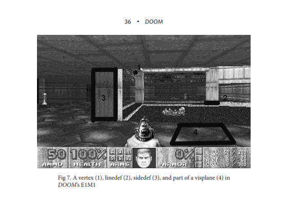
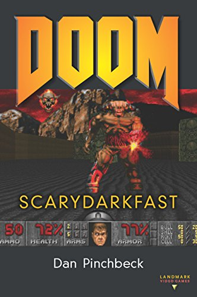

<em>The General Arcade library has hundreds of different books about video games and game development. Each month we cover the best of them, which will be useful for developers and/or inquisitive readers.</em>

So much has been said and shown about DOOM that it would seem there is nothing more to add. Hundreds, no, thousands of articles, essays, and interviews. A book about the history of the developers, <a href="https://generalarcade.com/game-engine-black-book-doom/">a book about the game’s engine</a>, even novels based on the game… But what if a famous game developer who is crazy about DOOM wrote a scientific book and looked at the game from the Game Studies point of view? Just think about it: DOOM, science, and a book. Such a mix is definitely worth a try.

15 years ago, Game Studies was hardly a noticeable phenomenon: there wasn’t a lot of quality literature, and the audience wasn’t that interested in it. Over the years, the amount of content began to grow, first came courses devoted to games, and then entire schools appeared . Of particular interest are lectures, courses, and books created by experienced game developers. Our book today is just one of those: Dan Pinchbeck has not only created the “walking simulator” genre, but also developed some perfectly received games (Dear Esther, Amnesia: A Machine for Pigs, Everybody’s Gone to the Rapture). Dan has an excellent understanding of games and how to make them, so reading his analysis will not only be interesting but also useful.

The first thing you should immediately pay attention to is the lack of a historical part. Don’t expect the author to retell Carmack and Romero’s childhood, all historical information is given here solely to reinforce the context. Almost at the very beginning, Pinchbeck recommends reading Masters of DOOM by David Kushner to those who are interested in the history of the studio and its developers. However, the lack of the historical part does not make the book uninteresting or boring: almost immediately, Pinchbeck begins to talk about games in the first person, their merits and development. From a scientific point of view, it is very necessary to understand the context when the game was released and the author does an excellent job with the introduction: the book talks about the very first games in an accessible way from the first person, then about the development and influence of Wolfenstein, and after that Pinchbeck moves on to the most interesting thing – to DOOM.

<figure class="aligncenter size-large"><figcaption>The book has several illustrations with comments by the author, but they are not all in color.</figcaption></figure>

Pinchbeck shares not only his “scientific” view of game design, but while collecting information for the book, he spoke with Carmack, Romero, Tom Hall and other former members of id. Understanding the principles of the development of the id Tech 1 engine, it becomes much clearer why some of the levels are based on certain design decisions. Bobby Prince, the composer of the game, talks about the then game music limitations of those years, and Sandy Petersen comments on certain game situations on the levels.

As many as three chapters are devoted to the levels of the game, each covers a separate game episode (there were three in the basic version). In these chapters, Pinchbeck arranges a text-based let’s play guide, where he talks about the most remarkable places on the levels with the addition of comments from the creators. For many readers, some DOOM levels that have already seemed familiar will be able to open from a new perspective when they learn how these levels were made and what was behind the sometimes unusual decisions.

<figure class="aligncenter size-large"><figcaption>Original cover</figcaption></figure>

If you have enough time, we recommend that you read these three chapters, going through the described levels with the author. This will add a unique immersion to the game and give you a unique experience. It will be a real excursion into the game with an amazing guide.

The chapters that follow don’t disappoint either, as we learn about the impact DOOM has had on the modding scene and multiplayer that can’t be overestimated. Innocent fun, which the developers did not take seriously, eventually stood at the origins of eSports. DOOM is a game that surprises in many different ways.

Of course, the author mentioned re-releases, ports and sequels. The original edition dates back to 2013, so Pinchbeck doesn’t talk about DOOM (2016) and DOOM Eternal (but he liked them a lot, if anything), but he explains well the phenomenon of DOOM 3, which has gone too far from the origins of the series.

<figure class="aligncenter size-large"><figcaption>Russian edition cover. Art by <a href="https://www.artstation.com/dartagnan">Dmitriy Druzhkov</a></figcaption></figure>

All the chapters of this book have two things in common – a love for the topic under consideration and a scientific point of view that does not allow this love to make biased statements. When necessary, the author criticizes certain points or takes comments from the authors themselves. This side view adds to the importance of the book. This book isn’t about fanboy excitement, it’s scientific proof of why DOOM is a great game. I wish there were more books like this. Of course, cult games do not need to once again prove their importance, history speaks for itself, but science obliges us to consider and explain everything. And then in the process you can discover a lot of interesting things.

If you’re interested in this book and want to read it, the good news is that the <a href="https://library.oapen.org/bitstream/handle/20.500.12657/24022/1006111.pdf">digital edition is absolutely free</a>. Alas, the paper edition in English is very rare and quite expensive.

