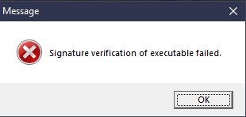
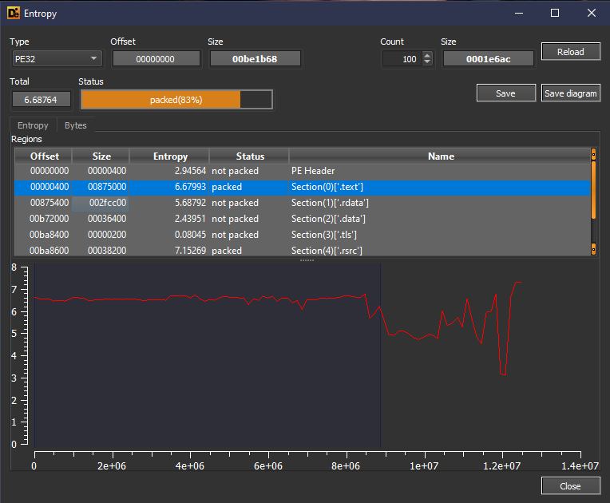
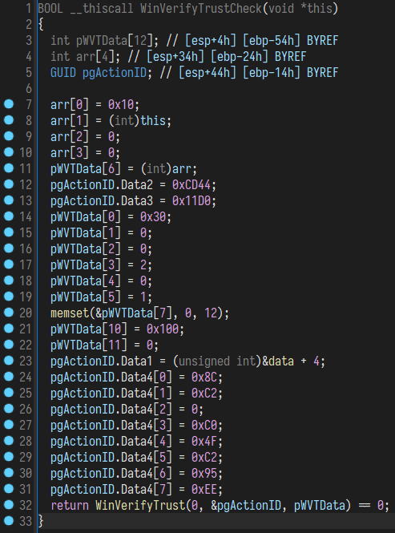

Serious Sam is one of the series that got its love from the players absolutely worthily. Whether it’s posh The First Encounter, crazy The Second Encounter, controversial Serious Sam 2 or “adult” Serious Sam 3, each game invariably immerses you in a unique mix of grotesque and an irony with inornate jokes of protagonist and non-stop action.

Ten years have passed since the release of Serious Sam 3, and lots of things changed in the world during that time — a new generation of consoles arrived, the bitcoin rate skyrocketed… Video games have also changed. But something remained unchanged — anti-piracy protection by Croteam.

First of all, we’d like to note that this article was written for informational purposes only, most of the technical information was changed, and detailed nuances are not disclosed. We don’t support piracy in any way and we encourage you to always support the developer!

<h2 id="h-part-i-getting-the-right-game-build"><strong>Part I: Getting the Right Game Build</strong></h2>

Let’s start with the main thing, searching for the build that we need. The fact is that the current version of Serious Sam 3 on Steam no longer contains custom DRM — for some reason known only to them, the developers or the publisher completely cut it out. But we are not looking for easy ways, right?

Although, in fact, downloading the build we need with “hellish” DRM is not so difficult — many thanks to Valve for the SteamCMD console utility and the ability to download old game builds, simply knowing the ID of the desired manifest and the ID of the depot we need (that is, the container with files). The IDs we need:

<ul><li>download_depot 41070 41071 XXXXXXXXXXXXXXXXXXX</li><li>download_depot 41070 41074 XXXXXXXXXXXXXXXXXXX</li><li>download_depot 41070 41075 XXXXXXXXXXXXXXXXXXX</li><li>download_depot 41070 41076 XXXXXXXXXXXXXXXXXXX</li><li>download_depot 41070 41079 XXXXXXXXXXXXXXXXXXX</li><li>download_depot 41070 104807 XXXXXXXXXXXXXXXXXXX</li></ul>

The first argument in this case is the App ID of the game, the second is the Depot ID (“SS3_GameBin_Windows”, “DLC_Sam3Extended”, “SS3_Common”, “SS3_Common_Windows”, “SS3 CommonCatalog”, “Serious Sam 3: BFE English”), and the third one is the Manifest ID. For obvious reasons, we didn’t add specific manifest IDs to this text, but we’d like to note that this specific build should be at least 7 years old.

So, when all the necessary depots are downloaded, they can be combined using quotidian CTRL+X and CTRL+V. For reference, all content downloaded in this way will be located in the following path:

<ul><li>%SteamInstallDir%\steamapps\content\app_%AppId%</li></ul>

After combining the depots, the build is ready to use, and it can be transferred to the folder with the installed game:

<ul><li>%SteamInstallDir%\steamapps\common\Serious Sam 3</li></ul>
<h2 id="h-part-ii-brief-analysis-of-drm">Part II: Brief Analysis of DRM</h2>

<strong>2.1: Checking the build for protection</strong>

To proceed with the protection analysis itself, you must make sure that you are really dealing with the right build. To do this, you just need to edit the game’s executable file or steam_api.dll! The fact is that if at least one of these files is changed on disk (not in memory), the code is executed on a different branch and ultimately leads to this error:

<figure class="aligncenter size-large"></figure>

After changing a couple of bytes in PE header of the binary, start the game and you’ll see an error dialog box — after you click the “OK” button, the game will close. This is exactly what we need. Because if you do the same on a new build, nothing will happen and the game will start correctly.

<strong>2.2: A little bit about DRM</strong>

Before working with DRM, we checked the file for the possible packers. DiE determined that the .text section we needed was packed, but in fact, this didn’t become a particular problem for us in the end, because it turned out that there was a light self-coded obfuscator solution in the code that didn’t interfere with our analysis.

<figure class="aligncenter size-large"></figure>

After extensive analysis following the loading of the executable file into debugger, we concluded that there are only two main checks in the game. As mentioned above, when modifying either of two binary files, we’ll be greeted with an error dialog saying that the digital signature verification has failed. This is the first and the main check, which is located almost in the same place where the game initialization code is executed:

<figure class="aligncenter size-large"></figure>

Inside this check, the standard WinAPI function “WinVerifyTrust” is used, which checks the required object and then returns either a successful execution code or one of the possible errors:

<ul><li>“TRUST_E_SUBJECT_NOT_TRUSTED”</li><li>“TRUST_E_PROVIDER_UNKNOWN”</li><li>“TRUST_E_ACTION_UNKNOWN”</li><li>“TRUST_E_SUBJECT_FORM_UNKNOWN”</li></ul>

Another check is a byte-by-byte check of the path where the game is installed. To actually get an absolute path the standard WinAPIs are being used, like “GetModuleFileName”, so we won’t dwell on it.

<strong>2.3: Symptoms</strong>

Below is a list of all found triggers that will activate if the game thinks we’ve stolen Croteam product:

Random crashes. If the game has determined that one or more checks have failed, a flag is set inside the code, which is then checked very often. At some point, after the counter of the pirate flag reaches a certain value (it can be different, it ranges from several thousand times to infinity). Each of such crashes is accompanied by a dialog box that says absolutely nothing specific.

Inverted controls. The symptom speaks for itself. After the player reaches a certain checkpoint in the game (in the very first mission), a trigger completely inverts the character’s movements: movement to the right changes to movement to the left, and when you try to move forward, it changes, and you will go back. Changing the control keys will help you only for a short time — after a while you will get this problem again.

Graphic bugs. Really funny and at the same time very ingenious method of combating piracy — if the game has determined that you are the happy owner of a pirated version, random graphic bugs can begin: from the disappearance or flickering of structures to the distortion of enemy models and the environment.

Chaotic camera shake. It can be attributed to graphical bugs, but the nature of this check is somewhat different. Sometimes the camera will automatically rotate to a fixed degree and then return to its original position. Or maybe it will force you to stare at the sky, and stay there, preventing the player from continuing the game (mission “Under the Iron Cloud”).

<h2 id="h-part-iii-possible-workarounds">Part III: Possible Workarounds</h2>

In the course of our small investigation, it was revealed that two conditions must be met in order to successfully disable protection. First, when checking the integrity of binary files (“Sam3.exe” and “steam_api.dll”), the “WinVerifyTrust” function must return 0, which means successful verification.

There is, however, a small clause: simply returning 0 will not be enough, so we need to ask “MSDN” for help to find out more about our WinAPI. After reading the description, we understand that we will need to deal with the third argument, which takes a pointer to “WINTRUST_DATA” structure, where we are interested in the “pFile” element, which is actually a pointer to “WINTRUST_FILE_INFO” structure. There we’ll see the “pcwszFilePath” element containing the full path to the file for which the WinAPI is called.

While debugging, we will come across two binary files that interest us, and if we redirect the path to the original (renamed) files without a change in the PE header, the game starts and it will get us to the main menu.

The second condition is to make the game thinkinking that “steamapps\common\Serious Sam 3” is present in the path. The fact is that all games from Steam library are installed to “steamapps\common”, either it’s the default Steam folder or a library for storing the games on another hard drive. So developers made a very logical decision to check for the path where the game is installed.

Usually, when installing a pirated version of the game, people pick a completely random directory, which is good for developers and does its job, making the pirate feel all the pain and suffer. The question comes up immediately: why not just create a similar path and put the game files there? Of course, that would be easier! But we wrote at the beginning of the article that easy ways are not for us… Our goal is to demonstrate that this trick can be done programmatically.

Actually, to make the fake installation path trick to work, you can replace the path directly in debugger, use the third-party programs that are making the use of the driver (not the safest way on a stable live system), or use some special WinAPI file system hooks.

We will use the third method, as the most effective and safest. We will not give the exact names of the WinAPI functions that were used to install the hooks, but we will say that they are used directly to access the desired file or directory (at the same time, you can install hooks both on functions from “kernel32.dll” and on their low-level analogues in “ntdll.dll”). To check that our path has completely changed to a fake one, just go to “Bin\Sam3.All.log” path and look at the following lines:

<ul><li>00:00:00 LOG: Binary hard path: X:\GAMES\steamapps\common\Serious Sam 3\Bin\</li><li>00:00:00 LOG: Application directory: X:\GAMES\steamapps\common\Serious Sam 3\</li></ul>

As you can see, we now have a part of the fake path so that the trigger won’t work and the game will consider itself a licensed copy. To be fair, it should be noted that most of the in-game triggers are all connected to the check of installation path — a trigger for a spinning camera or a trigger for possible random graphic bugs, for example.

Actually, if you look at it, protection is far from being as complicated as it might seem at first glance. It’s just mind blowing how the developers have installed all kinds of traps (triggers) with an obvious love and inventiveness to make the life of a common pirate a real Hell.

Unfortunately, we couldn’t catch the famous trigger with immortal scorpion that chased the player around the map with monstrous speed: as it turned out, he was present in the game when, among other things, there was an additional DRM from Valve, CEG (Custom Executable Generation).

And finally, we’d like to give a couple of tips to the developers in case they decide to return to the origins again.

<ul><li>Use a small and fast self-coded VM solution which can be used to hide the necessary checks;</li><li>When working with WinAPI, it is better to call them implicitly, replacing the standard “GetProcAddress” solution;</li><li>As an option — check the structure of the Steam auth ticket to match the required fields;</li><li>Check system WinAPIs for any byte changes —for example, when installing hooks.</li></ul>

<em>Alexei Chernov</em>

