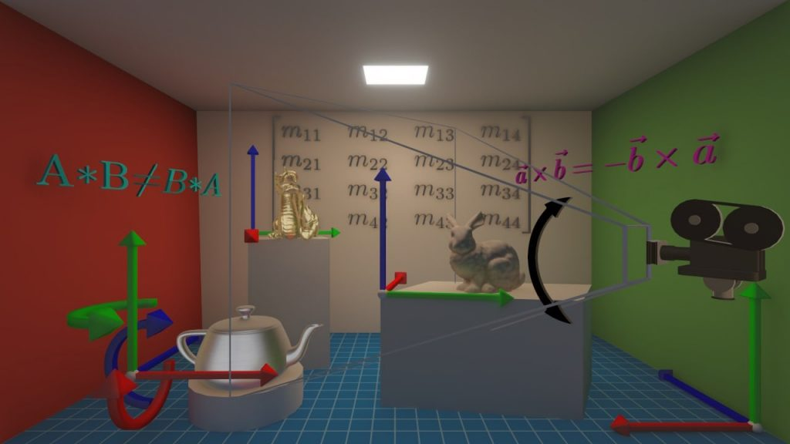
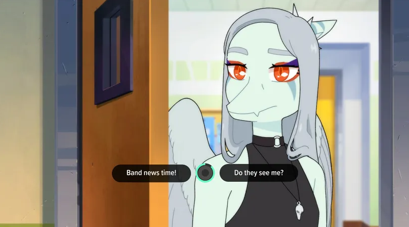
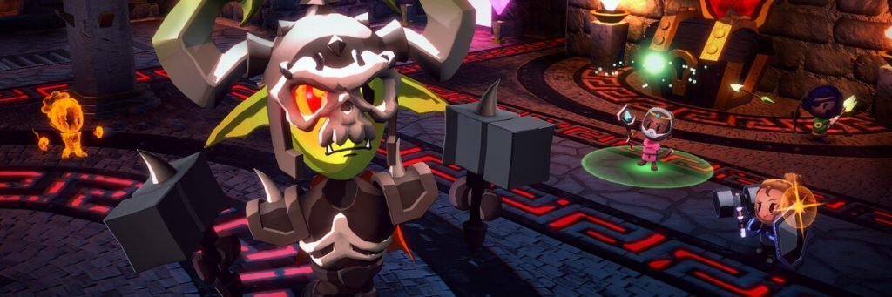
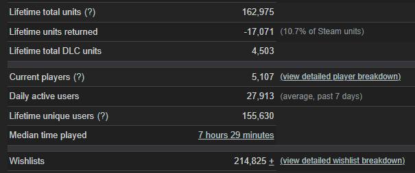
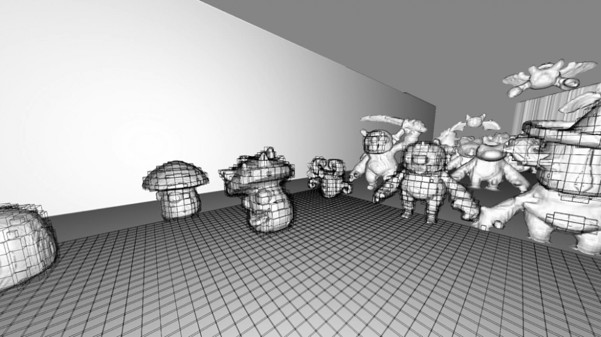

*The game development industry brings something new all the time. General Arcade shows the most interesting releases, updates and news of the past week, which are recommended reading for both industry veterans and novice developers.*

## Updates/releases/news

[WebGPU 1.0 standard released in Chrome](https://developer.chrome.com/blog/webgpu-release/)

The new version of Chrome will include support for the new WebGPU 1.0 standard.

## Interesting articles/videos

[Matrix Compendium](https://gpuopen.com/learn/matrix-compendium/matrix-compendium-intro/)

AMD engineers have collected information on transformation in computer graphics in a series of blog posts. There you can find notes on matrices, their transformations, nuances due to non-commutativity of operations (A∗B≠B∗A ) and anti-commutativity (a⃗×b⃗=−b⃗×a⃗).

[The Epic Games Team on Lumen, MetaHuman, UE5.2 Demo, and AI](https://80.lv/articles/the-epic-games-team-on-lumen-metahuman-ue5-2-demo-ai/)

Epic Games CTO Kim Libreri, VPs Nicholas Penwarden and Vladimir Mastilovich discussed the company’s announcements at GDC 2023, explained how Lumen came to be for UE5, talked about the production process behind the UE5.2 demo, and shared some behind-the-scenes information about procedural tools in Unreal Engine and MetaHuman.

[Firaxis Games on the development of Marvel’s Midnight Suns](https://www.unrealengine.com/en-US/developer-interviews/firaxis-games-talks-about-designing-and-developing-the-superhero-tactical-experience-of-marvel-s-midnight-suns)

When the studio had the opportunity to jump into the Marvel Universe, the developers didn’t want to just mix XCOM and Marvel together. Instead, the team aimed to develop a game with a more pompous superhero flair. An older, deeper version of Marvel comics was used as a starting point. Epic Games spoke with Firaxis about how they changed the XCOM formula for Marvel’s Midnight Suns, how they went about giving players a real connection to Marvel heroes, and why they decided to give this property a supernatural twist.

[Revisiting Goodbye Volcano High’s Narrative to Find Meaning in the Apocalypse](https://www.gamedeveloper.com/design/rescoping-the-narrative-of-goodbye-volcano-high-to-find-meaning-in-the-apocalypse)

Narrative Director Jenna Yow explains how they tweaked Goodbye Volcano High’s unwieldy narrative to help the game’s main characters shine.

[Make players feel like their choices matter to the story](https://youtu.be/KU3FlTpxSyk)



In his GDC 2022 keynote, Tony Howard-Arias details how they tackled such issues at both the micro and macro levels.

[Development of an improved Full-Body Ragdoll system](https://youtu.be/tvgEljKCkrg)



Nan Ma from LIGHTSPEED STUDIOS talked about Wobbledoll, an advanced ragdoll system that was unveiled during GDC 2023, discussed the features of the system, and explained why machine learning was introduced into it.

[Creating a Multiplayer Game with Netcode for GameObjects](https://blog.unity.com/games/build-a-production-ready-multiplayer-game-with-netcode-for-gameobjects)

A short summary of the webinar series on working with mesh and GameObjects.

[How Big Ambitions Succeeded on Steam](https://newsletter.gamediscover.co/p/deep-dive-how-big-ambitions-hit-it)

Over 3700 extremely positive (95% positive) reviews. The game ranks in the top 10 for “total first week time-adjusted Steam reviews” in GameDiscoverCo Plus’ March monthly post-release chart of nearly 950 new games. How did it happen?

[Stray: giving character to a futuristic city](https://www.gamedeveloper.com/art/stray-giving-character-to-a-futuristic-city)

Learn more about the unique environment art in the award-winning indie game Stray and how artists used Adobe Substance 3D tools to bring their city to life.

[Real-time sparse distance fields for games](https://gpuopen.com/gdc-presentations/2023/GDC-2023-Sparse-Distance-Fields-For-Games.pdf)

The presentation introduces the implementation of Brixelizer, AMD’s real-time SDF generator.
