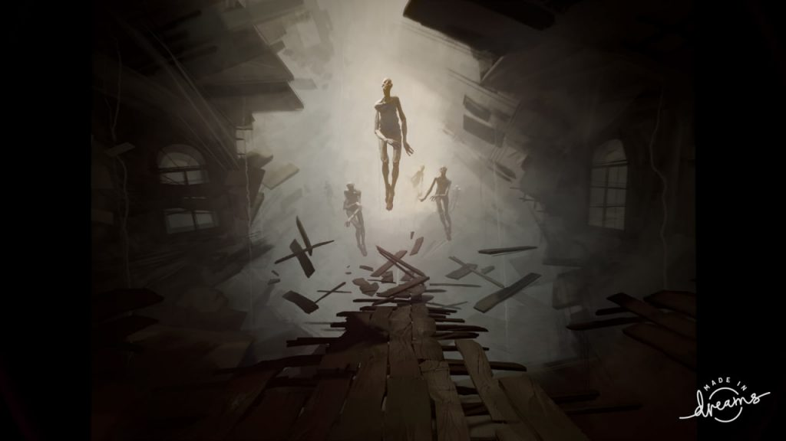
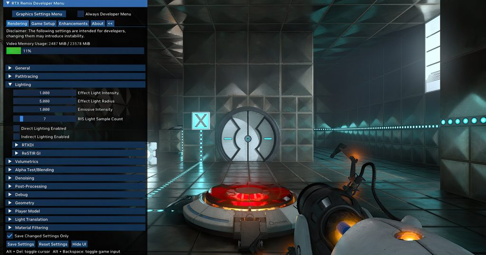
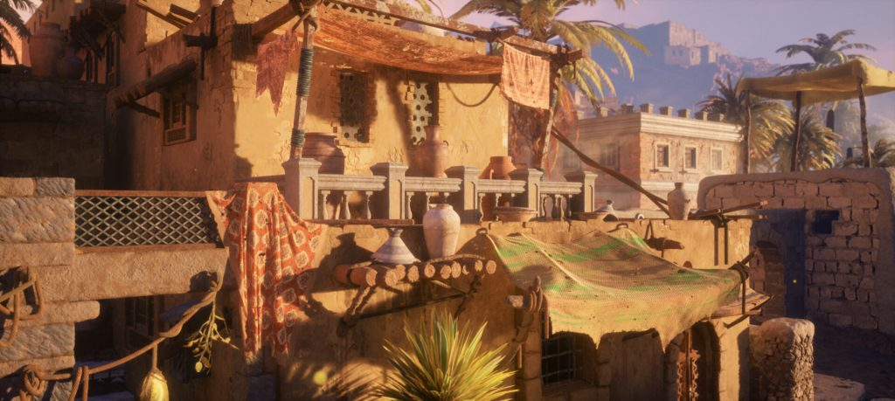
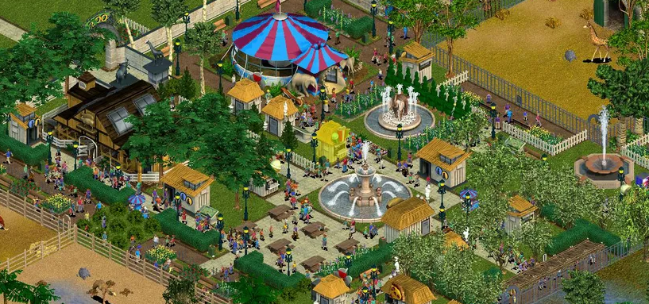
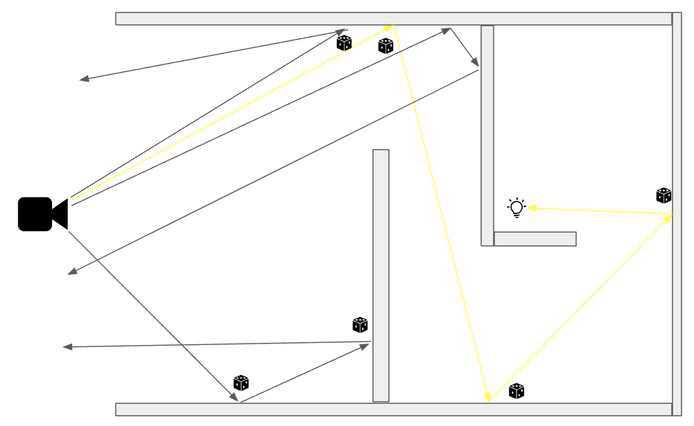
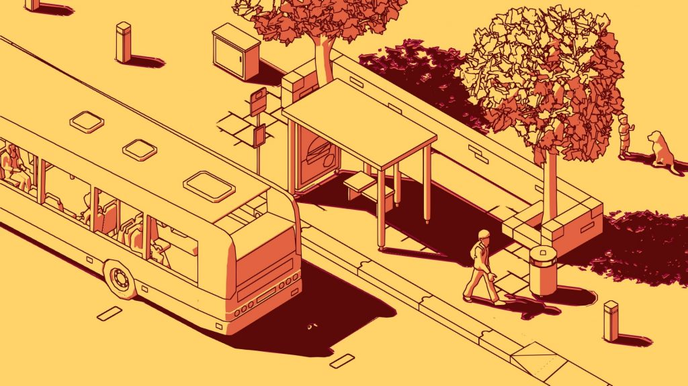

*The game development industry brings something new all the time. General Arcade shows the most interesting releases, updates and news of the past week, which are recommended reading for both industry veterans and novice developers.*

[Dreams Active Support Ends September 1st](https://docs.indreams.me/en-US/whats-happening/news/dreams-support-update)

Players will be able to continue downloading other people’s levels and create their own, but some of the features will not be released, multiplayer, for example. There will be no PS5/PSVR2 versions either.

[NVIDIA releases RTX Remix source code under MIT license](https://www.nvidia.com/en-us/geforce/news/rtx-remix-runtime-open-source-download/)

This tool allows you to remaster classic games on DirectX 8 and 9. RTX Remix captures the game scene and replaces assets during playback, introducing RTX technologies into the game: path tracing, DLSS 3 and Reflex. There is also an AI-tool that allows you to improve the textures and all that.

[Working on Oasis demo created with Unreal Engine and Substance 3D](https://80.lv/articles/working-on-oasis-demo-reel-using-unreal-engine-substance-3d/)

Hanson Wang talked about the Oasis project, showed approaches to help speed up and organize work, and explained how materials are created.

[6 Lessons Learned From Creating Zoo Tycoon](https://www.gamedeveloper.com/business/six-lessons-from-the-making-of-zoo-tycoon)

Hank Howey reveals some key business lessons for developers.

[The games you like are probably not the ones that sell well on Steam](https://howtomarketagame.com/2023/04/10/the-games-that-you-like-probably-arent-the-ones-that-sell-well/)

Most indie developers don’t do market research when making a game they’re passionate about and really enjoy. Unfortunately, the average indie game makes less than $5,000. So the “do what you like” advice doesn’t seem to work very well.

[World Space Path Resampling](http://www.zyanidelab.com/world-space-path-resampling/)

Light tends to be strongly reflected. Real time path tracing can be very tricky, we are limited by the number of rays per pixel and of course we need high quality noise free samples. Also high FPS. In fact, we want everything and quickly. Can we improve the quality of our indirect reflections?

[Five tips for working with a publisher](https://www.gamesindustry.biz/five-tips-to-building-developer-publisher-relations)

Playstack’s Harvey Elliott shares tips on what studios should look out for and how to make sure those relationships work.

[Creative and technical aspects of SCHiM development](https://80.lv/articles/the-creative-and-technical-aspects-of-developing-schim/)

Ewood van der Werf talked about the advantages and disadvantages of indie game development and talked about creating SCHiM’s art style, level design and challenge balance.

[Introduction to AMD hardware profiling tools](https://gpuopen.com/learn/amd-lab-notes/amd-lab-notes-profilers-README)

A series on different profiling tools, as well as a guide on why a developer might use one tool over another.

[Developing a Water Rendering Solution](https://80.lv/articles/developing-a-next-gen-water-rendering-solution-for-games/)

Zhenyu Mao and Kui Wu from LIGHTSPEED STUDIO talked about the Photon Water System, discussing their motivations, production process and challenges they faced, and discussed the strengths of the system, including physics support for gameplay programmers and physically based underwater volumetric lighting.

[Direct3D 12: Shaderland Adventures](https://godotengine.org/article/d3d12-adventures-in-shaderland/)

In the article, the author decided to tell how he encountered some problems related to various aspects of the shaders.

[Projective geometric algebra](https://terathon.com/gdc23_lengyel.pdf)

Slides from the GDC report on geometric algebra. The presentation covers the basic building blocks of algebra and how it relates to the concepts of other algebras.
