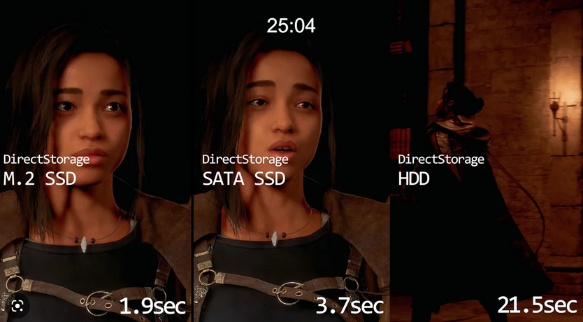
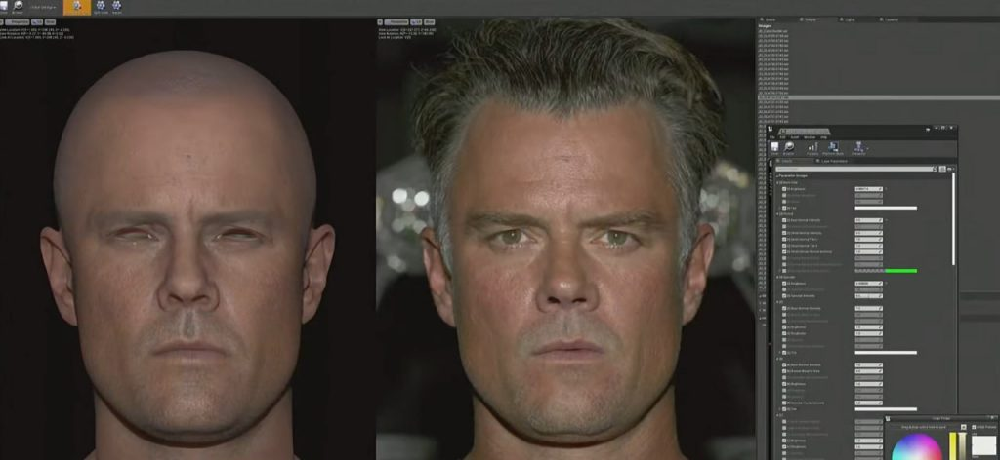
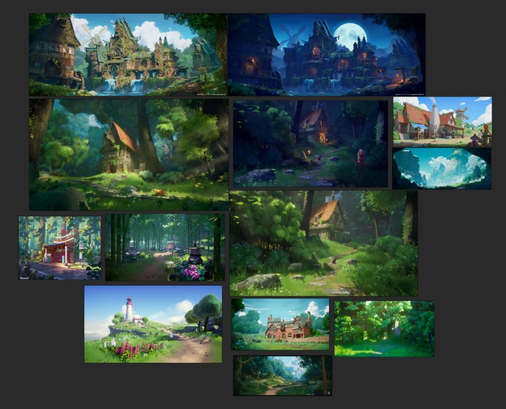
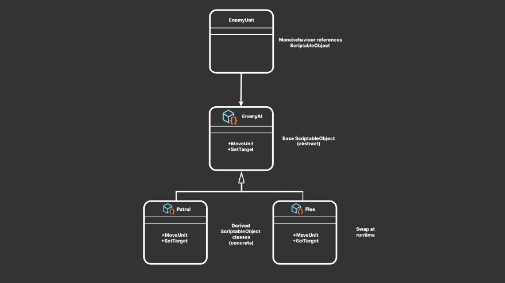
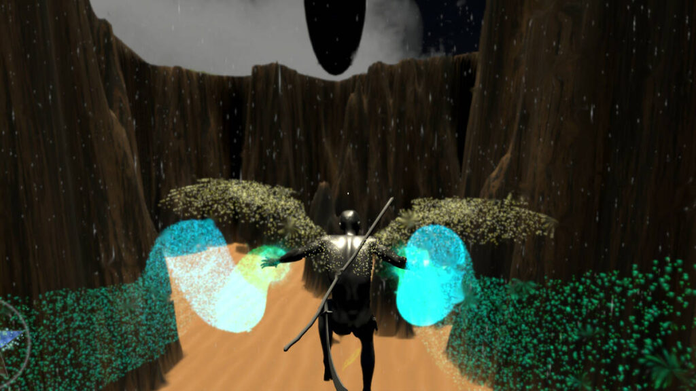

*The game development industry brings something new all the time. General Arcade shows the most interesting releases, updates and news of the past week, which are recommended reading for both industry veterans and novice developers.*

[Babylon.js 6.0 and Havok](https://blogs.windows.com/windowsdeveloper/2023/04/20/part-1-announcing-babylon-js-6-0/)

Microsoft has released Babylon.js 6.0. Developers team added the Havok physics engine. And not just added, but “secretly worked with the Havok team” on it. And it’s all free!

[Microsoft releases DirectStorage 1.2 with HDD support](https://devblogs.microsoft.com/directx/directstorage-1-2-available-now/)

The developers have also improved GPU decompression of textures.

[iOS 17 will introduce installation of applications from third-party sources](https://www.bloomberg.com/news/newsletters/2023-04-16/apple-wwdc-2023-june-5-plan-reality-headset-new-macs-watchos-10-ios-17-lgjfj5bf)

Mark Gurman of Bloomberg writes about Apple’s plans. According to him, the company will comply with a law passed by the European Parliament, which obliges Apple and Google to allow the installation of applications on smartphones from third-party sources in Europe.

[SEGA buys devs of Angry Birds — Rovio Entertainment for $776 million](https://www.gamedeveloper.com/blogs/how-acquiring-rovio-empowers-sega-to-grow-its-ip-and-global-games-business)

The acquisition will address SEGA’s current weakness in the mobile market outside Japan, helping it develop its brands and launch online services around the world.

[Realistic shooter with a view from the chest recorder called Unrecord](https://store.steampowered.com/app/2381520/Unrecord/)



A whole team now working on the game has opened a page on Steam, where they shared the first details.

[Dive into Epic Games’ Unreal Editor for Fortnite](https://80.lv/articles/a-deep-dive-into-epic-games-unreal-editor-for-fortnite/)

Epic Games Executive Vice President Saxs Persson shared some behind-the-scenes details regarding the recently released UEFN, talked about the features and benefits of the editor, and discussed monetization strategies.

[GDC 2023 talk on character rendering in The Callisto Protocol is now available](https://www.gdcvault.com/play/1029339/The-Character-Rendering-Art-of)

You can look at the GDC Vault.

[Where to find and how to choose the right trend for your hyper casual game](https://premortem.games/2023/04/21/where-to-find-and-how-to-pick-the-right-trend-for-your-hypercasual-game/)

In addition to a series of articles on hyper-casual games and the social media trends that inspire them, AppMagic spoke with AZUR Games and FreePlay, developers and publishers in the mobile and hyper-casual games market.

[Lighting setup for a cozy forest scene in Unreal Engine 5.1](https://80.lv/articles/setting-up-lighting-for-a-cozy-forest-scene-in-unreal-engine-5-1/)

Yueyang Zhao talked about his project House in the Forest, talked about the choice of assets and his approach to creating vegetation, and also spoke in detail about how he set up various lighting scenarios in Unreal Engine 5.1.

[Fast design iterations in Breachers using AssetPostprocessor and Blender](https://blog.unity.com/games/rapid-design-iteration-in-breachers-using-assetpostprocessor-and-blender)

Developers for current projects have come up with a workflow where they model and organize levels in Blender and rely on the Unity AssetPostprocessor to integrate them into the project.

In the article, they shared how they came up with this workflow and how it supports fast iterations.

[GigaBash is a colossal kaiju clash paying homage to Godzilla and Ultraman](https://www.unrealengine.com/en-US/developer-interviews/gigabash-is-a-colossal-kaiju-clash-paying-homage-to-godzilla-and-ultraman)

 Passion Republic Games got the opportunity to work with Toho Co., Ltd, the studio behind the Godzilla franchise. In late 2022, the team released the Godzilla 4 Kaiju Pack DLC, adding Godzilla, Gigan, Mechagodzilla, and Destoroy as playable characters in GigaBash. The Epic Games team sat down with the studio to talk about the creation of GigaBash, the opportunity to work with Godzilla, and how Epic MegaGrant helped them during development.

[Kirby’s many dimensions](https://youtu.be/cWdt07ncRxU)



In the GDC 2023 keynote, developers Shinya Kumazaki and Tatsuya Kamiyama discuss how they brought traditional Kirby gameplay to the 3D world, as well as explore some of the game’s new features, including the fan-favorite Mouthful Mode.

[6 Ways ScriptableObjects Can Benefit Your Team and Code](https://blog.unity.com/engine-platform/6-ways-scriptableobjects-can-benefit-your-team-and-your-code)

In the article Unity explains the benefits of ScriptableObjects.

[GDC 2023 talk from Epic Games about UE5 character physics](https://youtu.be/FK7FBBdY5fY)



Learn how the new Unreal Engine 5 tools can be used to create a dog that can be petted in a presentation by Andreas Suika.

[Indie developer Kaigen Finlay: “It’s easy to lose yourself in game development”](https://premortem.games/2023/04/17/solo-developer-kaighen-finley-its-easy-to-lose-myself-in-game-development/)

Kaighen Finley founded his own website and game development company Team iNtuition right out of high school. He mainly focused on web development, but has always been drawn to game development. Therefore, after two years, he “sharply switched” to the later. That’s when he started working on Q’Redux, which is now in Early Access on Steam.
