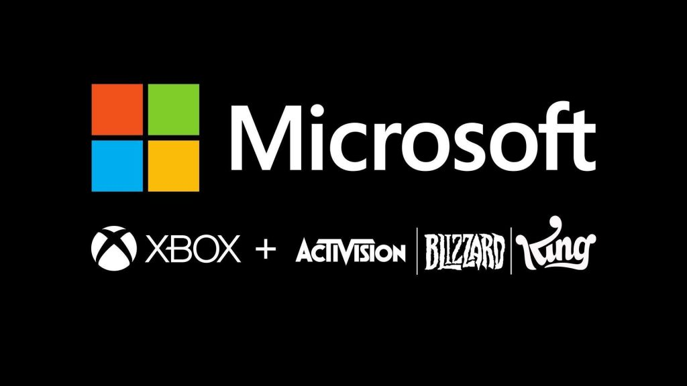
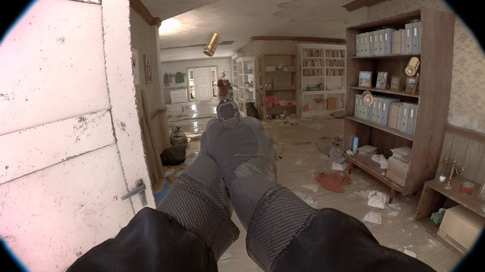
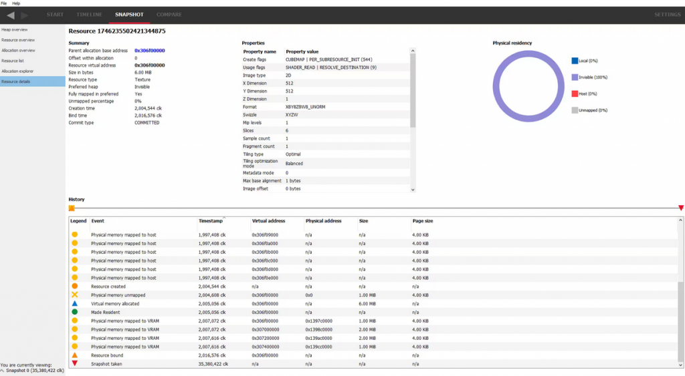
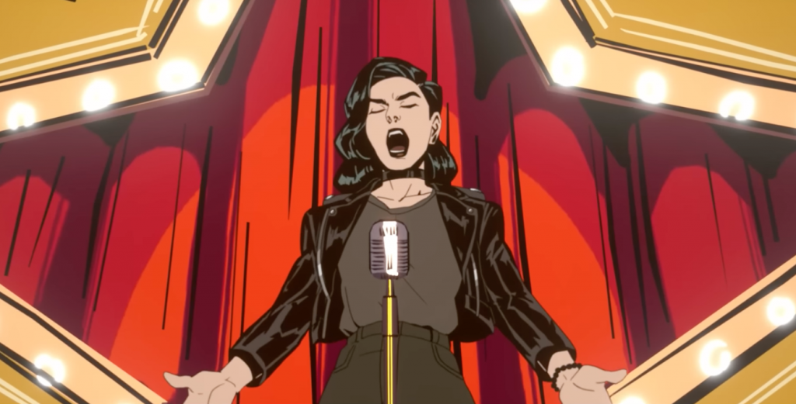
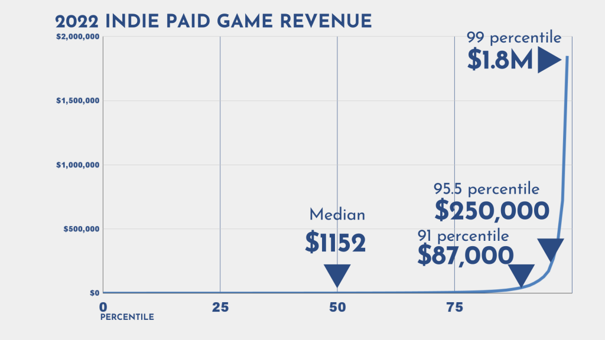

*The game development industry brings something new all the time. General Arcade shows the most interesting releases, updates and news of the past week, which are recommended reading for both industry veterans and novice developers.*

[British antitrust regulator blocks Microsoft’s deal with Activision Blizzard](https://www.videogameschronicle.com/news/the-uk-regulator-has-blocked-microsofts-acquisition-of-activision/)

About how Microsoft could thwart competition in the nascent cloud market with Xbox Game Pass subscription services. The company is going to appeal.

<Honkai: Star Rail surpasses Genshin Impact in first-day mobile revenue>

Only on mobile devices in a day from the moment of release the game earned over 5 million dollars. And over 20 million downloads.

[Alawar will close its playground with games](https://www.alawar.com/)

20 years after launch. You can play on the site and download games from it until the end of May. Activation keys will also work until closing.

[Unrecord wishlisted by Over 600k Steam Users](https://steamdb.info/stats/mostwished/)

In just a week, the game got to the 22nd place of the top.

[Radeon Memory Visualizer 1.6](https://gpuopen.com/learn/rmv-1-6-improved-device-config-info-expanded-resource-details/)

And improved device collection information with an expanded resource discovery panel.

[How Tunic was built on mystery](https://www.gdcvault.com/play/1029384/-TUNIC-This-Was-Here)

Andrew Shouldice, developer of Tunic, talks at the GDC about the discovery of mysterious and significant secrets.

[Unsolved mysteries of Tetris by creator Alexey Pajitnov and designer Henk Rogers](https://youtu.be/6YhkkyXydNI)



Alexey Pajitnov and Henk Rogers were not so recognizable to the general public. However, the situation began to change with the release of the film. In the latest video from Ars Technica, Pajitnov and Rogers return to the origins of the game.

[Want to make a great game trailer? Optimize it for social networks](https://premortem.games/2023/04/28/want-to-make-a-great-game-trailer-optimize-it-for-social-media/)

Even if Twitter disappears completely, these still apply to other platforms where users scroll through the feed quite quickly.

[Death of the Game: Unreal Tournament](https://youtu.be/07err3i5MPk)



Retrospective of the legendary game.

[What if Steam didn’t charge 30% commission](https://howtomarketagame.com/2023/04/25/what-if-steam-didnt-take-30/)

Even at 30% Steam as a platform gives more than any other platform at the moment.

[Why Halo Infinite bots look more like humans](https://youtu.be/4bOsJSRk0i8)



A solid analysis of how AI works in the game.

[A funny story from the developer Stories Untold. Players complained that they got stuck on a black screen when launching Episode 1](https://twitter.com/jon_NoCode/status/1652246041595375618)

It turned out that they had a pirated assembly of Windows, where there were either curved or completely cut out codecs for video playback. The developers of the middleware/library that was used in the game did not even provide for such a case, since such codecs come immediately with the installation of the system.
