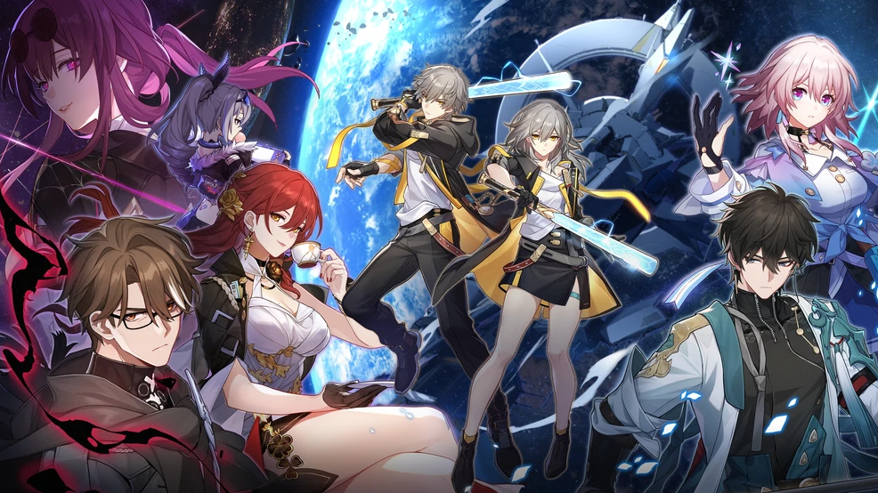
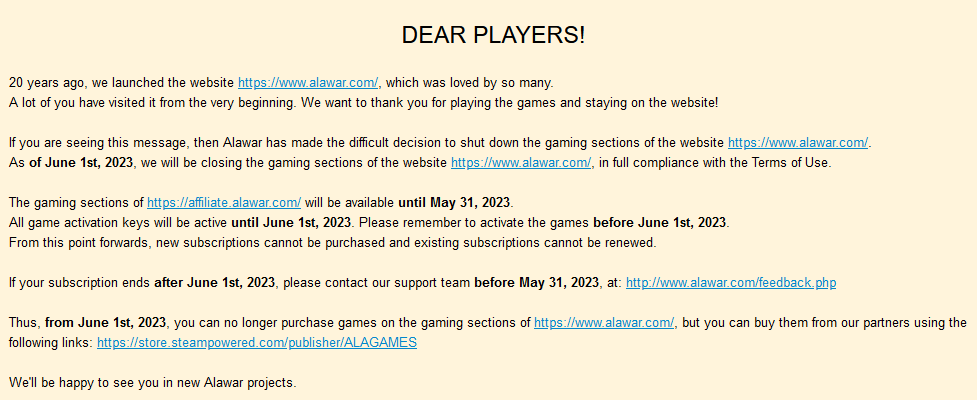
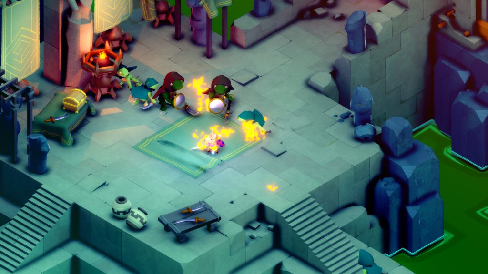
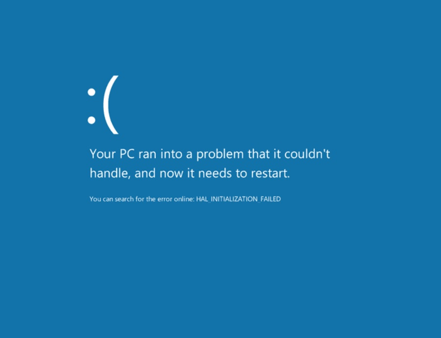

<em>The game development industry brings something new all the time. General Arcade shows the most interesting releases, updates and news of the past week, which are recommended reading for both industry veterans and novice developers.</em>

<a href="https://www.videogameschronicle.com/news/the-uk-regulator-has-blocked-microsofts-acquisition-of-activision/">British antitrust regulator blocks Microsoft’s deal with Activision Blizzard</a>

<figure class="wp-block-image size-large"></figure>

About how Microsoft could thwart competition in the nascent cloud market with Xbox Game Pass subscription services. The company is going to appeal.

<a href="Honkai: Star Rail surpasses Genshin Impact in first-day mobile revenue">Honkai: Star Rail surpasses Genshin Impact in first-day mobile revenue</a>

<figure class="wp-block-image size-large"></figure>

Only on mobile devices in a day from the moment of release the game earned over 5 million dollars. And over 20 million downloads.

<a href="https://www.alawar.com/">Alawar will close its playground with games</a>

<figure class="wp-block-image size-large"></figure>

20 years after launch. You can play on the site and download games from it until the end of May. Activation keys will also work until closing.

<a href="https://steamdb.info/stats/mostwished/">Unrecord wishlisted by Over 600k Steam Users</a>

<figure class="wp-block-image size-large"></figure>

In just a week, the game got to the 22nd place of the top.

<a href="https://gpuopen.com/learn/rmv-1-6-improved-device-config-info-expanded-resource-details/">Radeon Memory Visualizer 1.6</a>

<figure class="wp-block-image size-large"></figure>

And improved device collection information with an expanded resource discovery panel.

<a href="https://www.gdcvault.com/play/1029384/-TUNIC-This-Was-Here">How Tunic was built on mystery</a>

<figure class="wp-block-image size-large"></figure>

Andrew Shouldice, developer of Tunic, talks at the GDC about the discovery of mysterious and significant secrets.

<a href="https://youtu.be/6YhkkyXydNI">Unsolved mysteries of Tetris by creator Alexey Pajitnov and designer Henk Rogers</a>

<iframe allow="accelerometer; autoplay; clipboard-write; encrypted-media; gyroscope; picture-in-picture; web-share" allowfullscreen="" frameborder="0" height="315" src="https://www.youtube.com/embed/6YhkkyXydNI" title="Unsolved Tetris Mysteries With Creator Alexy Pajitnov &amp; Designer Henk Rogers | Ars Technica" width="560"></iframe>

Alexey Pajitnov and Henk Rogers were not so recognizable to the general public. However, the situation began to change with the release of the film. In the latest video from Ars Technica, Pajitnov and Rogers return to the origins of the game.

<a href="https://premortem.games/2023/04/28/want-to-make-a-great-game-trailer-optimize-it-for-social-media/">Want to make a great game trailer? Optimize it for social networks</a>

<figure class="wp-block-image size-large"></figure>

Even if Twitter disappears completely, these still apply to other platforms where users scroll through the feed quite quickly.

<a href="https://youtu.be/07err3i5MPk"> Death of the Game: Unreal Tournament</a>

<iframe allow="accelerometer; autoplay; clipboard-write; encrypted-media; gyroscope; picture-in-picture; web-share" allowfullscreen="" frameborder="0" height="315" src="https://www.youtube.com/embed/07err3i5MPk" title="Death of a Game: Unreal Tournament" width="560"></iframe>

Retrospective of the legendary game.

<a href="https://howtomarketagame.com/2023/04/25/what-if-steam-didnt-take-30/">What if Steam didn’t charge 30% commission</a>

<figure class="wp-block-image size-large"></figure>

Even at 30% Steam as a platform gives more than any other platform at the moment.

<a href="https://youtu.be/4bOsJSRk0i8">Why Halo Infinite bots look more like humans</a>

<iframe allow="accelerometer; autoplay; clipboard-write; encrypted-media; gyroscope; picture-in-picture; web-share" allowfullscreen="" frameborder="0" height="315" src="https://www.youtube.com/embed/4bOsJSRk0i8" title="Why Halo Infinite's Bots Play More Like Humans | AI and Games #71" width="560"></iframe>

A solid analysis of how AI works in the game.

<a href="https://twitter.com/jon_NoCode/status/1652246041595375618">A funny story from the developer Stories Untold. Players complained that they got stuck on a black screen when launching Episode 1</a>

<figure class="wp-block-image size-large"></figure>

It turned out that they had a pirated assembly of Windows, where there were either curved or completely cut out codecs for video playback. The developers of the middleware/library that was used in the game did not even provide for such a case, since such codecs come immediately with the installation of the system.

