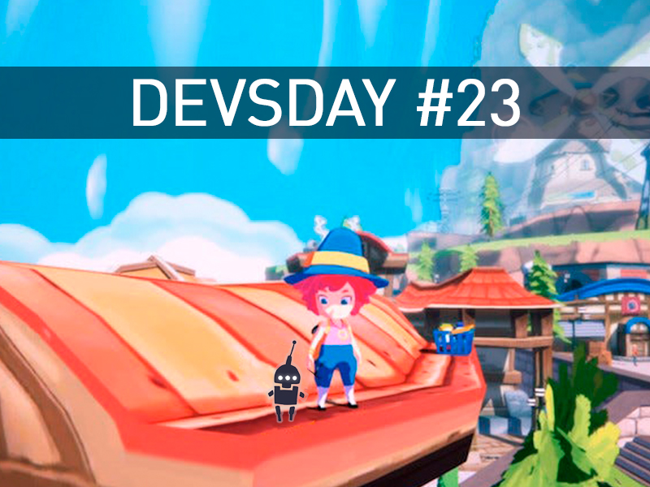
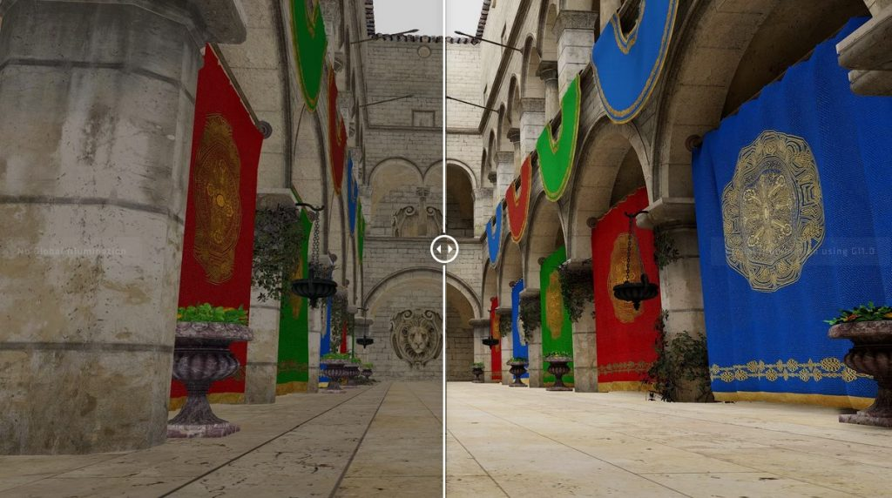
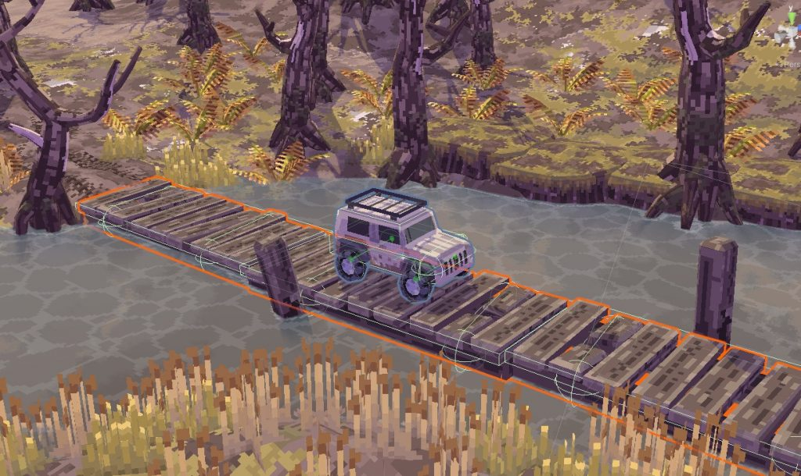
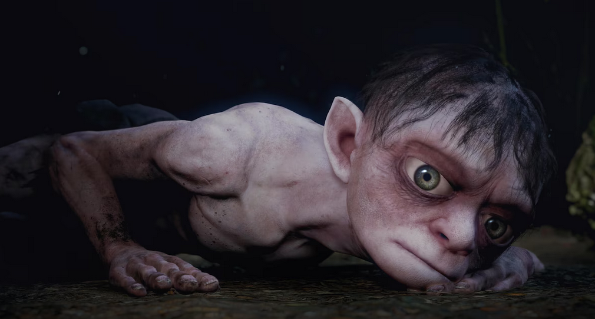
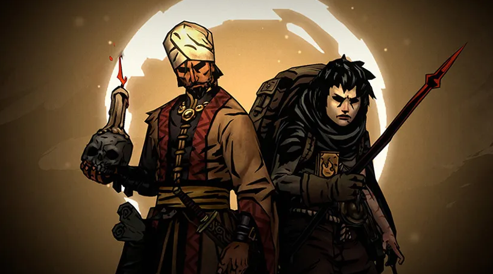
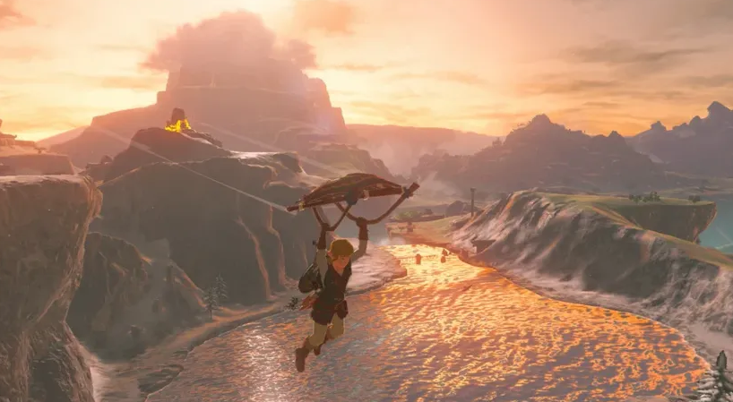
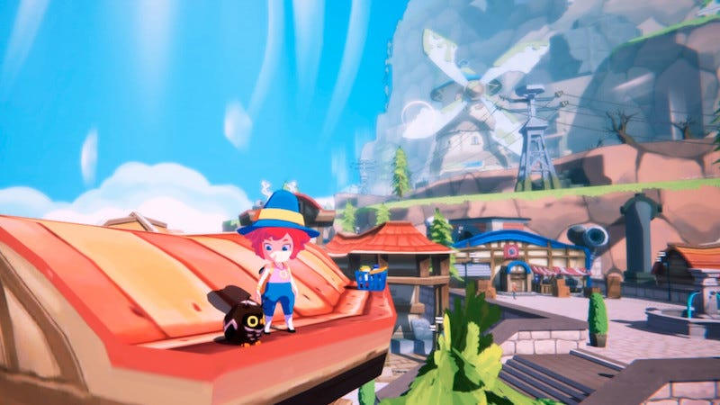

<em>The game development industry brings something new all the time. General Arcade shows the most interesting releases, updates and news of the past week, which are recommended reading for both industry veterans and novice developers.</em>

<a href="https://assets.publishing.service.gov.uk/media/645cac312226ee000c0ae5fd/Interim_Order_.pdf">British regulator imposes additional restrictions on Microsoft and Activision Blizzard</a>

<figure class="wp-block-image size-large"></figure>

They now need to get written approval from the CMA if they buy or acquire a stake in internal studios, or if Microsoft acquires a stake in a company that has a stake in Activision Blizzard.

<a href="https://youtu.be/xsoMk1EJoAY">Stability AI releases Stable Animation SDK, text-to-animation tool</a>

<iframe allow="accelerometer; autoplay; clipboard-write; encrypted-media; gyroscope; picture-in-picture; web-share" allowfullscreen="" frameborder="0" height="315" src="https://www.youtube.com/embed/xsoMk1EJoAY" title="Stable Animation 🎞️" width="560"></iframe>

Users can create animations in various ways: using prompts (no images), source image, or source video.

<a href="https://marmoset.co/toolbag/beta-history/">Beta Marmoset Toolbag 4.06</a>

<figure class="wp-block-image size-large"></figure>

The update expands USD support and adds the ability to render HDR image sequences.

<a href="https://youtu.be/I7zyNDazmGQ">Unreal Engine 5.2</a>

<iframe allow="accelerometer; autoplay; clipboard-write; encrypted-media; gyroscope; picture-in-picture; web-share" allowfullscreen="" frameborder="0" height="315" src="https://www.youtube.com/embed/I7zyNDazmGQ" title="Unreal Engine 5.2 Feature Highlights" width="560"></iframe>

Update highlights: Procedural Content Generation Framework (PCG) for populating large scenes in UE5 and Substrate, a modular content creation system. In addition, Chaos Flesh (a real-time muscle and soft body modeling system) appeared, Nanite, Lumen and Path tracing were updated.

<a href="https://blog.unity.com/engine-platform/sponza-scene-remaster-for-unity-devs">Sponza scene remaster for Unity is now available</a>

<figure class="wp-block-image size-large"></figure>

The original scene was created by Frank Meinl of Crytek in the early 2000s. Several teams in Unity use Sponza to test and test features. In the blog, the developers talked about some of the updates they have made to the environment to help Unity developers realize its full potential.

<a href="https://gpuopen.com/learn/amd-capsaicin-framework-release-gi/">AMD introduced the Capsaicin Framework, an ARR research platform</a>

<figure class="wp-block-image size-large"></figure>

An internal real-time graphics research platform that AMD uses to develop and test new rendering algorithms. The first of these is their GI-1.0 real-time global illumination solution.

<a href="https://youtu.be/t4718r53zAs">“We don’t like the class, so we didn’t test it”: Tim Kane spoke about the development of The Temple of Elemental Evil</a>

<iframe allow="accelerometer; autoplay; clipboard-write; encrypted-media; gyroscope; picture-in-picture; web-share" allowfullscreen="" frameborder="0" height="315" src="https://www.youtube.com/embed/t4718r53zAs" title="The Trials of The Temple of Elemental Evil" width="560"></iframe>

As well as a story about the refusal of the publisher to release patches for the game.

<a href="https://80.lv/articles/kingdom-developer-on-creating-pixel-environments/">Kingdom developer on creating a pixelated environment</a>

<figure class="wp-block-image size-large"></figure>

Thomas van den Berg, the creator of Kingdom, talked about their first project, the early development of Cloud Gardens, and the use of PixPaint to create 3D pixel art.

<a href="https://youtu.be/IfCRHSIg6zo">Quake PVS: Render Optimization Gem</a>

<iframe allow="accelerometer; autoplay; clipboard-write; encrypted-media; gyroscope; picture-in-picture; web-share" allowfullscreen="" frameborder="0" height="315" src="https://www.youtube.com/embed/IfCRHSIg6zo" title="Quake's PVS: A hidden gem of rendering optimization" width="560"></iframe>

Brief extract about portals for pre-calculation of visibility information.

<a href="https://youtu.be/DJ99mv52fVo">Creation of realistic facial animations for The Quarry</a>

<iframe allow="accelerometer; autoplay; clipboard-write; encrypted-media; gyroscope; picture-in-picture; web-share" allowfullscreen="" frameborder="0" height="315" src="https://www.youtube.com/embed/DJ99mv52fVo" title="Case Study: Creating Realistic Facial Motion for 'The Quarry'" width="560"></iframe>

In a talk from GDC 2023, the developers talk about the Digital Domain technologies and pipeline created to capture faces in The Quarry.

<a href="https://youtu.be/EUuhaJe4mds">What makes an impossible boss cool</a>

<iframe allow="accelerometer; autoplay; clipboard-write; encrypted-media; gyroscope; picture-in-picture; web-share" allowfullscreen="" frameborder="0" height="315" src="https://www.youtube.com/embed/EUuhaJe4mds" title="What Makes A Great Impossible Boss?" width="560"></iframe>

Vanguard from Demon’s Souls, Silent Abyss from Salt and Sanctuary, and many more. Although with sufficient diligence they can be defeated, but at the first meeting, it is still better to avoid them.

<a href="https://80.lv/articles/kabam-on-using-unreal-engine-for-cross-platform-game-development/">Kabam on using Unreal Engine to develop cross-platform games</a>

<figure class="wp-block-image size-large"></figure>

VP of Product Tyler Black and Head of Publishing Nick Anderson discussed how Unreal Engine can be used to develop cross-platform games and explained how the features of the engine helped them create King Arthur: Legends Rise.

<a href="https://www.unrealengine.com/en-US/spotlights/the-lord-of-the-rings-gollum-reimagines-tolkien-s-middle-earth">The Lord of the Rings: Gollum reimagines Tolkien’s Middle-earth</a>

<figure class="wp-block-image size-large"></figure>

The Daedalic Entertainment team that created the game feel the responsibility of sending Gollum on a new journey and reimagining Middle-earth. “Working on one of these gigantic projects is incredibly challenging, but also very exciting,” says Daedalic Entertainment lead artist Matthias Fischer.

<a href="https://www.gamedeveloper.com/production/how-darkest-dungeon-ii-s-developers-evolved-their-early-access-process">How Darkest Dungeon II Developers Changed Early Access</a>

<figure class="wp-block-image size-large"></figure>

Red Hook Studios had to figure out the best way to make the game. Co-founders Chris Bourassa and Tyler Sigman explained how their team has adjusted their methods to navigate this ever-evolving path of video game development.

<a href="https://www.gamesindustry.biz/comparing-space-oranges-and-zero-g-apples-a-deep-dive-into-everspaces-steam-launch">Detailed description of the launch of Everspace on Steam</a>

<figure class="wp-block-image size-large"></figure>

Rockfish CEO Michael Schade busts some myths about Steam Early Access, wishlists, pricing, Game Pass and more.

<a href="https://www.gamedeveloper.com/design/5-design-lessons-learned-from-i-the-legend-of-zelda-breath-of-the-wild-i-">5 Breath of the Wild Design Lessons</a>

<figure class="wp-block-image size-large"></figure>

An overview article on various conference presentations, blogs and discussions.

<a href="https://newsletter.gamediscover.co/p/how-did-this-video-game-kickstarter">How did Mika raise $1.4 million on Kickstarter?</a>

<figure class="wp-block-image size-large"></figure>

A simple and understandable pitch, experience of passing KS, buying traffic, releasing a demo during the festival on Steam, as well as the announcement of a physical version for Switch.

<a href="https://80.lv/articles/making-vfx-with-unreal-engine-s-niagara/">Creating visual effects with Niagara in Unreal Engine</a>

<figure class="wp-block-image size-large"></figure>

Simran Vaidya talked about how they created water VFX, showed work in Unreal Engine 5 and shared tips for beginner VFX artists.

