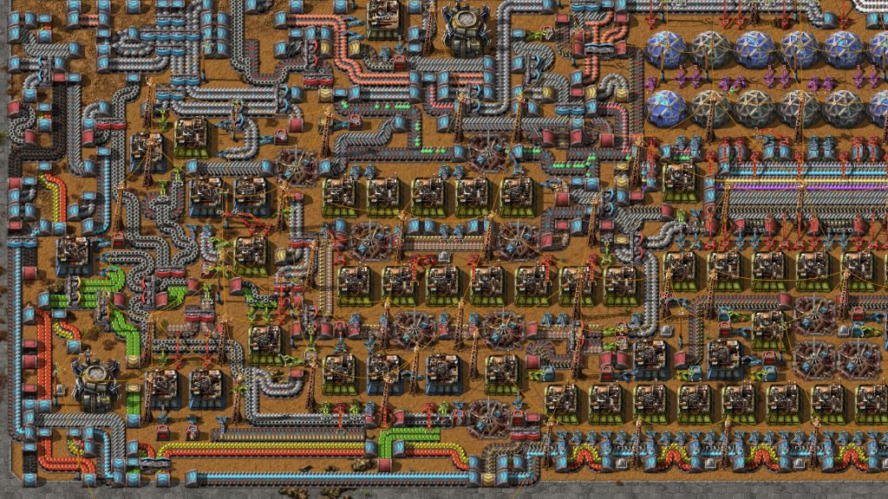
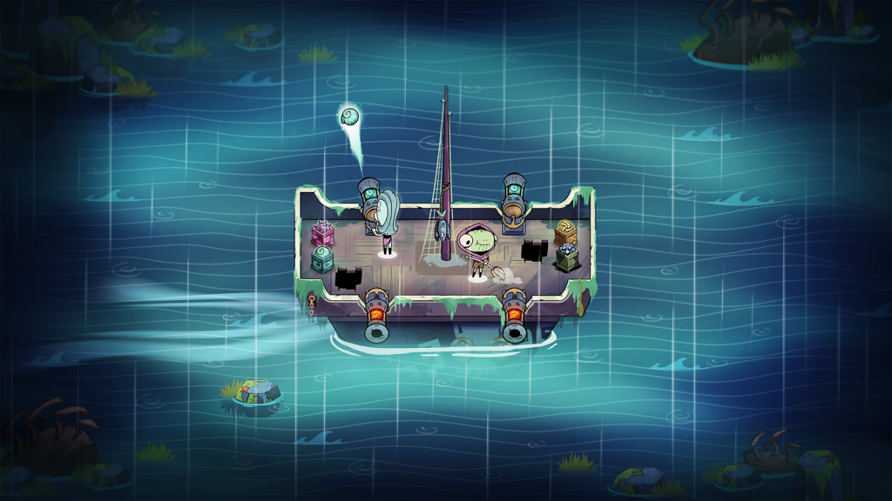
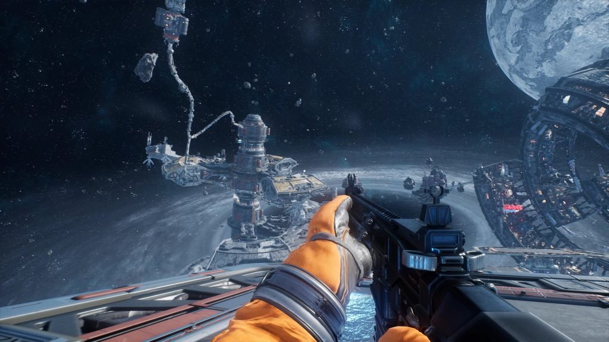
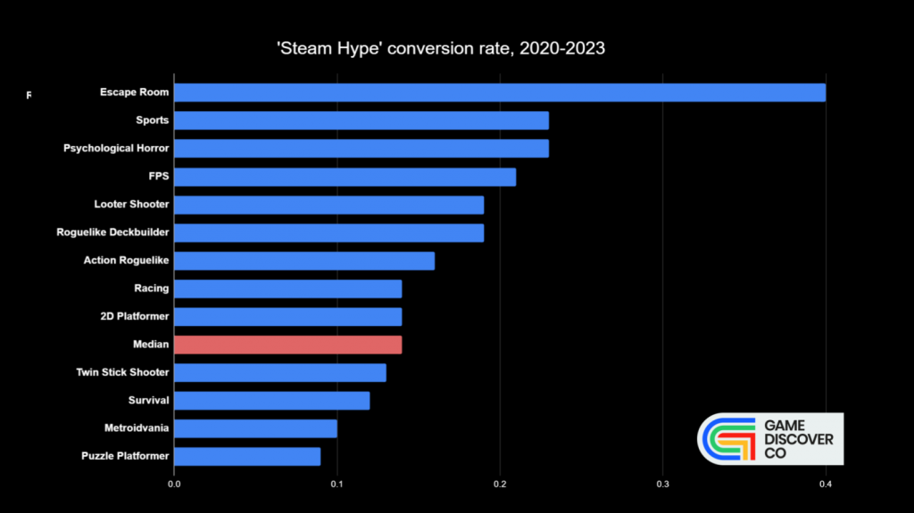
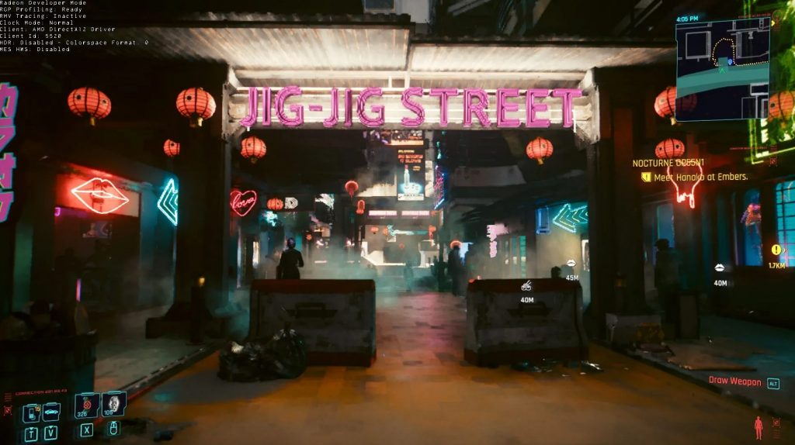

*The game development industry brings something new all the time. General Arcade shows the most interesting releases, updates and news of the past week, which are recommended reading for both industry veterans and novice developers.*

[The developer and publisher of the game King of Avalon filed a class-action lawsuit for false advertising](https://gamingonphone.com/news/funplus-king-of-avalon-koa-gets-a-class-action-lawsuit-for-mendacious-advertising/)

The in-game store sells packs with a crossed-out price ($4.99 instead of $120.9), but in fact the price is always the same. It’s funny that the developers received the same lawsuit in 2022 for their game State of Survival.

[Atari acquires Nightdive, developer of System Shock remake and many cool ports, for $19.5 million](https://www.globenewswire.com/news-release/2023/05/15/2668381/0/en/Atari-Closes-the-Acquisition-of-Nightdive-Studios.html)

Nightdive called Atari “the perfect partner”.

[Sculp Tool released for 3ds max version 2023-2024](https://youtu.be/9o7xT3lfrTA)



The plugin allows you to do full-fledged sculpting without having to switch to external programs. Boolean operations and retopology from merged elements are supported (very close to DynaMesh).

[Cascadeur 2023.1](https://youtu.be/m7NiXi-5j6o)



The update adds a new experimental motion capture video system, macOS support, and a radically redesigned user interface.

[Austria officially recognizes that loot boxes in FIFA Ultimate Team violate the law on gambling](https://www.gamesindustry.biz/report-sony-fails-to-appeal-austrian-loot-box-verdict)

PlayStation is required to refund certain FIFA Ultimate Team packs. Sony had until April 3 to file an appeal, but did not do so. Now the company is obliged to pay ~340 euros to gamers who have previously applied to the court.

[Roots of Pacha was hidden from Steam due to a conflict between the publisher and developers](https://www.gamesindustry.biz/roots-of-pacha-delisted-on-steam-due-to-contractual-dispute)

A few days after the release, the developer took away access to the admin panel from the publisher, who had to contact Valve. Developers from Soda Den claim that the cause of the conflict is related to the rights to the game.

[The Future of Steam Traffic Tracking](https://store.steampowered.com/news/group/4145017/view/3719453992486109638)

Steam is planning an update regarding traffic tracking. Traffic will be broken down by region. They will greatly improve identification and add more information from external sources. Google Analytics support is going to be disabled.

[How Factorio manages to work without lags with so many elements on the screen](https://www.reddit.com/r/factorio/comments/13bsf3s/technical_questions/)

The Factorio developer shared some details of the work of internal systems, in particular, he spoke about ECS.

[Cult of the Lamb: Gowing an Internet Cult](https://youtu.be/Bp0-lfjDDFk)



Devolver at GDC talked about working with social networks for Cult of the Lamb. It seems like basic things, but many still somehow score on it. There are also several examples of other games.

[Do Not Feed the Monkeys 2099: Developing a futuristic voyeur simulator](https://80.lv/articles/do-not-feed-the-monkeys-2099-developing-a-futuristic-digital-voyeur-simulator/)

Luis Olivan of Fictiorama Studios talked about how the team decided to work on a sequel to Do Not Feed the Monkeys, delved into the game’s puzzle creation, and shared the team’s strategies for finding and engaging an audience.

[How to prepare the game for investors and publishers](https://80.lv/articles/pitch-perfect-how-to-prepare-your-game-for-investors-and-publishers/)

Xsolla Funding Club shares the best practices for a successful pitch.

[A creative journey to develop a game that will satisfy everyone](https://blog.unity.com/games/creative-journey-of-designing-ship-of-fools)

In the post, the Fika Productions art and animation team details the creative path behind the development of their nautical roguelite Ship of Fools. The team uses the 2D tools Unity Editor, Universal Render Pipeline (URP), Cinemachine, Netcode for GameObjects and more to bring this 2D co-op game to life.

[Tape To Tape: how an indie sports game got incredible sales](https://howtomarketagame.com/2023/05/16/tape-to-tape-how-an-indie-sports-title-generated-amazing-sales/)

The developers of the 90s style hockey game Tape To Tape have found a niche and recently showed off an amazing launch.

[Working with weapons and gravity in Moon Mystery](https://80.lv/articles/working-with-weapons-gravity-in-moon-mystery/)

Cosmosscouts founder Mikolaj Szymanowski explained why the studio didn’t want Moon Mystery’s gravity to be too realistic, and how Interstellar inspired weapons artists.

[How clouds work in video games](https://twitter.com/StylizedStation/status/1659208008491208704)

Great twitter thread with examples from various games.

[Which genres on PC best convert pre-release interest?](https://newsletter.gamediscover.co/p/which-pc-genres-convert-pre-launch)

Some analytics from GamediscoverCo.

[Let’s talk about WebGPU](https://cohost.org/mcc/post/1406157-i-want-to-talk-about)

The article presents the history of the graphics API and how WebGPU fits into the story.

[Updated Path Tracing in Cyberpunk 2077](https://chipsandcheese.com/2023/05/07/cyberpunk-2077s-path-tracing-update/)

A detailed overview of the performance of the latest Cyberpunk 2077 update has been presented.
