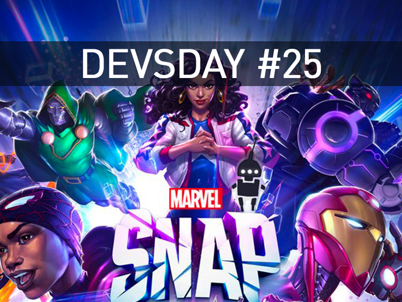

<em>The game development industry brings something new all the time. General Arcade shows the most interesting releases, updates and news of the past week, which are recommended reading for both industry veterans and novice developers.</em>

<a href="https://www.bloomberg.com/news/articles/2023-05-24/microsoft-appeals-uk-s-decision-to-block-activision-mega-deal">Microsoft files appeal against UK deal ban with Activision Blizzard</a>

<figure class="wp-block-image size-large"></figure>

The British antitrust regulator blocked Microsoft’s $69 billion deal with Activision Blizzard at the end of April 2023. The company has filed an appeal in response. It can take up to 9 months to review.

<a href="https://blog.unity.com/engine-platform/unity-2022-lts-is-coming-in-june">Unity 2022 LTS Coming in June</a>

<figure class="wp-block-image size-large"></figure>

DOTS, multiplayer services, immersive HD environments with HDRP, quality lighting and enhanced visuals (even on mobile), DirectX 12 and more.

<a href="https://archive.org/details/1999_Game_Developers_Conference_Audio">Jason Scott digitized over 90 tapes from the 1999 Game Developers Conference</a>

<figure class="wp-block-image size-large"></figure>

70+ hours of presentations!

<a href="https://www.appsflyer.com/product-news/measurement/pc-console-solution/">AppsFlyer analytics now on PC and consoles</a>

<figure class="wp-block-image size-large"></figure>

Analytics supported on Steam, Epic, Xbox, PlayStation, Nintendo Switch and Meta Quest, cross-platform attribution and more.

<a href="https://youtu.be/3GLH25M0L5E">15 profitable games and 6 failures: Paradox Interactive statistics for 10 years</a>

<iframe allow="accelerometer; autoplay; clipboard-write; encrypted-media; gyroscope; picture-in-picture; web-share" allowfullscreen="" frameborder="0" height="315" src="https://www.youtube.com/embed/3GLH25M0L5E" title="Paradox Interactive | PDX Deep Dive" width="560"></iframe>

Pillars of Eternity and Shadowrun Trilogy went to zero. Dungeonland, War of the Vikings, Warlock 2, Knights of Pen &amp; Paper 2, Imperator: Rome and Empire of Sin failed. Succeeded: Cities in Motion 2, Empire, March of the Eagles, The Showdown Effect, Leviathan: Warships, Magicka 2, Tyranny, Steel Division: Normandy 44, Surviving Mars, BattleTech, Prison Architect, Age of Wonders: Planetfall, Surviving the Aftermath , Victoria 3, and Age of Wonders 4. It’s worth adding that Europa Universalis IV, Cities: Skylines, Hearts of Iron IV, Stellaris, and Crusader Kings III are “endless games” that are still supported today.

<a href="https://youtu.be/VyQgWh-XAxs">Cut bonus, crunches and conflict with Interplay management: Tim Kane on leaving the Fallout 2 team</a>

<iframe allow="accelerometer; autoplay; clipboard-write; encrypted-media; gyroscope; picture-in-picture; web-share" allowfullscreen="" frameborder="0" height="315" src="https://www.youtube.com/embed/VyQgWh-XAxs" title="Listening To My Stories With Nuance" width="560"></iframe>

In the last video, Tim Kaine spoke about the conflict with Brian Fargo and about leaving the Fallout 2 development team. The release of the first part had to be postponed, because there was a floating bug. Tim and another employee had been fixing it for over a week. And when they fixed it, Brian Fargo tried to get the name of the one who was to blame for the bug. Tim didn’t give out the employee’s name. That very bug bug Fargo put on Kane himself, since he “did not give out the employee.”

<a href="https://youtu.be/3Q5Cuh2kOQo">“There is no such thing as a perfect game”: Mark Darra on the development of Baldur’s Gate</a>

<iframe allow="accelerometer; autoplay; clipboard-write; encrypted-media; gyroscope; picture-in-picture; web-share" allowfullscreen="" frameborder="0" height="315" src="https://www.youtube.com/embed/3Q5Cuh2kOQo" title="Baldur's Gate - Memories and Lessons" width="560"></iframe>

And if you’re writing your own scripting language for a game, then rest assured that it will be used for things you didn’t even plan. Very informative and interesting text.

<a href="https://blog.unity.com/engine-platform/accessing-texture-data-efficiently">Efficient Access to Texture Data</a>

<figure class="wp-block-image size-large"></figure>

Unity has published an article on the company blog about working with textures in the engine and the best ways to process pixels.

<a href="https://youtu.be/9Yomqk0C6kE">Valve’s “secret weapon”</a>

<iframe allow="accelerometer; autoplay; clipboard-write; encrypted-media; gyroscope; picture-in-picture; web-share" allowfullscreen="" frameborder="0" height="315" src="https://www.youtube.com/embed/9Yomqk0C6kE" title="Valve's &quot;Secret Weapon&quot;" width="560"></iframe>

An analysis of Valve’s approach to developing their games, which consists in constant playtests. Teams hold them every week, which allows you to change the game even in the early stages of development. For example, in the original version of HL2, the player only gets a gravity gun towards the end of the game. Playtests have shown that players really liked the mechanic, so in the release version we get these weapons in the early stages of the game.

<a href="https://www.kodeco.com/38238361-unreal-engine-5-ui-tutorial">Tutorial on working with UI in Unreal Engine 5</a>

<figure class="wp-block-image size-large"></figure>

Creating a HUD, displaying it and updating the displayed data.

<a href="https://www.deconstructoroffun.com/blog/2023/5/23/marvel-snap-the-definitive-deconstruction">Marvel Snap – The Definitive Deconstruction</a>

<figure class="wp-block-image size-large"></figure>

DeconstructorOfFun did a huge breakdown of the game. The mechanics, game cycle and economy of the game are considered in more detail.

<a href="https://80.lv/articles/blizzard-s-senior-artist-on-her-artistic-journey-landing-a-job-at-a-aaa-studio/">A Blizzard artist on her creative journey and getting a job at an AAA studio</a>

<figure class="wp-block-image size-large"></figure>

Environment artist Molly Warner talked about her creative journey, her first projects and workflows when creating environments, explained the benefits of Unreal Engine and shared some tips on how to get a job in an AAA studio.

<a href="https://newsletter.gamediscover.co/p/steam-publisher-sales-how-does-having">Steam Publisher Sale</a>

<figure class="wp-block-image size-large"></figure>

Some interesting facts about the release of Dwarf Fortress, Boyfriend Dungeon and other games of the publisher on Steam.

<a href="https://youtu.be/lL6A_MC1E2Y">How Unexplored 2 creates entire fantasy worlds from scratch</a>

<iframe allow="accelerometer; autoplay; clipboard-write; encrypted-media; gyroscope; picture-in-picture; web-share" allowfullscreen="" frameborder="0" height="315" src="https://www.youtube.com/embed/lL6A_MC1E2Y" title="How Unexplored 2 Generates Entire Fantasy Worlds from Scratch | Artifacts #1" width="560"></iframe>

Unexplored at maximum speed. In the new game, not just random generation of rooms, but of the whole world, events of regeneration of plots after death. The world creation logic is based on declarative rules and graphs. But the key to all this is the cyclical nature of generation.

<a href="https://80.lv/articles/call-of-duty-and-dead-space-art-producer-game-art-production-from-the-inside/">Creating game art for Call of Duty and Dead Space from the inside</a>

<figure class="wp-block-image size-large"></figure>

Ksenia Taranets, lead art producer at Room 8, spoke about the role of an art producer in game projects and its features.

<a href="https://blog.42yeah.is/rendering/2023/05/13/photon-mapping.html">How photon mapping works</a>

<figure class="wp-block-image size-large"></figure>

The caustic is a remarkable phenomenon, but huge powers are needed to realize a physically reliable effect. This is hard to achieve with ray/path tracing. This article discusses the problems with ray counting in ray tracing methods, and also shows how photon mapping aims to reduce the number of rays.

