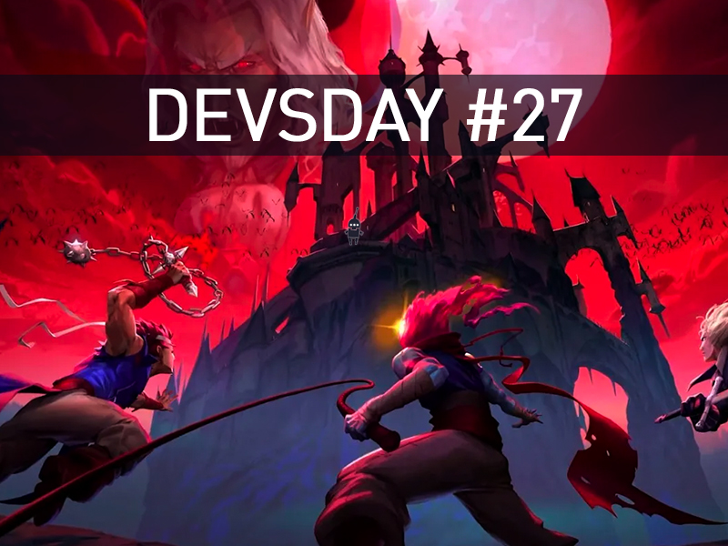
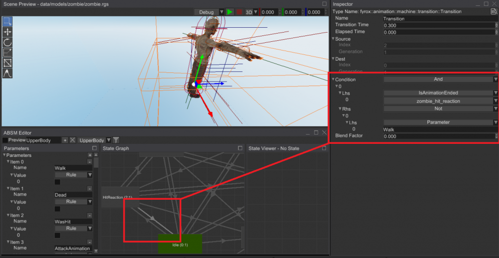

<em>The game development industry brings something new all the time. General Arcade shows the most interesting releases, updates and news of the past week, which are recommended reading for both industry veterans and novice developers.</em>

<a href="https://blog.photonengine.com/photon-quantum-is-now-free-for-development/#">Photon Quantum is now free during development</a>

<figure class="wp-block-image size-large"></figure>

Up to 20 CCUs!

<a href="https://fyrox.rs/blog/post/fyrox-game-engine-0-30/">Fyrox Engine 0.30</a>

<figure class="wp-block-image size-large"></figure>

A major update to the Rust engine, mainly focusing on animation, editor, sound, and improved editor experience.

<a href="https://www.gamesindustry.biz/from-dead-cells-to-reinventing-retro-ip-the-untold-story-of-evil-empire">From Dead Cells to reinventing retro IP: The untold story of Evil Empire</a>

<figure class="wp-block-image size-large"></figure>

Gamesindustry spoke with CEO Steve Philby and COO Benjamin Laulan about how the Dead Cells DLC developer steps out of Motion Twin’s shadow and strikes his own.

<a href="https://youtu.be/YhydrX7Y7B8">Analysis of Bioshock Infinite level</a>

<iframe allow="accelerometer; autoplay; clipboard-write; encrypted-media; gyroscope; picture-in-picture; web-share" allowfullscreen="" frameborder="0" height="315" src="https://www.youtube.com/embed/YhydrX7Y7B8" title="The Unreal level I made to work on Bioshock Infinite" width="560"></iframe>

Level designer Bioshock Infinite posted a 20-minute level/gameplay breakdown video he made for a level design test at Irrational Games back in 2011.

7 keys to Slime Rancher 2’s success

<iframe allow="accelerometer; autoplay; clipboard-write; encrypted-media; gyroscope; picture-in-picture; web-share" allowfullscreen="" frameborder="0" height="315" src="https://www.youtube.com/embed/6fr5jSUMfVQ" title="7 keys to Slime Rancher 2's success" width="560"></iframe>

Matt Cramer, CTO of Monomi Park talks about the Unity tools that helped the team build a bigger and better performing world in Slime Rancher 2.

<a href="https://80.lv/articles/making-a-lovecraftian-environment-in-maya-substance-3d-painter-unreal-engine/">Creating Lovecraftian environments in Maya, Substance 3D Painter and Unreal Engine</a>

<figure class="wp-block-image size-large"></figure>

Zurab Barisashvili spoke about the work on the Stranger On Low Tides project, showed the color correction and post-processing effects used in the scene.

<a href="https://youtu.be/v9j5k3K29Rw">Working on Bard’s Tale (1991) constructor</a>

<iframe allow="accelerometer; autoplay; clipboard-write; encrypted-media; gyroscope; picture-in-picture; web-share" allowfullscreen="" frameborder="0" height="315" src="https://www.youtube.com/embed/v9j5k3K29Rw" title="Making of Bard's Tale Construction Set (1991)" width="560"></iframe>

Tim Cain talked about his experience with legacy code and hardcode

<a href="https://www.unrealengine.com/en-US/developer-interviews/layers-of-fear-reimagines-horror-with-unreal-engine-5">Layers of Fear reimagines horror with Unreal Engine 5</a>

<figure class="wp-block-image size-large"></figure>

The Unreal Engine team spoke with Anshar Studios about the development and benefits of porting the franchise first to UE4 and then to Unreal Engine 5, the challenges of adding a flashlight to the game, and how the team used tools like Lumen.

<a href="https://youtu.be/zfmekgRfHkM">Baldur’s Gate 2: Shadows of Amn and Throne of Bhaal: Memories and Lessons</a>

<iframe allow="accelerometer; autoplay; clipboard-write; encrypted-media; gyroscope; picture-in-picture; web-share" allowfullscreen="" frameborder="0" height="315" src="https://www.youtube.com/embed/zfmekgRfHkM" title="Baldur's Gate 2: Shadows of Amn and Throne of Bhaal - Memories and Lessons" width="560"></iframe>

Mark Darrah spoke about the work on the project and shared interesting moments.

<a href="https://www.cyanilux.com/tutorials/waterfall-shader-breakdown/">Waterfall shader analysis</a>

<figure class="wp-block-image size-large"></figure>

Base the effect with an SDF (Signed Distance Field) sphere, but the Y position is fixed so that a hole is created underneath. To make it more liquid-like, this hole and the sides of the waterfall are distorted with a sine wave and clipped at the alpha channel. Noise is used to add foam to make it more like flowing water.

