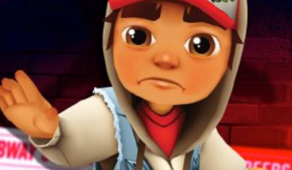
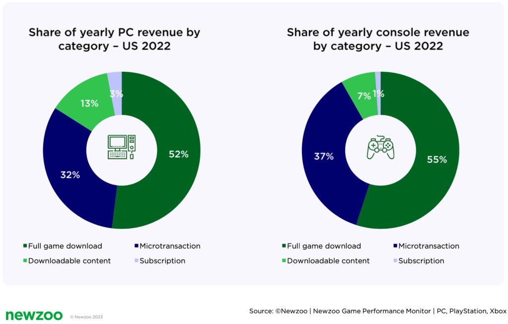
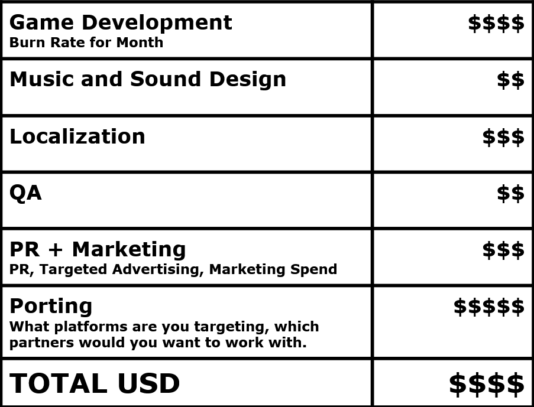
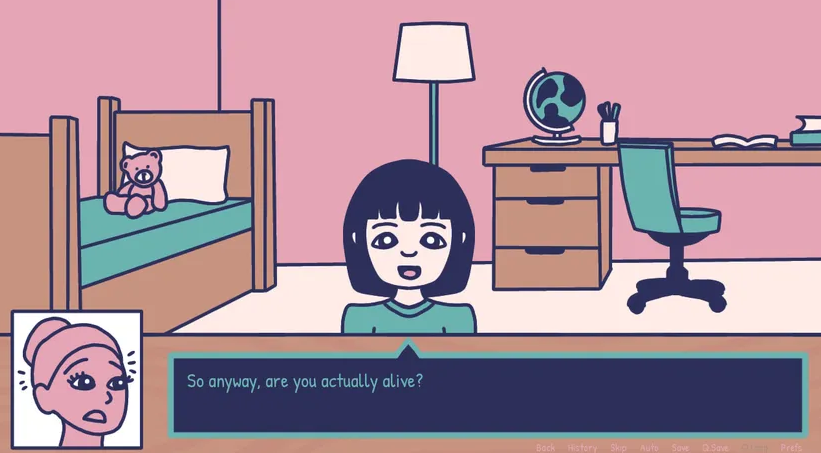
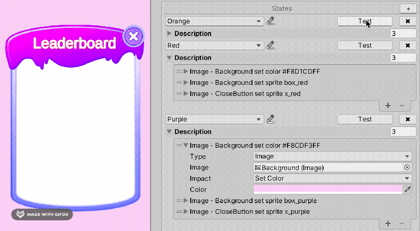
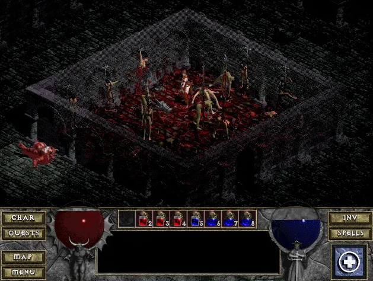
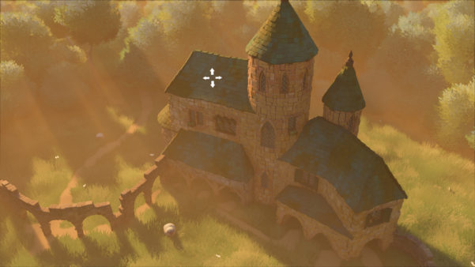

<em>The game development industry brings something new all the time. General Arcade shows the most interesting releases, updates and news of the past week, which are recommended reading for both industry veterans and novice developers.</em>

<a href="https://youtu.be/WghYEFIoaM8">Epic Games releases MetaHuman Animator</a>

<iframe allow="accelerometer; autoplay; clipboard-write; encrypted-media; gyroscope; picture-in-picture; web-share" allowfullscreen="" frameborder="0" height="315" src="https://www.youtube.com/embed/WghYEFIoaM8" title="MetaHuman Animator Now Available" width="560"></iframe>

This tool allows you to easily create facial animations for Metahumans and record facial expressions through the camera on your iPhone (12+) or PC. The company also released Blue Dot with a demo.

<a href="https://www.linkedin.com/search/results/content/?heroEntityKey=urn%3Ali%3Aorganization%3A82551&amp;keywords=kiloo%20games&amp;position=0&amp;searchId=1f0092cc-c121-4a19-9a27-a2d145f0b7c0&amp;sid=~CS&amp;update=urn%3Ali%3Afs_updateV2%3A(urn%3Ali%3Aactivity%3A7074681771010744321%2CBLENDED_SEARCH_FEED%2CEMPTY%2CDEFAULT%2Cfalse)">Subway Surfers collaborators studio prepares to close</a>

<figure class="wp-block-image size-large"></figure>

After 23 years on the market. Before the end of the month, Kiloo Games will fire everyone. This was reported by employees on Linkedin.

<a href="https://github.com/Unity-Technologies/MegacityMultiplayer">Unity MegaCity Multiplayer sample project</a>

<figure class="wp-block-image size-large"></figure>

Multiplayer game project for 64+ players. Impressive, right?

<a href="https://premortem.games/2023/06/12/from-extra-content-to-extra-revenue-dlc-works-best-for-strategy-games/">From extra content to extra revenue: DLC works best for strategy games</a>

<figure class="wp-block-image size-large"></figure>

Highlights from Newzoo’s analysis of 1600 DLC releases for PC and consoles from April 2020 to April 2023.

<a href="https://docs.google.com/presentation/d/1sBAQvfuGt_guknfyYHhWhBEripuOcH9aiOS86-l5TGY">SUPERHOT Team has published an indie game pitch template</a>

<figure class="wp-block-image size-large"></figure>

Particular attention should be paid to. As the team advises to focus on the financial side of the issue, you do not need to make many slides explaining the mechanics of the game. This was noticed in gamediscover. In the same article, they shared links to already known pitches.

<a href="https://www.gamedeveloper.com/pc/the-best-free-tools-for-narrative-games">The best free tools for narrative games</a>

<figure class="wp-block-image size-large"></figure>

From Twine to Ren’Py to Decker and more.

<a href="https://80.lv/articles/making-a-post-apocalyptic-female-character-in-zbrush-maya-substance-3d-painter/">Creating a post-apocalyptic female character in ZBrush, Maya and Substance 3D Painter</a>

<figure class="wp-block-image size-large"></figure>

Thiago Brandao shared the secrets of creating a detailed character, explained the complex texturing process, and talked about creating realistic facial features.

<a href="https://www.gamesindustry.biz/death-to-meetings-rethinking-teamwork-in-remote-game-development">Death to Meetings: Reimagining Teamwork in Remote Game Development</a>

<figure class="wp-block-image size-large"></figure>

Glenn Brace of NDreams Elevation shares tips for setting up a fully remote studio.

<a href="https://youtu.be/ryB8hT5TMSg">Recreating the smoke grenade from Counter-Strike 2</a>

<iframe allow="accelerometer; autoplay; clipboard-write; encrypted-media; gyroscope; picture-in-picture; web-share" allowfullscreen="" frameborder="0" height="315" src="https://www.youtube.com/embed/ryB8hT5TMSg" title="I Tried Recreating Counter Strike 2's Smoke Grenades" width="560"></iframe>

Topics covered include frame debugging, voxels, mesh voxelization, volume shadows, and more.

<a href="https://www.gamedeveloper.com/blogs/statefului-a-unity-ui-library-based-on-markup-and-states">StatefulUI: UI library for Unity based on states and markup</a>

<figure class="wp-block-image size-large"></figure>

Basic article on working with the user interface in Unity.

<a href="https://youtu.be/f4s1h2YETNY">Introduction to shaders</a>

<iframe allow="accelerometer; autoplay; clipboard-write; encrypted-media; gyroscope; picture-in-picture; web-share" allowfullscreen="" frameborder="0" height="315" src="https://www.youtube.com/embed/f4s1h2YETNY" title="An introduction to Shader Art Coding" width="560"></iframe>

Explains how to create digital art with shaders, explains basic tools, concepts and math.

<a href="https://www.gamedeveloper.com/design/7-design-lessons-from-the-history-of-diablo">7 design lessons from the history of Diablo</a>

<figure class="wp-block-image size-large"></figure>

The franchise has gone through many changes in 27 years.

<a href="https://howtomarketagame.com/2023/06/12/marketing-your-steam-game-before-you-have-a-steam-page-the-tiny-glade-story/">Marketing Your Game Before You Have a Steam Page: The Tiny Glade Story</a>

<figure class="wp-block-image size-large"></figure>

In December 2022, Anastasia Opara and Tomasz Stachowiak launched the Steam page for their Tiny Glade sandbox and got 10,000 wishlists in 24 hours. Within 4 months they have collected even more and now they are in the TOP50 in terms of the number of wishlists on Steam (over 420,000).

<a href="https://80.lv/articles/designing-3d-persian-style-props-using-maya-mari/">Creating 3D Persian Style Props Using Maya and Mari</a>

<figure class="wp-block-image size-large"></figure>

Simin Farrokh Ahmadi shared the details of the Persian Afternoon project, explaining the modeling, texturing, and lighting processes in Maya and Mari.

