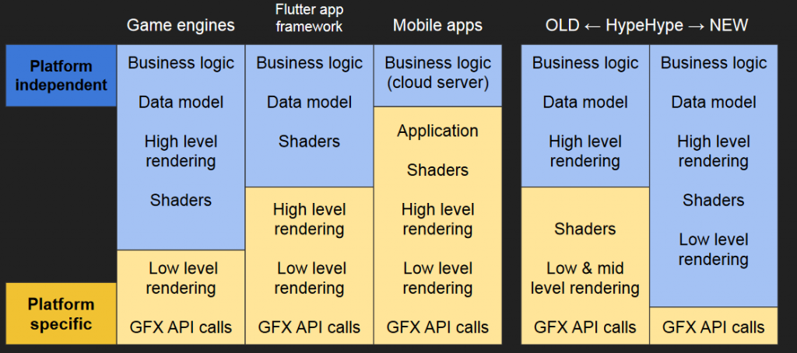
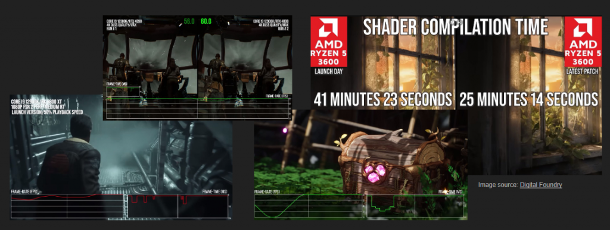

<em>The game development industry brings something new all the time. General Arcade shows the most interesting releases, updates and news of the past week, which are recommended reading for both industry veterans and novice developers.</em>

<a href="https://www.unrealengine.com/en-US/blog/realityscan-is-now-available-for-android-devices">RealityScan is now available not only on iOS, but also on Android</a>

<iframe allow="accelerometer; autoplay; clipboard-write; encrypted-media; gyroscope; picture-in-picture; web-share" allowfullscreen="" frameborder="0" height="315" src="https://www.youtube.com/embed/EpQX27bxRew" title="RealityScan Is Now Also Available for Android" width="560"></iframe>

It allows you to create high-quality 3D models of objects from several pictures from your phone.

<a href="https://www.unrealengine.com/en-US/electric-dreams-environment">Epic Games has released a sample project Electric Dreams Environment</a>

<iframe allow="accelerometer; autoplay; clipboard-write; encrypted-media; gyroscope; picture-in-picture; web-share" allowfullscreen="" frameborder="0" height="315" src="https://www.youtube.com/embed/6JUfisUhm68" title="Deep Dive into the Electric Dreams Project | Inside Unreal" width="560"></iframe>

Earlier this year, Epic Games showed a demo and new engine features at GDC, and now everyone can poke the project.

<a href="https://defold.com//2023/06/19/Defold-adds-support-for-Sony-PlayStation/">Defold now supports Sony PlayStation 4</a>

<figure class="wp-block-image size-large"></figure>

Basic access to the necessary tools and documentation will be provided free of charge, while full access to the source code is available at a paid membership level.

<a href="https://github.blog/2023-06-21-gamedev-js-2023/">Results of the Open Source Contest with Gamedev.js Jam 2023</a>

<figure class="wp-block-image size-large"></figure>

The article mentions 13 games. All sources are included.

<a href="https://youtu.be/lk--if_7J9g">Documentary about Blasphemous</a>

<iframe allow="accelerometer; autoplay; clipboard-write; encrypted-media; gyroscope; picture-in-picture; web-share" allowfullscreen="" frameborder="0" height="315" src="https://www.youtube.com/embed/lk--if_7J9g" title="Landing Blasphemous: The making of Blasphemous 1 (Full Documentary)" width="560"></iframe>

Very interesting and informative video about the game and the people who made it.

<a href="https://80.lv/articles/recreating-phoenix-from-harry-potter-with-zbrush-ornatrix-substance-3d-painter/">Recreating the Phoenix from Harry Potter in ZBrush, Ornatrix and Substance 3D Painter</a>

<figure class="wp-block-image size-large"></figure>

Ramon Tapia spoke about the Phoenix project, explained how grooming is done in Ornatrix, and showed the texturing process.

<a href="https://80.lv/articles/crossroads-making-a-stylized-scene-in-maya-substance-3d-painter-ue5/">Creating a stylized scene in Maya, Substance 3D Painter and UE5</a>

<figure class="wp-block-image size-large"></figure>

Zaldom spoke about the creation of a new Crossroads project and talked about the stages of creating a stylized scene in Maya, Substance 3D and Unreal Engine 5.

<a href="https://www.gamesindustry.biz/how-to-market-console-and-pc-games-in-a-mobile-world">How to promote console and PC games in the mobile world</a>

<figure class="wp-block-image size-large"></figure>

AppsFlyer talked about the rise of cross-platform gaming and why it’s adding console and desktop support to its marketing tools.

<a href="https://premortem.games/2023/06/20/solo-dev-ansdor-loves-his-total-creative-control-i-dont-like-too-much-planning/">Indie developer ansdor on creative control</a>

<figure class="wp-block-image size-large"></figure>

A Brazilian game developer shares his experience of entering the industry and not being able to work for anyone.

<a href="https://newsletter.gamediscover.co/p/why-your-steam-follower-to-wishlist">Why is the ratio between the number of followers and those who added the game to the wishlist important?</a>

<figure class="wp-block-image size-large"></figure>

You can get a general idea of the popularity of an unreleased Steam game from its top wishlist ranking, you can see the exact number of subscribers for each game, and sites like SteamDB have good historical subscriber charts. Not all games convert equally. But gamediscover.co still thinks that subscribers are very “indicative” of the general interest.

<a href="https://80.lv/articles/the-working-culture-and-hiring-practices-at-rockfish-games/">Work Culture and Recruitment Practices at ROCKFISH Games</a>

<figure class="wp-block-image size-large"></figure>

Michael Schade, CEO of the studio, spoke about the organization of the company and approaches to hiring, discussed the role of independence in culture and talked about the features of the game development market in Hamburg.

<a href="https://news.blizzard.com/en-us/diablo4/23964183/peeling-back-the-varnish-the-graphics-of-diablo-iv">About Diablo IV graphics</a>

<figure class="wp-block-image size-large"></figure>

The developers have written a high-level overview of topics related to Diablo IV’s graphical techniques.

<a href="https://80.lv/articles/insights-on-game-localization-from-ark-one-studios/">A look at game localization from Ark One Studios</a>

<figure class="wp-block-image size-large"></figure>

The studio’s general manager, Christian Modesto, spoke about the organization of work, explained how they hire new employees, and discussed the challenges of the video game localization industry.

<a href="https://youtu.be/Fwh-fzhREOU">Modernization of rendering in Supercell</a>

<iframe allow="accelerometer; autoplay; clipboard-write; encrypted-media; gyroscope; picture-in-picture; web-share" allowfullscreen="" frameborder="0" height="315" src="https://www.youtube.com/embed/Fwh-fzhREOU" title="Modernizing Rendering at Supercell" width="560"></iframe>

In a GDC 2023 talk, Timo Heinapurola talked about the process of implementing a new rendering framework at Supercell and walked through the stages of modifying their existing games.

<a href="https://enginearchitecture.realtimerendering.com/downloads/reac2023_modern_mobile_rendering_at_hypehype.pdf">Modern mobile rendering</a>

<figure class="wp-block-image size-large"></figure>

In the presentation, the author explains how he developed a new rendering architecture focused on mobile hardware.

<a href="https://enginearchitecture.realtimerendering.com/downloads/reac2023_dunia_shader_pipeline.pdf">Far Cry Dunia Engine Shader Pipeline</a>

<figure class="wp-block-image size-large"></figure>

A report on the history of the development of the Far Cry shader system. It is shown how the architecture has been improved many times for the transition to D3D12.

