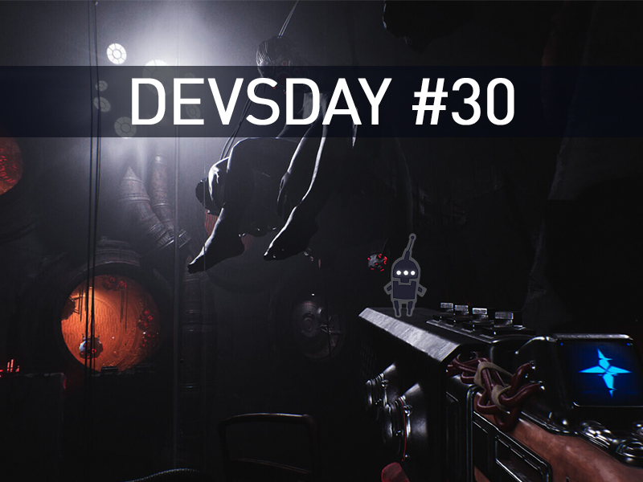
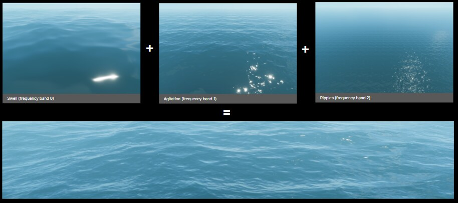
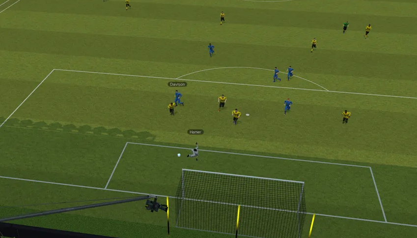
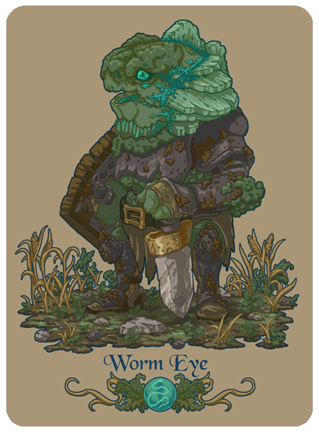
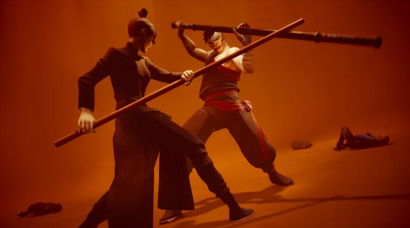
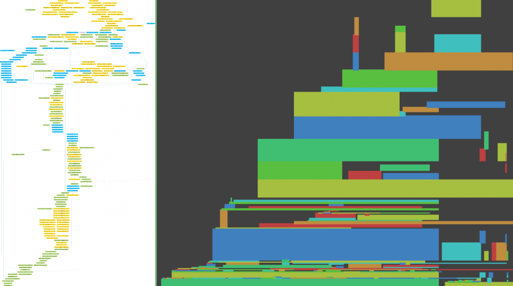

<em>The game development industry brings something new all the time. General Arcade shows the most interesting releases, updates and news of the past week, which are recommended reading for both industry veterans and novice developers.</em>

<a href="https://www.blender.org/press/blender-3-6-lts-release/">Blender 3.6 LTS</a>

<iframe allow="accelerometer; autoplay; clipboard-write; encrypted-media; gyroscope; picture-in-picture; web-share" allowfullscreen="" frameborder="0" height="315" src="https://www.youtube.com/embed/0-LiGWgKRgk" title="Blender 3.6 LTS - New Features Overview" width="560"></iframe>

A major update with new features ranging from the highly anticipated node simulation system to support for hardware-accelerated ray tracing on AMD and Intel cards.

<a href="https://www.ign.com/articles/xbox-seriously-considered-acquiring-sega-bungie-io-and-others-to-fill-content-gaps">Microsoft considered buying CD PROJEKT RED, Mundfish and about 200 other gaming companies</a>

<figure class="wp-block-image size-large"></figure>

This became known from a presentation with the corporation’s M&amp;A strategy, published as part of proceedings with the US Federal Trade Commission (FTC).

<a href="https://archive.org/details/unreleased-half-life-concept-art">Dozens of Valve game concept art have been posted online, including canceled Half-Life 2: Episode 3 and Stars of Blood</a>

<figure class="wp-block-image size-large"></figure>

Some of them were previously available only in low resolution, and many are being published for the first time.

<a href="https://youtu.be/dR4IuN2tF78">Unity introduced a tool and platform for working with AI</a>

<iframe allow="accelerometer; autoplay; clipboard-write; encrypted-media; gyroscope; picture-in-picture; web-share" allowfullscreen="" frameborder="0" height="315" src="https://www.youtube.com/embed/dR4IuN2tF78" title="Create games and apps faster with Unity Muse | Unity AI" width="560"></iframe>

With their help, you will be able to get work done faster, without being distracted by unnecessary processes, and they will also allow you to embed AI directly into Unity projects.

<a href="https://blog.unity.com/engine-platform/new-hdrp-water-system-in-2022-lts-and-2023-1">New system for working with water in Unity 2022 LTS and 2023.1</a>

<figure class="wp-block-image size-large"></figure>

The Unity team talked about the new system, first introduced in HDRP as part of Tech Stream 2022.2, with a focus on rendering. The upcoming 2023.1 release of Tech Stream expands the system’s feature set for better integration with worlds and gameplay.

<a href="https://www.gamesindustry.biz/football-manager-studio-head-rebuffs-playstations-claim-that-game-pass-is-value-destructive">Football Manager Developer Denies PlayStation’s Claim That Game Pass Is “Destroying Value”</a>

<figure class="wp-block-image size-large"></figure>

The head of the studio believes that the subscription model can work great for some games, but not others, which does not make it bad though.

<a href="https://gamedev.rs/news/046/">RustGameDev#46</a>

<figure class="wp-block-image size-large"></figure>

Digest of the Rust gamedev community for May 2023.

<a href="https://www.unrealengine.com/en-US/developer-interviews/how-unreal-engine-empowered-a-small-team-to-build-luna-abyss-beautiful-bullet-hell-prison">How Unreal Engine upgraded a small team when creating Luna Abyss</a>

<figure class="wp-block-image size-large"></figure>

The Unreal Engine team spoke to Bonsai Collective about the development process behind Luna Abyss’ fast-paced, frantic battles. The team also explained how Unreal Engine and Epic MegaGrant helped them bring their obsessive vision to life.

<a href="https://80.lv/articles/making-abandoned-blowers-with-blender-substance-3d-unreal-engine-5/">Creating abandoned blowers with Blender, Substance 3D and Unreal Engine 5</a>

<figure class="wp-block-image size-large"></figure>

Aleksandra Zając revealed in detail how the Abandoned Blowers project was created, described the texturing process using Multiple UV and Vertex Paint, and also told how rust was created.

<a href="https://www.unrealengine.com/en-US/developer-interviews/two-falls-represents-two-different-cultures-with-contrasting-art-styles">Two Falls represents two different cultures with contrasting art styles</a>

<figure class="wp-block-image size-large"></figure>

When two cultures meet, an interesting story is born. Two Falls (Nishu Takuatshina) is an adventure set in the Canadian wilderness of the 17th century. It tells the story of a meeting between recently shipwrecked French settlers and the original inhabitants of the region. French immigrant Jeanne and Innu hunter Maïkan find their experiences and stories intertwined. The Unreal Engine team discussed the development of the game with the team.

<a href="https://80.lv/articles/developing-visuals-for-deck-building-roguelike-tamarak-trail/">Roguelike Tamarak Trail visual development</a>

<figure class="wp-block-image size-large"></figure>

Yarrow Games talked about the development process of Tamarak Trail, showed early game concepts and explained how the characters, visuals and environments are created.

<a href="https://www.unrealengine.com/en-US/developer-interviews/inside-kingdoms-reborn-s-game-dev-s-journey-of-discovery-and-city-building">Kingdoms Reborn development full of discoveries</a>

<figure class="wp-block-image size-large"></figure>

Born in the mind of a student a few years ago, Kingdoms Reborn has sold over 300,000 copies to date, with an Early Access average of 90 percent on Steam. The Unreal Engine team spoke to the developer about his journey as an indie, why Unreal Engine was the right fit for him and his game, and how early access has become a key element of long-term development.

<a href="https://www.gamedeveloper.com/design/from-inspiration-to-coherence-building-the-world-of-i-sifu-i-">From Inspiration to Consistency, Sifu World Building</a>

<figure class="wp-block-image size-large"></figure>

Paul-Émile Boucher, Art Director of the game, explained how the game’s art has evolved.

<a href="http://enginearchitecture.realtimerendering.com/downloads/reac2023_task_graph_renderer.pptx">Task Graph Renderer at Activision</a>

<figure class="wp-block-image size-large"></figure>

The report tells about the design of the Task Graph architecture used in the company.

<a href="https://youtu.be/7nyEq-oDeLI">Death of a Game: Overwatch 2</a>

<iframe allow="accelerometer; autoplay; clipboard-write; encrypted-media; gyroscope; picture-in-picture; web-share" allowfullscreen="" frameborder="0" height="315" src="https://www.youtube.com/embed/7nyEq-oDeLI" title="Death of a Game: Overwatch 2" width="560"></iframe>

Analysis of the history of the game and the decisions of the developers.

<a href="https://www.unrealengine.com/en-US/developer-interviews/norse-is-a-tactical-viking-game-that-taps-into-many-aspects-of-unreal-engine-5-s-ecosystem">Norse is a Viking tactical game that taps into many aspects of the UE5 ecosystem</a>

<figure class="wp-block-image size-large"></figure>

Stage has received an Epic MegaGrant and is using Unreal Engine 5 to bring Norse to life using Nanite, Lumen and MetaHuman. The Unreal Engine team spoke with the developers about what inspired the Norwegians and how Unreal Engine 5 helped them bring history to life.

<a href="https://youtu.be/9gf2MT-IOsg">How AI works in The Sims</a>

<iframe allow="accelerometer; autoplay; clipboard-write; encrypted-media; gyroscope; picture-in-picture; web-share" allowfullscreen="" frameborder="0" height="315" src="https://www.youtube.com/embed/9gf2MT-IOsg" title="The Genius AI Behind The Sims" width="560"></iframe>

Mark Brown takes a detailed look at the artificial intelligence in the game. In addition to the analysis itself, if it is not enough for you, in the description you can find a bunch of useful links to materials on the topic.

