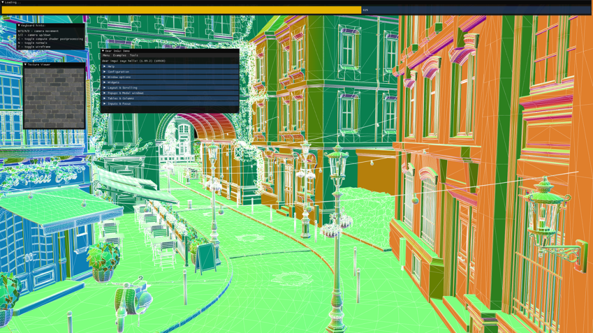
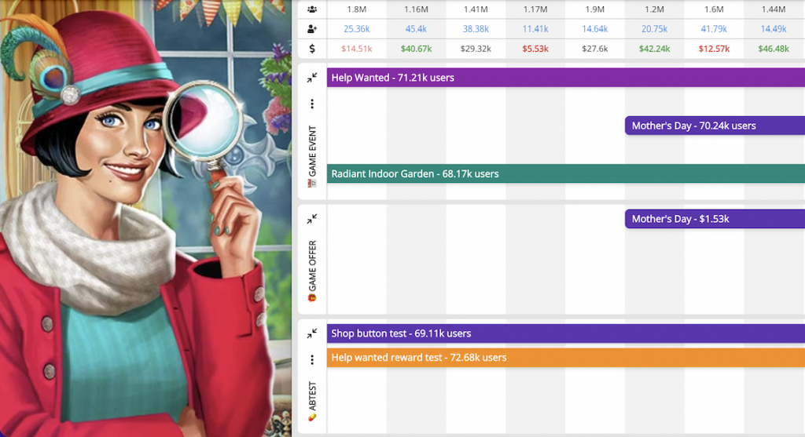
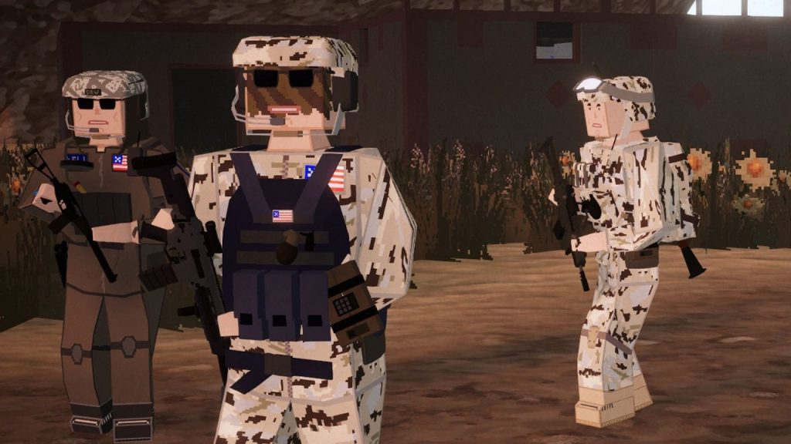
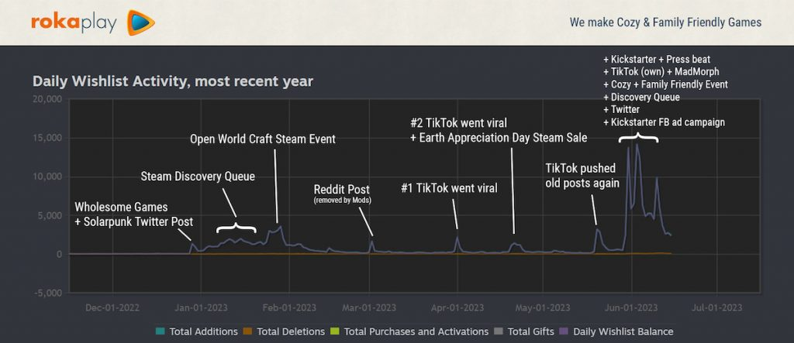

*The game development industry brings something new all the time. General Arcade shows the most interesting releases, updates and news of the past week, which are recommended reading for both industry veterans and novice developers.*

[Godot 4.1](https://godotengine.org/article/godot-4-1-is-here/)

The update is aimed at improving stability and fixing bugs. In addition, AI navigation is improved and now it’s possible to detach code editors and place them on other displays.

[Steam does not ban games with neuro-content – if it does not violate the rules](https://www.videogameschronicle.com/news/valve-clarifies-it-doesnt-want-to-discourage-games-with-ai-generated-content/)

However, you need to prove that you have the rights to the art. That is, in fact, generation is allowed only on your own datasets.

[Meta releases high-performance cross-platform graphics library IGL](https://github.com/facebook/igl/)

The library provides a single low-level interface that runs on top of native graphics APIs from OpenGL and Vulkan to Apple Metal.

[The Grove 2.0 released](https://www.thegrove3d.com/releases/the-grove-2-0/)

The tool was rewritten in Rust, which, as they say, accelerated it by 5-20 times. Divided into modules: core, plugins for Houdini and Blender.

[Unity 2023.1 Tech Stream](https://blog.unity.com/engine-platform/2023-1-tech-stream-now-available)

Improved features and rendering quality for both HDRP and URP, new light baking architecture, and more.

[How to set up LiveOps in hidden object games (June’s Journey case)](https://balancy.co/blog/2023/07/04/how-to-set-up-liveops-in-hidden-object-games-case-junes-journey/)

The article is dedicated to the most profitable game in the HOG category. The studio’s LiveOps strategy, which has kept players for many years and contributes to the continued success of the game, has been dismantled.

[What Cyberpunk 2077 taught us about non-linear level design](https://youtu.be/lXLRd5Kah-I)



The GDC 2023 keynote provides an overview of the design intent behind the levels in the game. It talks about what the team was able to learn from this, and finally how these lessons were turned into principles and methods that can be applied by level designers.

[How to promote multiplayer games. History of BattleBit Remastered](https://howtomarketagame.com/2023/07/03/how-to-market-a-multiplayer-the-battlebit-remastered-story/)

A little story about how three developers managed to create an online multiplayer shooter that had over 800,000 wishlist additions before launch, resulting in over 87,323 players playing at the same time. Within 2 weeks of launch, 1,800,000 copies have been sold.

[Why Remote Employees Are Getting Less Productive, Depressed, and Lonely](https://www.deconstructoroffun.com/blog/the-remote-work-experiment-is-over)

A little thought about remote work, the pros and cons are considered, and why companies are increasingly trying to return employees to the office.

[Behind the Scenes of Diablo IV Frames](https://mamoniem.com/behind-the-pretty-frames-diablo-iv/)

This article provides a detailed study of Diablo IV frame rendering on PC. As always, the various stages and passes of the frame are shown.

[How Solarpunk hit 250k wishlists on Steam](https://newsletter.gamediscover.co/p/how-solarpunk-racked-up-250k-steam)

Good trailer, clever use of tags and of course a beautiful game.
