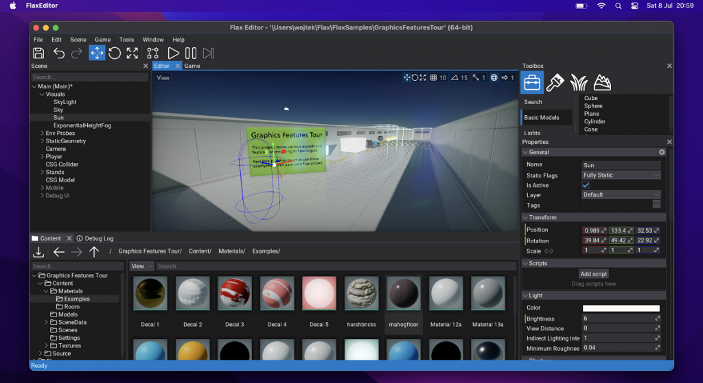
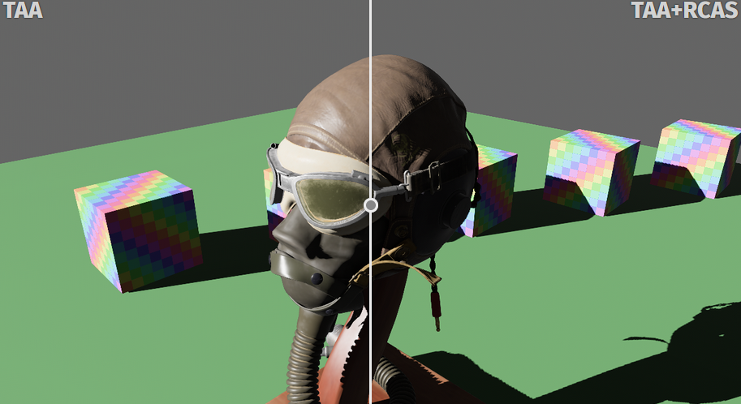
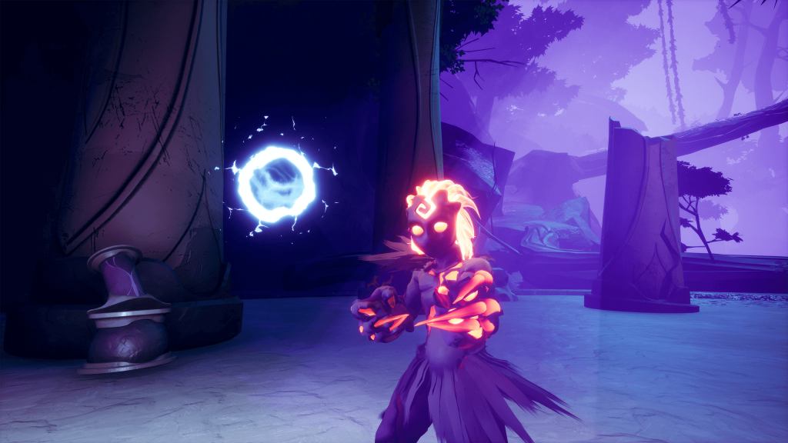
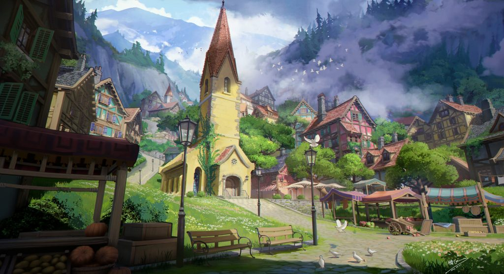
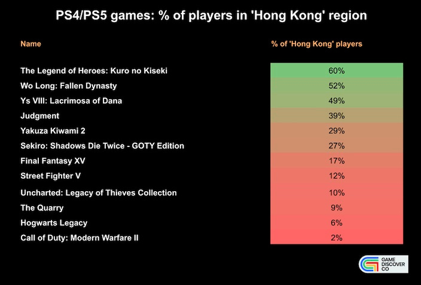

*The game development industry brings something new all the time. General Arcade shows the most interesting releases, updates and news of the past week, which are recommended reading for both industry veterans and novice developers.*

[AMD releases FidelityFX SDK 1.0](https://github.com/GPUOpen-LibrariesAndSDKs/FidelityFX-SDK)

In addition to past technologies, 1.0 added Blur, Depth of Field and Lens Effects.

[Flax Engine 1.6](https://flaxengine.com/blog/flax-1-6-released/)

.NET 7 and C# 11, moved from PhysX 4.1 to PhysX 5.1, iOS support, and a bunch of other new features.

[Noclip set to rescue archive with a decade of video game history](https://youtu.be/7KKCWGN2fBs)



The team collected a large number of previously undigitized videocassettes and discs from ten years ago with trailers, interviews, gameplay, documentaries and a video game conference, most of which were being prepared for disposal. They took the initiative to digitize the entire collected archive.

[Google Play updated the rules for blockchain applications](https://android-developers.googleblog.com/2023/07/new-blockchain-based-content-opportunities-google-play.html)

In accordance with Google Play’s gambling policy, apps that do not qualify to participate in gambling cannot accept money for a chance to win assets with an unknown real monetary value, including NFTs. For example, developers should not offer purchases if the value of NFTs received by users is not clear at the time of purchase.

[Bevy 0.11](https://bevyengine.org/news/bevy-0-11/)

4 months after the last release, a new version of the Rust engine was released. Added TAA, as well as SSAO, and many more.

[Why a team of 9 switched to Unreal Engine to create Strayed Lights](https://www.unrealengine.com/en-US/developer-interviews/why-a-team-of-nine-switched-to-unreal-engine-to-deliver-visually-stunning-action-game-strayed-lights)

The Unreal Engine team spoke with Embers Game Director and Co-Founder Maxim Philipp about how a small group managed to create such a massive game, as well as advice they would give to other indie developers looking to create a work of art.

[Creating a Ghibli style mountain village in Unreal Engine 5](https://80.lv/articles/making-a-ghibli-inspired-mountain-village-in-unreal-engine-5/)

Lara D’Adda talked about working on the Stylized Mountain Village project, explained how the NPR buildings were modeled and textured, and discussed the rendering pipeline.

[The Secret of Into the Breach’s AI](https://youtu.be/fkEG55gFqrA)



Power in Simplicity! The game is more about puzzles, not strategic thinking. There should be no such situations when it becomes not just difficult, but almost impossible to pass some level.

[The making of IMMORTALITY](https://youtu.be/8ov00DFQ5gg)



New documentary from Noclip about creating interactive cinema.

[Inside China’s “hidden” game console market](https://newsletter.gamediscover.co/p/in-depth-inside-chinas-hidden-game)

Some analytics from gamediscover and Niko Partners.

[7 days of indie developer](https://youtu.be/ZQqxwp0CO-w)



Work-life balance, a little hatred for unity, and more.

[Creating roads with Unity Spline](https://youtu.be/ZiHH_BvjoGk)



Video tutorial on how to create a road network using the spline system.
