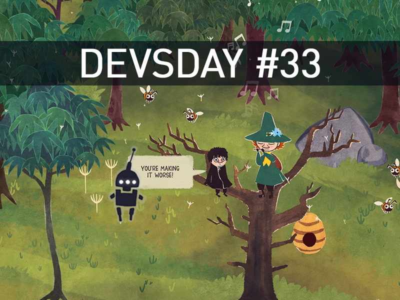

<em>The game development industry brings something new all the time. General Arcade shows the most interesting releases, updates and news of the past week, which are recommended reading for both industry veterans and novice developers.</em>

<a href="https://forums.unrealengine.com/t/unreal-engine-5-3-preview/1240016">Unreal Engine 5.3 Preview</a>

<figure class="wp-block-image size-large"></figure>

In this version, the rendering functions provide more control over performance and produce better results. The assembly with the help of Multi-process Cook has been reduced, which will speed up iteration.

<a href="https://store.steampowered.com/news/group/4145017/view/3687933234141224746">New Steamworks Traffic Reporting Tools</a>

<figure class="wp-block-image size-large"></figure>

New UTM tools and deprecation of Google Analytics.

<a href="https://80.lv/articles/recreating-underwater-sun-rays-from-avatar-the-way-of-water-in-houdini/">Recreating the underwater sunbeams from Avatar in Houdini</a>

<figure class="wp-block-image size-large"></figure>

Nabil Jabour, FX TD at Framestore, explains how he managed to recreate the effect from the film.

Postmortem: Prototyping Let’s! Revolution! to turn Minesweeper into a turn-based roguelike strategy

<figure class="wp-block-image size-large"></figure>

Michael Highland, creative director, and Ian Sundstrom, gameplay programmer, talk about how their team went through the tedious process of releasing their first commercial game.

<a href="https://80.lv/articles/dynamic-character-poses-in-zbrush-evoking-motion-and-grace-in-fine-art-sculptures/">Dynamic character poses in ZBrush: movement and grace in sculptures</a>

<figure class="wp-block-image size-large"></figure>

3D artist Deryck Pelegrini shared the details of The Three Dancers project, explaining how he created a set of different poses from the same mesh using Reallusion’s new Pose Tools plugin for ZBrush.

<a href="https://www.unrealengine.com/en-US/developer-interviews/born-of-bread-is-a-paper-mario-inspired-rpg-made-entirely-with-blueprints">Born of Bread is a 100% Blueprinted Paper Mario RPG</a>

<figure class="wp-block-image size-large"></figure>

The Unreal Engine team spoke with the developers about the lessons learned from their first game, Helltown, and how they were applied to Born of Bread. We also chatted about how the team used the Unreal Engine to create the game’s signature 2D and 3D look, the power of blueprints, and whether it’s possible to pet a dog in their game.

<a href="https://sms.playstation.com/stories/gdc-2023-presentations">Santa Monica Studio Presentations from GDC 2023</a>

<figure class="wp-block-image size-large"></figure>

The studio posted slides of their presentations. Reports about both rendering and animation, AI and more.

<a href="https://blog.unity.com/games/stunning-scenarios-in-warhammer-40000-warpforge">Crafting the stunning scenarios in Warhammer 40,000: Warpforge</a>

<figure class="wp-block-image size-large"></figure>

The art director and producer talked about the development of the game on Unity.

<a href="https://80.lv/articles/developing-a-procedural-graffiti-generator-in-unreal-engine-5/">Creating a Procedural Graffiti Generator in Unreal Engine 5</a>

<figure class="wp-block-image size-large"></figure>

Canberk Yücekök shared a brief description of the process of creating his generator.

<a href="https://blog.unity.com/engine-platform/nature-shaders-with-shader-graph-in-2022-lts">How to create nature shaders with Shader Graph in 2022 LTS</a>

<figure class="wp-block-image size-large"></figure>

The Unity team talks about the subtleties of writing shaders and gives an example of this for the nature shader.

<a href="https://www.gamesindustry.biz/hyper-games-mission-to-bring-moomins-to-the-masses">Hyper Games mission to popularize Moomin</a>

<figure class="wp-block-image size-large"></figure>

The developer of Snufkin: Melody of Moominvalley talks about the adaptation of the world by Tove Jansson.

<a href="https://fabiensanglard.net/ega/index.html">Commander Keen’s Adaptive Tile Refresh</a>

<figure class="wp-block-image size-large"></figure>

Fabien Sanglard breaks down the technology used in the first trilogy.

