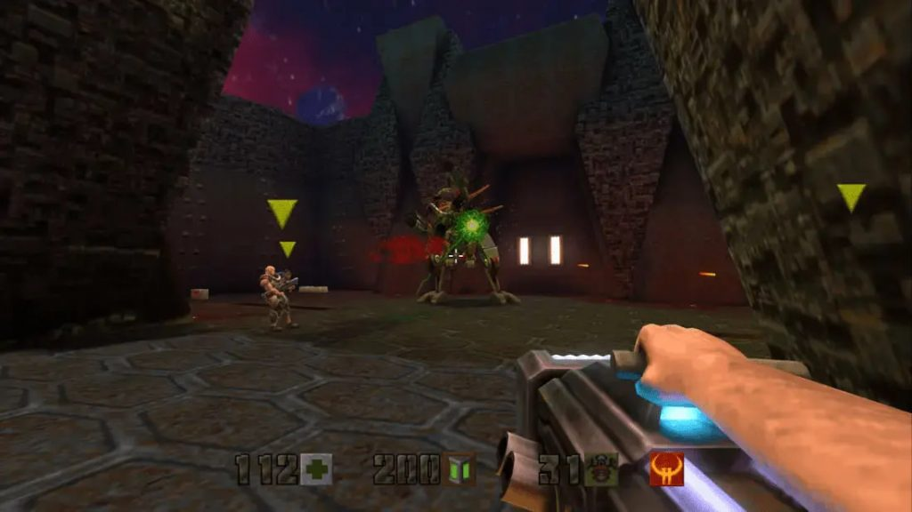
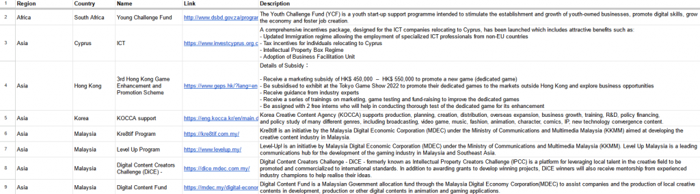
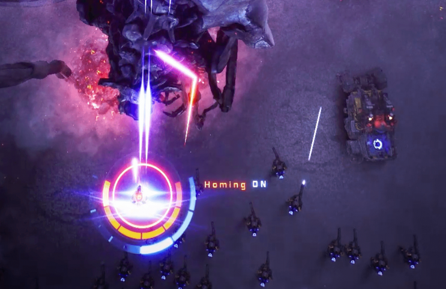
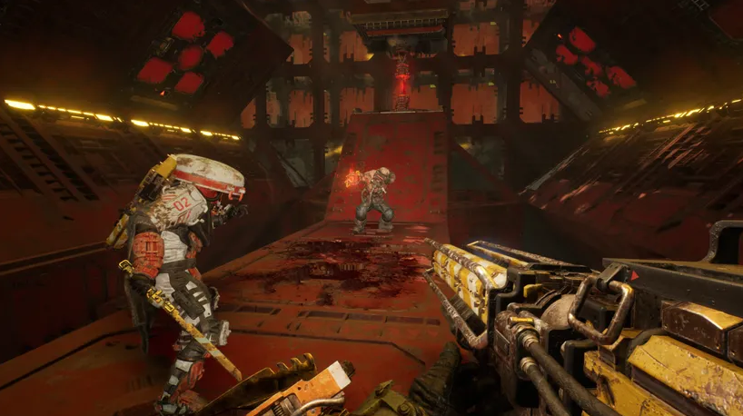

*The game development industry brings something new all the time. General Arcade shows the most interesting releases, updates and news of the past week, which are recommended reading for both industry veterans and novice developers.*

[Quake II Remastered Sources Now Available on GitHub](https://github.com/id-Software/quake2-rerelease-dll)

Including Quake 2 code 64.

[Punch Club 2: Fast Forward made $1.4 million in 18 days](https://dtf.ru/gameindustry/2022902-nintendo-hochet-zapatentovat-mehaniki-iz-tears-of-the-kingdom-vklyuchaya-perehod-vo-vremya-bystrogo-peremeshcheniya)

$1.4m gross in 18 days. The median time in the game is 10 hours. The release had 100k wishlists (the original had 10k).

[80lv compiled a list of state funds, IT and game development hubs](https://80lv.info/grants)

Treat this as an opportunity to evaluate the local market, find expertise and build new connections. At the F2P Campus, for example, we talked to one of the creators of Assassins.

[How Avalanche put the soul into Hogwarts Legacy](https://www.unrealengine.com/en-US/developer-interviews/why-avalanche-worked-to-deliver-a-hogwarts-game-with-soul)

The Unreal Engine team sat down with the developers at Avalanche Software to find out how they applied the lessons they learned while working on Disney Infinity and 25 to Life to create such a huge open world.

[How KeelWorks moved from animation to game development to create CYGNI: All Guns Blazing](https://www.unrealengine.com/en-US/developer-interviews/how-keelworks-moved-from-animation-to-game-dev-to-create-cygni-all-guns-blazing)

The Unreal Engine team spoke with KeelWorks about the development of the first project, the transition from animation to game development, and how the two Epic MegaGrants played a “vital role” in the team’s journey.

[How to Increase Wishlists with Twitter Aggregators](https://howtomarketagame.com/2023/08/07/how-to-get-wishlists-using-twitter-game-aggregators/)

An example of a specific game where tweets from such an account did a good job of boosting the number of additions to the Steam doing lists.

[Dark Pictures: Season 1 – 4 games in 4 years: audio systems for narrative horror](https://youtu.be/hr-D-wtK0Ew)



Barney Pratt of Supermassive Games talks about some of the technical systems, creativity and solutions that have brought award-winning quality. The video focuses on believable character sound, interactive mixing, musical direction, and spatial audio.

[How the developers of Meet Your Maker created a unique experience with a no-crunch policy](https://www.gamedeveloper.com/production/deep-dive-how-the-developers-of-meet-your-maker-made-a-first-of-its-kind-game-with-a-no-crunch-policy)

Behavior Interactive Senior Producer Julien Tolschuk-Jalbert and Senior Creative Director Ashley Pannell explain why not crunching is a value to start with managers.

[Using decals for shaders and post-processing](https://medium.com/@raphaelhorion/using-decals-to-drive-object-shaders-and-post-processing-252805232748)

This post introduces the idea of using decals to control post-processing and object-level effects.

[Rewritten wipEout](https://phoboslab.org/log/2023/08/rewriting-wipeout)

In 2022, the source code of the game leaked to the network. The author of the article has completely revised them, and it compiles under Windows, Linux, macOS and WASM.

[Insights about publishing indie games](https://80.lv/articles/insights-on-indie-game-publishing-from-kasedo-games/)

Jonathan Hales of Kasedo Games discussed the key elements of a publisher-developer partnership, laid out initial criteria for developers, and shed light on the support independent developers can expect from Kasedo Games.

[Working with Shadows in Final Fantasy XVI](http://www.jp.square-enix.com/tech/library/pdf/2023_FFXVIShadowTechPaper.pdf)

An implementation of Tiled Deferred Shadow is presented, with performance measurements and quality results.

[Vampire Survivors: Flexible Community Management](https://youtu.be/vfMhgSTVrNs)



Beth Molloy, speaking at GDC 2023, talks about how, as the community manager of the indie hit Vampire Survivors, she managed a community of millions of players with no experience in the field.
