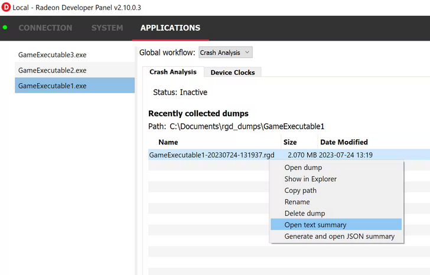
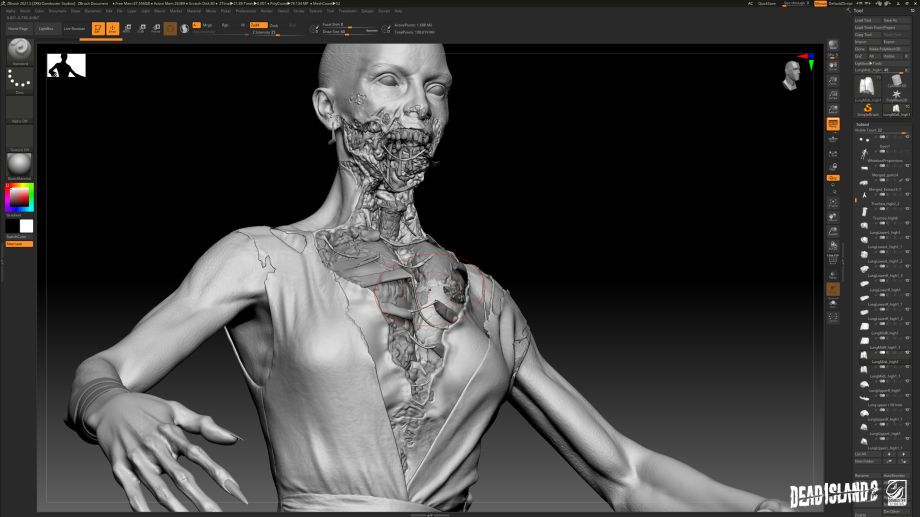

<em>The game development industry brings something new all the time. General Arcade shows the most interesting releases, updates and news of the past week, which are recommended reading for both industry veterans and novice developers.</em>

<a href="https://gpuopen.com/radeon_gpu_detective_available_now/">AMD releases Radeon GPU Detective to detect bugs in graphics cards</a>

<figure class="wp-block-image size-large"></figure>

The utility automatically saves and analyzes the dumps, and then creates a report that can make it easier to find and fix the problem.

<a href="https://store.steampowered.com/news/group/4145017/view/3700310527377680731">Steam Minimum Price Threshold Update</a>

<figure class="wp-block-image size-large"></figure>

Valve has adjusted the minimum price allowed in some currencies other than the US dollar to align with the recommended currency conversions. The $0.99 low remains the same, and the update brings the lows in a number of other currencies in line with this price. If the cost of your products is below this limit, then they will become unavailable in some countries, so it is better to update the settings.

<a href="https://dev.epicgames.com/en-US/news/epic-online-services-expands-free-crossplay-overlay-from-pc-to-consoles">Epic Online Services Expands Cross-Platform Play Between PC and Consoles</a>

<iframe allow="accelerometer; autoplay; clipboard-write; encrypted-media; gyroscope; picture-in-picture; web-share" allowfullscreen="" frameborder="0" height="315" src="https://www.youtube.com/embed/l0JojT0q0Fc" title="Crossplay expanded from PC to consoles | Game Development | Epic Online Services" width="560"></iframe>

An expanded set of tools from Epic Games allows developers to bring players together across platforms (Microsoft Xbox, Nintendo Switch and Sony PlayStation).

<a href="https://clockwork-labs.medium.com/press-release-august-09-2023-44f91e5494e3">Clockwork Labs announces new SpacetimeDB platform for multiplayer gaming</a>

<figure class="wp-block-image size-large"></figure>

Sandbox MMORPG developer BitCraft has unveiled a new serverless platform that allows small teams to create massively multiplayer online games. Conceptually, this is a mixture of databases and services in the form of modules, which allows you to work directly with the database and game logic.

<a href="https://blog.selfshadow.com/2023/08/12/siggraph-2023-links/">Links from SIGGRAPH 2023</a>

<figure class="wp-block-image size-large"></figure>

An updated collection of reports, slides and more from Siggraph 2023.

<a href="https://80.lv/articles/moonspire-on-how-its-speechbound-rpg-helps-learn-languages-in-fun-way/">Moonspire on How Its Speechbound RPG Helps Learn Languages in Fun Way</a>

<figure class="wp-block-image size-large"></figure>

Manuel Tausch talked about the RPG Speechbound from Moonspire Games, showed the visual development process and explained how the use of modern text-to-speech systems makes the game unique.

<a href="https://blog.unity.com/games/how-rubber-duck-games-developed-evil-wizard-boss-fight">Boss battles in Evil Wizard</a>

<figure class="wp-block-image size-large"></figure>

A detailed analysis, starting from the concept (inspired by Jaina from Warcraft), ending with VFX, shaders.

<a href="https://www.unrealengine.com/en-US/developer-interviews/how-the-three-person-team-behind-laysara-summit-kingdom-found-a-new-spin-on-city-builders">How the 3-man team that developed Laysara: Summit Kingdom found a new approach to city building</a>

<figure class="wp-block-image size-large"></figure>

The Unreal Engine team spoke with Maciek Pryc about Laysara, the development of the game’s impressive weather system, and how Unreal Engine and other tools help a team of three work like a big studio.

<a href="https://youtu.be/m6c3y6MK-AU">Postmortem Among Us VR</a>

<iframe allow="accelerometer; autoplay; clipboard-write; encrypted-media; gyroscope; picture-in-picture; web-share" allowfullscreen="" frameborder="0" height="315" src="https://www.youtube.com/embed/m6c3y6MK-AU" title="Emergency Meeting! It's the 'Among Us VR' Postmortem" width="560"></iframe>

In a GDC 2023 talk, Jennifer Rabbitе, Michal Ksiazkiewicz and Shawn Patton talk about the benefits of porting and playtesting. They also explain some of the issues they encountered, and ultimately voted to release the game during the pandemic.

<a href="https://www.deconstructoroffun.com/blog/2023/8/14/chrome-valley-customs-a-new-contender-in-the-match-3-race">Chrome Valley Customs: Can a male audience and a puzzle game be the same?</a>

<figure class="wp-block-image size-large"></figure>

The article discusses and compares male and female stereotypes in games in order to analyze the generally accepted social representations.

<a href="https://howtomarketagame.com/2023/08/16/frequently-asked-questions-about-steam-next-fest/">Frequently Asked Questions about Steam Next Fest</a>

<figure class="wp-block-image size-large"></figure>

The author of howtomarketagame answers key questions about the fest, demos and streams.

<a href="https://80.lv/articles/dambuster-on-how-dead-island-2-s-zombies-humans-gore-were-made/">How zombies, people and blood were created for Dead Island 2</a>

<figure class="wp-block-image size-large"></figure>

Dambuster Studios Lead Character Artist Richard Smith spoke about the team’s character creation process, explained how zombies, humans and gore were created for Dead Island 2, and shared some tips for aspiring character artists.

