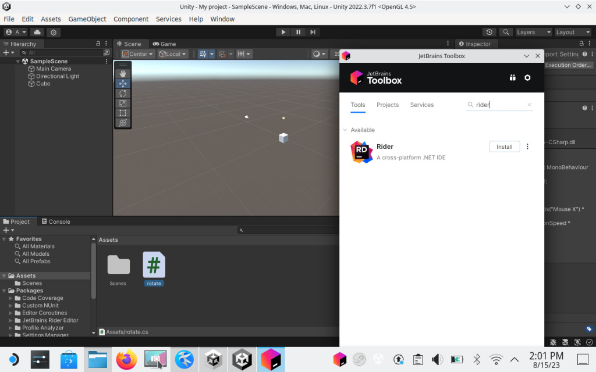
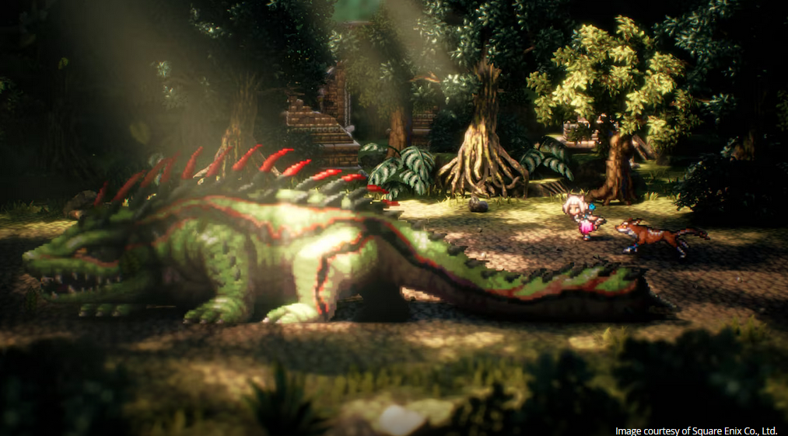
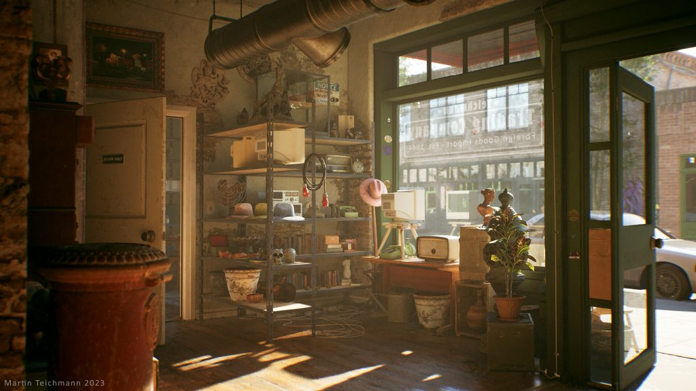
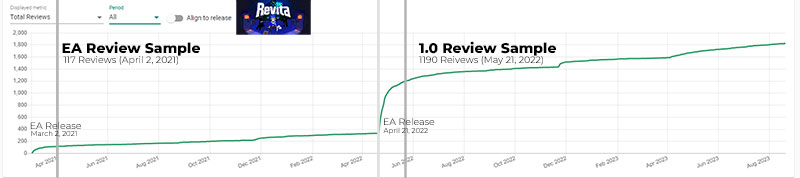
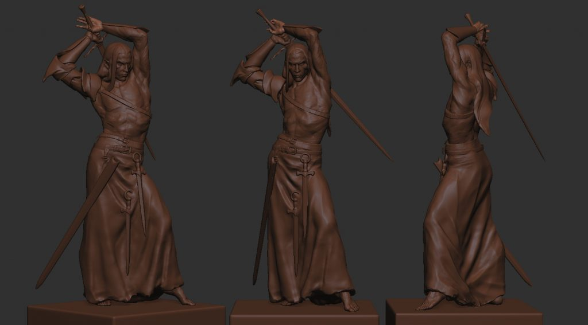
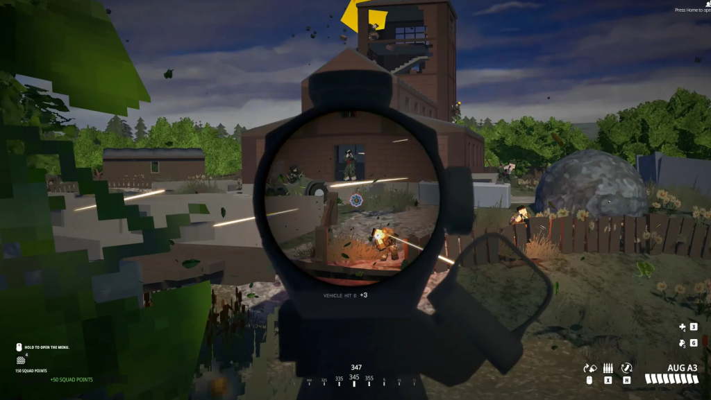
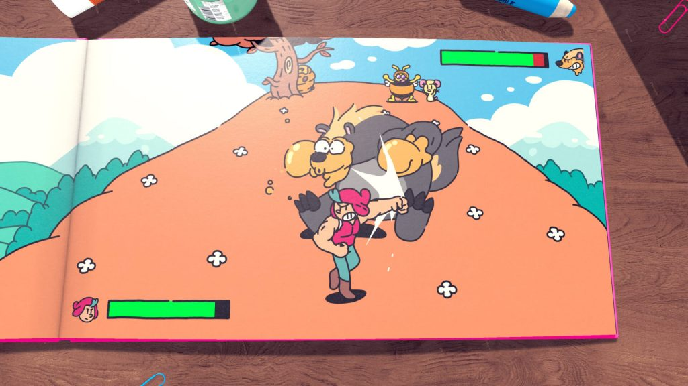

*The game development industry brings something new all the time. General Arcade shows the most interesting releases, updates and news of the past week, which are recommended reading for both industry veterans and novice developers.*

[NVIDIA Announces DLSS 3.5](https://developer.nvidia.com/blog/generate-groundbreaking-ray-traced-images-with-next-generation-nvidia-dlss/)



The new version has added Ray Reconstruction, which should improve the quality of traced images by removing noise. DLSS 3.5 also adds automatic scene change detection to prevent complex frames from being created when frames are generated between major scene changes. This is done by analyzing the camera orientation in the game for each pair of DLSS Frame Generation frames.

[AMD showed the long-awaited FSR 3 technology](https://gpuopen.com/fsr3-announce/)

FSR 3, a solution similar to Nvidia’s DLSS 3, combines frame generation (Fluid Motion Frames) with upscaler (FSR 2) and latency reduction (Anti-Lag+). Forspoken and Immortals of Aveum will be the first to try this technology. FSR 3 will run on Radeon graphics cards as well as Nvidia and Intel GPUs.

[JetBrains talked about how to install Rider IDE on Steam Deck](https://blog.jetbrains.com/dotnet/2023/08/23/how-to-install-jetbrains-rider-on-steam-deck/)

This step-by-step guide shows how to install Rider and the .NET SDK on Steam Deck, which will help simplify development for this platform and speed up the testing process, allowing you to do it right on the target device.

[Octopath Traveler II creates a bigger world in stunning HD-2D style](https://www.unrealengine.com/en-US/developer-interviews/octopath-traveler-ii-builds-a-bigger-bolder-world-in-its-stunning-hd-2d-style)

The Unreal Engine team spoke with Square Enix and Acquire about the style improvements, the development of eight new heroes, and how Unreal Engine helped the team create breathtaking combat in the game.

[How to create a scene with dozens of props using photogrammetry and UE5](https://80.lv/articles/antique-shop-how-to-make-a-scene-with-dozens-of-props-using-photogrammetry-ue5/)

Lead Environment Artist Martin Teichmann shared the details of the Antique Shop scene, explaining how many of the assets were created using Maya, Substance 3D and RealityCapture, as well as detailing the lighting setup in Unreal Engine 5.

Estimating Early Access success

Early access is a big risk. In a new article, howtomarketagame talks about what to expect from a full release after EA.

[Rules and subtleties of sculpting in ZBrush](https://80.lv/articles/the-rules-intricacies-of-sculpting-miniatures-in-zbrush/)

Alex Carratala spoke about the nuances of creating realistic human models, talked about the importance of silhouettes and shared a detailed description of the recent Red project.

[Why the developers of BattleBit Remastered wanted to make a large-scale, low-spec shooter.](https://www.gamesindustry.biz/why-battlebit-remastereds-devs-wanted-to-make-a-low-spec-large-scale-shooter)

And how a trio of inexperienced developers created a game that sold 100,000 copies in just three hours.

[Plucky Squire combines 2D and 3D visuals in an aesthetically pleasing and mechanically interesting way](https://www.unrealengine.com/en-US/developer-interviews/the-plucky-squire-blends-2d-and-3d-visuals-in-aesthetically-pleasing-and-mechanically-interesting-ways)

The Unreal Engine team spoke with the developers about how they started working on a new game in a new studio, how they used Unreal Engine to create the details of their small world, and the impact on the team of getting an Epic MegaGrant.

[The secret of one animation from Uncharted](https://youtu.be/dlQqiJYdyYM)



The author of the video analyzes the interaction of Nathan Drake with the environment and tries to recreate these animations on his own
