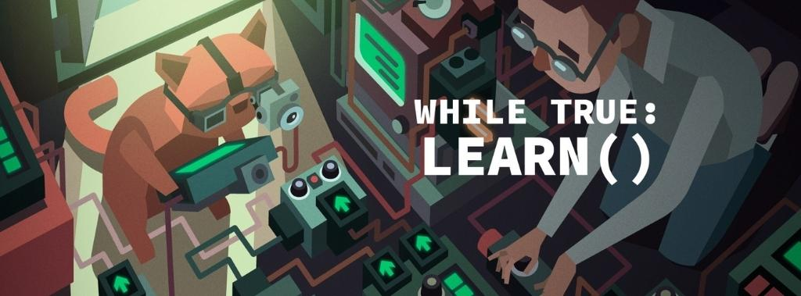

<em>The game development industry brings something new all the time. General Arcade shows the most interesting releases, updates and news of the past week, which are recommended reading for both industry veterans and novice developers.</em>

<a href="https://blog.unity.com/news/plan-pricing-and-packaging-updates">Unpleasant situation with Unity</a>

<figure class="wp-block-image size-large"></figure>

The hottest news of this week. On September 12, without any warning, the company announced that it would now charge a certain amount per number of installations.

<a href="https://techcrunch.com/2023/09/08/market-intelligence-firm-sensor-tower-conducts-layoffs-several-execs-out/">There have been layoffs at Sensor Tower. Among those fired are top managers</a>

<figure class="wp-block-image size-large"></figure>

TechCrunch reports that more than 40 people have lost their jobs.

<a href="https://godotengine.org/article/godot-developer-fund/">Godot launches funding initiative to fuel long-term growth</a>

<figure class="wp-block-image size-large"></figure>

The development fund was launched in July and has already accepted many new and old sponsors, but the team needs to take funding to a new level to maintain the current pace of development, and increase it with new employees.

<a href="https://youtu.be/wbem5qrH5ow">Procreate unveils new 2D animation app for iPad</a>

<iframe allow="accelerometer; autoplay; clipboard-write; encrypted-media; gyroscope; picture-in-picture; web-share" allowfullscreen="" frameborder="0" height="315" src="https://www.youtube.com/embed/wbem5qrH5ow" title="Introducing: Procreate Dreams" width="559"></iframe>

A new animation application designed to create breathtaking hand-drawn animations and dynamic motion graphics.

<a href="https://youtu.be/GHZZffgRvkw">Roblox introduced new AI tools</a>

<iframe allow="accelerometer; autoplay; clipboard-write; encrypted-media; gyroscope; picture-in-picture; web-share" allowfullscreen="" frameborder="0" height="315" src="https://www.youtube.com/embed/GHZZffgRvkw" title="Roblox Assistant" width="559"></iframe>

Assistant, simplified avatar creation and voice chat moderation.

<a href="https://80.lv/articles/choosing-defold-for-steam-games-production-the-story-of-luden-io/">Choosing Defold for creating games: the story of Luden.io</a>

<figure class="wp-block-image size-large"></figure>

CEO of Luden.io Oleg Chumakov shared the history of his company and relations with Defold.

<a href="https://80.lv/articles/impact-of-concept-art-on-the-character-creation-pipeline/">The influence of concept art on the character creation process</a>

<figure class="wp-block-image size-large"></figure>

Character artist Jef Bernaers talks about his thesis written at the Breda University of Applied Sciences on the influence of concept art on character creation.

<a href="https://80.lv/articles/behind-the-last-case-of-benedict-fox-developing-art-environments-gameplay/">Behind The Last Case of Benedict Fox</a>

<figure class="wp-block-image size-large"></figure>

The Plot Twist team talked about developing The Last Case of Benedict Fox, finding an art style for the game, and working on lighting in Unity.

<a href="https://howtomarketagame.com/2023/09/11/three-inspiring-marketing-success-stories/">Three inspiring stories of marketing success</a>

<figure class="wp-block-image size-large"></figure>

The post showcases 3 games and 3 marketing campaigns that have achieved tremendous success in terms of wishlist and sales. The best part is that these are all games of small teams with a modest track record.

<a href="https://youtu.be/TdWFzpgnljs">How to make a good 2D camera</a>

<iframe allow="accelerometer; autoplay; clipboard-write; encrypted-media; gyroscope; picture-in-picture; web-share" allowfullscreen="" frameborder="0" height="315" src="https://www.youtube.com/embed/TdWFzpgnljs" title="How to Make a Good 2D Camera" width="559"></iframe>

Are you making a 2D game? Then you will need to work on the camera. But there’s more to it than just following the main character. The video gives five tips on how to make your camera better.

<a href="https://80.lv/articles/mastering-realism-how-to-create-props-environments-for-aaa-games/">Mastering realism: how to create props and environments for AAA games</a>

<figure class="wp-block-image size-large"></figure>

The Kevuru Games team returned to 80 Level to talk about the behind-the-scenes creation of environments and game props.

<a href="https://youtu.be/yPfagLeUa7k">Trying to simulate the entire ocean</a>

<iframe allow="accelerometer; autoplay; clipboard-write; encrypted-media; gyroscope; picture-in-picture; web-share" allowfullscreen="" frameborder="0" height="315" src="https://www.youtube.com/embed/yPfagLeUa7k" title="I Tried Simulating The Entire Ocean" width="559"></iframe>

The video discusses ocean modeling and shading. Theory, mathematics and practical implementation are considered.

<a href="https://www.deconstructoroffun.com/blog/2023/9/12/product-mindset-why-does-your-team-need-it-and-is-it-worth-cultivating">Product thinking: why does your team need it and is it worth developing?</a>

<figure class="wp-block-image size-large"></figure>

We can all agree that great ideas come from great teams. What follows this belief is the misconception that all you have to do is build an amazing team and then just step aside and let them do what they do best.

<a href="https://youtu.be/BZKGFZyWeKc">How Fortnite designers created their own tools</a>

<iframe allow="accelerometer; autoplay; clipboard-write; encrypted-media; gyroscope; picture-in-picture; web-share" allowfullscreen="" frameborder="0" height="315" src="https://www.youtube.com/embed/BZKGFZyWeKc" title="How 'Fortnite' Designers Made Their Own Tools" width="559"></iframe>

In a keynote from Tools Summit 2023, the developers explain the benefits of their designer-focused methodology, and how anyone who can create user interfaces in Unreal has the skills to create powerful editing and asset management tools and eliminate inefficiencies in their own workflows.

