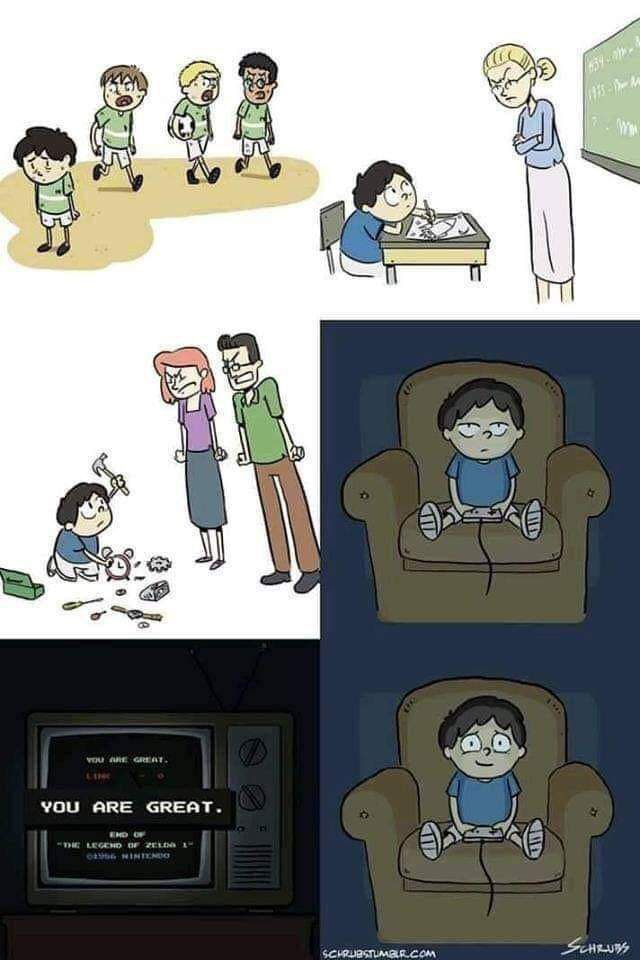
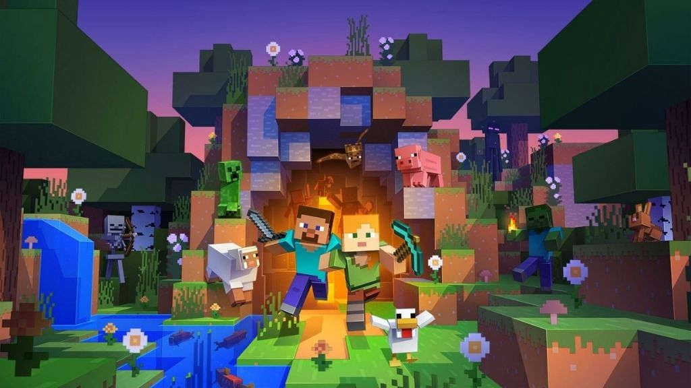
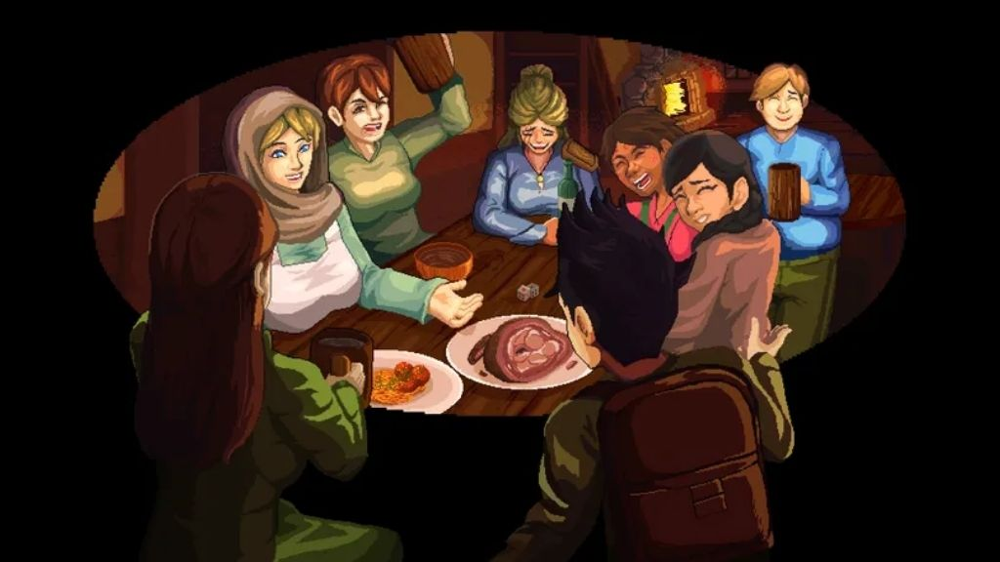
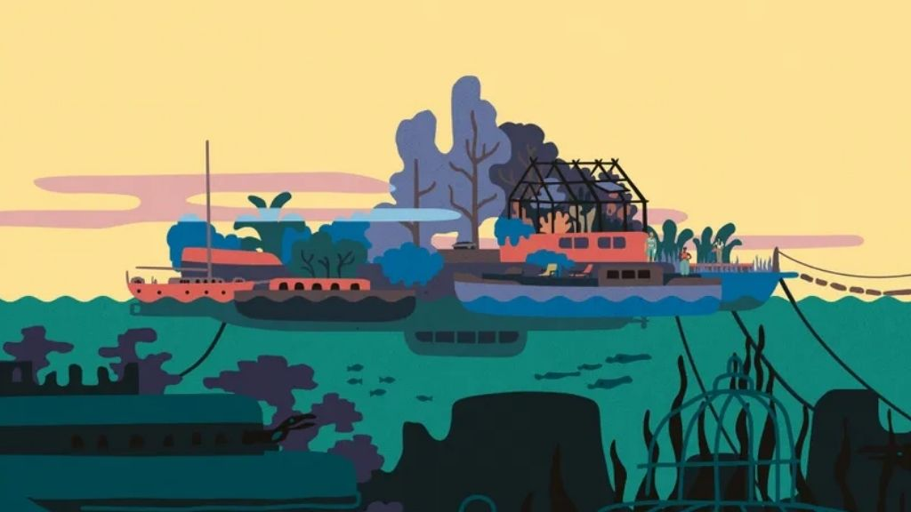
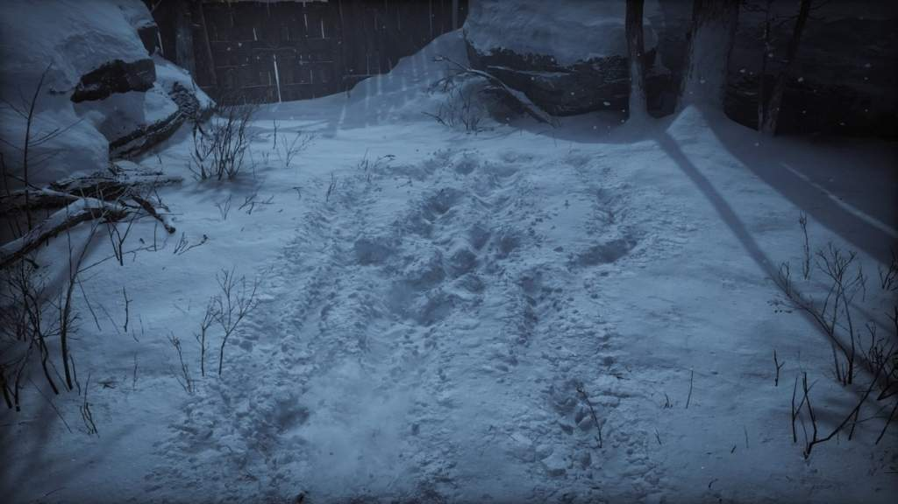
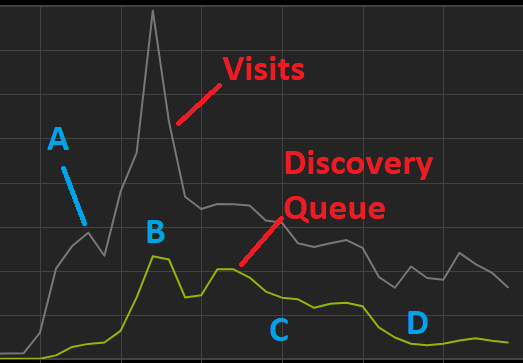
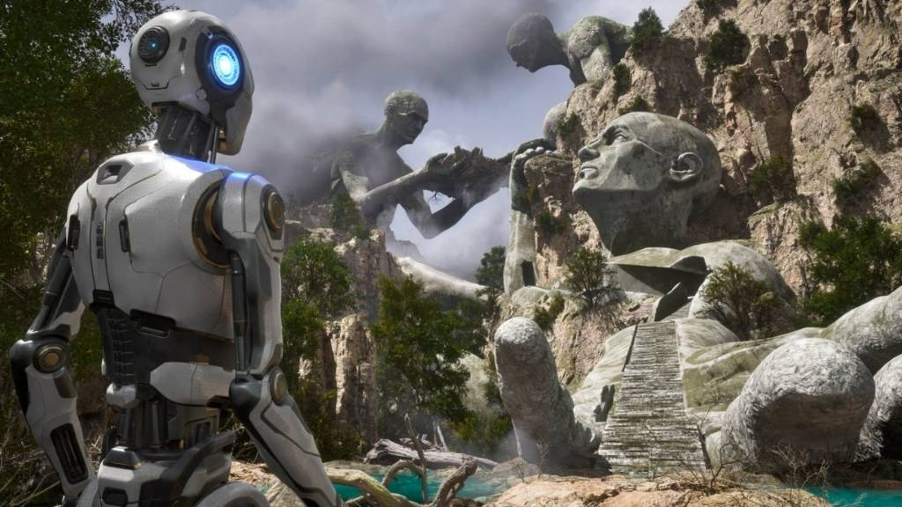
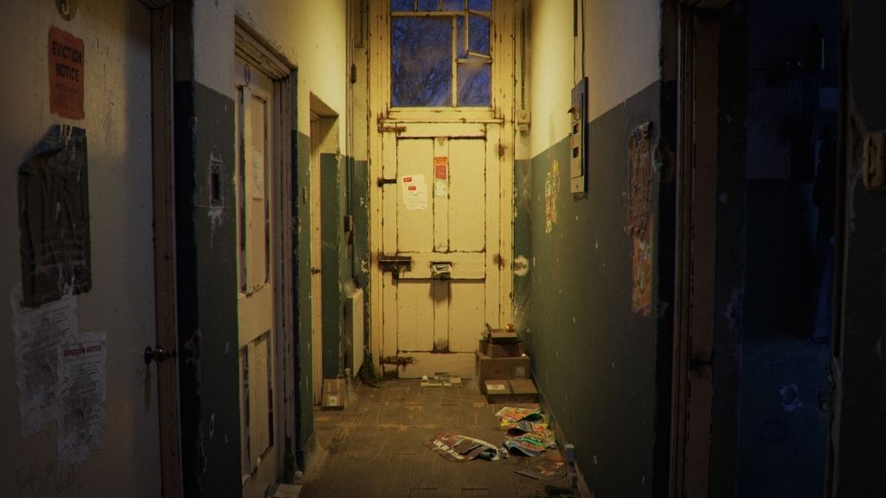
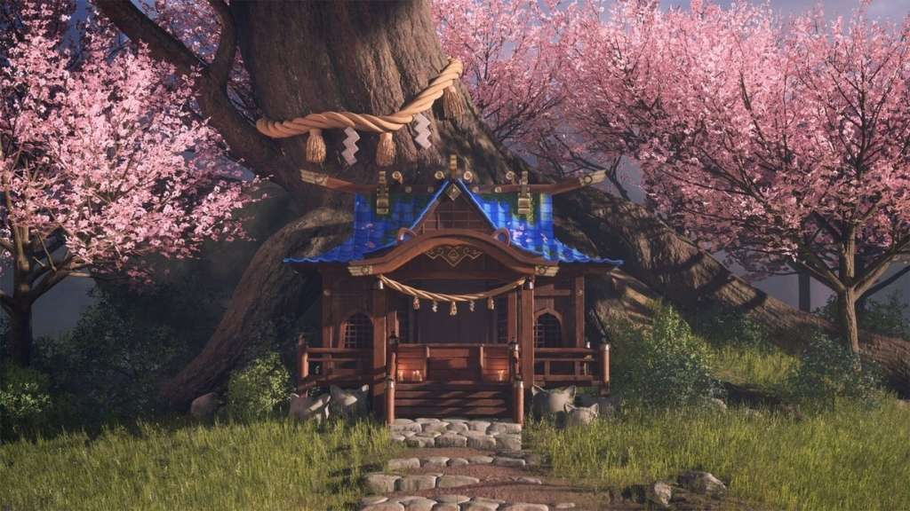

*The game development industry brings something new all the time. General Arcade shows the most interesting releases, updates and news of the past week, which are recommended reading for both industry veterans and novice developers.*

[Roblox made employees choose between working in the office and quitting](https://blog.roblox.com/2023/10/future-work-together-roblox/)

Roblox management wants employees to return to the office. The company’s CEO announced that starting next year they will have to come to the office at least three times a week – from Tuesday to Thursday. Those who do not agree will have to look for another job.

[Epic Games offered no commission to developers for releasing old games in its store](https://store.epicgames.com/en-US/features/now-on-epic)

The terms will apply for the first 6 months, then Epic will take 12% as before.

[Video games make more than half of gamers feel happier; games are an outlet for them](https://www.theesa.com/news/global-report-reveals-positive-benefits-of-video-gameplay/)

The American Entertainment Software Association decided to find out what motivates people to play video games. 64% of gamers said that for them games are an outlet from everyday life. For 63% of gamers, games help them feel happier.

[Minecraft sales reach 300 million copies](https://www.windowscentral.com/gaming/minecraft/minecraft-crosses-300-million-copies-sold-as-it-prepares-to-celebrate-its-15th-anniversary)

In terms of sales, it is 100 million ahead of the game in second place.

[How Nintendo created Link’s Ultrahand](https://youtu.be/pvOqTunOQB8)



Video with an analysis of the mechanics and how the world itself is designed to this ability.

[Postmortem Windy Meadow](https://www.gamedeveloper.com/design/deep-dive-windy-meadow)

A good longread on Gamasutra with an analysis of the game.

[Creating a Narrative with Multiple Climaxes and Multiple Characters in Saltsea Chronicles](https://www.gamedeveloper.com/design/deep-dive-designing-the-narrative-for-multiple-middles-and-multiple-heroes-in-saltsea-chronicles)

The goal was not to create a character or even a series of characters, but rather a community.

[How the God of War Ragnarok snow system was created](https://80.lv/articles/santa-monica-s-senior-programmer-on-how-god-of-war-ragnar-k-s-snow-system-was-made/)

Paolo Surricchio, rendering master at Santa Monica Studios, explained why the team redesigned the snow system for God of War Ragnarök, shared details about the creation, and talked about optimizing snow for PS4 and PS5.

[What do you need to get into the Discovery queue?](https://howtomarketagame.com/2023/10/16/what-does-it-take-to-get-in-the-discovery-queue/)

Let’s figure it out together with howtomarketagame.

[About Croteam’s transition from proprietary technologies to UE5 for The Talos Principle 2](https://www.unrealengine.com/en-US/developer-interviews/inside-croteam-s-transition-from-in-house-tech-to-ue5-for-the-talos-principle-2)

The Unreal Engine team spoke with Chief Creative Officer Davor Hunski and Lead Programmer Goran Adrinek about the reasons for the engine change, why the team is unlikely to ever return to its own technology, and some of the inspiration behind puzzle game The Talos Principal 2, and its deep philosophical roots.

[How to Texture an Abandoned Corridor in Substance 3D Painter](https://80.lv/articles/learn-how-to-texture-abandoned-corridor-in-substance-3d-painter/)

Rahul Sonawane explained how he developed the Silent Corridor project, showed how he created the dust, and explained the texturing process in Substance 3D Painter.

[Busting GameDev Myths: Unreal Engine is Difficult to Learn](https://80.lv/articles/busting-gamedev-myths-unreal-engine-is-difficult-to-learn/)

Aspiring environment artist Lily Lee shared more about the Harujinja project, showing how easy it is for a beginner to get started with Unreal Engine 5.

[Steam Deck: how many units have already been sold](https://newsletter.gamediscover.co/p/steam-deck-everything-you-were-afraid)

There are no official data, but if you believe the leaks, then there are already more than 1 million.

[Best Grid Shader (Yet)](https://bgolus.medium.com/the-best-darn-grid-shader-yet-727f9278b9d8)

A good article describing the problem and solutions.
