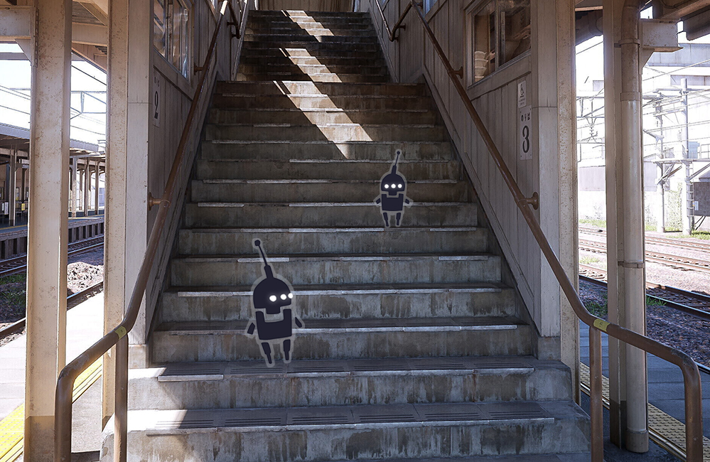

An Italian 3D artist <a href="https://www.artstation.com/subjectn">Lorenzo Drago</a> knows how to make amazing and beautiful designs. This is evident in his portfolio and his recent work, which has attracted a lot of attention.

<figure class="wp-block-image size-large"></figure>

Etchū-Daimon Station (based on a real-life train station from Toyama, Japan) is made in Unreal Engine 5 and is stunningly beautiful.

<figure class="wp-block-image size-large"></figure>

Lumen, the new lighting model, makes the picture so realistic that people don’t immediately realize that what they’re looking at is a graphic rather than a photo. In dynamics, the station also looks great.

<iframe allow="accelerometer; autoplay; clipboard-write; encrypted-media; gyroscope; picture-in-picture" allowfullscreen="" frameborder="0" height="703" src="https://www.youtube.com/embed/2paNFnw1wRs" title="YouTube video player" width="1250"></iframe>

