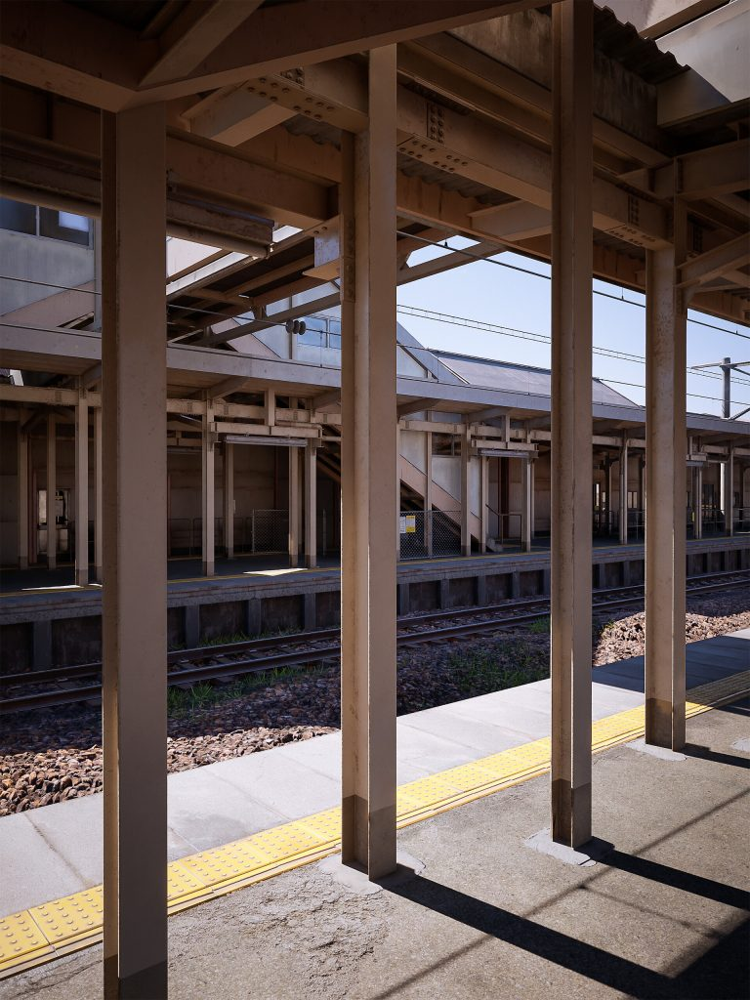
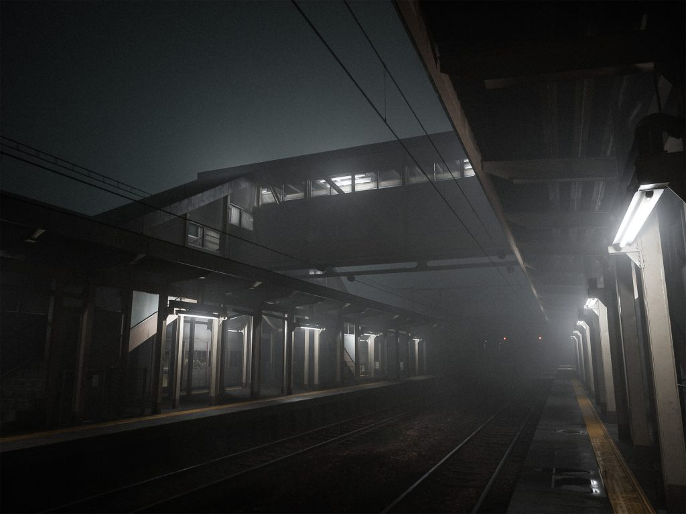

An Italian 3D artist [Lorenzo Drago](https://www.artstation.com/subjectn) knows how to make amazing and beautiful designs. This is evident in his portfolio and his recent work, which has attracted a lot of attention.

Etchū-Daimon Station (based on a real-life train station from Toyama, Japan) is made in Unreal Engine 5 and is stunningly beautiful.

Lumen, the new lighting model, makes the picture so realistic that people don’t immediately realize that what they’re looking at is a graphic rather than a photo. In dynamics, the station also looks great.


