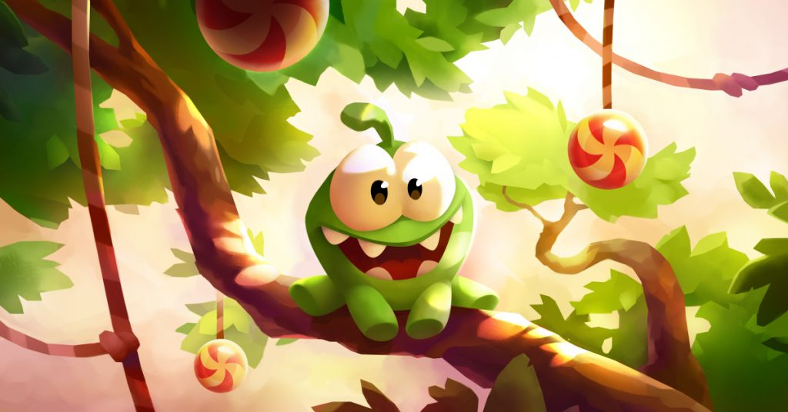

The video game industry in the countries of the former Soviet Union looks quite strong, and we’d like to continue talking about those games that got the titles of world wide hits as well as those that you may well have missed, although they are undoubtedly worthy of attention.

But obscurity is definitely not something that Rage of Mages can be accused of. The series dates back to 1998 when the original game was released. The events of the first game take place in Allod Umoyr, a mysterious place that doesn’t belong to any of the Empires of the game world and is shrouded in mystery… No one has ever returned from there, and of course, this only encourages adventure seekers of all stripes and the curious ones! And it is to this mysterious place that you will have to go as one of the four characters that you are offered to choose from.

Rage of Mages became one of the first Russian games to gain popularity all over the world, so it is not at all surprising that Rage of Mages II: Necromancer was released the year after, and Evil Islands: Curse of the Lost Soul, the third game of the series, after another year.

Eight games were released under the Rage of Mages brand overall, including free games as well as multiplayer ones and mobile. Interesting fact is that Cloud Pirates, which was released in 2016, was developed by a separate studio called Allods Team, and not Nival, which gave life to the series as such.



Another game that we would like to recall today is Space Rangers, released in 2002. The game didn’t become as popular as Rage of Mages, but it found its fans around the whole world anyway. The game belongs to the not so popular genre of “epic games”, but at the same time it has elements of RPG, turn-based strategy, text quest and even arcade.

The game takes place in space, at the beginning of the XXXI century, when the galaxy is inhabited by as many as five intelligent civilizations: Maloki, Bearings, Faeyans, Gaals and people. All these races are part of Galactic Commonwealth, which has common time reckoning and common currency. But besides them, there are aggressive klisans in the vastness of space, and they are the ones, who don’t let the others to feel themselves in peace. And there are space pirates who don’t care about any laws at all, and who only need as much money as possible from peaceful, harmless ships! By the way, in the end of the game, pirates play a rather serious role, so they are not just insignificant minor characters.

Interesting fact: many call the starting point of work on Space Rangers the release of the game General, created by Dmitry Gusarov back in 1999. It was thanks to the community of this game that the New Game Software studio eventually appeared, later renamed Elemental Games, and the very same Dmitry Gusarov became the head of development for Rangers.

The development of Space Rangers wasn’t notably covered in mass media, so the release of the game came as a surprise to many. And judging by the reaction of users and critics, a pleasant surprise! The game received very high marks and acquired, if not a million, but certainly a damn close-knit fan club! Elemental Games failed to repeat the success with the release of Space Rangers 2: Rise of the Dominators in 2004, but the dilogy is still considered very successful, and it definitely got its share of success and stavas.



By the way, there is Space Rangers HD: A War Apart [in Steam](https://store.steampowered.com/app/214730/Space_Rangers_HD_A_War_Apart/) at the moment. The game was released in 2013, so if you want to check this crazy mix of genres, it will be the best way to do it.

Next on the list is Cut the Rope, a Russian puzzle game in which you have to feed a funny monster by throwing off all sorts of goodies. The game was developed by the Russian company ZeptoLab and was released in 2010. Its popularity is largely due to the apparent simplicity, which turns into very serious logical problems that are not available for everyone to solve. And, of course, the cutest monster called Om Nom!

In fact, even those who never played Cut the Rope or Cut the Rope 2 (2014) and never even heard of it will most likely recognize this monster’s face. And the 2011 Russian-British animated series Om Nom Stories contributed a lot to this.

There is also a very interesting story with the King’s Bounty series. We would like to mention separately the actual King’s Bounty II, which at the time of this publication is only preparing for release.

The King’s Bounty series itself appeared back in 1990, when the American company New World Computing released the turn-based RPG of the same name. It was the ideas of King’s Bounty, by the way, that gave the inspiration to the first game of the cult series Heroes of Might and Magic appeared in 1995. But the original KB was quite different from HOMM.

For example, King’s Bounty was much more focused on tactics (that is, wandering through labyrinths and direct battles), while HOMM was focused on development, construction, gathering resources, and the like. Another thing is that there is no ability to develop player-captured castles in King’s Bounty, while in HOMM this is one of the key components of the gameplay. And of course, in King’s Bounty the player controls only one character, and in HOMM their number can reach eight. And even though one of the Heroes of Might and Magic’s sequels, Quest for the Dragon Bone Staff, is essentially a remake of the original King’s Bounty, these series of games stand “separate” from each other.

After the bankruptcy of The 3DO Company and the closure of New World Computing, the rights to the King’s Bounty series were bought by the Russian company 1C. And by the way, the development of the first “Russian” part was carried out by the Vladivostok company Katauri Interactive, known for working with games in the Space Rangers series, which we have already mentioned today! From 2008 to 2014, under the leadership of 1C, six games were released in the King’s Bounty series, but despite the fact that the series has consistently remained quite popular, it would be wrong to call at least one of the released games a world hit.

But King’s Bounty II seems to have other plans. The game was officially announced on August 14, 2019 on the eve of gamescom, and its development began two years earlier. Initially, the release was planned for 2020, but due to various delays, everything had to be postponed to August 24, 2021. The style of King’s Bounty II is significantly different from previous games in the series, and this time we will have something much more realistic. The developers motivated this by the fact that they want to do something “more mature”. And judging by the published information, the work done so far is much more than serious. With a clear focus on global popularity.



Of course, we cannot guarantee that everything will work out for 1C… But the fact that many fans of the series are waiting for King’s Bounty II can be asserted with complete confidence!

Finally, we’d like to recall two games that didn’t become super wold wide hits, but still showed itselves very well in Russian gaming industry. First, Parkan, a Russian space simulator released in 1997. The gameplay consisted of two main mechanics: controlling the space patrol cruiser PARKAN and visiting ships and planetary bases in person, wearing a special spacesuit. Critics rated the game very high: in Game.EXE magazine, for example, it got 94%, and Game Land gave it 8/10.

But Nikita, the studio that created the game, couldn’t repeat their success. Eight years later, in 2005, a direct sequel to the original 1997 game, Parkan 2, was released. However, the site reviewer Absolute Games gave it only 47% of the rating, citing the fact that there is “absolutely nothing to do” in the game. So the authors didn’t succeed in continuing the series successfully. And nevertheless, we are definitely shouldn’t forget about the first part – after all, it left its mark on the global gaming industry for sure.

And the last game for today is Blitzkrieg from Nival Interactive. The plot of the game is based on the events of World War II, and you are invited to go through the campaigns for the Soviet Union, Nazi Germany and the Allies (British and American troops). There are also factions in the game that cannot be played – Fascist Italy, which appears as an enemy in the North African campaign for the Allies, Finnish troops that you will encounter in the Soviet campaign, and the armed forces of France and Poland, which appear in the German campaign. Each campaign consists of several chapters covering a specific phase of the war.

An excellent evidence of the popularity of Blitzkrieg is the fact that a large number of add-ons came out to it, and most importantly, a huge number of games that were created on the Blitzkrieg engine. Games and add-ons created on the basis of Blitzkrieg number in dozens, and each has consistently stood out among other developments with a recognizable “face” of the creation of Nival Interactive.



General Arcade worked on [Blitzkrieg Anthology](https://generalarcade.com/project/blitzkrieg/), by the way. Our software engineer needed three months and such tech stack as Custom engine and C++ to implement GOG Galaxy Crossplay support (i.e. online multiplayer between GOG and Steam).

Guess we should finish for now. Some may be surprised – how come there is nothing about Tetris in four articles about games created on the territory of the former Soviet Union!? But we think that Tetris already became something like an “icon” that belongs to the whole world. And besides, is there anyone on the planet to whom at least something new can be told about Tetris!?..

*Alexander Kurikh*
