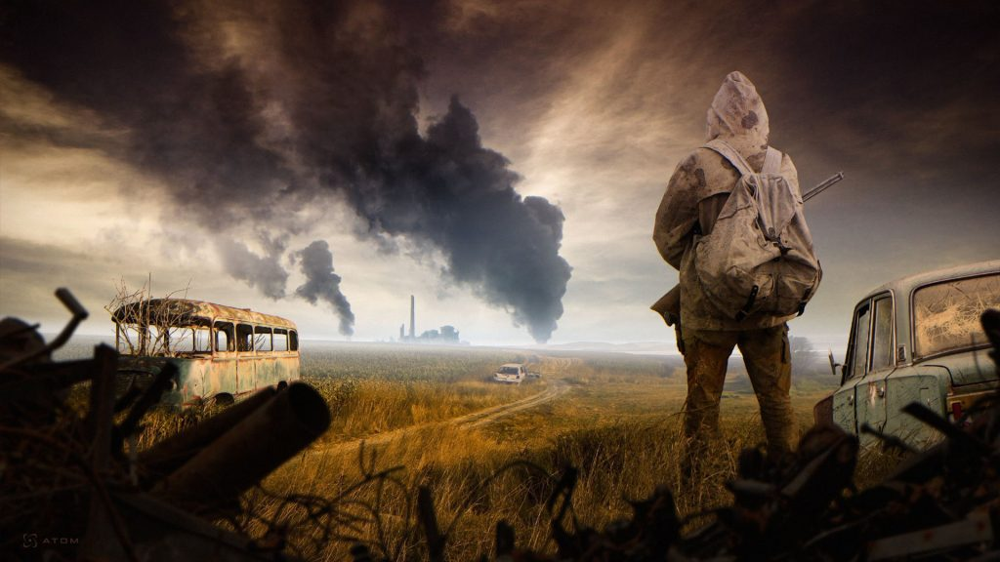
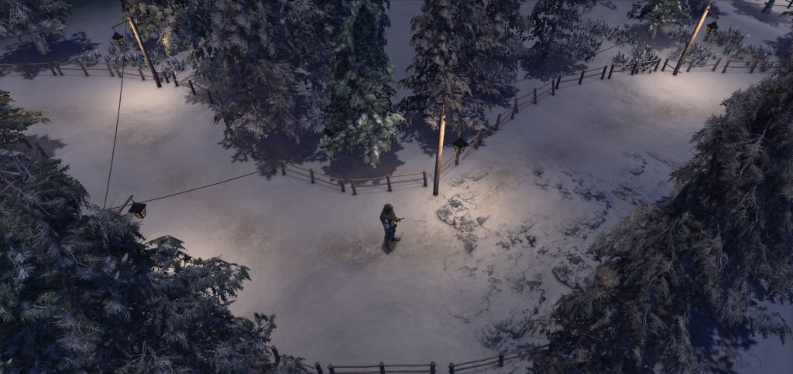
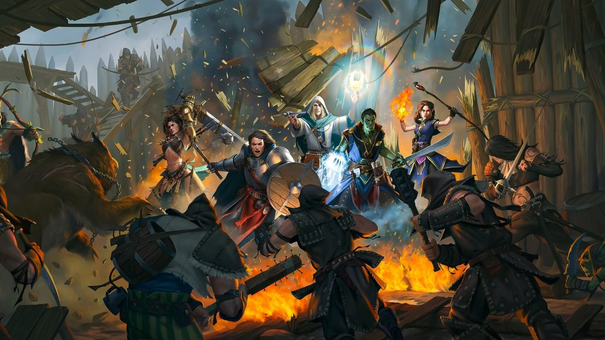
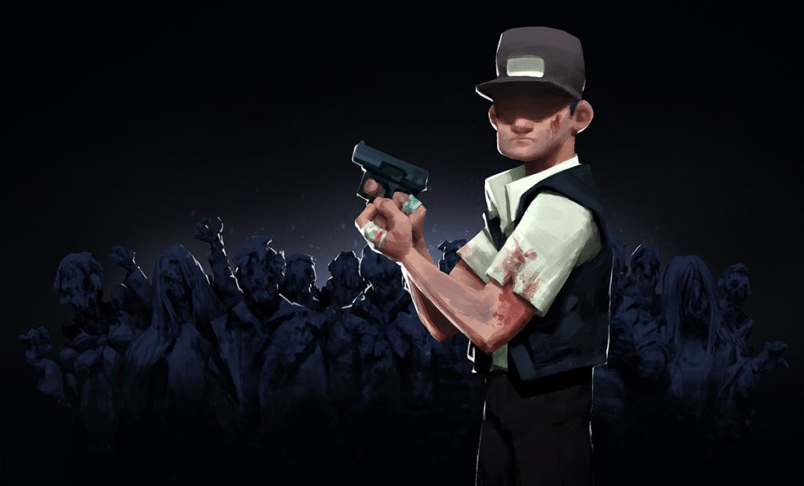
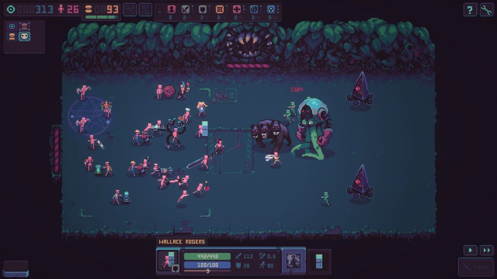

Choosing the topic of video games that stand out for some specific feature (in our case, geography!) opens an endless world and unlimited springboard for content! Likewise with our series of articles about games created in the territory of the former USSR. Considering that new games appear continuously, we’ll never be able to describe all of them. But in our case, the process is important, not the final result!

And that means it’s time for another article in the mentioned series. This time we’d like to start it with a story about an interesting new indie project called illWill – don’t confuse it with the Lake of Tears’ eighth studio album. The illWill we’re talking about is a first-person shooter, which its creator describes as “the mix of Doom, Quake, Blood and Serious Sam with some bits of madness”. And by the way, this is not a mistype: it is the creator, not the creators. Only one person is working on the project, [Slava Bushuev](https://gamejolt.com/@slava_bushuev).



However, it is unlikely that you would have thought so after trying the demo if you hadn’t had the information in advance… The game turns out to be of really high quality, and this is especially noticeable against the background of a huge number of retro shooters that have flooded the market lately.

Among other things, the retro theme, which has caught the wave of popularity nowadays, is convenient for developers by the fact that you can simply close your eyes to some points and shortcomings, saying that “they tried to make the maximum immersion in retro”. For illWill, no such sin has been noticed – Bushuev, on the contrary, is trying to work on every small detail in his project.

Of course, right now it’s too early to judge because we’ve got really lots of time waiting for the actual release… But the [demo released in October 2021](https://gamejolt.com/games/ILLWILL/648468) inspires hope that everything will be fine. And if development continues as planned, FPS fans will have a very interesting journey through the dungeons!

Frankly speaking, it was not without a fly in the ointment. If you believe the same development plan we were talking about, the full version of illWill will not be released for sale until December 2022. As you understand, working alone is clearly not conducive to the high speed of creating new maps and opponents.

Another game that seems to be worth paying attention to is [Evade The Light](https://store.steampowered.com/app/1601870/Evade_The_Light/) from the Azerbaijani studio [AzDimension](https://azdimension.az/). This is also a first-person shooter, but a shooter of a completely different type. And if the main thing in illWill is a hunting shotgun with a good old shot, the authors of Evade The Light promise to captivate their players with a well-thought-out plot.



The action takes place in Azerbaijan in the near future. In one of the sparsely populated mountain regions of the country, a paranormal incident occurred, which not only affected all living things in the region but also turned all human ideas about the laws of nature… General panic was avoided, but the government didn’t achieve great success in studying the anomaly – all the scientists sent to the scene of the incident simply disappeared without a trace!

Well, as it usually happens, it is you who have to take on the role of the last hope in solving the riddle. “You never know what is hidden in the darkness”, – says the description of the game…

AzDimension promises an absolutely free world, completely accessible for exploration from the very beginning of the game. As you understand, the main task is to study the secrets of the Anomaly, but it will not be so easy to do this, since the Zone itself will be against you. So get ready for different monsters, ethereal spirits, and stuff like that… And also, as we are promised, “the player will resist time itself” – however, so far we can only guess how exactly this type of danger will be shown.

What the developers of Evade The Light have managed to show to the general public so far looks very good, quite meeting the requests of AAA titles. And if the gameplay will be at the same level, the game will clearly become a hit among fans of the S.T.A.L.K.E.R. series and games the like.

By the way, the release is already scheduled for the fourth quarter of 2021, so there is very little time left to wait!

Actually, the topic of all kinds of cataclysms or even the end of the world has always been popular with the makers of books, films, and video games, and it will probably be popular right up to this very end of the world. And it was this idea that was once again played up by the authors of the [ATOM](https://atomrpg.com) [RPG](https://atomrpg.com/ru/), undeservedly forgotten by us in previous articles.

The game was developed by the independent studio [Atom Team](https://twitter.com/the_atomgame), which includes specialists from Russia, Ukraine, Lithuania, and Poland. The release took place at the end of 2018, and although the game didn’t become the “second Fallout”, user ratings were beyond praise – and even now they remain so, by the way.

By the way, Fallout was one of the games that inspired the developers from Atom Team – along with Wasteland, System Shock, Deus Ex, and Baldur’s Gate. The ATOM RPG takes place in an alternative post-nuclear world in an unnamed part of the former USSR (apparently, in the European part of the country). 1986 in this universe didn’t pass as peacefully as in our reality, and nuclear war broke out between USSR and United States, putting an end to all the usual world foundations.

Your character is an ordinary member of the secret organization called ATOM, which survived a nuclear war and has secretly watches the world around since then. In 2005, the ATOM leadership sent you to search for the expedition of General Morozov, which went for valuable technologies and hasn’t been in touch for some time. You will be able to move freely between any locations of the game, the largest of which is the town of Krasnoznamenny, where the leaders seek to reproduce the pre-war Soviet realities and the settlement of Peregon merchants.

And of course, during your travels, you can encounter a wide variety of mutant animals, trade caravans, groups of stalkers, robbers, slave traders, adherents of all sorts of destructive sects. And besides, there is always the possibility of visiting completely random locations not indicated on the map initially. That is everything in the best traditions of already mentioned Fallout!

The realities of ATOM RPG sets the mood in no way worse than the eminent “big brothers”, which the developers were guided by during their work on the offspring. Putting ATOM RPG on a par with Fallout or Wasteland would be overkill, but we’re pretty sure that fans of the classics will also appreciate the game from Atom Team.

At the same time, in 2018, the next role-playing game which got into today’s article was released. And although the general assessments of [Pathfinder: Kingmaker](https://kingmaker.owlcatgames.com/), created by the Russian studio [Owlcat Games](https://owlcatgames.com/), didn’t break the records set by ATOM RPG, the audience took the game very warm. This, in general, is not surprising, considering that Kingmaker was based on the popular tabletop role-playing game Pathfinder Roleplaying Game and became a part of its universe.

But for a complete picture, it is worth making a reservation that although the players received Pathfinder: Kingmaker very warm, the critics weren’t so loyal. On the Metacritic portal, for example, the game received only 73/100, which is seriously inferior to the estimates of the user audience.

In Pathfinder, you will have to explore the Stolen Lands, the battles over which have continued for centuries. Hundreds of kingdoms have flourished and fallen here, and now it is the time to find your own! To become a worthy ruler, you have to curb nature, keep enemy nations in check, and sometimes deal with internal threats… By the way, one of the game’s scriptwriters was Christopher Avellone, known for his work on Fallout 2, Planescape: Torment, Icewind Dale, Baldur’s Gate III, Neverwinter Nights 2, and many other acclaimed hits.

Another step back in time, to 2016, when Russian studio [DO MY BEST](https://twitter.com/domybest_games) released the scrolling shooter [The Final Station](http://thefinalstation.com/). The gameplay of this game is divided into two parts: in one you travel between settlements by train, which, of course, needs to be monitored, and in the other, you need to stop in a settlement to explore buildings and basements in search of supplies and survivors.

According to the plot, 106 years before the events of the game, the first visit to Earth took place, when huge capsules of gas fell to the surface of the planet. This weird gas made the inhabitants of the cities turn into monsters who rushed at all living things, and then THEY came – huge creatures 100 meters high, from which there was no escape.

After some time, when most of the world civilization was destroyed, THEY disappeared, and it seems that humanity got another chance… Or maybe not? It seems that everything depends on you.

The Final Station got very high appraisals from both players and critics, and GameCritics called the game “a perfect example of a game capturing a theme and riding it for all it’s worth”. In addition, the DO MY BEST project managed to win grand prizes at DevGAMM Minsk 2015 and Indie Game Cup 2015. And even now the unusual pixel sci-fi horror scores are excellent!

And, by the way, since we are talking about pixels, it would be nice to mention [Despot’s Game](https://twitter.com/despotism_3k), a strategy from [Konfa Games](https://konfagames.com/) studio released in October 2021.

The game takes place in a universe created by the authors in their previous game, Despotism 3k. In a post-apocalyptic labyrinth, people wake up: without clothes and without memories, but with a bunch of weapons. It’s someone’s evil joke, a crazy experiment, or just a game you don’t know – you will have to deal with questions like this later. And to begin with, it would be nice to survive.

The player’s task is to collect loot and turn naked, intimidated people who fell under his control into magicians, ninjas, and masters of callous pretzel throwing. Well, even in spite of this, sooner or later all of them will be eaten by carnivorous cabbage… But with your help, they will have at least some time to walk around the local labyrinths.

Actually, the developers themselves remind everyone that “sooner or later artificial intelligence will enslave us all”, and declare that the main mission of their games is “to prepare everyone for the inevitable fate”. But at least getting ready for slavery or death with Despot’s Game and Despotism 3k is fun. And it is unlikely that anyone in the near future will be able to come up with the same amusing “training base” for such an unpleasant fate.

And a “cherry on the cake” today is [Force Reboot](https://ln404.itch.io/force-reboot) – another Russian shooter, which is being developed by only one person.

Seen from the outside, the game is very reminiscent of ULTRAKILL from New Blood Interactive, but the similarity is mostly visual. It is quite difficult to make a diverse visual range when trying to implement everything in the style of the first Atari…

As for the gameplay, Force Reboot is very different from its more famous colleague and differs mainly due to the unusual setting that the player is offered with each new map. It is not limited to the new guns: you will be offered to change the speed, gravity, physics, and even the size of opponents! By the way, it is much more difficult to kick smaller enemies than evil cyborgs of normal size…



Force Reboot doesn’t claim to revolutionize the gaming industry and doesn’t offer us something extraordinary or unseen before. But at the same time, it is damn addictive, and once you sit down to play this shooter, you risk not coming to your senses for several hours!

*Alexander Kurikh*
