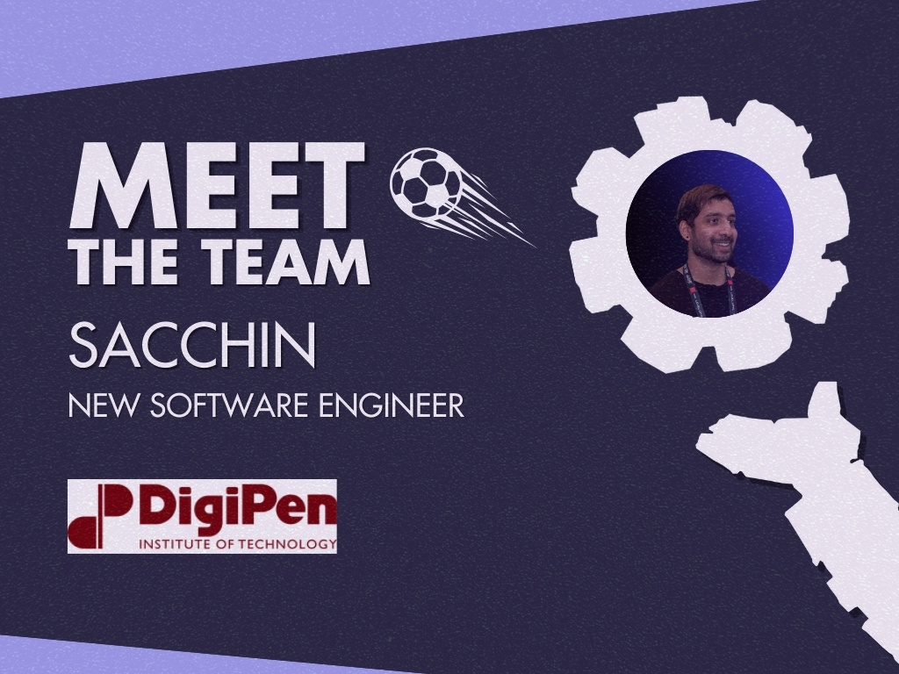

Sacchin’s journey into the tech world started with his dad’s nudge, who also studied in the US. Following his dad’s lead, he chose the cool <a href="https://www.digipen.edu/">DigiPen Institute of Technology</a> in Redmond, Washington. Sacchin thrived there, learning heaps about computer science and game development, setting the stage for his future career.

After graduating, Sacchin joined <em>The Forge</em> in San Diego, California, as a Graphics Programmer, where he quickly moved up the ranks to become a Senior Graphics Programmer. His time at The Forge was marked by big contributions to major projects, which fuelled his passion for game development.

Beyond the world of code, Sacchin has a rich tapestry of interests. Growing up in MidValley, Malaysia, he was all about playing football (soccer) and taking part in tournaments as a right-wing. Football’s been a big part of his life since he started watching matches on TV, even though coding and gaming now take up most of his time.

Sacchin’s also an avid gamer. He and his pals have been hooked on <a href="https://www.leagueoflegends.com/en-us/"><em>League of Legends</em></a> for 12 years, and the game holds a ton of special memories for him. Recently, he’s been diving into the massive world of <em><a href="https://en.bandainamcoent.eu/elden-ring/elden-ring">Elden Ring</a>,</em> taking on tough bosses and exploring open-world adventures. His gaming journey started with classics like <em>Halo</em> and <em>Counter-Strike</em>, laying the foundation for his enduring passion for video games.

<em>“One of the best things about working at General Arcade (GA) is the amazing flexibility.</em>

<em>Whether it’s work hours or the option to work from home, GA gets that a good work-life balance is key. This flexibility lets everyone manage their time well, leading to high productivity and job satisfaction.</em>

<em>Plus, there are loads of cool projects happening at the same time, creating an exciting environment for creative minds. Even better, employees get to pick the projects they want to work on, which not only stokes their passion but also lets them learn new skills and tackle tough tasks, boosting their professional growth.</em>

<em>And the company vibe is another highlight. GA fosters an inclusive and vibrant culture where teamwork and camaraderie thrive. Colleagues aren’t just co-workers – they’re a community, making the work environment fun and supportive.”</em> — Sacchin.

We’re stoked to have Sacchin on our team and eagerly anticipate the innovative contributions he will bring.

