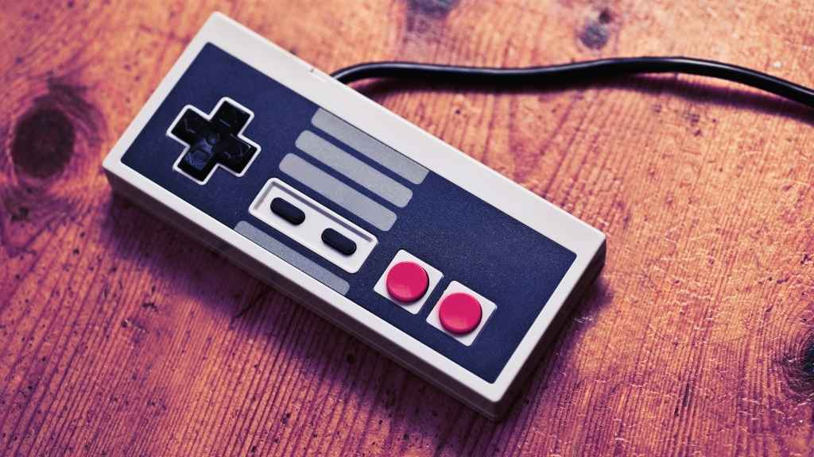

What happened in the gaming industry this week? RPG Maker VX went free on Steam, Nintendo revised Switch sales forecasts, Dragon Ball: Sparking! Zero sold 5 million copies, and more: at General Arcade, we’re here to keep you in the loop with our Weekly Game Development Industry Digest, whether you’re a gaming enthusiast or a developer. 

<h6 id="h-rpg-maker-vx-free-on-steam"><strong><a href="https://store.steampowered.com/app/220700/RPG_Maker_VX_Ace/" rel="nofollow">RPG Maker VX Free on Steam</a></strong></h6>

Hold your horses rookie game developers! The RPG Game Maker VX is now FREE on Steam for a limited time until 10th February 2025. For a beginner game enthusiast, this tool helps to simplify game creation with its built-in assets. Since it rarely goes completely free, now would be the best time to grab it.

<h6 id="h-video-game-history-foundation-brings-rare-magazines-back-to-life"><strong><a href="https://gamehistory.org/what-were-doing/">Video Game History Foundation Brings Rare Magazines Back to Life</a></strong></h6>
<figure class="wp-block-image size-large"></figure>

Over 1,500 out-of-print gaming magazines, rare game development documents, and promotional materials are now available in a free digital archive from the Video Game History Foundation.

<h6 id="h-nintendo-revises-sales-forecast-as-switch-falls-short-on-sales"><strong><a href="https://www.gamedeveloper.com/business/nintendo-lowers-sales-forecast-with-switch-performing-below-expectations-" rel="nofollow">Nintendo Revises Sales Forecast as Switch Falls Short on Sales</a></strong></h6>

A recent sales report from Nintendo reveals that Switch’s performance has fallen short of expectations. The software sales has declined by almost 24% whereas hardware sales for 30.6%. Despite the slow momentum, switch still holds a large player base with over 100 million active users. For the Switch 2 release this year, Nintendo has lowered its sales forecast.

<h6 id="h-dragon-ball-sparking-zero-hits-5-million-copies-sold"><strong><a href="https://x.com/dragonballgames/status/1886686193535848650" rel="nofollow">Dragon Ball: Sparking! Zero Hits 5 Million Copies Sold</a></strong></h6>

In less than six months, Dragon Ball: Sparkling! Zero has sold 5 million copies worldwide since its release in October 2024. This means it has surpassed the sales of its predecessors, FighterZ and Kakarot. It is now considered one of the best selling titles for its company, Bandai Namco.

<h6 id="h-helldivers-2-one-year-later-still-dropping-in"><strong><a href="https://blog.playstation.com/2025/02/06/helldivers-2-one-year-later/" rel="nofollow">Helldivers 2: One Year Later, Still Dropping In</a></strong></h6>

A look back at Helldivers 2’s explosive first year, from its February 2024 launch to the return of the Illuminate. Helldivers 2 burst onto the gaming scene, quickly becoming one of the year’s top releases. Its addictive gameplay captured many (even at General Arcade). What’s truly exciting is the developers’ commitment to the game. With <a href="https://www.eurogamer.net/digitalfoundry-2025-helldivers-2-has-received-a-stealth-ps5-pro-upgrade-and-heres-what-it-does" rel="nofollow">every update</a>, Helldivers 2 grows, adding new, unexpected elements that keep the universe fresh and engaging.

<h6 id="h-this-might-be-the-coziest-thing-you-ll-play-this-year"><strong><a href="https://x.com/Vivarium_Game/status/1886140434604249129">This Might Be the Coziest Thing You’ll Play This Year</a></strong></h6>
<figure class="wp-block-image size-large"></figure>

Vivarium, a visually stunning new game inspired by a Studio Ghibli film is filled with magical animations and a soothing atmosphere. Designed to attract players through its dreamy visual, this would be a must play for fans of artistic, relaxing games.

<h6 id="h-final-fantasy-vii-rebirth-fall-of-a-hero"><strong><a href="https://www.square-enix-games.com/en_GB/news/final-fantasy-vii-rebirth-nibelheim-pt2" rel="nofollow">Final Fantasy VII Rebirth: Fall of a Hero</a></strong></h6>

Director Naoki Hamaguchi discusses the creation of the iconic Nibelheim flashback in Final Fantasy VII Rebirth. This deep dive covers making Sephiroth playable, enhancing Cloud’s combat abilities, and recreating key moments like the Shinra Manor exploration and the village’s fiery destruction. Hamaguchi reveals insights into design choices, from making Sephiroth feel powerful to conveying Cloud’s unreliable memories and the emotional impact of the burning of Nibelheim.

<h6 id="h-kepler-interactive-bets-on-bold-games"><strong><a href="https://www.gamedeveloper.com/business/publishers-can-still-bet-on-bold-interesting-games-says-kepler-interactive" rel="nofollow">Kepler Interactive Bets on Bold Games</a></strong></h6>

Despite dealing in a competitive market, Kepler Interactive – a game developer known for its unique titles emphasizes the importance of creative risk-taking in game development.  According to them, investing in unconventional games is a winning strategy as dedicated audiences would always be attracted to such titles and it also makes a company stand out in the ever-crowded game industry. 

<h6 id="h-iicon-2026-where-industries-converge-through-gaming"><strong><a href="https://www.iicon.com/" rel="nofollow">IICON 2026: Where Industries Converge Through Gaming</a></strong></h6>

The Entertainment Software Association (ESA), creators of E3, are launching IICON 2026 in Las Vegas (April 27-30). This new conference will bring together leaders from gaming, tech, healthcare, sports, and more to explore the growing impact of gamification across industries.  Featuring keynotes, workshops, and networking, IICON aims to showcase how interactive entertainment is shaping the future of business, technology, and beyond. Major players like Amazon, Disney, EA, Microsoft, Nintendo, Sony, and others are already on board.

<h6 id="h-looking-for-a-non-predatory-idle-game"><a href="https://www.gamedeveloper.com/design/greenheart-necromancer-reinvents-the-idle-game-shows-how-to-rethink-predatory-mechanics" rel="nofollow">Looking for a non-predatory idle game?</a></h6>
<figure class="wp-block-image size-large"></figure>

Greenheart Necromancer reimagines the idle game genre, ditching predatory mechanics for a relaxing experience. It rewards patience and allows players to step away, offering a fresh take on long-term gameplay.

<a href="https://generalarcade.com/your-weekly-game-development-industry-digest-devsday-40/">DEVsday #40</a>

