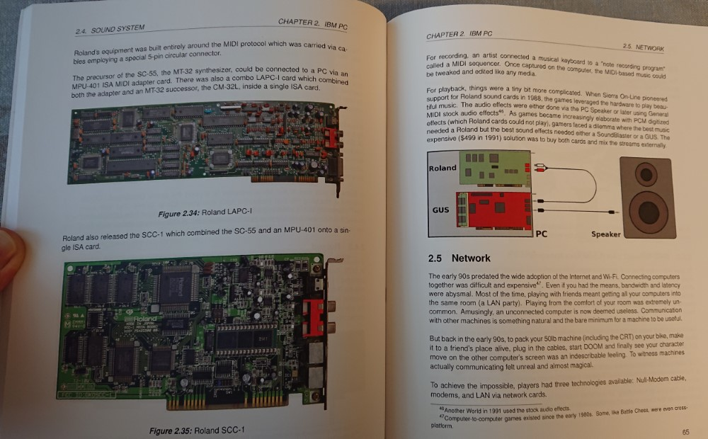
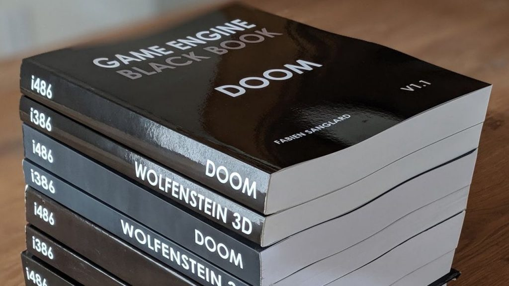
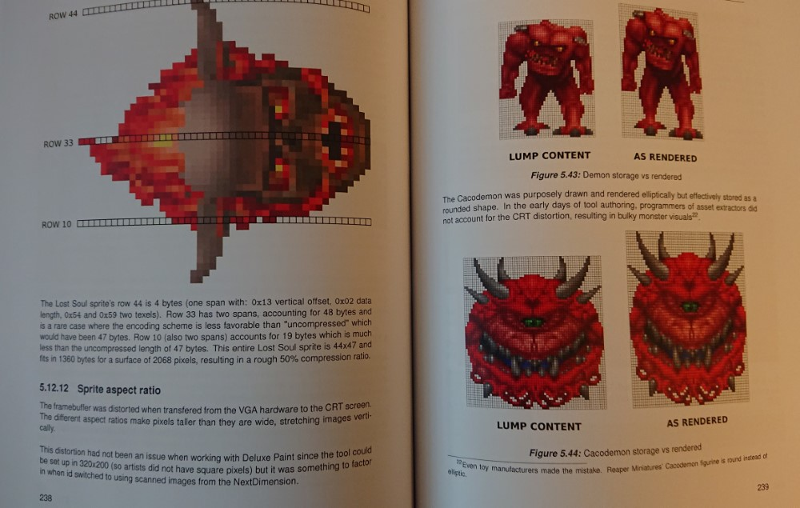
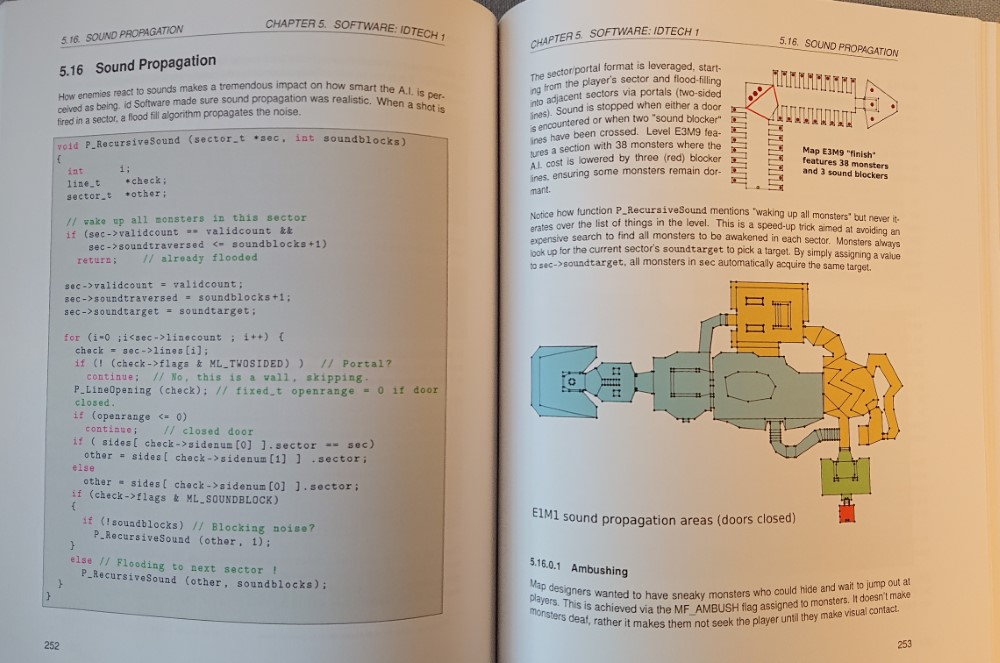

“In early 1993, id Software was on top of gaming industry. Wolfenstein 3D launched the first-person shooter genre, and sales of its sequel, Spear of Destiny, skyrocketed”. That’s the words that started Engine Black Book: DOOM released 25 years after the DOOM.ZIP file appeared on the FTP server of the University of Wisconsin-Madison, and it is rather difficult to argue even with such a peremptory statements.

The thing is that the technologies and tools that were used by id Software really surpassed everything that any of many competitors could offer — it was not in vain that the company spent years creating them. But while id was able to safely follow the beaten path that guaranteed them some definite success, the company acted much more daringly, “playing all-in”, leaving everything and starting from scratch. “Definite success” was not enough for the future authors of DOOM and Quake, they wanted everything at once. That’s what Game Engine Black Book: DOOM is about — “the story of how they did it, a book about history and technology”.

But don’t expect the “high-pitched speech”. Fabien Sanglard, the author of Game Engine Black Book: DOOM, has never been involved in journalism or writing, and at the time of working on the Black Book, he worked as a programmer in Google. “My language is a little better compared to the first book (note — we are talking about the Game Engine Black Book: Wolfenstein 3D, released in 2017), but still very clumsy”, Sunglard warns his readers bluntly. But instead, you are offered detailed descriptions and illustrations that will help you discover exactly how DOOM became a legend and changed the gaming industry…

By the way, both John Carmack and Dave Taylor, who in those years was responsible for Linux versions of games at id Software, agree that the book contains the most necessary things, and “burning people’s hearts with the verb” in this case is not necessary at all. Both of them wrote introductory words to Game Engine Black Book: DOOM, recommending it in every possible way to both professional developers and ordinary curious people (later, with publication of v1.1, John Romero also added introductory words to the book).

The result was 427 full-color pages of detailed discription of PCs of that era (Intel 80486, VESA Local Bus, DOS extenders, Watcom compilers, etc.), NeXT hardware (and especially the NeXTStation TurboColor), and the process of porting the engine to consoles like Jaguar, Sega 32X , Super Nintendo, Sony Playstation, 3DO and Sega Saturn.

The authors of Game Engine Black Book: DOOM reviews repeatedly noted that the book can be called “a simple step-by-step guide to creating and launching DOOM”, and it is this simplicity that turns out as the main advantage of the book and that is what attracts to it. The “Black Book of DOOM” is more like some kind of tutorial, and even those who don’t consider themselves newbies in working with various versions of id Tech called it useful as well.

Roughly speaking, most of the engine is hidden from the outside eye, and you don’t need to touch it when working with porting the game from one platform to another. The main reason is probably that the first version of DOOM was built on NeXT computers, and MS-DOS i486 machines were “on top of the mountain” at that time.

Frankly speaking, over the past quarter of a century, a huge number of books tried to take on the role of a “guide to DOOM”, but often they only told about BSP or, for example, only about the so-called “ray casting rendering “… But no one succeeded in to cover everything at once before Sanglard. Still, id Tech is much more than just a renderer. It is a full-fledged game engine, and this “black” book tells in great detail how some parts of this engine work — the parts, about which the authors of similar “guides” for some reason somehow forgot.

Game Engine Black Book: DOOM touches on many topics forgotten by the rest. Actually, if you want to talk about rendering, only about 15% of the content is devoted to it in the “Black Book”!

And by the way, it is precisely because of big part of the book is devoted to those “other” things, the Game Engine Black Book: DOOM is often paired with Graphics Programming Black by Michael Abrash, a code optimization guru who worked with Carmack on the first part of Quake.

In 1993, DOOM was a huge step forward in terms of graphics, and notably outperformed id Software’s last game, Wolfenstein 3D, which used a 90-degree grid as its base. This was done to simplify rendering and improve the performance of the game, but in the year that has passed between the releases of Wolfenstein 3D and DOOM, progress has already made it possible to retreat from such decisions. So Doomguy could already run around the maps, where the walls were located at arbitrary angles, and the general design (the height of the floors, for example) has moved away from the strict framework.

In terms of visual appeal, of course, it was a great gift to the players, but the walls still remained exclusively vertical — again to improve performance and save time in rendering process. The engine of the first two parts of DOOM generally boasts a wide variety of “tricks” that ultimately lead the games to work much faster than anyone could imagine. For example, instead of defining lines of sight and hearing lines on the maps, all this was pre-calculated during the build and saved along with the level, as a result, not requiring extra time during the actual game process. Because of this game map editing tools became real compilers for these maps! And Sanglard talks about all this in detail.

Game Engine Black Book: DOOM also tells about many other curious moments that many could miss during the actual game. Did you know that even though DOOM was launched at resolutions up to 320×200 pixels, these pixels were slightly elongated to correctly display the image in 4:3 format (which corresponds to 320×240), for example? It was done to display the image correctly. During the porting of the game to different platforms, this point was missed, and some versions of the game ended up looking “flattened”.

Or here’s another interesting moment: to get a higher frame rate, you could use a low resolution mode, in which twice lower number of pixels was rendered horizontally — it was doubled to fill the screen after. Also, the active screen area can be scaled down to generate fewer pixels — 96×48 to be exact. That is less than 10% of the full screen. All this is described in the “Black Book”.

Now it’s easy to find free high quality C-compiler. GNU GCC or Clang-LLVM provide very decent performance, and C-programming can be called a synonym for “tough performance optimization”. In 1992, the situation was completely different. To get maximum of performance out of a personal computer, it was necessary to program in assembly language. But the progress doesn’t stand still, and the next step towards the future was the appearance of the Watcom C-compiler, which was used during the work on DOOM.

It was the thing that provided sufficient performance so that almost whole game could be written in C!

This can honestly be called one of the reasons why the source code of the original version of DOOM as it came down to us is still useful to this day. If it was a program consisting of large number of modules written in assembly language, compilation would cause serious problems, and today the code would be of interest only to historical museums.

In those days, there was no complete monopoly of any one hardware architecture, and there was serious competition of many systems. However, this war was won by NeXT computers, which were the most stable and provided top performance — it was the computers that DOOM was developed on.

In addition, NeXT had several displays with very high resolutions (well, high back in that time — 1120×832 pixels), which allowed you to see much more code than on a standard DOS text display with 24×80 characters while working. A similar scheme (multiple displays/high resolution) is convenient even now.

Basicaly, using NeXT made working on the original versions of DOOM a real cross-development: the code was edited, compiled and linked with NeXT, and then copied to PC, which each developer also had, for testing and evaluating actual performance. This made the workflow much more efficient than anything offered by other systems of the day, and it also made it much easier to port the DOOM source code to any platform of your choice. All of this is also covered in detail in Game Engine Black Book: DOOM. It is discussed in last part of the book.

The author didn’t forget about many rather radical compromises that had to be made in order to make DOOM work on much less powerful systems than the one for which the game was originally designed either… Such moves seem to have become a real talk of the town: unlikely that without much thought someone will be able to name at least one device where DOOM wouldn’t work. Including irons and refrigerators.

As a result, Fabien Sanglard’s work turned out to be a rather unusual mix of an educational book, which, in fact, it is, and an interesting story about creating a new approach to the gaming industry as such. Although the author constantly complains on his English, reading Game Engine Black Book: DOOM is interesting, even if you are a layman in programming. And at the same time, the book is really useful if you consider it as some kind of manual.

So we would recommend it both as a starting point for game development and as something that can really help the serious pro.

*Alexander Kurikh*
