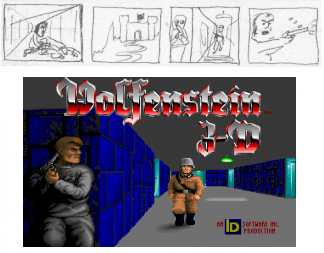
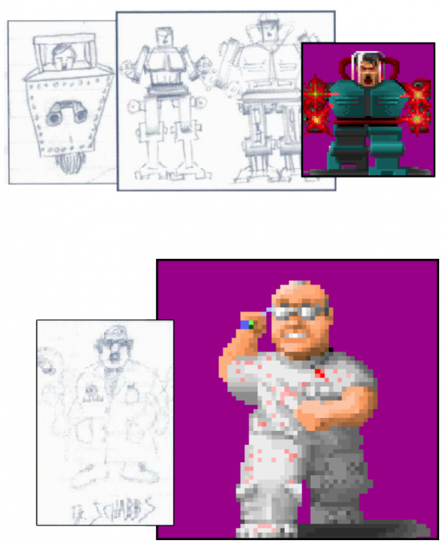
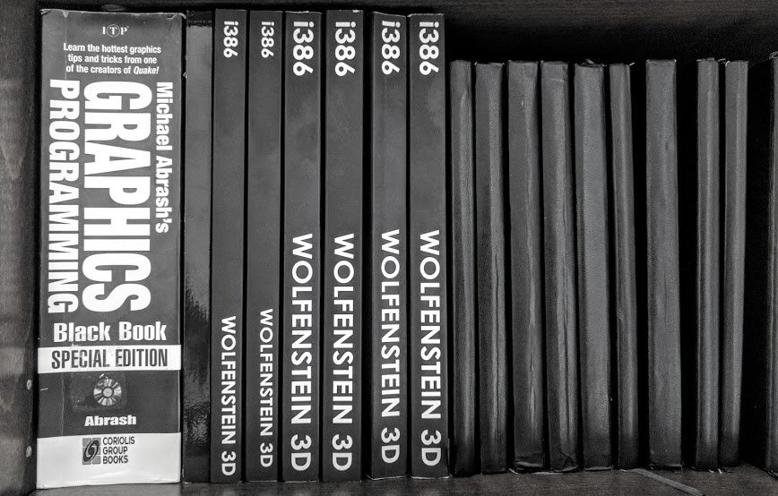
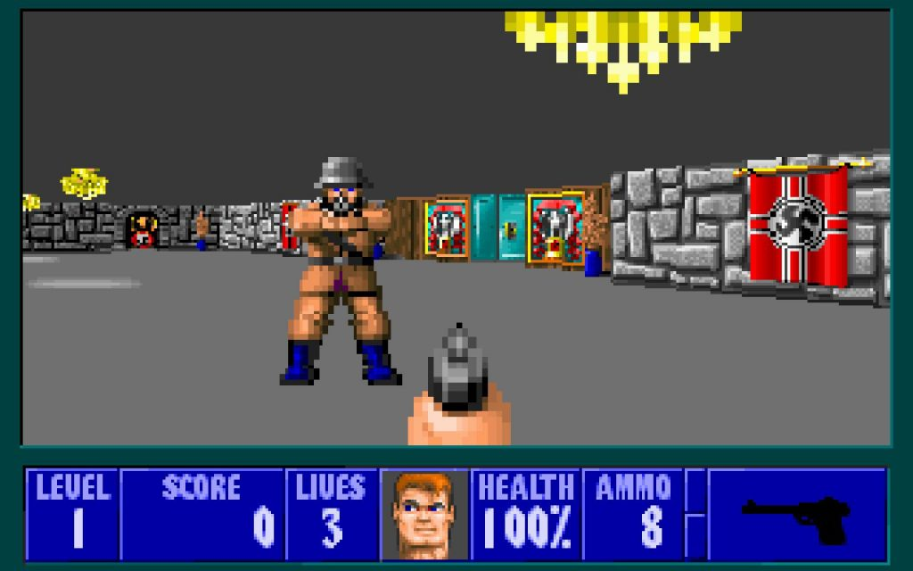

Game Engine Black Book: Wolfenstein 3D is the first book by Fabien Sanglard, he wrote it a year before Game Engine Black Book: DOOM, which we already talked about. And just like in book about DOOM, in this work Sanglard decided to talk about a game that was way ahead of its time.

But even though the graphics was incredible for its time, id Software continued to work on improvements. Back in 1992 John Carmack found a way to use integers instead of floating point (there was no hardware support for floating point), and it became one of the turning points in the history of computer game development in general.

<figure class="aligncenter size-large"></figure>

The book starts with description of the hardware available at the time of Wolfenstein 3D release, and describes all the technical problems that the creators of the shooter encountered during its development. There is also a short chapter about id Software team itself (but actually, if you are interested in this particular topic, it would be better to read another book, Masters of Doom). However, the main part of the content is a real “deep dive” into the game engine itself. So it’s no surprise that Game Engine Black Book: Wolfenstein 3D has been called by many “a journey into the Wolfenstein codebase”.

Any hardware always interacts with software, and often it is overloaded with it, which leads us to the fact that it takes forever to complete a seemingly simple task. And from a business point of view, normal performance and a couple of extra features are usually preferable to the highest level of performance with basic features — that means that during development programmers will more likely put extra effort into optimizing performance only if they see big benefits. They can halve the amount of memory or make something work an order of magnitude faster, for example.

<figure class="aligncenter size-large"></figure>

In fact, it means that all minor optimizations remain unimplemented. But Wolfenstein 3D didn’t go this way. The authors of the game slowly increased the speed of their creation — 5% here, 10% there … And as a result, the frame rate turned out to be really decent! Actually, this is the first phrase from the original description of Game Engine Black Book: Wolfenstein 3D: “How was Wolfenstein 3D made and what were the secrets of its speed?”.

“How did id Software manage to turn a machine designed to display static images for word processing and spreadsheet applications into the best gaming platform in the world, capable of running games at seventy frames per seconds?” — Sanglard asks. And he doesn’t forget, of course, to curse his extremely poor, as he believes, language and inept style of narration, as usual. There is no Sanglard’s book without it! The main thing is to answer all the theoretical accusations in advance, then for sure none of the critics will be able to hook you…

Instead of “high style,” Sanglard promises “some text and lots of drawings that will describe in detail the Wolfenstein 3D game engine and the hardware it used, an IBM PC with Intel 386 processor and VGA graphics card” in his work.

<figure class="aligncenter size-large"></figure>

In Game Engine Black Book: Wolfenstein 3D you will find details about such techniques as raycasting, compiled scalers, delayed playback, VGA Mode-Y, linear feedback shift register, fixed point arithmetic, pulse width modulation, runtime generated code, self-modifying code, and more. The author calls his work an “engineering book” that “discovers the software architecture that pioneered the first-person shooter genre”.

VGA video cards didn’t have hardware support for texture scaling, so everything had to be done in software. At the same time, for better performance, you cannot do all the calculations on the fly, which means that you need a set of simple assembly procedures — draw a certain texture column, reducing it to 40 pixels, for example. To create such sets, a function that generated all the necessary scalers at runtime was developed — a live example of metaprogramming, when the program itself writes another part of itself.

Sprites in Wolfenstein 3D are not saved or copied like regular bitmaps: in order to handle scaling and transparency, it was converted into small meta-programs that modified the usual texture scalers.

<figure class="aligncenter size-large"></figure>

It was stored on disk in game resource files in same format — that is, the conversion of graphic resources into something that the game could use during the execution of a particular task was performed as part of the build process. A similar technique may seem useful to many even now.

When your character dies in Wolfenstein 3D, the screen gradually becomes covered in red pixels — this is one way to select a list of all possible screen coordinates and shuffle it. However, in early 90s, this was completely inefficient and impracticable for the hardware available at that time. Therefore, the developers at id Software found another way to achieve the same effect — a rather incomprehensible way, to be honest.

Everything was implemented using so-called linear feedback shift register. This made it possible to generate a sequence of all pixel coordinates with just a few XOR operations and without any additional waste of memory. This move can be called not just innovative, but brilliant!

Basically, Game Engine Black Book: Wolfenstein 3D can be called a “historical book”. The content that Fabien Sanglard presented in it is also interesting from a professional point of view, but frankly speaking, the chance that you will find something fundamentally new for yourself is minimal. Almost everything written about 16-bit addressing, graphics rendering, and DOS internals is long out of date, and it would be foolish to argue with that.

<figure class="aligncenter size-large"></figure>

Therefore, the book will much more please those who are interested in the events surrounding the work on the game that marked the beginning of the first-person shooter genre. This part of the Game Engine Black Book tells quite fascinatingly how in September 1991 the team moved from Shreveport to Madison, Wisconsin, where they rented the first office, in which, by the way, Carmack stayed to live, so that he could save the time and don’t waste it even for a walk to work…

In addition, many will be very excited to read exactly what environment Wolfenstein 3D was developed in, what monitors were used, and which developer was responsible for which part of the code. Or, let’s say, what “hacks” id Software used to improve the working environment — for example, how it was possible to increase the resolution of available monitors, given that both Carmack and Romero were working with Turbo Debugger on small 12-inch monochrome monitors with an amber screen.

You cacn even probably say that Game Engine Black Book: Wolfenstein 3D is a programming textbook wrapped in the cover of a fiction novel. And by the way, it was this “zest” of the book that made the vast majority of critics give Sanglard’s work such high marks!

<figure class="aligncenter size-large"></figure>

<em>Alexander Kurikh</em>

