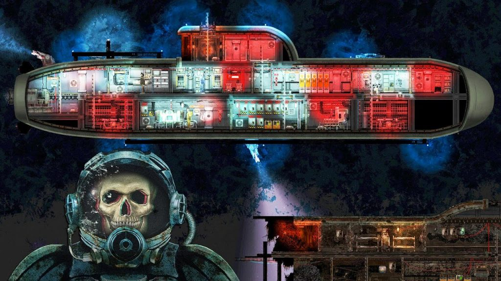
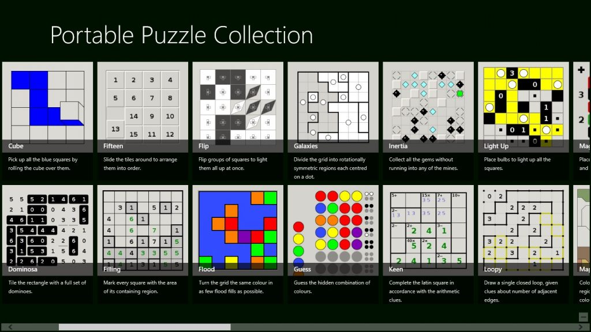
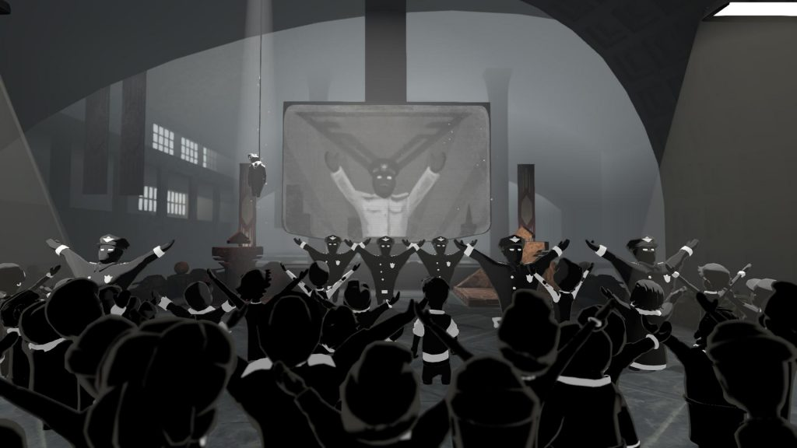
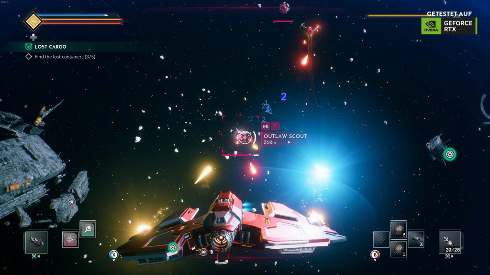

*Games surround our company every day. It is impossible to develop games without playing in your free time. There are many experienced gamers in our team who will tell you what they are playing right now. We would also like to make a point that the opinion of an employee does not represent the position of the company.*

**Mikhail (QA Engineer) plays Barotrauma** **(PC)**

Barotrauma may seem like a simple 2D submarine simulator in a sci-fi setting, but if you delve into it a bit, the details can surprise you!

Each element of the submarine is interactive, interconnected with each other, and can break at any time. The plating creates the illusion of protection from the aggressive environment and carnivorous fauna, but the very first hole in the rocks, or the attack of deep-sea predators will show the team’s vulnerability to the unknown.

The missions and map are procedurally generated, making the dives unique. However, the real Barotrauma is revealed in the cooperative mode: players choose one of the 6 classes, share areas of responsibility, and act as one, setting the submarine in motion, repairing it as necessary, fighting off intruders with the ship’s cannons, and sometimes you have to organize an exit into the open ocean to explore caves, sunken boats or bring an abandoned lighthouse back to life.

The greatest value of the game is the generation of unique situations, followed by the reaction of each crew member. A captain may miss an impending attack by a pack of crawlers, a medic may not notice the parasites in the body of a diver returning from a mission, and an engineer may not keep track of the reactor, leaving the entire submarine without power in a critical situation. It is for the sake of emotions that arise when overcoming difficulties occure, or vice versa – in case of failures, that it is worth playing Barotrauma.

**Aleksey (Software Engineer) plays Simon Tatham’s Portable Puzzle Collection (web)**

Everyone once in a while feels this uncontrollable urge to play some Minesweeper… right? On one of those days I found out that the default Windows version of this game is far from perfect. Most importantly: sometimes it generates unsolvable boards, forcing the player to. This marked the start of my quest for a flawless Minesweeper game.

I tried many an app both on windows and android, but to no avail. Some games always generated trivially solvable boards, others had annoying advertising. And in the end, there was no game that guaranteed the absence of unsolvable boards.

After following an obscure lead on one of the dark web forums (also known as reddit.com) I found this browser version of Minesweeper: <https://www.chiark.greenend.org.uk/~sgtatham/puzzles/js/mines.html>

It. Was. Perfect.

There were options to generate games with custom seeds, save games, load games, restart game with the same seed, a timer, an “undo” button, a “redo” button, a “solve automatically” button. And the best thing of them all: a small disclaimer in the bottom of the page that reads as follows: “The first square you open is guaranteed to be safe, and (by default) you are guaranteed to be able to solve the whole grid by deduction rather than guesswork.”

Over the years, this tiny internet page brought me countless hours of pure joy (most of which were supposed to be hours spent listening to the university lectures instead). But what if I told you there is more. Much more: <https://www.chiark.greenend.org.uk/~sgtatham/puzzles/>

There were 39 other incredible puzzles on this site!

Some of them were Minesweeper variations with slightly different rules (like Loopy, Tents and Tracks). Others were incredibly unique (like Cube, Flood, and Map). Some are quite easy (like Untangle and Inertia), others are brutally hard (I could not make a single move in Dominosa with “Order 6, Extreme” difficulty setting). My personal favorite of them all has to be Slant. Time and time again it pushes you to make non-trivial decisions.

Sometimes, such games are just a way to kill some time. Other times, they give the player challenges of mind-boggling difficulty. But they are always possible to be solved. And with each such challenge overcome, you push the boundaries of your own conscience.

**Alexandr (Software Engineer) plays Beholder 2 (PC)**

I recently completed Beholder 2 and was drawn into its gloomy atmosphere from the very first minute. The game places you in the center of a fictional totalitarian state, where you must navigate complex bureaucratic systems and ethical dilemmas.

Compared to the first part, the gameplay has evolved into a point-and-click adventure format, which I found to be incredibly engaging and reminiscent of the games I loved in my childhood. The game constantly presents the player with difficult moral dilemmas, forcing them to choose between bad and worse options.

While I thoroughly enjoyed playing Beholder 2, I can’t say that I felt happy at the end. The sheer number of people I had sent to hard labor weighed heavily on my conscience, and I couldn’t help but feel like I had failed to truly make a positive impact on the game’s world.

One of the standout features of Beholder 2 are the numerous references throughout the game.

Finally, the game’s endings are expertly crafted, with unexpected twists and turns. Overall, I highly recommend Beholder 2 to anyone looking for a thought-provoking and immersive gaming experience.

*Jump, and you will find out how to unfold your wings as you fall.*

Ray Bradbury

**Andrei (Software Engineer) plays EVERSPACE 2 (PC)**

I played 12 hours so far, went through the first system, and started the second. I like it.

I chose the Hard difficulty because I heard a lot about the systematic shooting of opponents instead of dogfights in the game, and so, I declare: this is a lie. When 6 or 7 pieces pile up on you in the danger zone at the same time, victory is gnawed out with teeth on the remains of the hull. And not always the first time. I like it!

The main quest is not bad, and the side quests are also well written. There are auto-generated tasks that boil down to “go kill everyone at this point” or “bring X from point A to point B”, alongside with special ones, and these are very interesting.

In general, I like it so far, especially the fact that in each zone there is a hunt for hidden treasures (and there are really useful things for pumping there). But on the other hand, it puts a lot of strain on my OCD due to FoMO.
