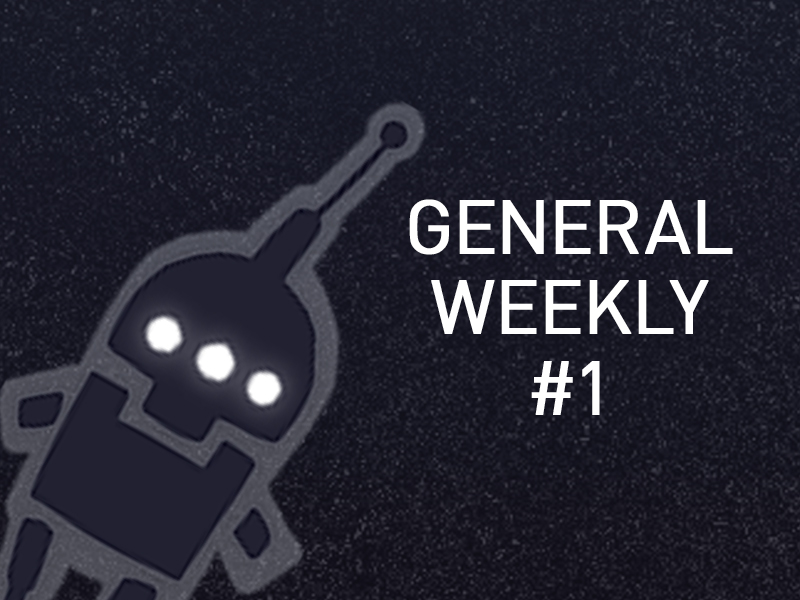
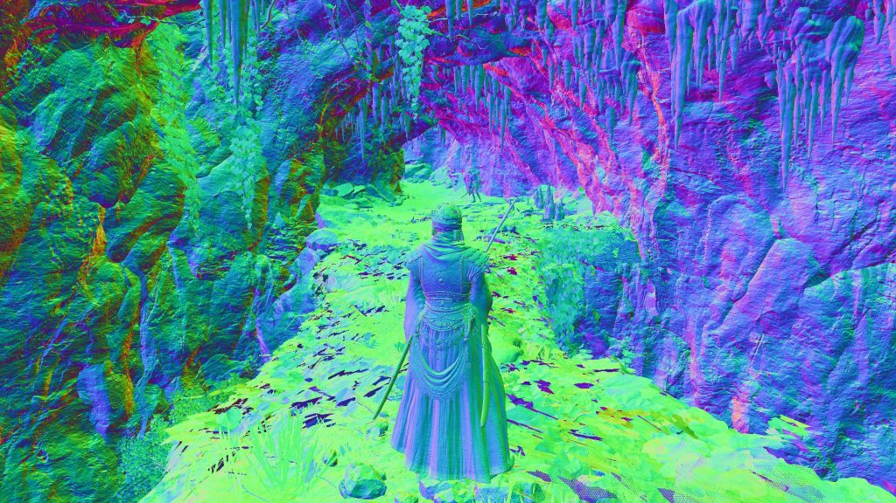
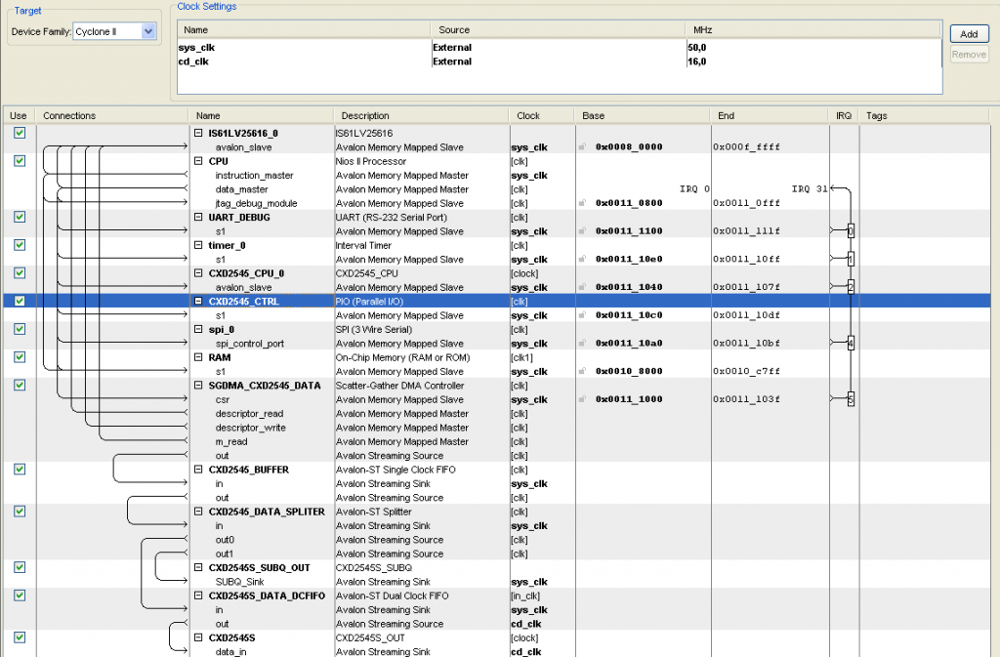
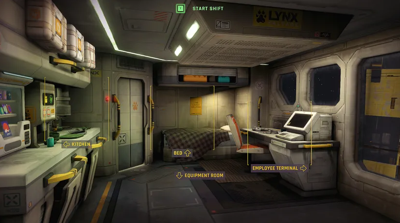
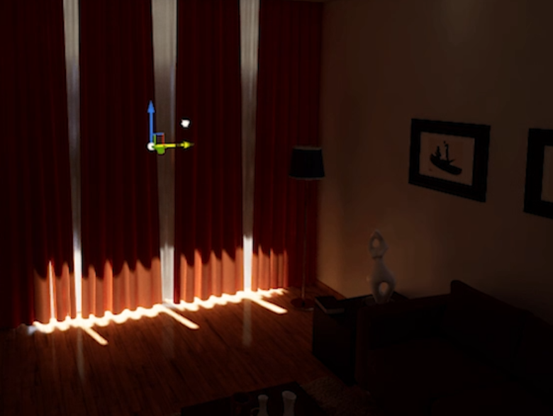
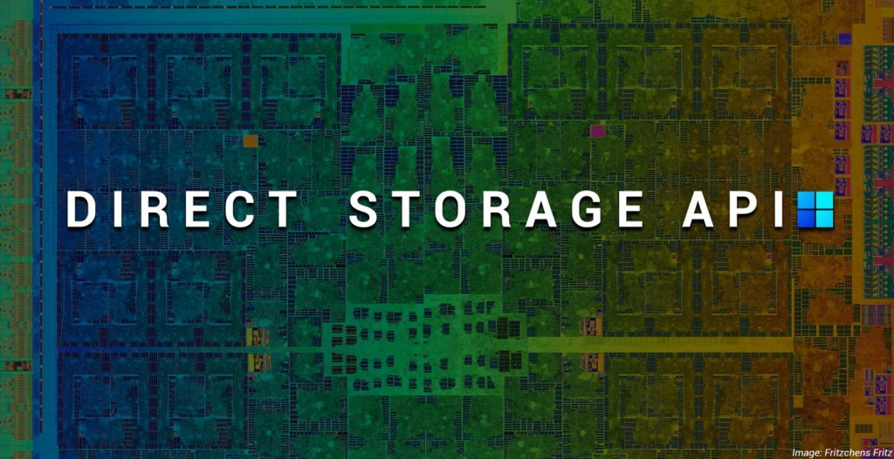
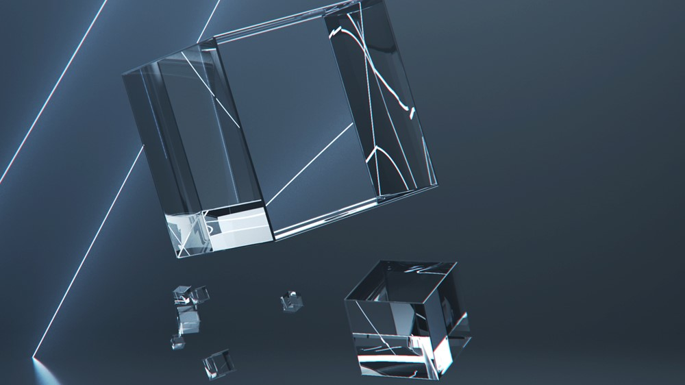

News: Character Creator 4 and iClone 8, Phoenix 5.0 have been released, the Construct Animate beta has become available.

Interesting things: Elden Ring rendering analysis, Z-Anatomy 3D reconstruction of the human body, the psychology of losing, Unreal Engine 5 goes all-in with dynamic global illumination and Lumen.

<h2 id="h-updates-releases-news">Updates/releases/news:</h2>

Character Creator 4 and iClone 8 are released.

<iframe allow="accelerometer; autoplay; clipboard-write; encrypted-media; gyroscope; picture-in-picture" allowfullscreen="" frameborder="0" height="315" src="https://www.youtube.com/embed/EKRpdxmZ9PM" title="YouTube video player" width="560">The team has also unveiled the highly anticipated iClone 8, a new and improved version of the real-time 3D animation tool for movies.</iframe>

An <a href="https://manual.reallusion.com/Character-Creator-4/Content/ENU/4.0/01_Welcome/Welcome.htm">updated version of Character Creator</a> will connect industry-leading pipelines to a single system for 3D character creation, rigging, asset management and interactive design.

The team has also unveiled the <a href="https://manual.reallusion.com/iClone-8/Content/ENU/8.0/01-Welcome/Welcome.htm">highly anticipated iClone 8</a>, a new and improved version of the real-time 3D animation tool for movies.

TressFX 5.0 is available as a patch for Unreal Engine.

The latest version of the TressFX UE patch, which provides high-quality simulation and rendering of realistic hair and fur using the GPU, <a href="https://gpuopen.com/learn/tressfx5/">works</a> on Unreal Engine 4.26 and 4.27.

Phoenix 5.0 release.

<iframe allow="accelerometer; autoplay; clipboard-write; encrypted-media; gyroscope; picture-in-picture" allowfullscreen="" frameborder="0" height="315" src="https://www.youtube.com/embed/qJgMr58UtQE" title="YouTube video player" width="560"></iframe>

The update introduces Thruster force and Axis Lock controls for scene objects affected by simulations, new options for controlling foam patterns created by fluid simulations, and a new voxel shader.

About the <a href="https://docs.chaos.com/display/PHX4MAYA/5.00.00">update for Maya</a> and for <a href="https://docs.chaos.com/display/PHX4MAX/5.00.00">3ds Max</a>.

Construct Animate beta is now available.

<iframe allow="accelerometer; autoplay; clipboard-write; encrypted-media; gyroscope; picture-in-picture" allowfullscreen="" frameborder="0" height="315" src="https://www.youtube.com/embed/I7u0d3ay_Nc" title="YouTube video player" width="560"></iframe>

The creators of the Construct 3 game engine <a href="https://www.construct.net/en/blogs/construct-official-blog-1/announcing-new-product-beta-1589">have released</a> a beta version of a new product, Construct Animate, which is a version of Construct 3 specifically designed to create 2D animations that can be exported as web apps, ads, or videos.

<h2 id="h-interesting-articles-and-videos">Interesting articles and videos</h2>

Parsing the rendering of Elden Ring.

<figure class="aligncenter size-large"></figure>

<a href="http://www.mamoniem.com/behind-the-pretty-frames-elden-ring/">Very good article about the game.</a>

The psychology of losing.

<iframe allow="accelerometer; autoplay; clipboard-write; encrypted-media; gyroscope; picture-in-picture" allowfullscreen="" frameborder="0" height="315" src="https://www.youtube.com/embed/N5HQaVy85s0" title="YouTube video player" width="560"></iframe>

Losing is not fun. We admire the winners, the losers are forgotten over time. Losing happens on numerous occasions in our lives, but the response to those losses is different. What is the psychology of losing? How do we react to failure on a cognitive level, and does our personality influence how we recover if we do.

How to become an animator in gamedev: instructions for those who want to animate in Spine.

<figure class="aligncenter size-large"></figure>

<a href="https://dtf.ru/gamedev/1206693-kak-stat-animatorom-v-geymdeve-instrukcii-dlya-teh-kto-hochet-animirovat-v-spine">Smirnov School tells</a> you what Spine is, how to use it, and what animation skills you need to earn money.

CD-Rom emulator for SonyPlaystation, which has been written for over ten years. Part 3.

<figure class="aligncenter size-large"></figure>

<a href="https://habr.com/ru/post/666296/">In this part</a>, the author redid everything twice, solved the SENS mystery, and along the way also solved a bunch of different small, but necessary issues.

CD-Rom emulator for SonyPlaystation, which has been written for over ten years. Part 4.

<figure class="aligncenter size-large"></figure>

<a href="https://habr.com/ru/post/666976/">In the last part</a>, the author achieved a stable TOC reading. And the unstable, buggy, but, nevertheless, launch of games. And also he figured out what SENS is, and how exactly the prefix performs positioning using carriage control commands. It remains to implement a module for SENS emulation. And to solve small, but important trifles.

Creating a Fantasy Medieval City in Unreal Engine 5 and Blender

<figure class="wp-block-image size-large"></figure>

Fabian Kraus <a href="https://80.lv/articles/creating-a-fantasy-medieval-city-in-unreal-engine-5-blender/">shared the story</a> behind the Medieval City project, why Unreal Engine is the perfect toolkit for level design needs, and explained how using different shapes helps guide players.

Gears of War could have come out without multiplayer.

<iframe allow="accelerometer; autoplay; clipboard-write; encrypted-media; gyroscope; picture-in-picture" allowfullscreen="" frameborder="0" height="315" src="https://www.youtube.com/embed/VnM93LeCrL8" title="YouTube video player" width="560"></iframe>

The fact that the original Gears of War could have been released on the Xbox 360 without multiplayer was revealed to Ars Technica by lead level designer Lee Perry as part of the War Stories series.

Epic Games could not make the battles really fun for a long time, so discussions about the fate of the online component lasted almost until the release of the game.

Hardspace: Shipbreaker Developer Experience in Early Access

<figure class="wp-block-image size-large"></figure>

What has Blackbird Interactive learned from working on Hardspace: Shipbreaker for two years? Lead Producer Jessica Klein and Game Director Elliot Hudson <a href="https://www.gamedeveloper.com/pc/hardspace-shipbreaker-is-taking-flight-here-s-what-its-devs-learned-in-early-access">shared some key takeaways and explained</a> how their gaming community has helped them get through this difficult time.

How to draw a metal texture: step by step tutorial

<iframe allowfullscreen="allowfullscreen" frameborder="0" height="315" src="https://www.youtube.com/embed/8vniQj61XSE" title="YouTube video player" width="560"></iframe>

Korean artist Chimmugsonyeo shows how to paint realistic metal textures, one of the most common textures in painting.

Unreal Engine 5 goes all-in with Dynamic Global Illumination and Lumen.

<figure class="wp-block-image size-large"></figure>

The engineers working on Lumen <a href="https://www.unrealengine.com/en-US/tech-blog/unreal-engine-5-goes-all-in-on-dynamic-global-illumination-with-lumen">reviewed</a> the system’s features and gave an overview of the technical details.

Speculations and myths about DirectStorage.

<figure class="wp-block-image size-large"></figure>

<a href="https://www.yosoygames.com.ar/wp/2022/05/directstorage-speculations-myths/">The article explains</a> what the DirectStorage API allows on a PC, shows what processes can be accelerated using the API, and what are the limitations of the API.

An introduction to hair and fur in Houdini 19

<iframe allow="accelerometer; autoplay; clipboard-write; encrypted-media; gyroscope; picture-in-picture" allowfullscreen="" frameborder="0" height="315" src="https://www.youtube.com/embed/p4yUNgy5HSA" title="YouTube video player" width="560"></iframe>

CFX artist Jonathan Kutzer has created a guide aimed at fully describing the process of working with fur/hair in Houdini 19, including but not limited to: handling geometry for pipeline and scene setup, working with specific tools, modifiers, fur generation, material setting.

UNIGINE 2 technologies: water system

<figure class="wp-block-image size-large"></figure>

Since version 2.2, UNIGINE <a href="https://habr.com/ru/company/unigine/blog/668174/">allows</a> you to visualize realistic water with complex behavior and support for two-way interaction with solids, as well to create various types of water basins: oceans, seas, lakes. In 2.15.1 on large bodies of water, you can create waves using wave layers, Beaufort presets or manually, and provide smooth transitions between different surface conditions. At the same time, there is no visible tiling at a long distance.

Comparison of GPU texture compression algorithms.

<iframe allow="accelerometer; autoplay; clipboard-write; encrypted-media; gyroscope; picture-in-picture" allowfullscreen="" frameborder="0" height="315" src="https://www.youtube.com/embed/3H-HGlsC0NY" title="YouTube video player" width="560"></iframe>

Jeff Russell gave a talk at Marmoset on GPU Texture Compression. The presentation covers the basics of BC1-7 schemes, as well as some of the strategies and rationale for working with these formats.

Improved API performance: Variable Rate Shading

<figure class="wp-block-image size-large"></figure>

<a href="https://developer.nvidia.com/blog/advanced-api-performance-variable-rate-shading/">This article</a> provides a brief overview of the available VRS modes, giving performance tips on how it affects hardware limitations.

Additionally, some guidance is provided on which workloads can benefit from using VRS.

<h2 id="h-miscellaneous">Miscellaneous</h2>

Artists behind Horizon Forbidden West share a bunch of new behind-the-scenes renders.

<a href="https://www.artstation.com/karakter">One</a>. <a href="https://www.artstation.com/user-8966">Two</a>. <a href="https://www.artstation.com/danielguti">Three</a>. <a href="https://www.artstation.com/arno">Four</a>. <a href="https://www.artstation.com/mashein">Five</a>. <a href="https://www.artstation.com/lexisflex73">Six</a>. <a href="https://www.artstation.com/jeroenheemskerk">Seven</a>.

We thank <a href="https://suvitruf.ru">Andrei Apanasik</a> for writing the original post and allowing us to publish it on our blog in English.

