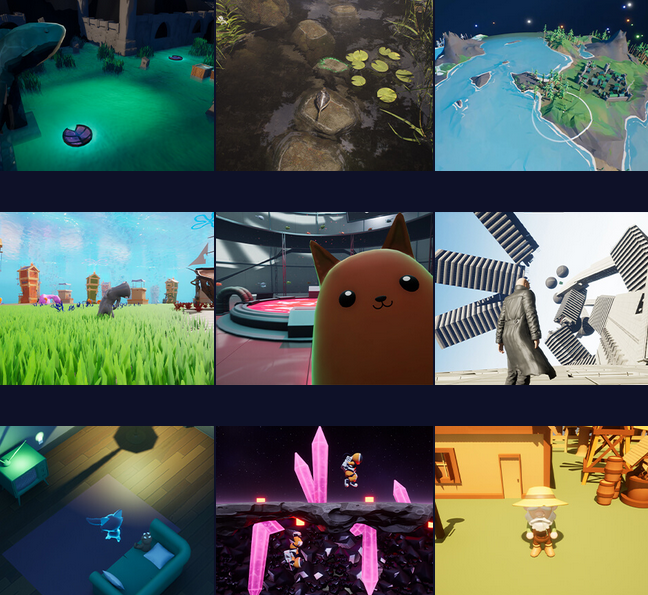
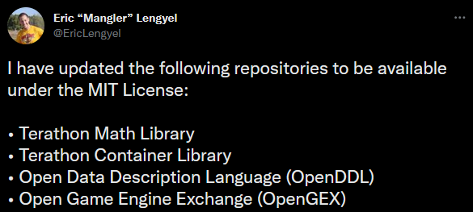
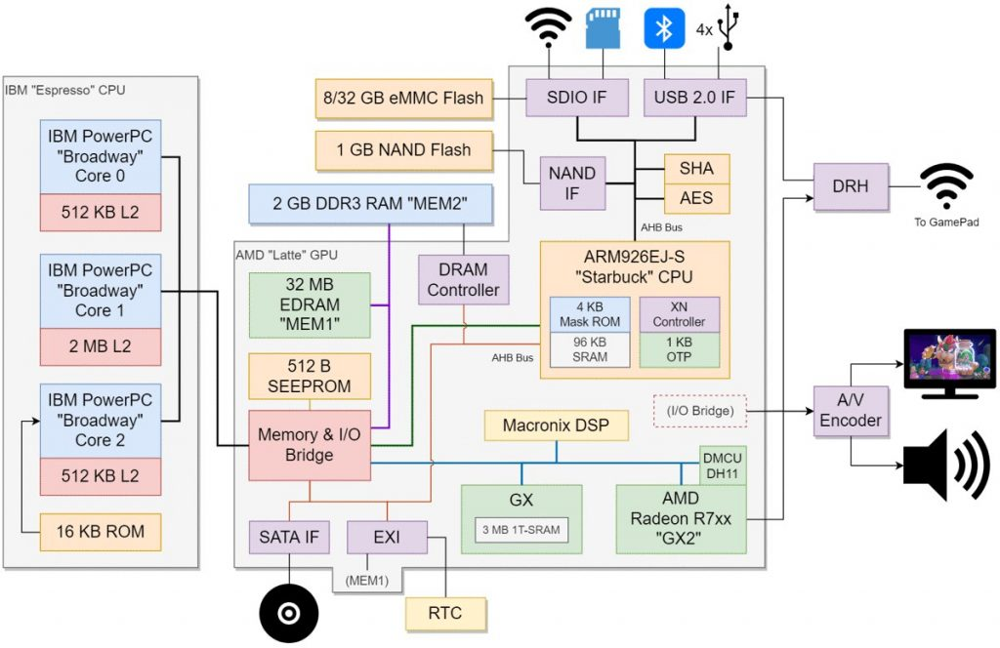
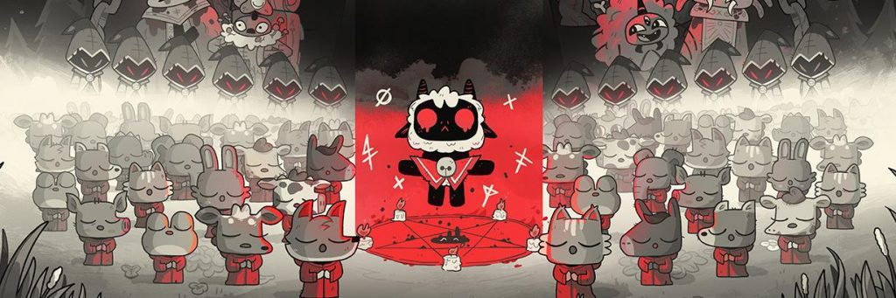
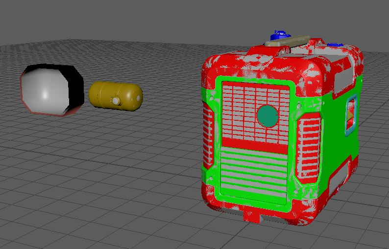
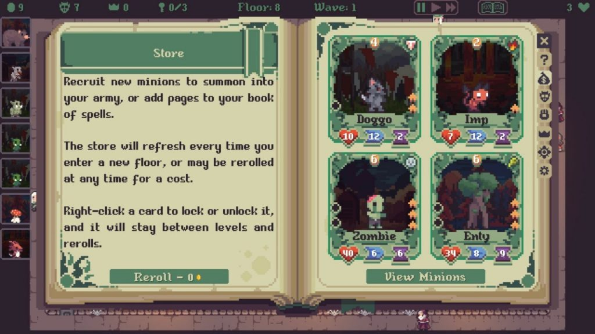
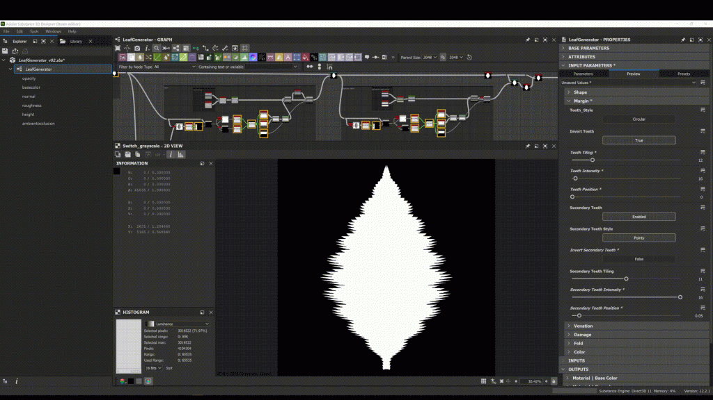
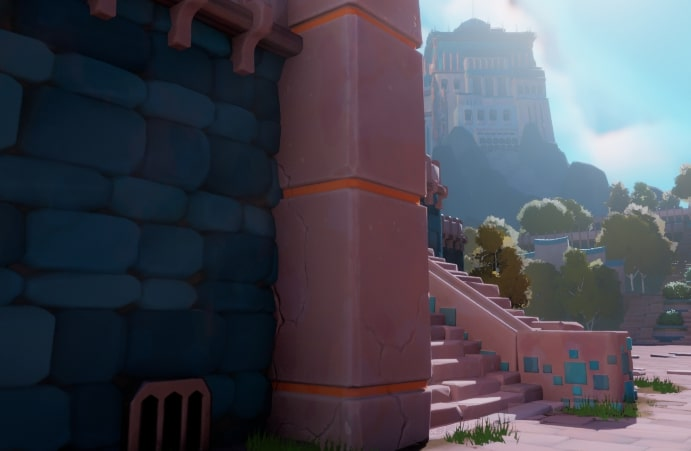
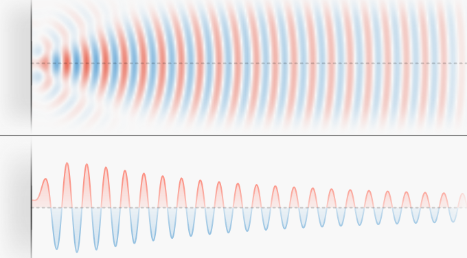
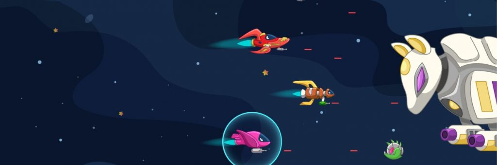

*The game development industry brings something new all the time. General Arcade shows the most interesting releases, updates and news of the past week, which are recommended reading for both industry veterans and novice developers.*

## Updates/releases/news

[Steam will change the display of game release dates](https://store.steampowered.com/news/group/4145017/view/3289340571611574691)

No more jokes. Developers will be able to choose one of 5 options:

    Exact date. For example, “August 24, 2023”.

    Month and year. For example “August 2023”.

    quarter of the calendar year. For example, “Third quarter of 2023”.

    Year. For example “2023”.

    Without date. It will say Coming Soon.

The changes will come into effect on January 1, 2023.

[Epic MegaJam 2022 Winners Revealed](https://www.unrealengine.com/en-US/blog/presenting-the-winners-of-the-2022-epic-megajam)

Among 525 projects and more than 3350 participants.

[Terathon Math Library goes open source under MIT license](https://github.com/EricLengyel/Terathon-Math-Library)

The libraries used in C4Engine are now open to everyone.

## Interesting articles/videos

[Wii U architecture](https://www.copetti.org/writings/consoles/wiiu/)

Rodrigo Copetti, who has repeatedly pleased us with analyzes of the architectures of various consoles, this time wrote an extensive article about Wii U.

[Godot in 100 seconds](https://youtu.be/QKgTZWbwD1U)



Good video for those who want to try working with Godot. It gives a detailed revision of the main points and basic things.

[Cult of the Lamb Hit Recipe](https://blog.unity.com/games/recipe-behind-smash-hit-cult-of-the-lamb)

The Unity team sat down with Jay Armstrong, Design Director and Lead Programmer at Massive Monster, to discuss how the team chose which genres to combine, what they did to balance the two-genre-in-one-game approach, and their top coping tips.

[Creating Realistic AAA Props in Unreal Engine 5](https://80.lv/articles/realistic-prop-creation-for-aaa-games-in-unreal-engine-5/)

Artist Shyamsagar S shared details on the Electric Generator project, explained how the props were modeled and textured, and demonstrated lighting and rendering processes in UE5.

[AnimationEvent and the CoreCLR garbage collector](https://blog.unity.com/technology/making-animationevent-safe-for-the-coreclr-garbage-collector)

Unity is constantly trying to make existing code work with Microsoft’s .NET CoreCLR JIT runtime, which includes a high-performance, more advanced and efficient garbage collector (GC).

The article briefly talked about some of the latest changes that the team has made to ensure the integration of the updated AnimationEvent with the advanced garbage collector.

[A small analytical post about the median demo time](https://howtomarketagame.com/2022/10/26/what-is-a-good-median-play-time-for-a-demo-benchmark/)

Data from Steam Next Fest February 2022 and Steam Next Fest October 2022. Graphs and summary can be viewed.

[Witchfire is a first-person roguelite designed for those who don’t like roguelites](https://www.unrealengine.com/en-US/developer-interviews/witchfire-is-a-first-person-roguelite-designed-for-those-who-don-t-like-roguelites)

To learn more about the development of the upcoming first-person shooter, the Unreal Engine team reached out to The Astronauts creative director and co-founder Adrian Chmelarz and asked him about the Witchfire development process, how the game uses photogrammetry to achieve stunning visuals, how the studio used the sound engine UE and more.

[Lucas Pope: “Games are the perfect mix of everything I love”](https://premortem.games/2022/10/26/lucas-pope-games-are-the-perfect-combination-of-everything-i-enjoy/)

A short interview to Premortem Games with the developer of the well-known Papers, Please.

[Slow Roads will brighten up office days](https://anslo.medium.com/slow-roads-tl-dr-a664ac6bce40)

An experiment in the procedural generation of endless scenic landscapes, designed as a casual racing game. Works in the browser, the client side uses three.js.

Key technical points are described in the article.

[Creating a leaf generator in Substance 3D Designer](https://80.lv/articles/creating-a-leaf-generator-in-substance-3d-designer/)

Sheref Atilla Gürbüz talked about the development of the leaf generator, showed which nodes were used, and demonstrated how colors are mixed to create realistic leaves.

[Adding painterly detail to a stylized project in UE5](https://80.lv/articles/paint-stroke-mask-adding-painterly-details-for-stylized-project-in-ue5/)

Gyuvannu-Karlu Sozzi explained why they decided to create a paint stroke mask, explained how a painterly look is achieved in 2D and 3D, and also told about the creation process.

[How ray tracing works, and how to speed it up by x600](https://youtu.be/gsZiJeaMO48)



The video is a step-by-step guide to the basics of ray tracing, explains the basic concepts, and explains why ray tracing methods are computationally intensive.

In addition, the ReSTIR method is considered, and how it can significantly reduce the required calculations.

[The nature of sound](https://ciechanow.ski/sound/)

The invisible and relentless sound just seems to exist, traveling through our surroundings to carry beautiful music or annoying noises. In this article the author explains what sound is, how it is created and distributed.

[Creating the first multiplayer game with Netcode for GameObjects](https://blog.unity.com/games/building-a-multiplayer-game-first-time-netcode-for-gameobjects)

In this article, the author walks you through the development of Galactic Kittens, from prototype to stable, and how you can use this sample to start your own multi-user project.

*We thank [Andrei Apanasik](https://suvitruf.ru) for writing the original post and allowing us to publish it on our blog in English.*
