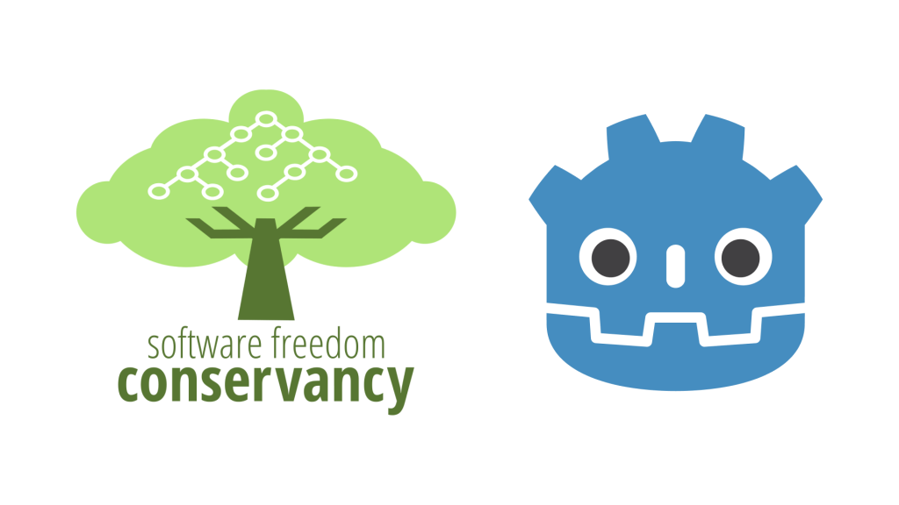
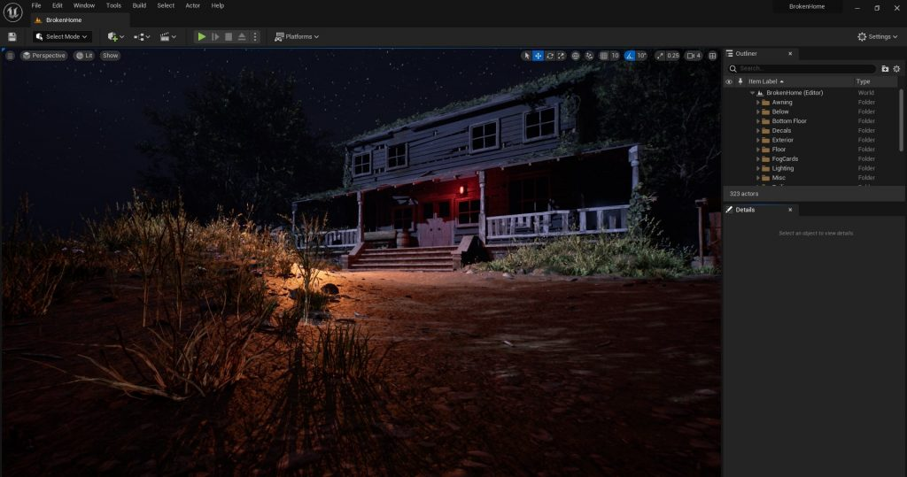
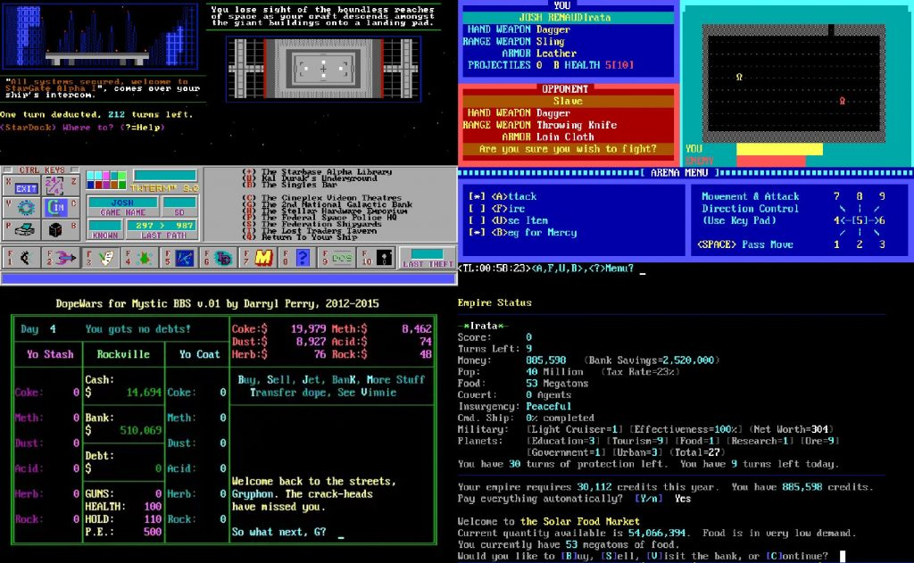
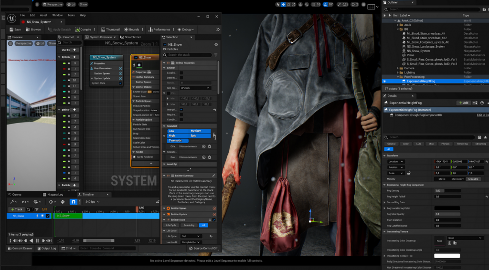

*The game development industry brings something new all the time. General Arcade shows the most interesting releases, updates and news of the past week, which are recommended reading for both industry veterans and novice developers.*

## Updates/releases/news

[Andrey “KranK” Kuzmin died](https://dtf.ru/life/1430918-pogib-andrey-krank-kuzmin)

Founder of K-D LAB and KranX Productions, game designer of the Vangers and the first part of the Perimeter. Thanks to Andrey, many have found their way into game development (including Nikolai Dybovsky).

[GDExtension for Rust](https://github.com/godot-rust/gdextension)

Allows you to use Rust while working with Godot 4. The extension is still at an early stage of development, but you can already play around.

[Godot leaves the Software Freedom Conservancy and forms an independent organization Godot Foundation](https://godotengine.org/article/godots-graduation-godot-moves-to-a-new-foundation)

In the Netherlands (in the same place as Blender). This will help in many ways in identifying the engine as a product, also it will come handy in many organizational issues (selling merchandise, selling user content, etc.).

[Enemies tech demo released on Unity and Digital human package updated](https://unity.com/demos/enemies)

The best moments from this very cinematic demo have now migrated to the package. Key areas of improvement: skin and eyes. The whole thing is already available on [GitHub](https://github.com/Unity-Technologies/com.unity.demoteam.digital-human).

[On Github, there is now an annual game jam lasting a month (from November 1 to December 1)](https://github.blog/2022-11-01-game-off-2022-theme-announcement/)

This time the theme is cliché.

[Defold 1.3.7](https://defold.com//2022/10/18/Defold-1-3-7/)

Added frustum culling for labels, added Slice9 support for sprites and more.

## Interesting articles/videos

[Great documentary about The Callisto Protocol](https://youtu.be/rM5RKkVnxf0)



Invited for extras authors of The Walking Dead and The Friday 13th.

[The developer of My Work is Not Yet Done successfully pitched the game to the publisher Raw Fury and decided to share the details on Reddit](https://www.reddit.com/r/gamedev/comments/yj11kz/i_successfully_pitched_a_game_to_raw_fury_heres/)

[Steam page](https://store.steampowered.com/app/1207690/My_Work_Is_Not_Yet_Done/). Pitch deck in [Google Docs](https://docs.google.com/document/d/189KJ3IcxRvf6gE9xs8u1_e6RJ3zkWr3XAVYC-WoCbpM/edit).

[Creating a scene with horror elements in Unreal Engine 5](https://80.lv/articles/designing-a-scene-with-horror-vibes-in-unreal-engine-5/)

Artist Justin Hien talked about the production process for the Forest Home environment, explained how the scene assets were modeled and textured, and discussed lighting setup in UE5.

[Demonstration of mental health in games](https://www.gamedeveloper.com/design/rewriting-the-horrors-of-mental-health-representation-in-games)

Take a look at how developers are trying to use mental disorders as a source of horror in video games.

[ROBLOX is MUD: the history of MUDs, virtual worlds and MMORPGs](https://felipepepe.medium.com/roblox-is-a-mud-the-history-of-virtual-worlds-muds-mmorpgs-12e41c4cb9b)

A lot has already been written about the history of virtual worlds, but most of the texts are usually devoted to MMORPGs. It would take a very large book to tell this story in detail, so this article has been written as a general timeline of what happened, the key names, and where you can get more information about it.

[Animated world of Ratchet and Clank: Rift Apart](https://youtu.be/H7pbEKZmYj0)



In a session with Animation Summit 2022, Lindsey Thompson of Insomniac Games discusses the process and inspiration for animating cinematics and gameplay for Ratchet and Clank: Rift Apart.

[How The Long Dark scaled to 10 million players – and what’s next](https://newsletter.gamediscover.co/p/how-the-long-dark-scaled-to-10-million)

Hinterland founder and creative director Rafael van Lierop announced 10 million LTD and 1 million MAU. GameDiscoverCo decided to figure out what the success is.

[Creating a female character in ZBrush, UE5 and Substance 3D Painter](https://80.lv/articles/creating-a-real-time-female-character-in-zbrush-ue5-substance-3d/)

Zoe Brening spoke about working on the Kuna Nuka project, explaining in detail the sculpting and texturing processes, and also talked about what she learned at the Think Tank training center.

[Performance optimizations in Lands of Blight](https://defold.com//2022/11/02/Performance-optimizations-in-Lands-of-Blight/)

In the post, d954mas shared his experience of optimizing Defold to run on a mobile browser with stable FPS and over 1000 enemies.

[Rust for creating helper tools](https://youtu.be/GtRo-eF8-TE)



In a keynote from GDC 2021, Treyarch’s Dan Olson explores the opportunities and challenges that Rust can bring to the game tool programmer and explores how Rust can be a powerful addition to the arsenal.

[How Diverse Narrative is Designed in Roadwarden](https://www.gamedeveloper.com/design/deep-dive-roadwarden)

The class, dialogue, and reputation system of this role-playing game was necessary to create meaningful events.

[How the Assassin’s Creed III Animation Team Raised the Bar 10 Years Ago Despite Hardware Limitations](https://gameworldobserver.com/2022/11/02/assassins-creed-3-animation-development-ubisoft-jonathan-cooper)

Jonathan Cooper recalled how the Ubisoft Montreal team created animation for the game. The developers have done an excellent job, from the rebuilt combat system to the ragdoll physics, making the project look impressive even after 10 years.
