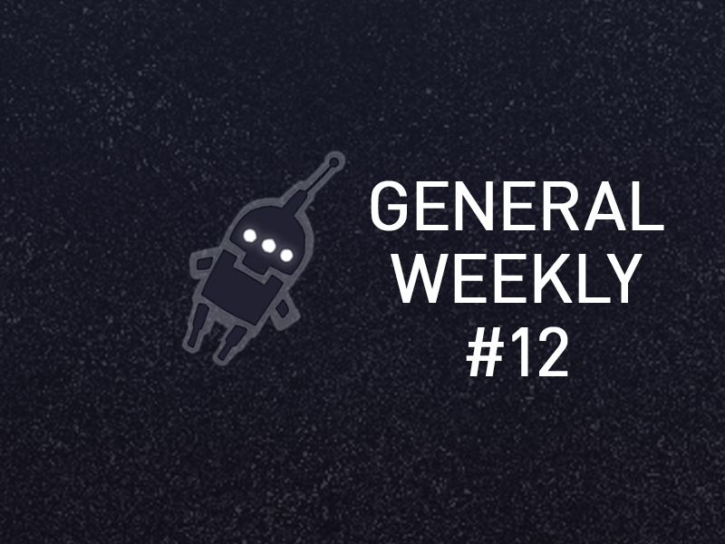
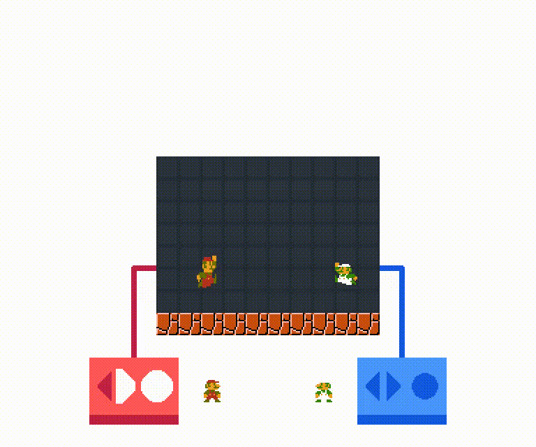
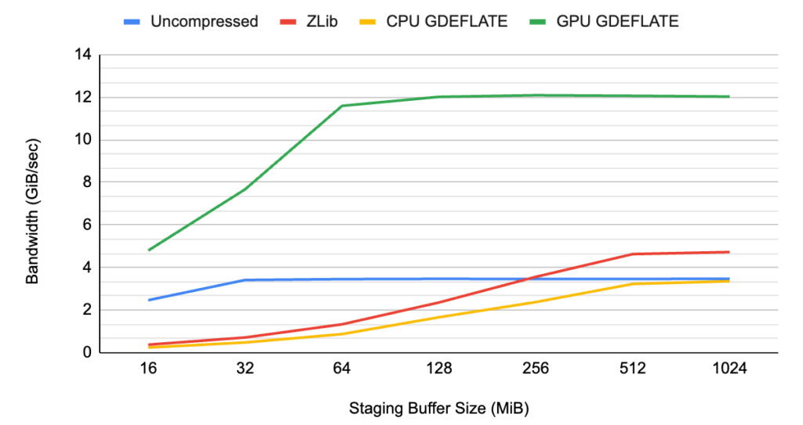
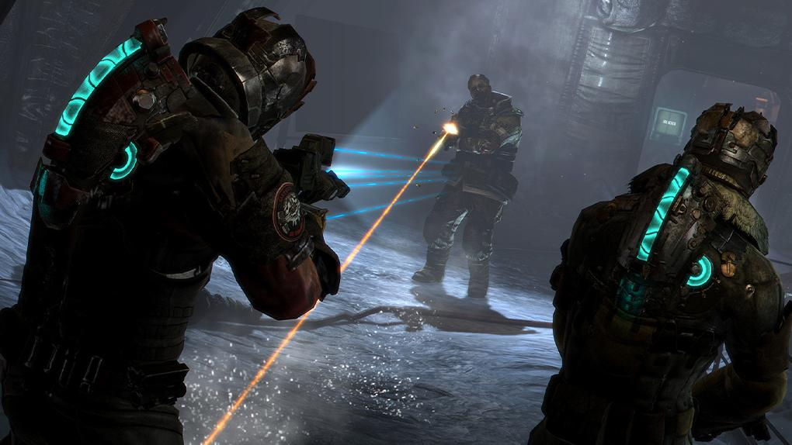
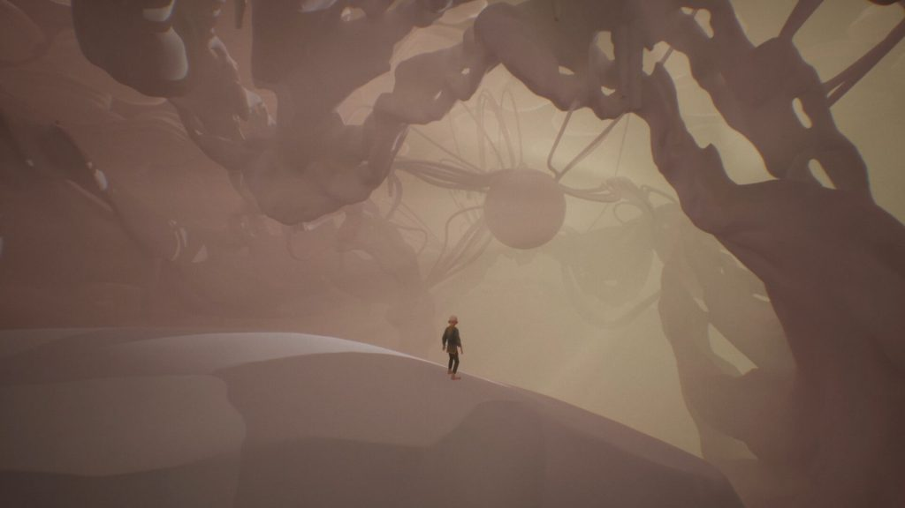
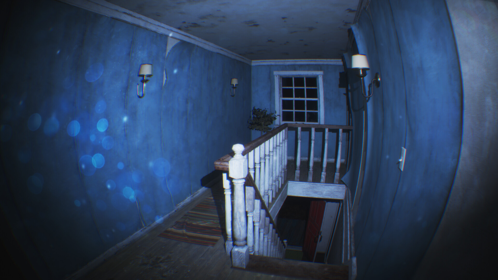
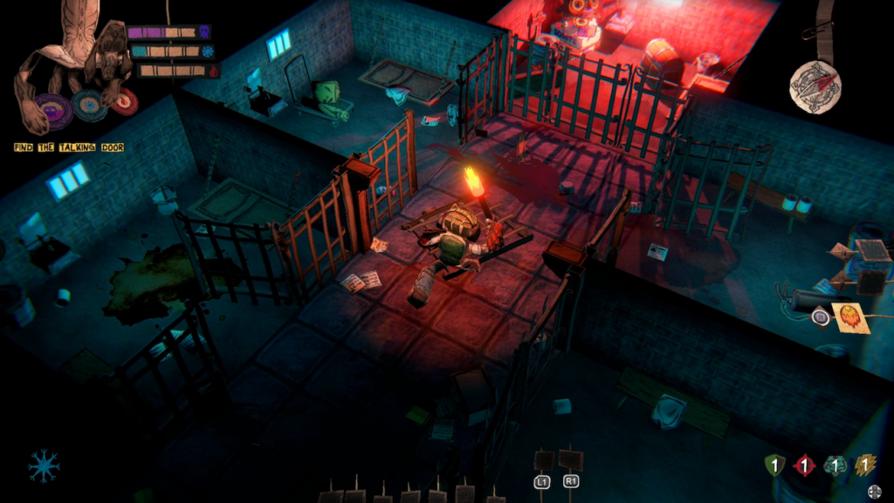

*The game development industry brings something new all the time. General Arcade shows the most interesting releases, updates and news of the past week, which are recommended reading for both industry veterans and novice developers.*

## Updates/releases/news

[An almost two-hour documentary about the history of Crystal Dynamics](https://youtu.be/DsByUubJkk8)



[Rollback in netcode and other multi-user solutions](https://twitter.com/munosnail/status/1595470325814546433)

An excellent thread with an analysis of various solutions for multiplayer games.

[Physically accurate rendering](https://youtu.be/XK_p2MxGBQs)



The video provides an overview of the physically accurate shading model on a physical basis. Discusses the Cooke-Torrance, Schlick GGX, and Fresnel BRDF models.

There is both a theoretical overview and an implementation in GLSL.

[Mark Darr’s Game Development Channel](https://youtu.be/qabZM40_bN4)



Mark Darra, former Dragon Age producer and BioWare veteran, needs no introduction. It turned out that he has a very interesting channel!

[Speed ​​up DirectX game loading with GDeflate for DirectStorage](https://developer.nvidia.com/blog/accelerating-load-times-for-directx-games-and-apps-with-gdeflate-for-directstorage/)

An overview of GDeflate compression on the GPU. The influence of the intermediate buffer size on the compression rate is shown.

[Glen Scofield answers questions about the Callisto Protocol.](https://youtu.be/TEXdJU9ZUX8)



[How to engage players with effective UI and game design](https://blog.unity.com/games/how-to-immerse-your-players-through-effective-ui-and-game-design)

Kristo Nobbs, Game Designer, shared a section from the latest UI/UX guide on how UI and game design can create deep immersion to captivate players.

[Setting up a soda water simulation in Houdini](https://80.lv/articles/setting-up-sparking-water-simulation-in-houdini/)

Max Schwuger showed how he created a simulation of carbonated water, told how they started working with Houdini.

[DOTS: Scaling MonoBehaviour and GameObjects](https://youtu.be/RhU8NZtgYp0)



The video shows how the popular game Indus Battle Royale uses its DOTS-based GenericLOD to scale conventional GameObject-based systems for animations, rigs, assets, and visual effects.

[Chasing the Unseen uses the math of fractals to create its environment](https://www.unrealengine.com/en-US/tech-blog/chasing-the-unseen-leverages-fractal-math-to-power-its-environments-and-gameplay)

Taking on such an ambitious project as an indie developer knew he needed the right tools. In a technical post, he told how he approached these tasks.

[How to implement a Great Jump for a Platformer](https://youtu.be/2S3g8CgBG1g)



In the Game Design Guide, the author shares tips and tricks you can use to improve Unity 2D’s jumps and movement, such as coyote time, double jumps, and more.

[Creating a Japanese Garden Scene in Unreal Engine 5](https://80.lv/articles/creating-a-japanese-garden-scene-in-unreal-engine-5/)

Environment and Props Artist Aakarsh Gupta talked about The Final Ascent project, explained how scene assets were modeled and textured, and discussed lighting setup in UE5.

[Paranormal Tales: How did the game top the Steam trends?](https://newsletter.gamediscover.co/p/paranormal-tales-how-did-it-hit-1)

Don’t try to sell a product (your game); instead, try to tell his story – there is a huge difference between these things.

[From Weapons to Wizards: Transforming Aesthetics and Modularity in Tiny Tina’s Wonderlands](https://youtu.be/k5EFEV1sfgM)



In a session with Audio Summit 2022, Gearbox Software’s Joshua Davidson illustrates how the soundscape has been aesthetically transformed into a fantasy aesthetic to bring Tiny Tina’s Wonderlands sound world to life.

[Postmortem Void Scrappers](https://defold.com//2022/11/24/Void-Scrappers-post-mortem/)

A small interview with the developers who use the Defold engine to create the game.

[Creepy paper world Paper Cut Mansion](https://premortem.games/2022/11/25/the-spooky-papercraft-world-of-paper-cut-mansion-cardboard-is-scary/)

It took developer Space Lizard Studio 5 years to bring this paper project to life. And the creation of the game required a lot of manual labor.

*We thank [Andrei Apanasik](https://suvitruf.ru) for writing the original post and allowing us to publish it on our blog in English.*
