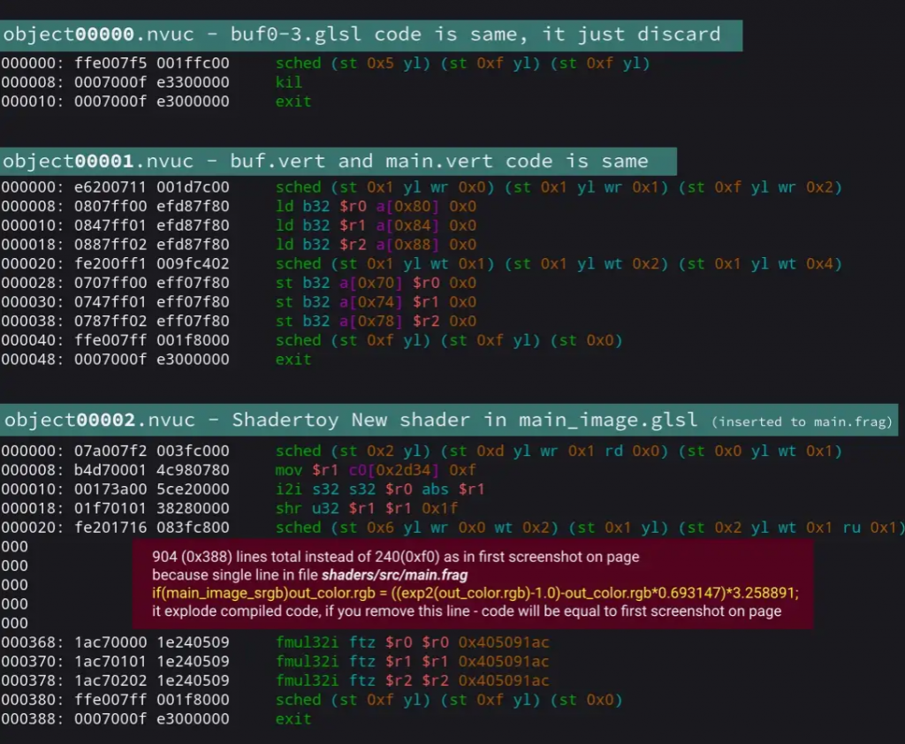

<em>The game development industry brings something new all the time. General Arcade shows the most interesting releases, updates and news of the past week, which are recommended reading for both industry veterans and novice developers.</em>

<h2 id="h-updates-releases-news">Updates/releases/news</h2>

<a href="https://github.com/storm-devs/captain-blood">The source code of the engine “Captain Blood” game was made publicly available under GPL-3</a>

<figure class="wp-block-image size-large"></figure>

You can download it from Github.

<a href="https://www.unrealengine.com/en-US/blog/new-metahuman-release-brings-easier-sharing-and-dna-calibration">Epic released a new version of MetaHuman</a>

<figure class="aligncenter"></figure>

The updates reveal MetaHumans’ “DNA” – sets of parameters that define 3D character head shapes and the structure of their facial rigs – making them easier to share and customize.

<a href="https://youtu.be/fXLOMOWWBJQ">RealityScan is now free to download on iOS</a>

<iframe allow="accelerometer; autoplay; clipboard-write; encrypted-media; gyroscope; picture-in-picture" allowfullscreen="" frameborder="0" height="315" src="https://www.youtube.com/embed/fXLOMOWWBJQ" title="RealityScan Available Now | Capture the World and Create Your Own" width="560"></iframe>

RealityScan is a 3D scanning app for mobile devices from Epic Games that turns photos into high-quality 3D models.

<a href="https://builder.blender.org/download/experimental/geometry-nodes-simulation/">Try the new simulation framework on Blender nodes</a>

<figure class="aligncenter"></figure>

The framework extends the existing Geometry Nodes system to support particle-based modeling. You can poke in the experimental assembly.

<a href="https://godotengine.org/article/release-management-4-0-and-beyond">Godot 4.0+ Release Management</a>

<figure class="wp-block-image size-large"></figure>

In the post, the team shed some light on expectations for version 4.0 and the future of Godot 4.x.

<a href="https://blog.unity.com/technology/the-latest-on-cinematic-studio-and-live-capture">Latest news about Cinematic Studio and Live Capture</a>

<figure class="aligncenter"></figure>

Last year, Unity released a set of virtual production and cinematography tools, and then launched a closed beta program to gather information about what creators need.

<h2 id="h-interesting-articles-videos">Interesting articles/videos</h2>

<a href="https://youtu.be/H9AAnV59ddE">Todd Howard on the Lex Friedman Podcast</a>

<iframe allow="accelerometer; autoplay; clipboard-write; encrypted-media; gyroscope; picture-in-picture" allowfullscreen="" frameborder="0" height="315" src="https://www.youtube.com/embed/H9AAnV59ddE" title="Todd Howard: Skyrim, Elder Scrolls 6, Fallout, and Starfield | Lex Fridman Podcast #342" width="560"></iframe>

The game designer regrets a little that he did not start developing the sixth part of TES earlier.

<a href="https://www.gamedeveloper.com/blogs/what-can-we-learn-from-the-1-600-highest-earning-indie-developers-on-steam-">What you can learn from 1600 indie developers on Steam who have earned over $100K</a>

<figure class="wp-block-image size-large"></figure>

Only 10% of developers on Steam have earned more than $100,000 in gross revenue. The author tried to compare, using open data, what successful developers did, that everyone else did not do.

<a href="https://youtu.be/d61_o4CGQd8">A Blow from the West: Wind Simulation in Ghost of Tsushima</a>

<iframe allow="accelerometer; autoplay; clipboard-write; encrypted-media; gyroscope; picture-in-picture" allowfullscreen="" frameborder="0" height="315" src="https://www.youtube.com/embed/d61_o4CGQd8" title="Blowing from the West: Simulating Wind in 'Ghost of Tsushima'" width="560"></iframe>

In a GDC 2021 talk, Bill Rockenbeck of Sucker Punch Productions gives a lot of tips and tricks to make simulations fast and believable while making the most of the Playstation’s GPU.

<a href="https://80.lv/articles/designing-the-post-apocalyptic-strategy-beacon-of-neyda/">Designing the post-apocalyptic strategic Beacon of Neyda</a>

<figure class="wp-block-image size-large"></figure>

Christian Molina talked about the history of Ghost Creative Studio, described the world and gameplay of Beacon of Neyda, and also explained how the parallax effect was created.

<a href="https://mamoniem.com/behind-the-pretty-frames-death-stranding/">Parsing the Death Stranding Frame</a>

<figure class="wp-block-image size-large"></figure>

Momo has written another cool article.

<a href="https://gameworldobserver.com/2022/12/01/ai-generated-game-assets-stable-diffusion-red-alert-scenario">How to Create Red Alert Inspired Game Assets with Stable Diffusion</a>

<figure class="wp-block-image size-large"></figure>

Tools for AI-generated assets are constantly evolving. Scenario co-founder Emmanuel de Maistre showed what game developers can achieve by setting up Stable Diffusion.

<a href="https://www.gamedeveloper.com/blogs/postmortem-my-hot-girlfriend">Postmortem: My Hot Girlfriend</a>

<figure class="wp-block-image size-large"></figure>

Lessons learned from building a tiny adventure game with Unity and Yarn Spinner.

<a href="https://youtu.be/AFo7KLk1eNE">Creating Enemies: The Evolution of Digital Humans Continues with Ziva</a>

<iframe allow="accelerometer; autoplay; clipboard-write; encrypted-media; gyroscope; picture-in-picture" allowfullscreen="" frameborder="0" height="315" src="https://www.youtube.com/embed/AFo7KLk1eNE" title="The making of Enemies: The evolution of digital humans continues with Ziva" width="560"></iframe>

Unity talks about the evolution and development of its tools.

<a href="https://newsletter.gamediscover.co/p/video-games-and-the-fractalization">Video games and the fractalization of attention</a>

<figure class="wp-block-image size-large"></figure>

A story from GameDiscoverCo based on three different pieces of content: a conversation with a client about how they can keep track of what’s happening in the busy world of PC and console video games in 2022; interview with Jason Della Rocca; Chris Zukowski’s study on average gross indie games.

<a href="https://youtu.be/iZXLLIihMTs">How The Callisto Protocol Animations Came to Life with Motion Capture</a>

<iframe allow="accelerometer; autoplay; clipboard-write; encrypted-media; gyroscope; picture-in-picture" allowfullscreen="" frameborder="0" height="315" src="https://www.youtube.com/embed/iZXLLIihMTs" title="" width="560"></iframe>

Lead Designer Benjamin Wurlod talks about the basic principles of the game.

<a href="https://simblob.blogspot.com/2022/11/introduction-to-hexagons-part-1.html">Introduction to Hexagons</a>

<figure class="wp-block-image size-large"></figure>

The developer tells in detail how he created his interactive diagrams for the tutorial.

<a href="https://www.deconstructoroffun.com/blog/2022/11/24/marvel-snap-the-one-deconstruction-to-rule-them-all">Why was the Marvel Snap a hit and how long will it stay?</a>

<figure class="wp-block-image size-large"></figure>

Deconstructor of fun goes into detail about the success of the game.

<a href="https://www.businessofapps.com/news/mobile-game-features-can-boost-player-retention/">Mobile gaming features can increase player retention</a>

<figure class="wp-block-image size-large"></figure>

Mobile game development isn’t just about a great idea, good characters, or exciting worlds. The most successful projects contain several elements that enhance the gaming experience and keep users coming back for more. But what exactly are they?

<a href="https://www.gameinformer.com/feature/2022/11/25/how-a-neon-white-level-is-made">Level design in Neon White by Annapurna</a>

<figure class="wp-block-image size-large"></figure>

The developers of Neon White discussed the challenges of creating a Smackdown playable level.

<a href="https://medium.com/geekculture/decompiling-nvidia-shaders-and-optimizing-5aeaeb65f828">Decompilation of Nvidia shaders and optimization</a>

<figure class="wp-block-image size-large"></figure>

This article shows how to decompile NVidia OpenGL and Vulkan shaders, what tools are needed to decompress Nvidia caches and rename shaders. Additionally, a couple of examples of optimizations and their impact on the generated assembly are presented.

<em>We thank <a href="https://suvitruf.ru">Andrei Apanasik</a> for writing the original post and allowing us to publish it on our blog in English.</em>

