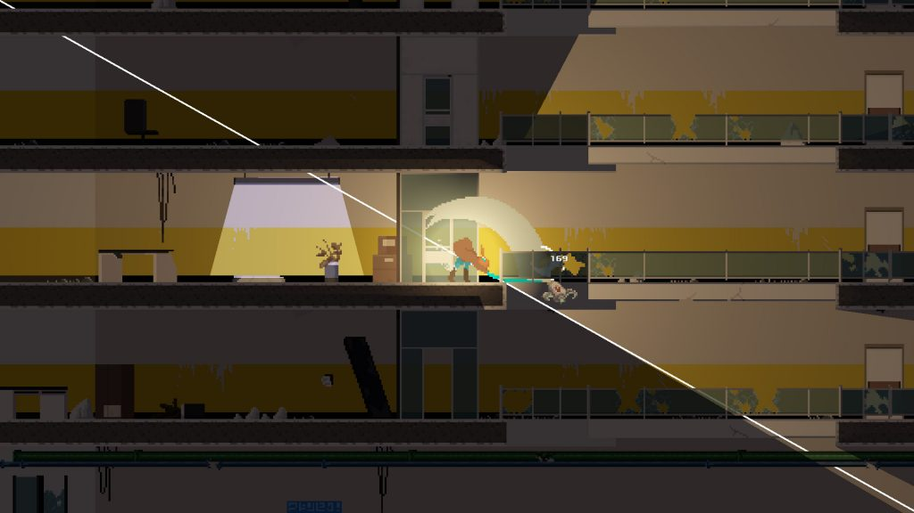
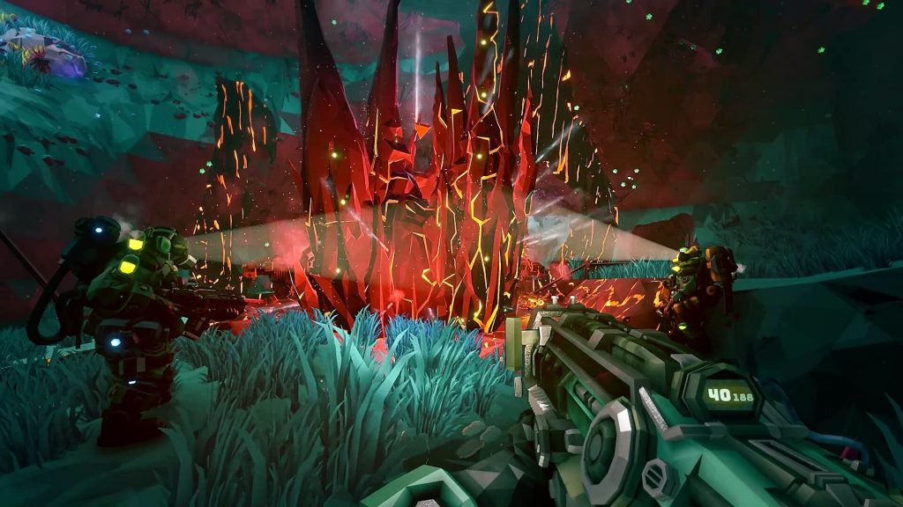
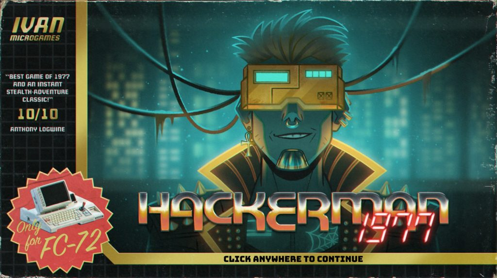
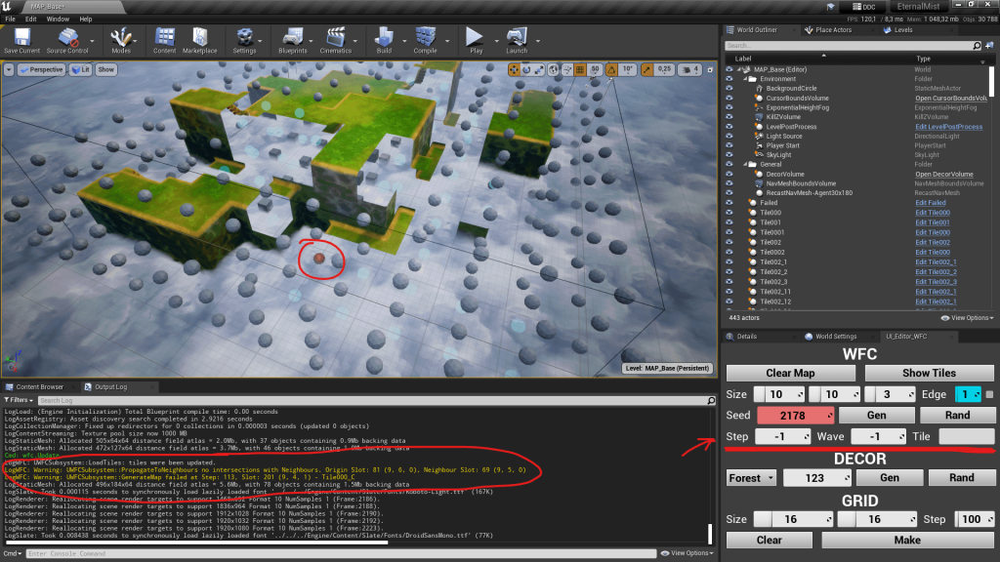
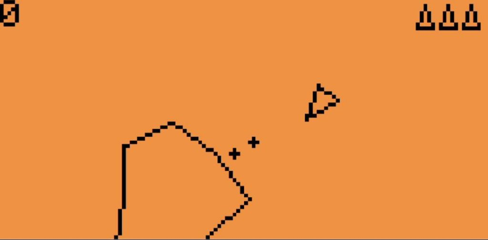

*The game development industry brings something new all the time. General Arcade shows the most interesting releases, updates and news of the past week, which are recommended reading for both industry veterans and novice developers.*

## Updates/releases/news

[Duelyst developers posted the source and assets of this CCG into open access](https://github.com/open-duelyst/duelyst)

All according to the Creative Commons Zero V1.0 Universal license is loaded at the github.

There are ready-made assemblies for Linux, Windows and MacOS. The server can be launched by yourself or at https://staging.dulyst.org. Further development of the game will be continued by the community as a part of the Openduelyst project.

[The game Kandria made on Common Lisp was released](https://github.com/Shirakumo/trial)

The engine is available on Github.

[AMD published a guide that will optimize games for the Radeon RX 7000 video cards](https://gpuopen.com/rdna3-isa-guide-now-available/)

More than 600 pages about the model of the Code of the Shader RDNA 3, about the memory hierarchy and instructions.

[Zbrush 2023 came out](https://youtu.be/cP4iQ9ju3Lk)



It is updated with new and improved sculpture tools, includes two new options for Zremesher and integrates Redshift Bridge.

[Winners Game Off 2022](https://github.blog/2023-01-13-game-off-2022-winners/)

Github introduced all the winners and some of the best Game Off 2022 games.

## Interesting articles/video

[Deep Rock Galactic Statistics](https://store.steampowered.com/news/app/548430/view/3640630403132894028)

In the recent report on Deep Rock Galactic there are interesting points:

The game is still well sold.

DAU is still growing.

40 hours on average in the user  If you correlate CCU and DAU, then the median time a day is in the region of 2 hours.

[Cyberpunk Adventure Hackerman 1977, builded inside Figma](https://www.figma.com/proto/wozH7xzVNQw2aIR8jymeTL/Hackerman-1977?page-id=0%3A1&node-id=496%3A8560&viewport=759%2C475%2C0.02&scaling=scale-down&starting-point-node-id=496%3A8560)

Russian developer Ivan Efimov released a free game in Figma.

[A small talk about the features of the implementation of Wave Function Collapse in the game](https://dtf.ru/gamedev/1568355-nemnogo-pro-osobennosti-realizacii-wave-function-collapse-v-nashey-igre)

The developers of the Eternal Mist tactical strategy talk about how they decided to implement automatic level generation, and what came of it.

[How Gloomwood combines Survival Horror and Immersive Sim](https://youtu.be/BRsWvtJSm0U)



Another good documentary from NoClip.

[Whether the Vampire Survivors’ clone awaits success](https://howtomarketagame.com/2023/01/09/are-vampire-survivor-likes-dead/)

The analysis of the success of Vampire Survivors and the emergence of a new genre.

[A new look at the romantic-sexual story of the narrative](https://youtu.be/vlyH_NAs3f0)



In the report with the GDC 2022, Michelle Clough from Talespinners is immersed in a new framework for writing and developing romantic/sexual content in games with a similar structure, but more flexibility and greater weight of the character/narrative than “Kindness Coins”.

[Asteroids for Flipper Zero](https://github.com/antirez/flipper-asteroids)

A classic game created on C for this tool for pentesters. The sources on the Github.

*We thank [Andrei Apanasik](https://suvitruf.ru) for writing the original post and allowing us to publish it on our blog in English.*
