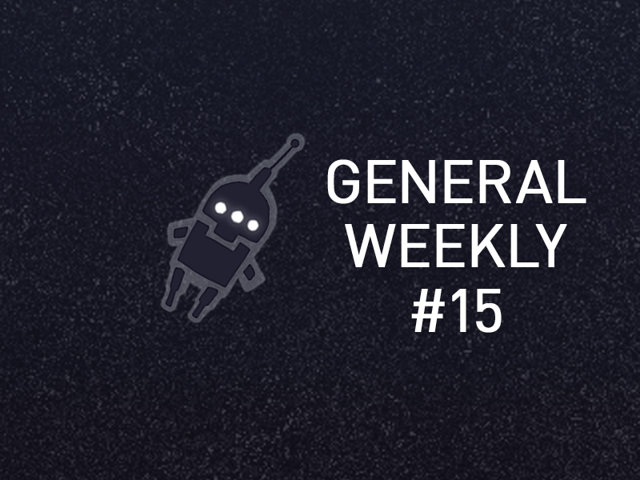

<em>The game development industry brings something new all the time. General Arcade shows the most interesting releases, updates and news of the past week, which are recommended reading for both industry veterans and novice developers.</em>

<h2 id="h-updates-releases-news">Updates/releases/news</h2>

<a href="https://github.com/cdpred/RedTalaria">CDPR released a plugin that allows you to share links to specific Blueprint nodes</a>

<figure class="wp-block-image size-large"></figure>

A useful plugin for UE, the source of which is available on GitHub.

<a href="https://www.gamesindustry.biz/unity-lays-off-nearly-300">Unity to lay off nearly 300 employees</a>

<figure class="wp-block-image size-large"></figure>

Over the past year, this is the second major wave of layoffs.

<a href="https://code.blender.org/2023/01/introducing-the-blender-metal-viewport/">Blender introduced Metal Viewport</a>

<figure class="wp-block-image size-large"></figure>

Blender 3.5 will provide a Metal GPU backend that supports Eevee. Better, faster than OpenGL.

<h2 id="h-interesting-articles-videos">Interesting articles/videos</h2>

<a href="https://www.gamesindustry.biz/finji-ceo-subscriptions-are-simultaneously-awesome-and-terrifying">Tunic’s Publisher worries subscription services hurt indie in the long run</a>

<figure class="wp-block-image size-large"></figure>

Concerned that subscription services may eventually phase out most indies.

<a href="https://80.lv/articles/recreating-stranger-things-rainbow-room-with-houdini-unreal-engine-5/">Recreating the rainbow room from Stranger Things with Houdini and Unreal Engine 5</a>

<figure class="wp-block-image"></figure>

Matthew Quickel talked about working on his project, explained how the procedural nature of Houdini affected the scene, and showed the lighting setup.

<a href="https://newsletter.gamediscover.co/p/console-game-wishlists-whats-the">Console game wishlists – what’s the deal?</a>

<figure class="wp-block-image size-large"></figure>

On Steam, you often play a game on the same device that you use to receive emails and watch YouTube videos. Therefore, wishlists are an important part of metrics. On consoles, similar metrics are a bit more abstracted from purchases for several reasons.

<a href="https://howtomarketagame.com/2023/01/18/how-a-pixel-art-shooter-achieved-a-million-dollar-launch-the-zero-sievert-story/">The story of ZERO Sievert: how a pixel art shooter made a million dollars</a>

<figure class="wp-block-image size-large"></figure>

On November 15, 2022, ZERO Sievert went into early access with over 275k wishlist additions. By the first day, 4485 Steam users were playing it at the same time. And by the end of the week, the game had earned $1,380,963.

<a href="https://godotengine.org/article/whats-missing-in-godot-for-aaa/">Godot for AA/AAA game development — what’s missing?</a>

<figure class="wp-block-image size-large"></figure>

Godot 4.0 is coming soon. It includes significant improvements across the board. However, one of the biggest questions the community has is how this compares to regular commercial offerings?

Procedural wrinkles

<figure class="wp-block-image size-large"></figure>

Simon Thommes from Blender Studio shared a detailed description of how the procedural wrinkle maps for Charge’s protagonist were created.

<a href="https://premortem.games/2023/01/16/a-real-car-crash-served-as-inspiration-for-the-wreck-by-the-pixel-hunt/">A real car accident was the inspiration for The Wreck by The Pixel Hunt</a>

<figure class="wp-block-image size-large"></figure>

The Wreck is inspired by a real situation. Once Florent Morin got into a car accident. He got off safely, but the car was wrecked, and this made a big impression on him. It inspired the creation of the game.

<a href="https://twitter.com/IGhibi/status/1613582443990192150">UV autoscaling in Unreal Engine</a>

<figure class="aligncenter"></figure>

Andrea Graizzaro shared an informative walkthrough explaining a neat UV autoscaling technique.

<a href="https://developer.nvidia.com/blog/practical-tips-for-optimizing-ray-tracing/">Practical tips for optimizing ray tracing</a>

<figure class="wp-block-image size-large"></figure>

In their blog, Nvidia breaks down various techniques.

<a href="https://arielcoppes.dev/2023/01/12/ludumdare52jam.html">Creating a game for Ludum Dare 52</a>

<figure class="aligncenter"></figure>

The developer spoke about his 72-hour game creating marathon and about the experience that he got from it.

<em>We thank <a href="https://suvitruf.ru">Andrei Apanasik</a> for writing the original post and allowing us to publish it on our blog in English.</em>

