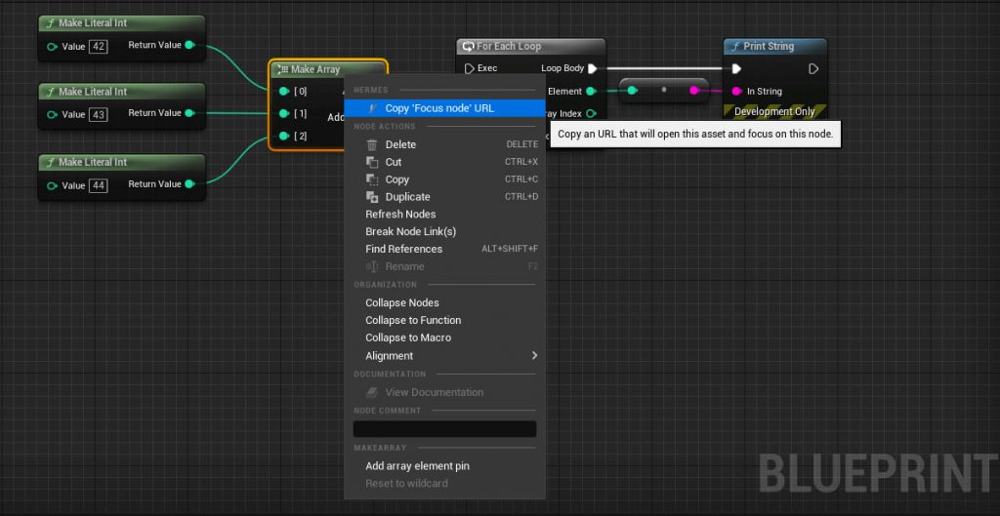
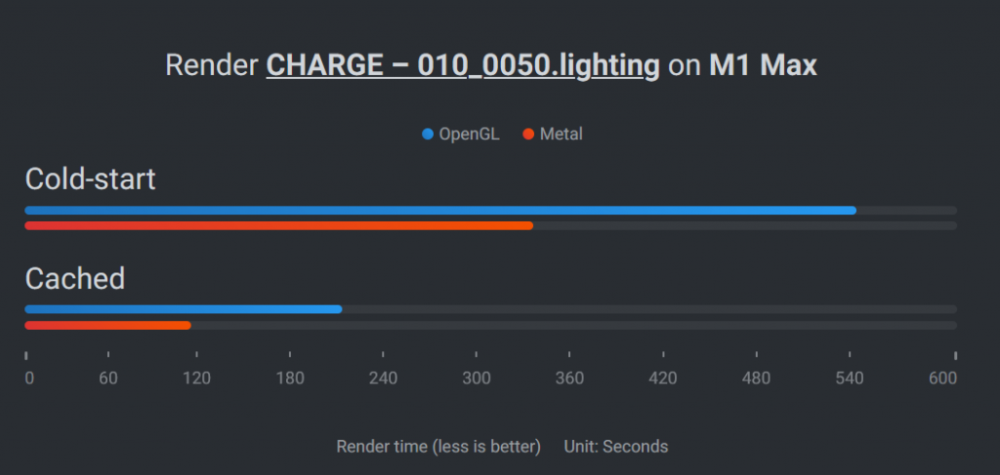
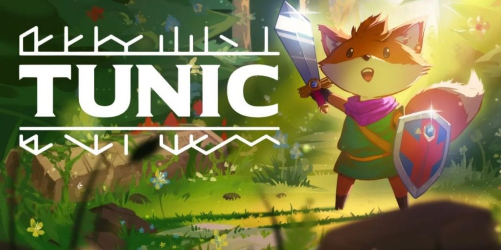
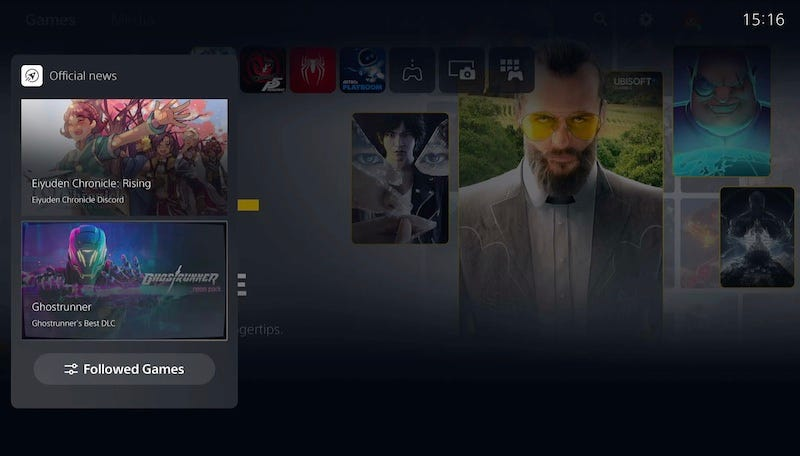
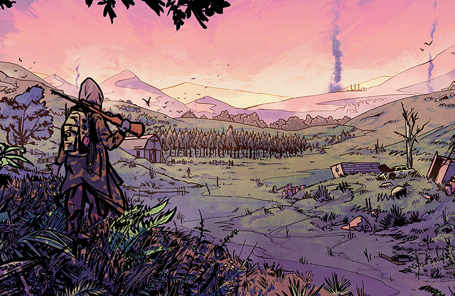
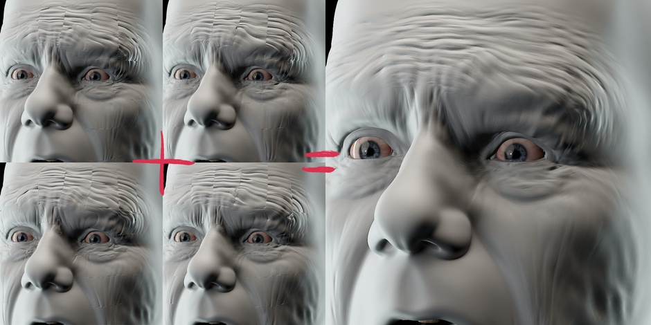
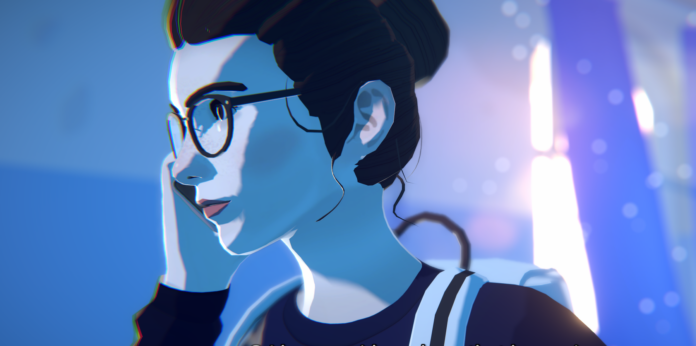

*The game development industry brings something new all the time. General Arcade shows the most interesting releases, updates and news of the past week, which are recommended reading for both industry veterans and novice developers.*

## Updates/releases/news

[CDPR released a plugin that allows you to share links to specific Blueprint nodes](https://github.com/cdpred/RedTalaria)

A useful plugin for UE, the source of which is available on GitHub.

[Unity to lay off nearly 300 employees](https://www.gamesindustry.biz/unity-lays-off-nearly-300)

Over the past year, this is the second major wave of layoffs.

[Blender introduced Metal Viewport](https://code.blender.org/2023/01/introducing-the-blender-metal-viewport/)

Blender 3.5 will provide a Metal GPU backend that supports Eevee. Better, faster than OpenGL.

## Interesting articles/videos

[Tunic’s Publisher worries subscription services hurt indie in the long run](https://www.gamesindustry.biz/finji-ceo-subscriptions-are-simultaneously-awesome-and-terrifying)

Concerned that subscription services may eventually phase out most indies.

[Recreating the rainbow room from Stranger Things with Houdini and Unreal Engine 5](https://80.lv/articles/recreating-stranger-things-rainbow-room-with-houdini-unreal-engine-5/)

Matthew Quickel talked about working on his project, explained how the procedural nature of Houdini affected the scene, and showed the lighting setup.

[Console game wishlists – what’s the deal?](https://newsletter.gamediscover.co/p/console-game-wishlists-whats-the)

On Steam, you often play a game on the same device that you use to receive emails and watch YouTube videos. Therefore, wishlists are an important part of metrics. On consoles, similar metrics are a bit more abstracted from purchases for several reasons.

[The story of ZERO Sievert: how a pixel art shooter made a million dollars](https://howtomarketagame.com/2023/01/18/how-a-pixel-art-shooter-achieved-a-million-dollar-launch-the-zero-sievert-story/)

On November 15, 2022, ZERO Sievert went into early access with over 275k wishlist additions. By the first day, 4485 Steam users were playing it at the same time. And by the end of the week, the game had earned $1,380,963.

[Godot for AA/AAA game development — what’s missing?](https://godotengine.org/article/whats-missing-in-godot-for-aaa/)

Godot 4.0 is coming soon. It includes significant improvements across the board. However, one of the biggest questions the community has is how this compares to regular commercial offerings?

Procedural wrinkles

Simon Thommes from Blender Studio shared a detailed description of how the procedural wrinkle maps for Charge’s protagonist were created.

[A real car accident was the inspiration for The Wreck by The Pixel Hunt](https://premortem.games/2023/01/16/a-real-car-crash-served-as-inspiration-for-the-wreck-by-the-pixel-hunt/)

The Wreck is inspired by a real situation. Once Florent Morin got into a car accident. He got off safely, but the car was wrecked, and this made a big impression on him. It inspired the creation of the game.

[UV autoscaling in Unreal Engine](https://twitter.com/IGhibi/status/1613582443990192150)

Andrea Graizzaro shared an informative walkthrough explaining a neat UV autoscaling technique.

[Practical tips for optimizing ray tracing](https://developer.nvidia.com/blog/practical-tips-for-optimizing-ray-tracing/)

In their blog, Nvidia breaks down various techniques.

[Creating a game for Ludum Dare 52](https://arielcoppes.dev/2023/01/12/ludumdare52jam.html)

The developer spoke about his 72-hour game creating marathon and about the experience that he got from it.

*We thank [Andrei Apanasik](https://suvitruf.ru) for writing the original post and allowing us to publish it on our blog in English.*
