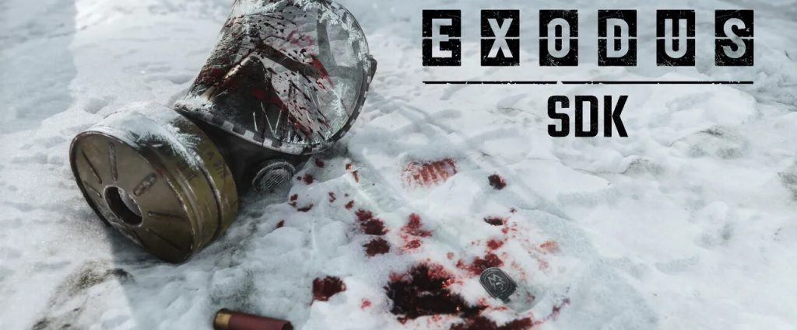
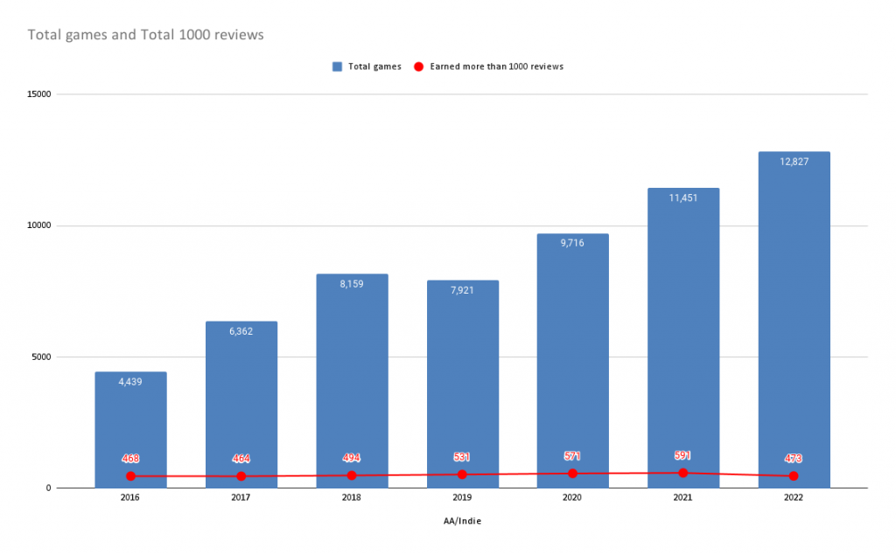
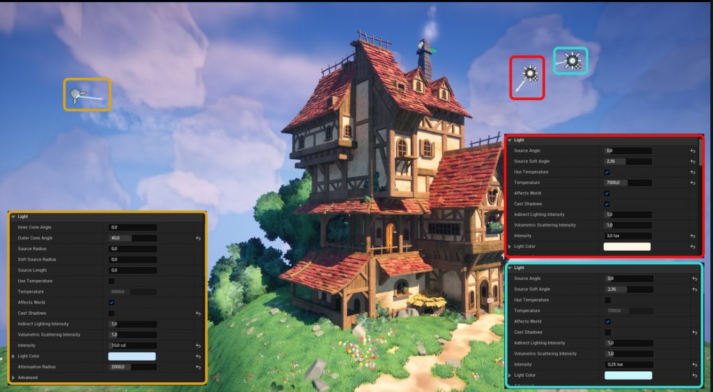
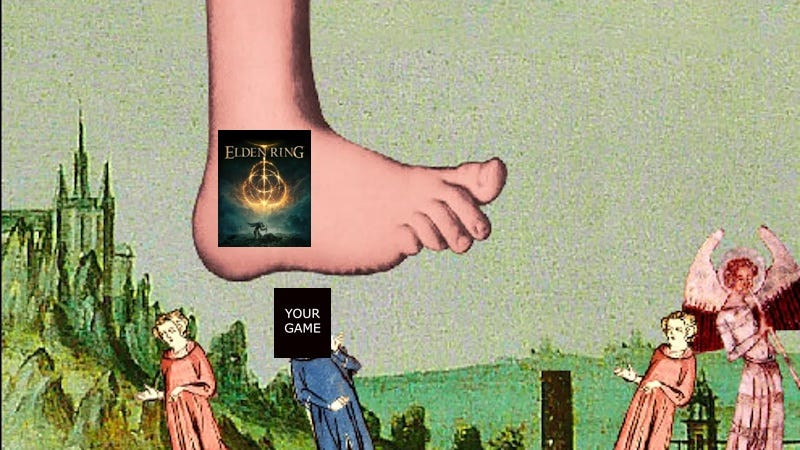
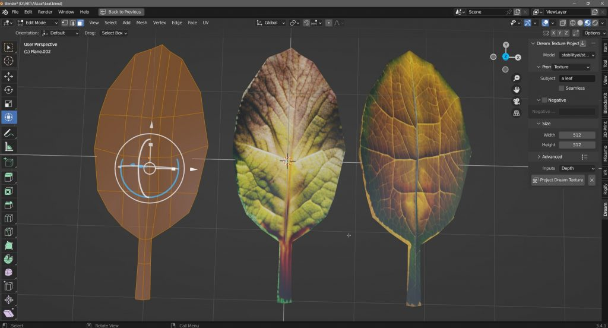
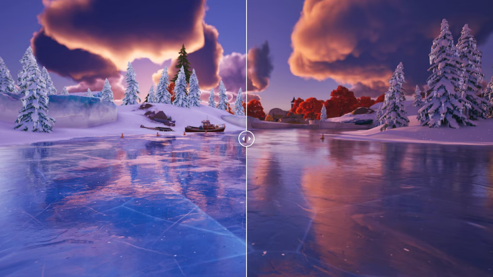
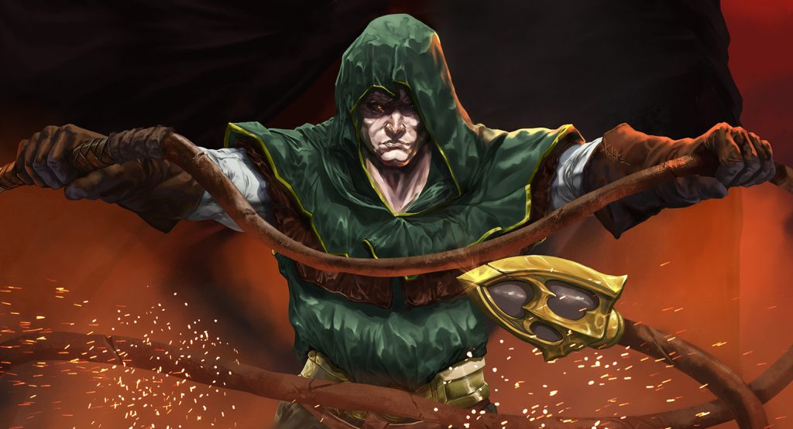
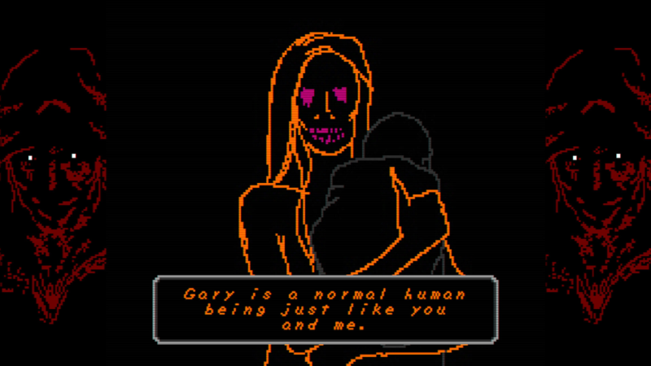
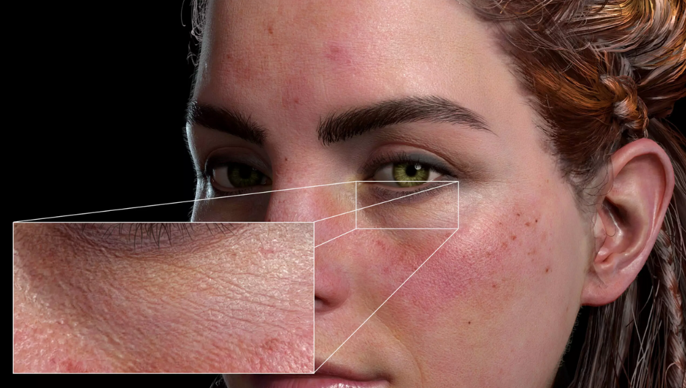

*The game development industry brings something new all the time. General Arcade shows the most interesting releases, updates and news of the past week, which are recommended reading for both industry veterans and novice developers.*

## Updates/releases/news

[4A Games releases SDK for Metro: Exodus](https://exodus-sdk.atlassian.net/wiki/spaces/ESDK/overview?mode=global)

A set of tools for creating mods for Metro Exodus will help you create absolutely any type of modifications.

[Microsoft asked Sony to appear in court to defend itself in a case against the Federal Trade Commission](https://dtf.ru/gameindustry/1588573-microsoft-poprosila-sony-yavitsya-na-zasedanie-suda-chtoby-zashchitit-sebya-v-dele-protiv-federalnoy-torgovoy-komissii)

The company wants a competitor to share some documents.

## Interesting articles/videos

[An indie game must have 1000 reviews to be promoted by Steam](https://twitter.com/AdventureMtn/status/1617582250299920384)

Chris Zukowski, an author of the Steam blog How To Market A Game, said that you need to get 1000 reviews in the first year in order tothe algorithms actively promote you on the platform.

In 2022, over 12,000 indie games were released on Steam. Only ~550 (info from https://vginsights.com/) of them are pushed by algorithms. 1000 reviews \* 30 \* $10 (average indie price) = $300,000. From about this level, you are actively pushed in the same Daily Deals.

[Working at Valve: no managers and complete freedom?](https://youtu.be/s9aCwCKgkLo)



Chris Brat and the team talked to former and current Valve employees and discussed the structure of the company in a video.

[How Goose Goose Duck hit 700K CCU on Steam](https://newsletter.gamediscover.co/p/how-goose-goose-duck-hit-700k-ccu)

Heard about the recent hit Goose Goose Duck? Well… like a recent one, the game came out in 2021, but the current one has skyrocketed recently. Yes, so much so that there were 700k CCU. Despite the fact that Among Us, which inspired the developers, only got to ~450k (but yes, Goose Goose Duck is free).

Top 13 on Steam. Monetized by cosmetics. The guys from Gamediscover did a little analysis.

[Creating a stylized medieval building in 3ds Max, UE5 and Substance 3D](https://80.lv/articles/creating-a-stylized-medieval-building-in-3ds-max-ue5-substance-3d/)

Tatiana Devos spoke about the Medieval House project, explained how modular elements were created and textured, and also told how she decorated the stage.

[How to make a cool double boss?](https://youtu.be/evJeudz8ZXY)



Yes, Smough and Ornstein included, but other examples are considered.

[Could another major game release crush your initial sales?](https://newsletter.gamediscover.co/p/can-another-big-game-release-crush)

The editors of gamediscover decided to address this issue.

[The Best Game Animations of 2022](https://youtu.be/Kwn32j8_-p0)



Daniel Floyd, professional animator and co-founder of Extra Credits, has taken a look at some of the coolest animations in games which came out in 2022.

[Adding Nanite to Fortnite Battle Royale](https://www.unrealengine.com/en-US/tech-blog/bringing-nanite-to-fortnite-battle-royale-in-chapter-4)

Graham Wihlidal, a developer at Epic Games, showed off the exciting features and improvements he and his team developed this year to launch Nanite in Fortnite Battle Royale Chapter 4. These features are available in Unreal Engine 5.1 (beta).

[Using Stable Diffusion for 3D Texturing](https://80.lv/articles/using-stable-diffusion-for-3d-texturing/)

Kieran Fogarty showed how you can use Stable Diffusion to create 3D textures and talked about the ethical side of using AI generators in production.

[Lumen adds real-time global illumination to Fortnite Battle Royale Chapter 4](https://www.unrealengine.com/en-US/tech-blog/lumen-brings-real-time-global-illumination-to-fortnite-battle-royale-chapter-4)

Daniel Wright and Krzysztof Narkowicz, engineers working on Lumen, in the post talked about how Lumen works in Fortnite, and also about the improvements that the team made to Lumen upon  the new chapter release (which are now available to all developers in Unreal Engine 5.1).

[Ever wondered what happened to indie developers who went all in?](https://www.reddit.com/r/gamedev/comments/10m8929/ever_wondered_what_happened_to_indie_devs_that/)

But one of the Reddit participants decided to collect everything from relevant subreddits into one list of such developers.

[The Secret of Vampire Survivors’ Addictiveness: Why It’s So Hard to Stop Playing](https://skillbox.ru/media/gamedev/sekret-addiktivnosti-vampire-survivors-pochemu-tak-slozhno-perestat-igrat/)

Let’s figure out how the hypnotic gameplay works, what Luca Galante’s game has in common with the casino, and what does the “one more move” phenomenon have to do with it.

[Pay attention to secretly popular subgenres](https://howtomarketagame.com/2023/01/23/pay-attention-to-these-secretly-popular-sub-genres/)

Chris Zukowski decided to review every Steam game released in 2022 that received at least 1,000 reviews. In the blog, he pointed out several genres that are very dear to the fans, there is not much competition there, and it is quite possible to develop them with a small team.

[Creating many faces of Horizon Forbidden West](https://www.guerrilla-games.com/read/creating-the-many-faces-of-horizon-forbidden-west)

The Guerrilla Games team shared how they achieved the superb quality of their characters’ faces in Horizon Forbidden West, as well as the extra fidelity that comes with the PS5’s power.

*We thank [Andrei Apanasik](https://suvitruf.ru) for writing the original post and allowing us to publish it on our blog in English.*
