*The game development industry brings something new all the time. General Arcade shows the most interesting releases, updates and news of the past week, which are recommended reading for both industry veterans and novice developers.*

## Updates/releases/news

[Godot 4.0 release](https://godotengine.org/article/whats-new-in-csharp-for-godot-4-0/)

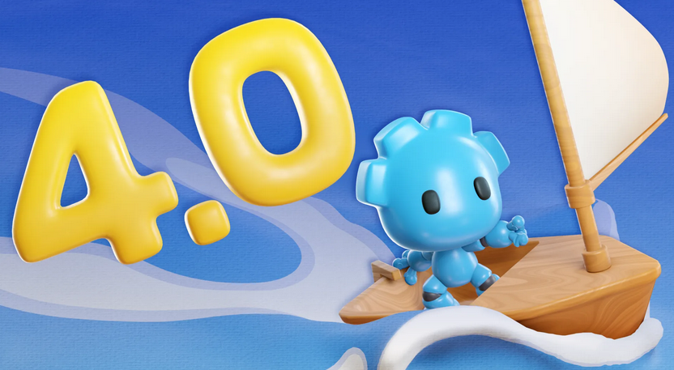

After over 3 years of rebuilding from the ground up, a complete core overhaul and engine rewrite, 17 alphas, 17 betas and 6 release candidates, the team has finally released the much anticipated new version of Godot. You can read more about 4.0 in a separate post.

[Stable Diffusion AI Art Generator Official Plugin Released for Blender](https://platform.stability.ai/docs/integrations/blender/get-started)

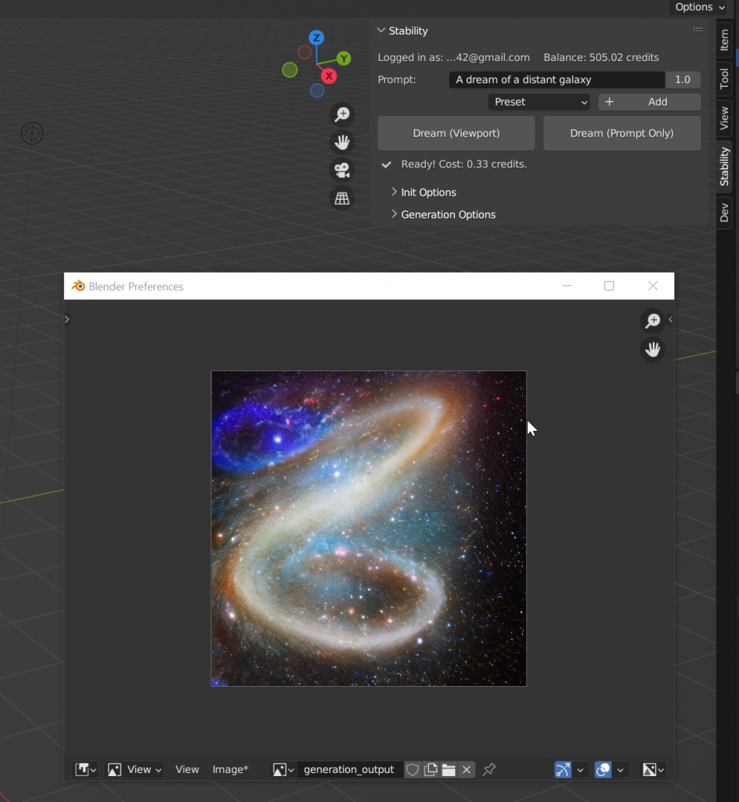

The extension is free and makes it much easier to experiment with projects.

[Valve has updated the rules and guidelines for obtaining keys](https://store.steampowered.com/news/group/4145017/view/3645136992388208760)

Briefly:

Maximum 2,500 Release State Override (beta) keys prior to release for crowdfunding purposes.

Up to 5 thousand standard keys for distribution in other stores. Previously, they didn’t give out much either, but there were no explicit restrictions in the rules.

Added text states that when processing requests for issuance, they look at different criteria: the level of interest of buyers on Steam, the number of keys already requested and activated, etc.

Clarified about the sale in other places, so that “the deal was not better than for users inside Steam.”

[Playtika has temporarily suspended the development of new games](https://www.gamesindustry.biz/playtika-no-longer-launching-or-developing-until-market-challenges-ease)

This would last until “until the payback for new games is economically viable”, the CEO said.

[Rust GameDev #42: January 2023](https://gamedev.rs/news/042/)

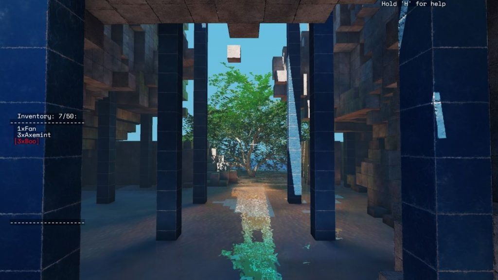

Another selection of gamedev from the Rust community.

[Valve Updated Steam Mature Content Survey and Pre-Release Checks](https://store.steampowered.com/news/group/4145017/view/3645136992391096608)

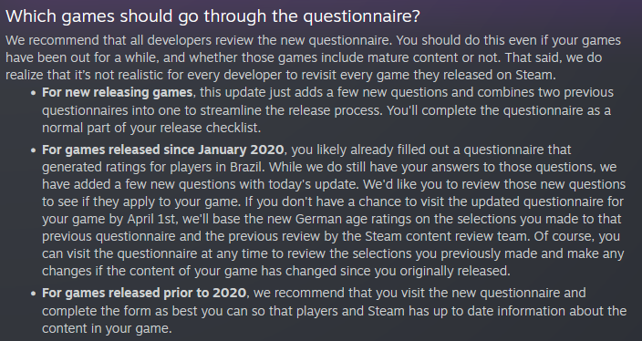

Updates should simplify the pre-release process and help customers better understand your game.

## Interesting articles/videos

[How to reduce your game load time by 2 seconds](https://medium.com/hypemasters/how-to-save-2-sec-loading-time-of-your-game-f53611bbea0a)

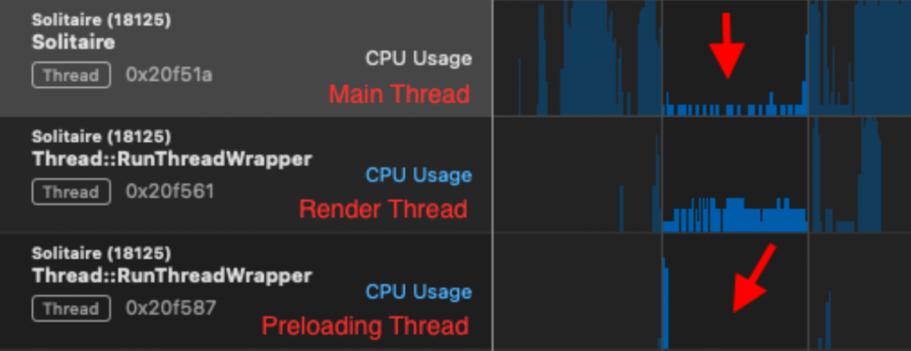

Pretty simple little things, though helpful for your game.

[How EBB Software integrated the Unreal Engine plugin for FSR 2.1](https://gpuopen.com/learn/scorn-fsr2/)

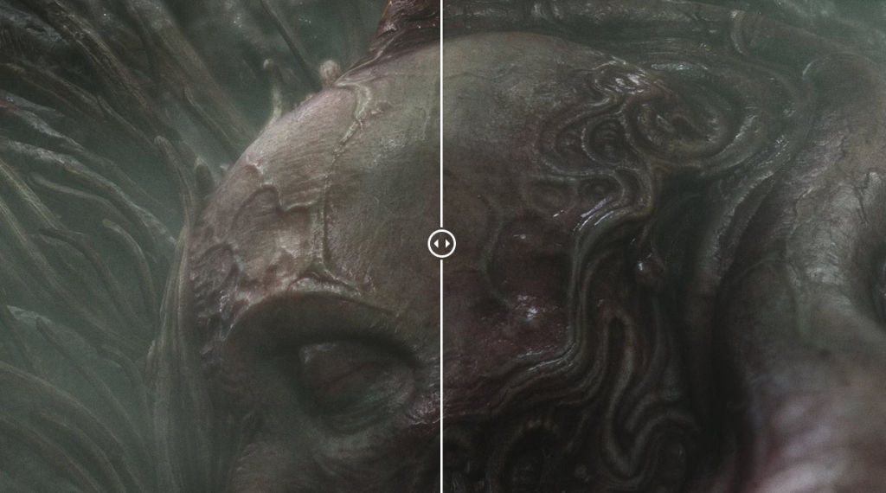

Scorn developers shared the technical details of integrating the new AMD technology.

[Creating a hunting camp in a dragon skull with ZBrush and Unreal Engine](https://80.lv/articles/making-a-hunting-camp-in-a-dragon-skull-with-zbrush-unreal-engine/)

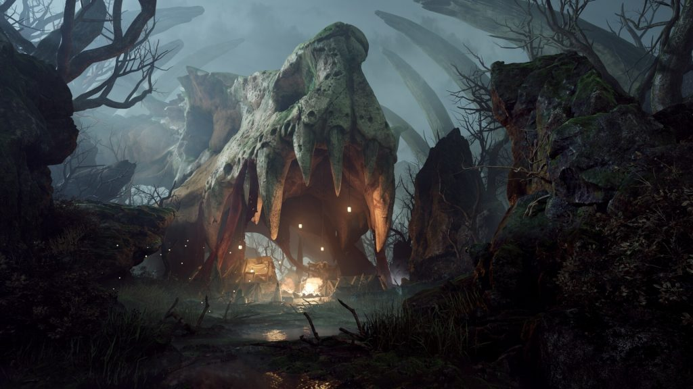

Antonio Bravo spoke about the Hunting Camp project, showed how the dragon’s head was created, and talked about setting up the lighting.

[Keeping track of memory with the new Memory Profiler package](https://blog.unity.com/engine-platform/inspecting-memory-with-the-new-memory-profiler-package)

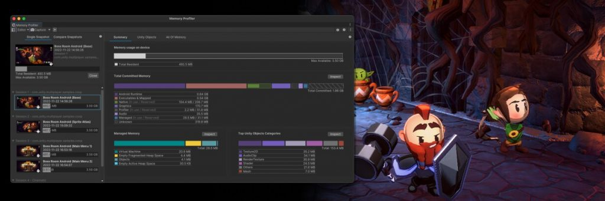

In the post, the Unity team covered five key workarounds in the new Memory Profiler package that you can use to diagnose and investigate memory-related issues in your game.

[Job Search Tips from Techland](https://80.lv/articles/tips-on-landing-a-job-from-techland/)

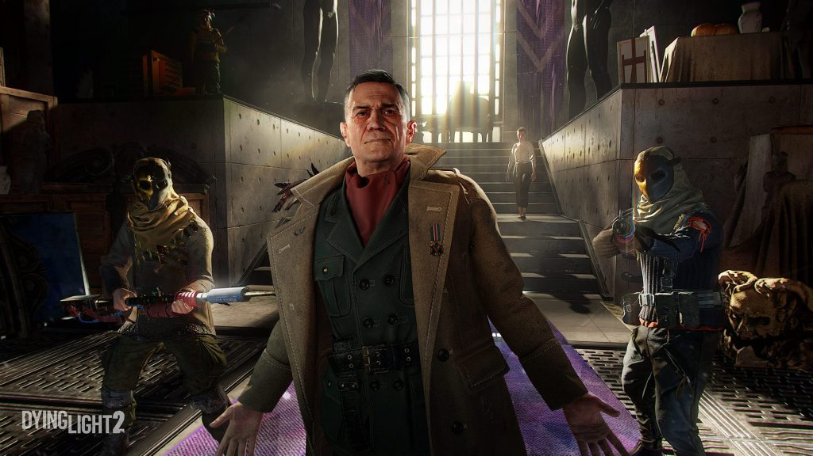

Techland’s chief recruiter Michal Penkala explained how to deal with losing a job, shared some portfolio building tips to help you find a new one faster, and gave tips for artists looking to join Techland.

[Preserving European Royal Heritage with RealityCapture and Unreal Engine](https://www.unrealengine.com/en-US/spotlights/preserving-european-royal-heritage-with-realitycapture-and-unreal-engine)

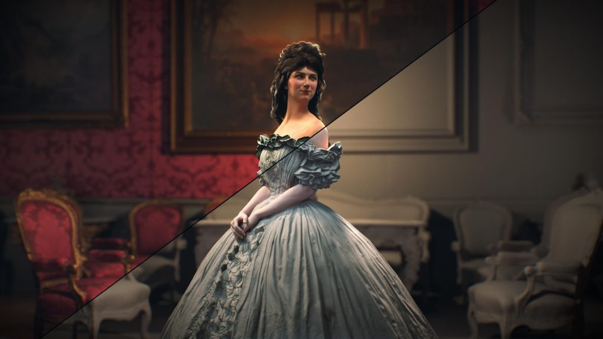

Organizations like Artzenal in Slovakia, which provides a full range of digital art services from early 2D sketches to high-quality 3D content and character art, are embarking on cultural preservation projects to help preserve history.

[How Against the Storm managed to combine urban development and roguelite](https://www.gamedeveloper.com/road-to-igf-2023/how-against-the-storm-managed-to-mix-city-building-and-roguelite-play)

The game combines elements of roguelite and city builder, inviting players to build and thrive despite the inevitable disasters.

[3D Content Compatibility with Non-Topology Modeling](https://developer.nvidia.com/blog/3d-content-interoperability-with-topology-free-modeling/)

Modern topology-based modeling software creates three-dimensional objects with a single level of detail. This makes them inoperable with the metaverse. Also, due to the topology creation process, 3D modeling is time consuming and has a high entry barrier to content creation.

[How new genres are invented](https://howtomarketagame.com/2023/02/27/how-new-genres-are-invented/)

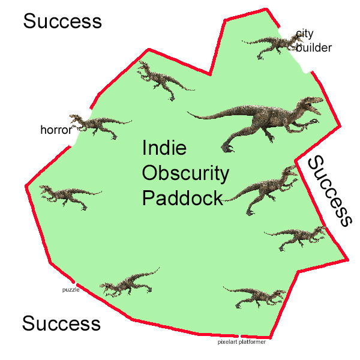

Some analytics with real examples.

[Death of a Game: Gwent](https://youtu.be/SgqIPeIFAqA)



Analysis of a standalone game from CDPR, which grew out of the Witcher 3 mini-game.

[Communication as the heart of the puzzle game](https://blog.unity.com/games/building-communication-into-a-puzzle-game)

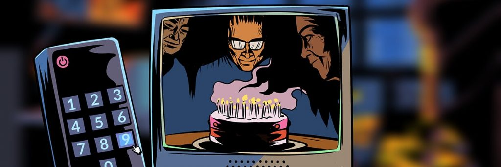

In the post, Eleven Puzzles Lead Game Designer Mairi Nolan talks about how the team has built communication on their latest release, Unsolved Case, and the importance of verbal interaction in a game.

[The Playrix case and why product-to-market fit is a moving target](https://www.deconstructoroffun.com/blog/2023/2/27/the-case-of-playrix-and-why-product-market-fit-is-a-moving-target)

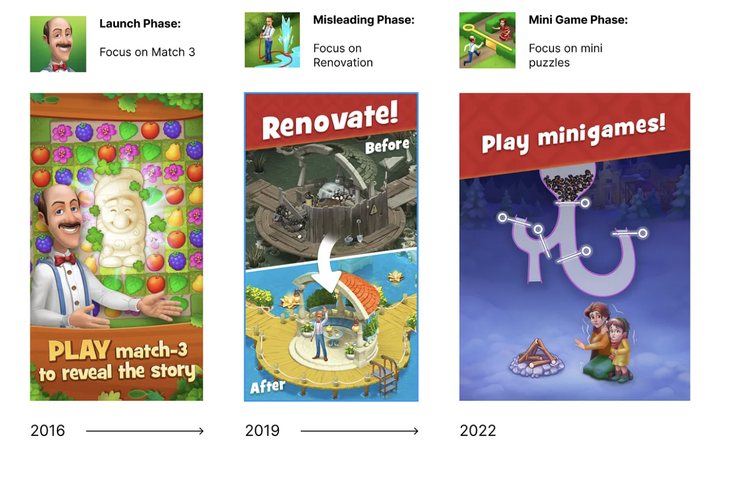

[Work culture and hiring process at Sierra Division](https://80.lv/articles/working-culture-and-the-recruitment-process-at-sierra-division/)

Jacob Norris talked about how the company determines which projects to work on, explained the workflow in the Sierra Division, and gave a number of useful tips for artists who want to start their journey in the studio.

Color replacement

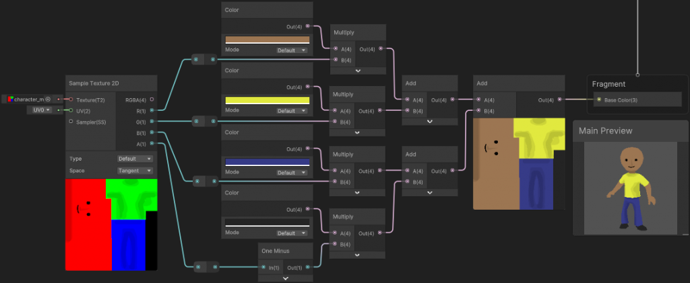

This article provides an overview of various methods for adjusting object colors.
