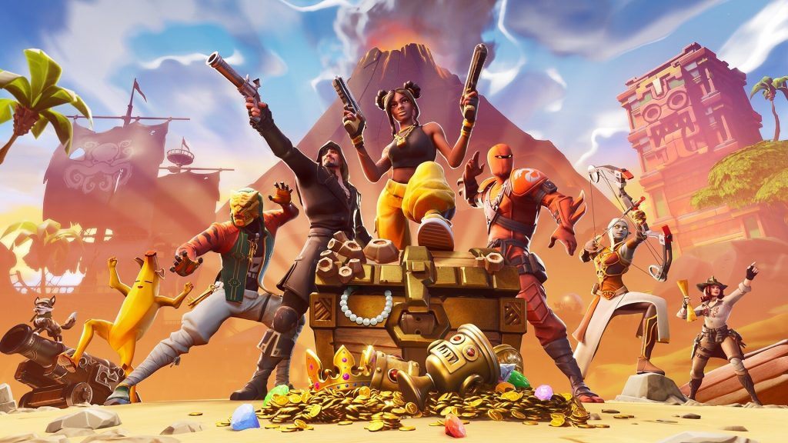
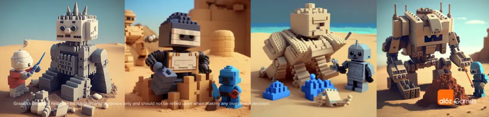
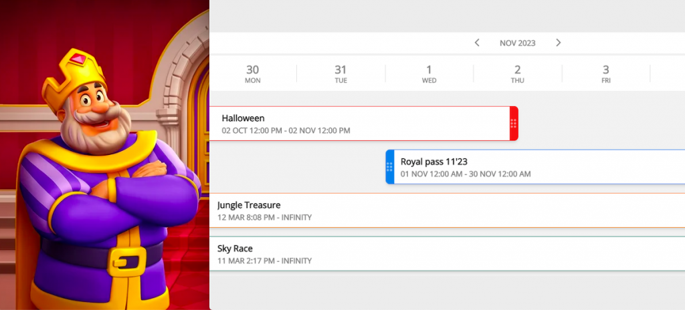
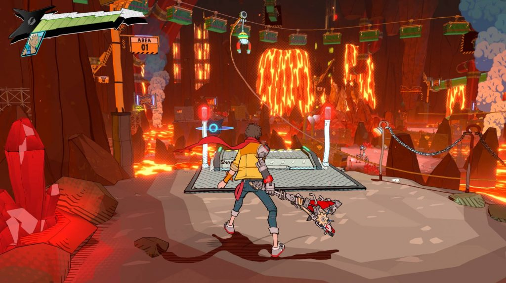
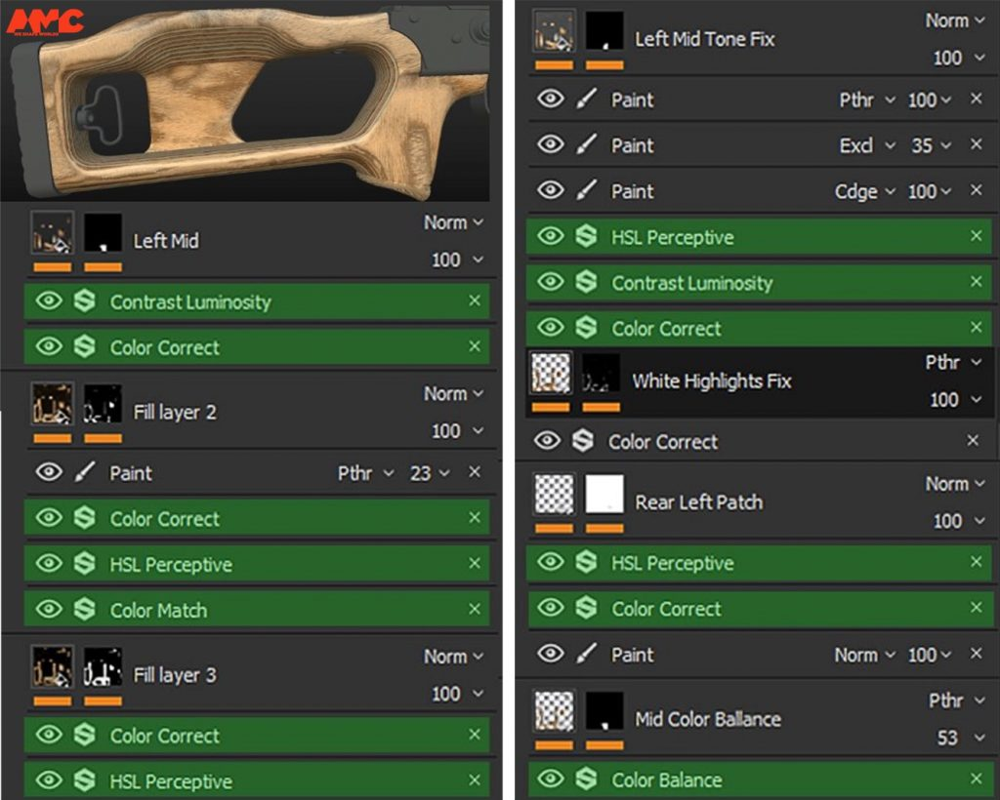
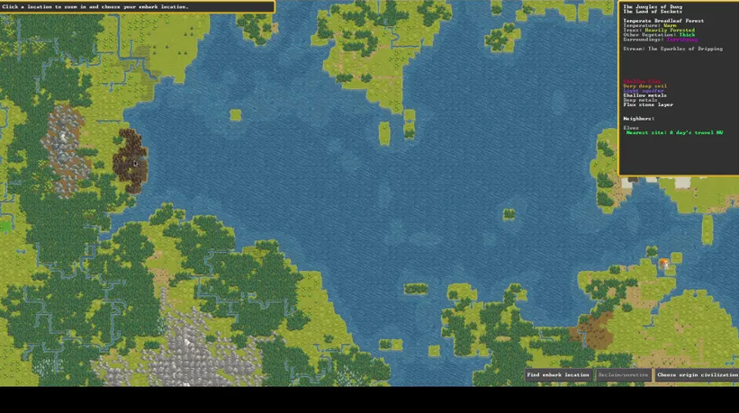
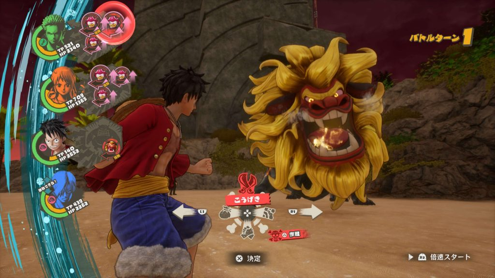
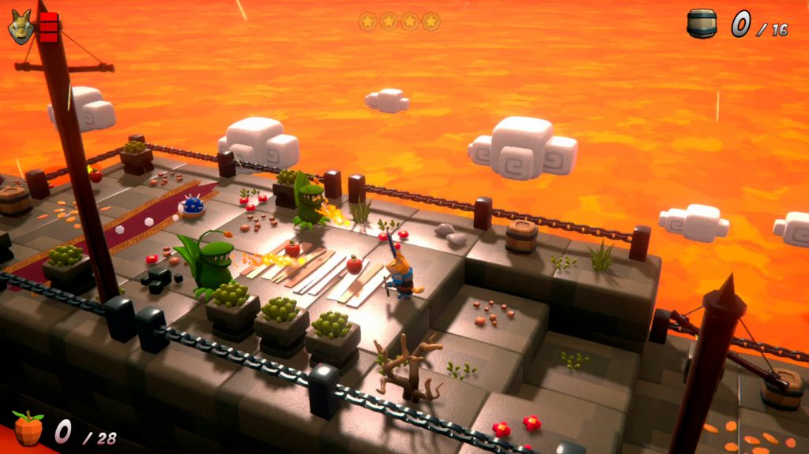
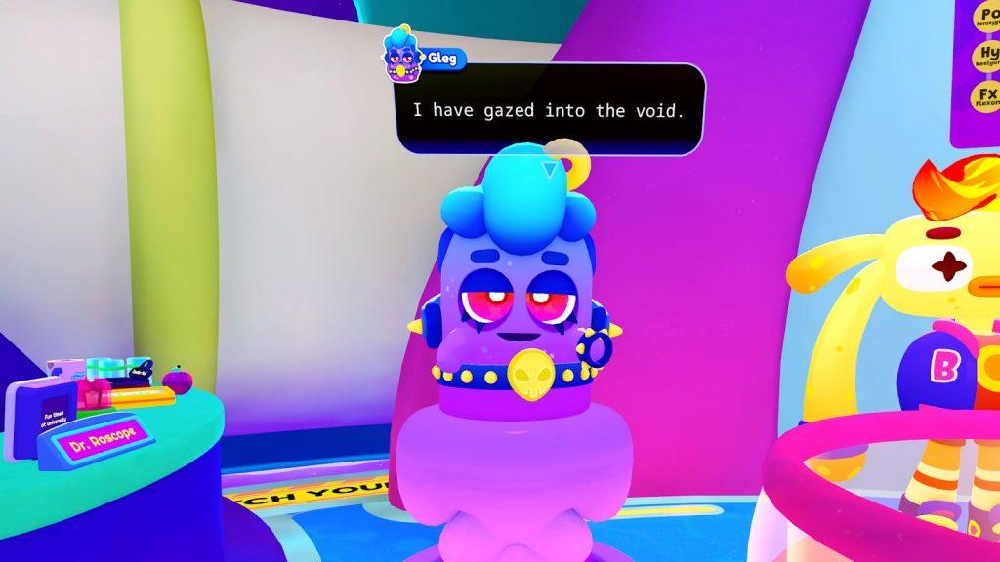
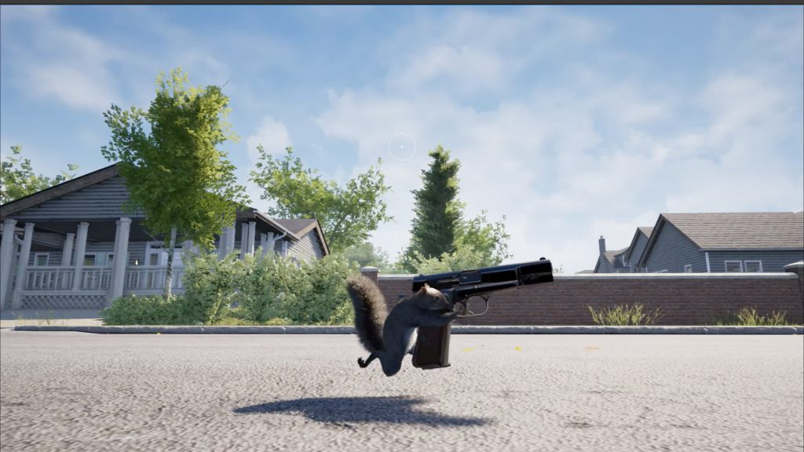

*The game development industry brings something new all the time. General Arcade shows the most interesting releases, updates and news of the past week, which are recommended reading for both industry veterans and novice developers.*

## Updates/releases/news

[DreamWorks released MoonRay renderer](https://github.com/dreamworksanimation/openmoonray)



It was used in the production of, for example, The Bad Guys, How to Train Your Dragon: The Hidden World, Puss in Boots: The Last Wish and other projects. Available on [Github](https://github.com/dreamworksanimation/openmoonray).

[Epic Games will release an Unreal Editor application that allows you to create games inside Fortnite](https://store.epicgames.com/ru/p/fortnite--uefn)

Will there be a competitor to Roblox?

[Rider 2023.1 and Unity DOTS support](https://blog.jetbrains.com/dotnet/2023/03/16/unity-dots-support-in-rider-2023-1/)

New code generation templates and of course checks and quick fixes.

[Godot arrives on the Epic Games Store](https://godotengine.org/article/godot-arrives-in-the-epic-games-store/)

Epic Games offered Godot Engine a place on the Epic Games Store. You can now use EGS to download the engine and updates.

[EmberGen 1.0](https://forums.jangafx.com/t/embergen-1-0-has-been-released-release-notes/1456)



JangaFX has released EmberGen 1.0, the highly anticipated first official, production-ready version of their real-time fluid simulator for game development, visual effects, and motion graphics.

## Interesting articles/videos

[The generative AI revolution will allow anyone to create games](https://a16z.com/2023/03/17/the-generative-ai-revolution/)

As the AI revolution in gaming matures, it will completely reshape user generated content (UGC), creating a world where anyone can create games, and expanding the gaming market beyond what many thought was possible.

[How to set up LiveOps in match-3 (Royal Match case)](https://balancy.co/blog/2023/03/13/how-to-set-up-liveops-in-match-3-games-case-royal-match/)

A series of articles analyzes genre-defining games. The article presents what the LiveOps of these games would look like in Balancy.

[Hi-Fi RUSH was inspired by Shaun of the Dead and Futurama](https://www.unrealengine.com/en-US/developer-interviews/hi-fi-rush-was-inspired-by-shaun-of-the-dead-and-futurama)

In an interview, John Yohanas, Hi-Fi RUSH Game Director, Kosuke Tanaka, Hi-Fi RUSH Lead Graphics Programmer, and Yuji Nakamura, Hi-Fi RUSH Lead Programmer, talked about using Unreal Engine for key early prototyping and how Futurama helped them capture play style.

[Creating a hyper-realistic weapon material in Substance 3D Painter](https://80.lv/articles/creating-hyperrealistic-wood-material-for-weapons-in-substance-3d-painter/)

David Oroian, Weapons and Hard Surface Artist at AMC Ro Studio, walked through the process of making the material for the rifle, showing the color grading steps and explaining how he personalizes the textures to make the result realistic.

[Making a Vampire Survivors-style game for Playdate](https://youtu.be/WIUOk2YIoWk)



The project took almost 3 months to create.

[How Tarn Adams Updated and Optimized Dwarf Fortress for an Official Steam Release](https://www.gamedeveloper.com/programming/how-tarn-adams-upgraded-and-optimized-dwarf-fortress-for-its-official-steam-release)

For 16 years, the legendary game has received many updates. Gamasutra spoke with the game’s creator to look into these changes and how they were prepared for the official release.

[ONE PIECE ODYSSEY Turns Popular Manga Into An Exciting Adventure RPG To Celebrate Its 25th Anniversary](https://www.unrealengine.com/en-US/developer-interviews/one-piece-odyssey-turns-the-popular-manga-into-a-rousing-rpg-adventure-as-a-celebration-of-its-25th-anniversary)

The Epic Games team spoke with Bandai Namco Entertainment and development partner ILCA about bringing the Straw Hat Pirates’ brilliant abilities to life in an RPG, creating a new island for this pirate adventure, and embodying the spirit of Eiichiro Oda’s enduring masterpiece.

Rise of Fox Hero: developing a 3D platform game with fun combat and puzzles

Josep Monzonis talked about how he stays motivated by balancing full-time work and game development, talked about Rise of Fox Hero’s combat and puzzle mechanics, and gave advice to aspiring indie developers.

[Development for for blindness and low vision in virtual reality with Cosmonious High](https://blog.unity.com/games/developing-for-blindness-low-vision-in-vr-with-cosmonious-high)

In the latest update, they have added a number of gameplay options, including one-handed control mode, subtitles, and more. The team believes that if only people without disabilities can play the game, this is a sign of an unfinished product.

[Squirrel With A Gun Development Process](https://80.lv/articles/the-development-process-behind-squirrel-with-a-gun/)

Daniel DeEntremont talked about how he came up with the idea for Squirrel With A Gun, explained why Unreal Engine 5 was chosen for the game, talked about the production processes behind the environments and game mechanics, and shared some tips for preparing the game for release in Steam.
