*The game development industry brings something new all the time. General Arcade shows the most interesting releases, updates and news of the past week, which are recommended reading for both industry veterans and novice developers.*

News: USD Hydra plugin for Blender version 1.1, Epic Games has introduced the Unreal Educator Accelerator.

Interesting things: a series of guides from Quixel, behind the scenes of TUNIC, which platforms you should launch your video game on the first place.

## Updates/releases/news:

AMD Releases USD Hydra Plugin for Blender Version 1.1



[The update](https://github.com/GPUOpen-LibrariesAndSDKs/BlenderUSDHydraAddon/releases/tag/v1.1.1) adds support for linking and exporting animated USD files, and enables rendering in RenderMan along with the USD native hdStorm renderer and AMD’s own Radeon ProRender.

Epic Games introduced the Unreal Educator Accelerator program.

It [introduces](https://www.unrealengine.com/en-US/blog/introducing-our-new-unreal-educator-accelerator-program) participants to the basics of interactive 3D. By the end of the short course, participants will understand the basics of Unreal Engine, Twinmotion, and Fortnite Creative, making it easier to incorporate them into a variety of curricula.

## Interesting articles/videos

A small analysis of the mimic effect.

You can download it [for free](https://bbbn19.gumroad.com/l/ofgii). This effect [works in Blender 3.0+](https://twitter.com/Bbbn192/status/1532405743047135233).

Smoke, mirrors and scrolling textures: behind the scenes of TUNIC.

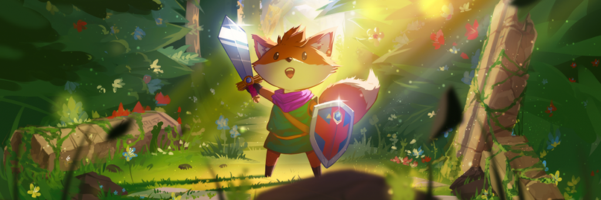

Lead developer Andrew Shooldis [joined](https://blog.unity.com/games/smoke-mirrors-and-scrolling-textures-behind-the-scenes-of-tunic) Unity’s Hassan Al Salman, and Unity insider Joyce Plocker on Twitch to lift the veil on a project he’s been working on since 2015.

Top games from Gamedev.js Jam 2022 with sources

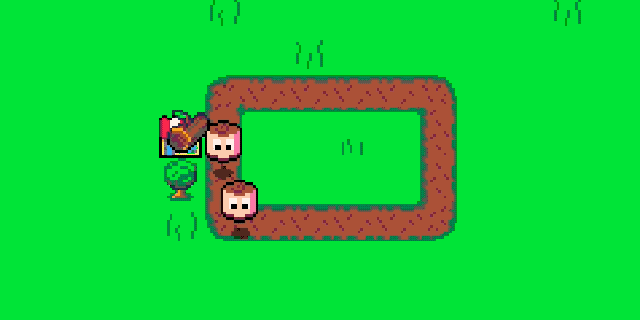

Of the 95 games submitted this year, 27 provided sources on GitHub. [The article presents](https://github.blog/2022-05-31-top-games-source-code-from-gamedev-js-jam-2022/) the top 10 of these games.

How to get a job as a game designer

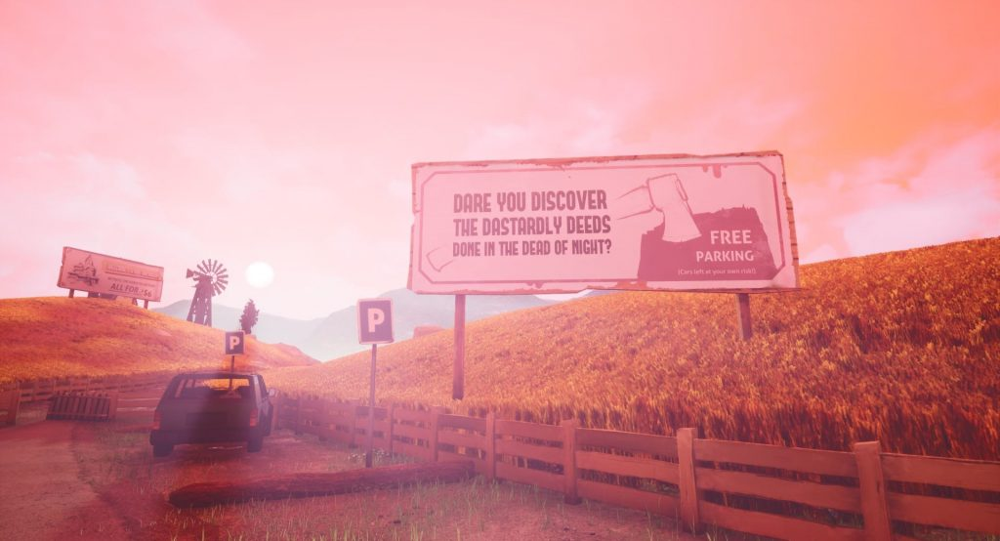

The GamesIndustry.biz Academy [explores](https://www.gamesindustry.biz/articles/2022-05-31-how-to-get-a-job-as-a-game-level-designer) the various skills required to take on a role that plays an important part in game development.

Recreating Doors of Durin from The Lord of the Rings in Unreal Engine 5.

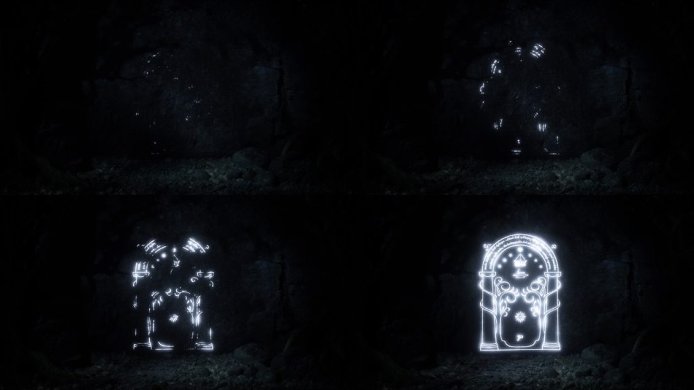

Salva Gomez [spoke](https://80.lv/articles/recreatig-the-lord-of-the-rings-doors-of-durin-in-unreal-engine-5/) about the Doors Of Durin project, talked about the lighting setup and explained why Unreal Engine 5 was chosen for the scene.

Artificial ping for League of Legends tournament.

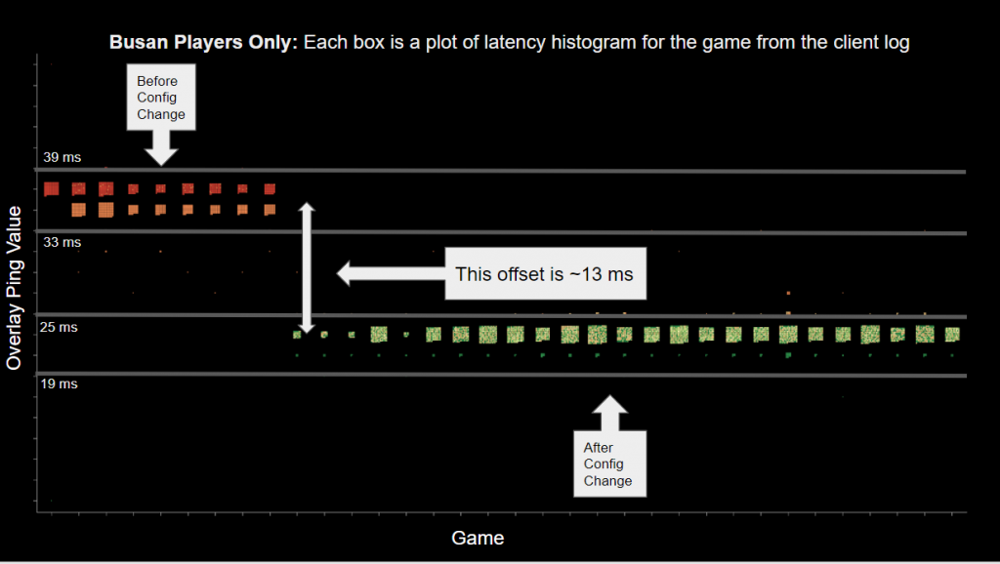

Recently, the Riot Esports Tech Team [has been working](https://lolesports.com/article/riot-games-tech-blog-artificial-latency-for-remote-competitors/blt44154a33b5d5a616) on a series of technical issues related to a tool that is used to equalize ping values ​​between local and remote opponents in the 2022 Mid-Season Invitational (MSI).

Quixel released a series of tutorials describing the process of creating Ninety Days in Unreal Engine 5



The tutorials show the workflows behind some of the environments and have a specific theme that the artists focus on while sharing some tips and tricks related to artwork.

[Overview: Creating ‘Ninety Days’ in Unreal Engine 5](https://www.youtube.com/watch?v=qELcbxazq2g)

[Displacing Geometry: Creating ‘Ninety Days’ in Unreal Engine 5](https://www.youtube.com/watch?v=j-qXa-0fIxA)

[Constructing Destroyed Assets: Creating ‘Ninety Days’ in Unreal Engine 5](https://www.youtube.com/watch?v=TABymp8AzMY)

[Animating in Sequencer: Creating ‘Ninety Days’ in Unreal Engine 5](https://www.youtube.com/watch?v=IfjQli1P__Y)

From Anime Art to Best RPG Award: The Making of Tales of Arise by Bandai Namco.

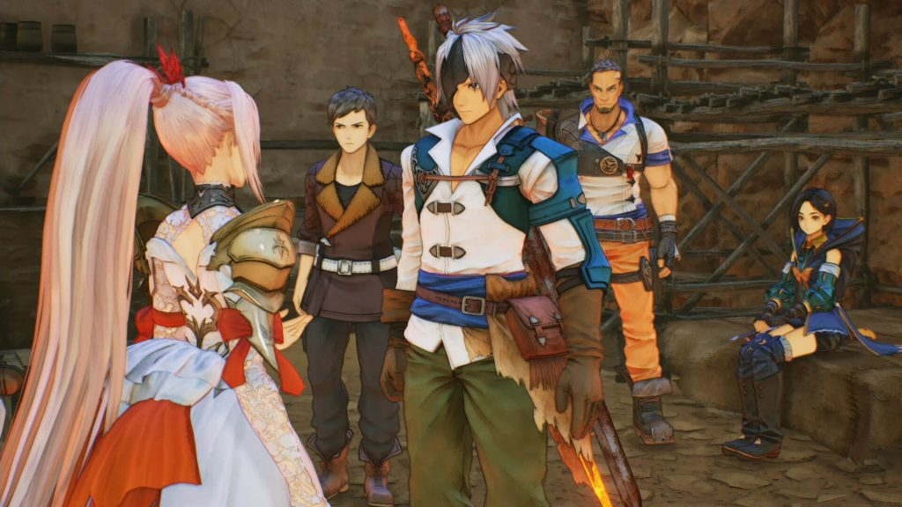

The Epic Games team [spoke](https://www.unrealengine.com/en-US/developer-interviews/from-anime-art-to-best-rpg-award-the-making-of-bandai-namco-s-tales-of-arise) with developers Bandai Namco Studio, as well as parent company Bandai Namco Entertainment, about how the team used the Unreal Engine to create the ultimate Tales of Experience.

Experimenting with functionality for large-scale game projects in UE5.

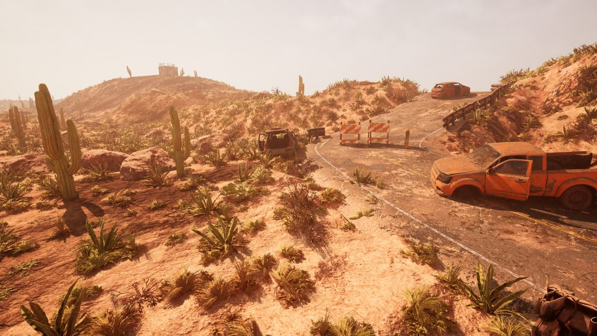

Planetrism Lead Environment Artist Kimmo Kaunela [spoke about the development](https://80.lv/articles/experimenting-with-features-for-large-scale-game-projects-in-ue5/) of large game projects in UE5, talked about his journey in Unreal Engine and discussed the new Chaos Vehicles, Lumen and Unreal Engine 5 procedural tools.

How they teach to create a game like Tower Defence – mistakes of “beginners”

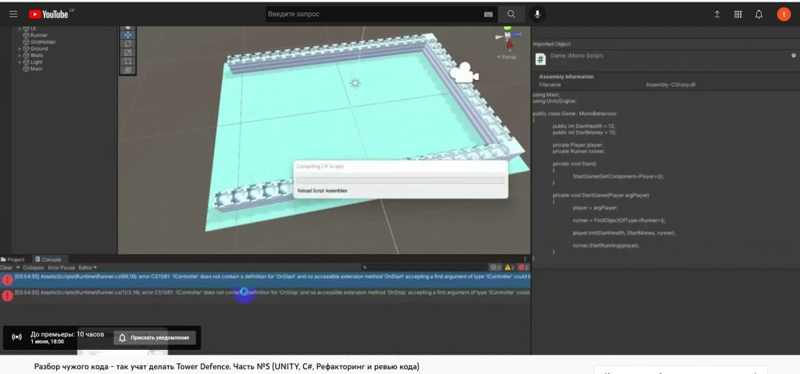

The author spent a lot of time refactoring one project, which, judging by the statements of the project creator, was the basis for teaching students at MIPT. [He told about it on Habr](https://habr.com/ru/post/668928/).

How can you influence perception through sound design?



Alexander Khilko, who has been working as an audio designer for 4 years at Wargaming, where he and his colleagues create the sound picture of a game about tanks played by tens of millions of people, shared a [presentation about sound design](https://dtf.ru/gamedev/1215059-kakim-obrazom-mozhno-vliyat-na-vospriyatie-cherez-saund-dizayn).

What platforms should you launch your video game on first?

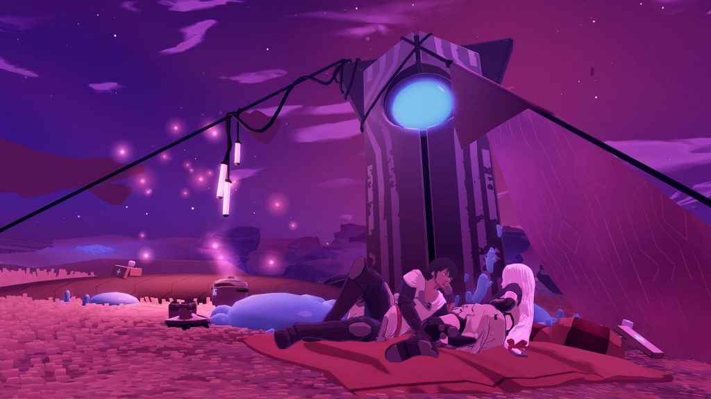

GameDiscoverCo [shared a study](https://newsletter.gamediscover.co/p/which-platforms-should-you-launch) about the release on various platforms, including the experience of developers Haven and Furi.

Creating a Ghibli Island in Blender, UE5 and Substance 3D.



Ariel Adasme [shared a detailed description](https://80.lv/articles/creating-a-ghibli-inspired-island-in-blender-ue5-substance-3d/) of the Island of the Néfeles project, talked about the stylized approach to texturing, and talked about the challenges associated with creating water.

Small tips for working in GameMaker on the example of a psychological thriller.

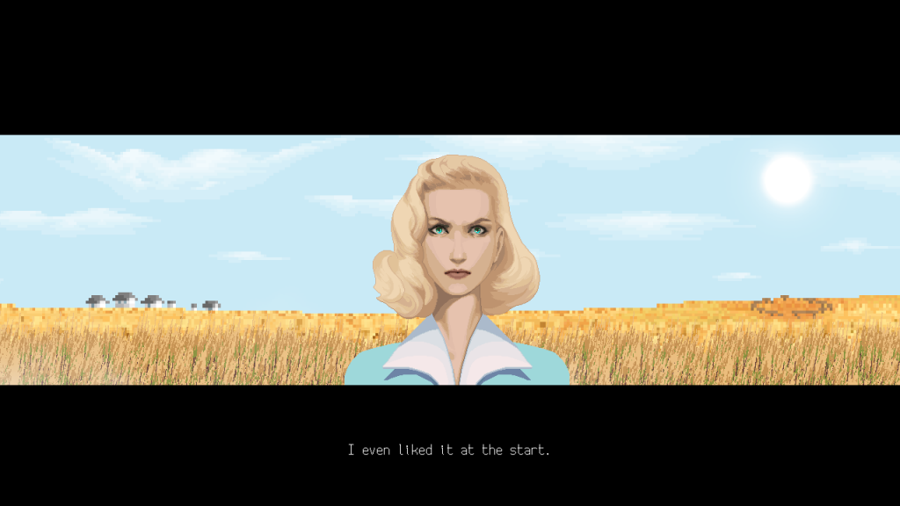

In recent years, Yakov has been [inventing and developing indie games](https://habr.com/ru/post/669212/) almost on his own. He is not a programmer by education, but a doctor, however he has been developing games in Game Maker since 2016, which has become his main job today.

He had to create three games before he understood these simple but important principles.

Scorn developers talked about the creation of weapons.



Ebb Software [shared](https://www.kickstarter.com/projects/1777595379/scorn-part-1-of-2-dasein/posts/3517340) how weapons in the upcoming Scorn horror game go from concept to completion, revealed the main themes of Scorn, and explained what role weapons play in the game.

Creating a Bat-Like Creature in ZBrush to Marmoset Toolbag

Mike Moore [detailed the Bat Creature project created](https://80.lv/articles/creating-a-bat-like-creature-in-zbrush-marmoset-toolbag/) at Vertex School, described the texturing workflow in the Marmoset Toolbag, and explained how the baroque lighting was set up.

Profiling in Unity 2021 LTS: what, when and how

The Unity team continues to [publish content](https://blog.unity.com/technology/profiling-in-unity-2021-lts-what-when-and-how) from their comprehensive guide to game profiling.

Building an army of frogs in UE5 with Niagara



A new informative guide has been released on the CodeLikeMe channel on how to use Unreal’s Niagara in a non-standard way.

Setting up different lighting scenarios for a Victorian era scene.

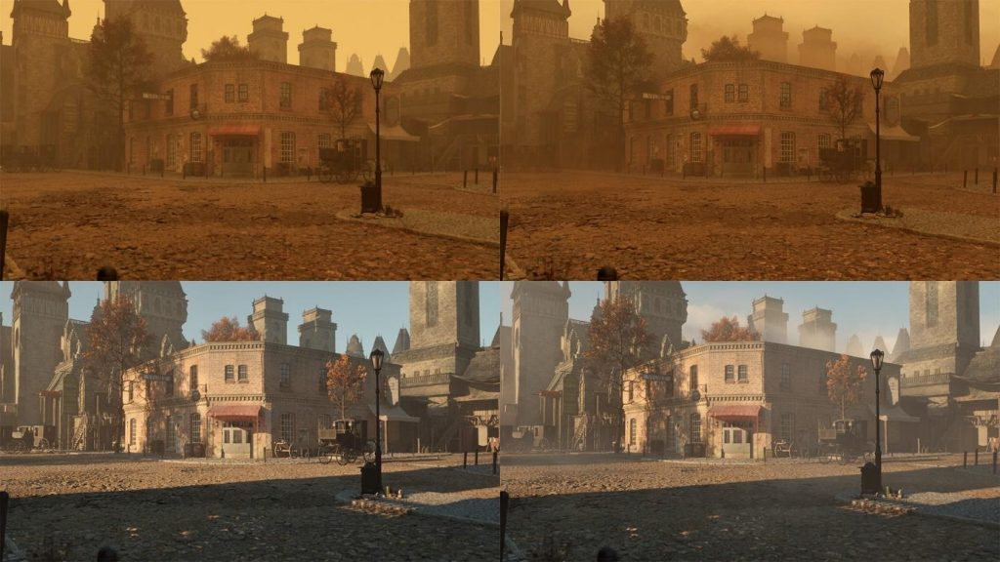

Lighting designer Karim Yasser [explained](https://80.lv/articles/setting-up-various-lighting-scenarios-for-a-victorian-era-scene/) how four different lighting schemes were created for the Victorian Street project, explained the workflow in Unreal Engine 5, and talked about using Nanite to create meshes.

Accelerate Ray Tracing with Software VRS.

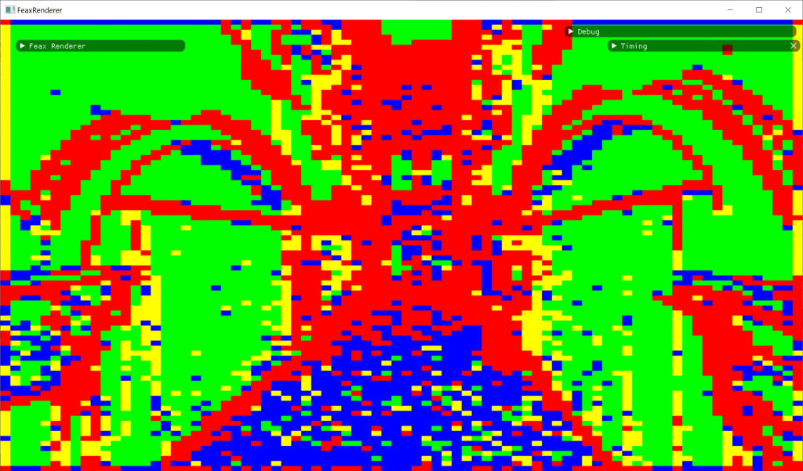

[This article](https://interplayoflight.wordpress.com/2022/05/29/accelerating-raytracing-using-software-vrs/) explains how to use compute shader-based Variable Rate shading techniques to reduce the cost of ray tracing.

The biggest problem with Death Stranding? Teach AI to walk.



The game presents a rich and complex environment for players to navigate, and this leads to the biggest problem that the developers of Kojima Productions had to face. How do you teach an AI to walk in a game that breaks so many conventions about how you move around the world?

## Miscellaneous

Witcher style village built with Unreal Engine 5.

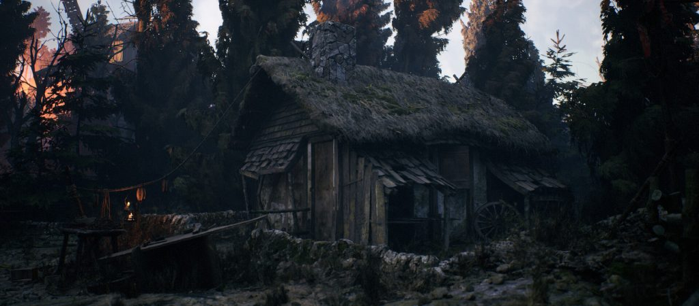

From [ArtStation](https://www.artstation.com/artwork/Ze9anG).

3D artists from Passion Republic, who worked on Elden Ring, shared a look at the created assets.

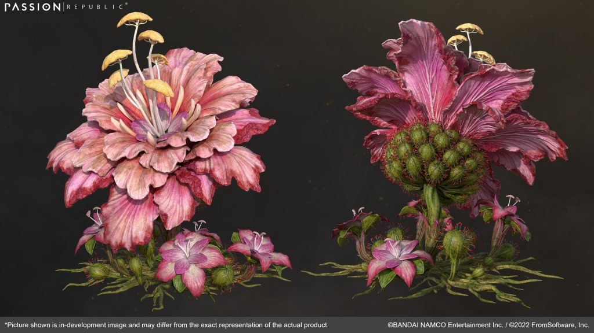

[Artists demonstrated outfits, sets of armor, etc](https://www.artstation.com/artwork/8wE4NQ).

We thank [Andrei Apanasik](https://suvitruf.ru) for writing the original post and allowing us to publish it on our blog in English.
