

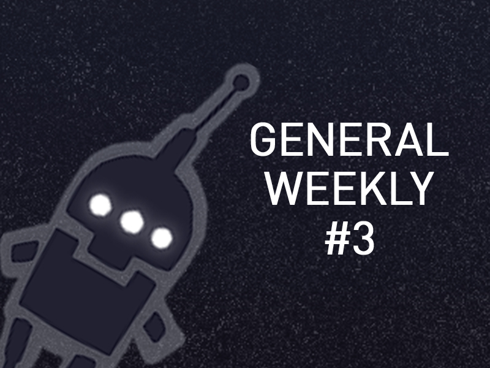

<em>The game development industry brings something new all the time. General Arcade shows the most interesting releases, updates and news of the past week, which are recommended reading for both industry veterans and novice developers.</em>

In the news: probabilistic programming language MarkovJunior, Blender 3.2 released, Epic Games updated the MetaHuman editor, adding mesh imports and additional face animations, Rusty Jam 2 and Houdini Game Jam 2022 game jams.

Of interest: an excellent article about the architecture of the Xbox 360, the re-creation of Lilith from the Diablo IV trailer in Maya and ZBrush, the technical post-mortem “Remember …” by Ice-Pick Lodge, quaternions for dummies.

<h2 id="h-updates-releases-news">Updates/releases/news</h2>

Blender 3.2 released
<iframe allow="accelerometer; autoplay; clipboard-write; encrypted-media; gyroscope; picture-in-picture" allowfullscreen="" frameborder="0" height="315" src="https://www.youtube.com/embed/TnX4_BcFY54" title="YouTube video player" width="560"></iframe>

    EEVEE Shader Improvements

    WebP support

    Improved in multithreading

    New Experimental OBJ Importer

    UI improvements

    Reduced memory consumption by nodes

    New Curve Pen tool for drawing and editing curves, and a radically updated set of 3D drawing tools

    Many changes and improvements to the Cycles renderer

Epic Games updated the MetaHuman editor with mesh imports and additional face animations…

<iframe allow="accelerometer; autoplay; clipboard-write; encrypted-media; gyroscope; picture-in-picture" allowfullscreen="" frameborder="0" height="315" src="https://www.youtube.com/embed/Aa2r9nbt6SA" title="YouTube video player" width="560"></iframe>

<a href="https://www.unrealengine.com/en-US/blog/new-release-brings-mesh-to-metahuman-to-unreal-engine-and-much-more">…as well as presets for lights, looped animations for testing, and compatibility with Unreal Engine 5’s internal tools.</a>

Unity has created a new codestyle repository.

<figure class="aligncenter size-large">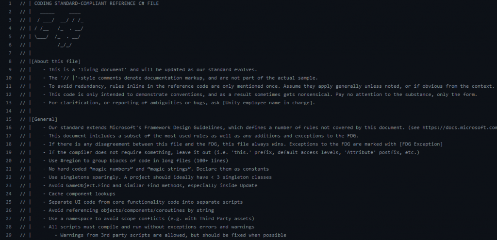</figure>

You can look <a href="https://github.com/UnityTechnologies/SolKorCSharpReference/blob/main/CSharpReference.cs">at Github</a>.

Unity has decided to shut down Unity Answers and will redirect to the Unity Forums.

<figure class="aligncenter size-large"></figure>

At the same time, they <a href="https://forum.unity.com/threads/unity-answers-shutdown.1293360/">write that</a>:

    The functionality of Forums falls short of Answers.

    Migration of all existing answers will most likely not be.

Rusty Jam 2

<figure class="aligncenter size-large"></figure>

Applications are <a href="https://gamedev.rs/blog/rustyjam-02/">accepted</a> from 18 to 26 June. Voting for entries will begin immediately after the end of the jam and will be a week-long.

Houdini Game Jam 2022

<figure class="wp-block-image size-large">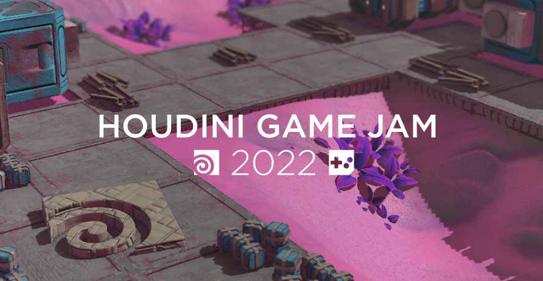</figure>

It will be held for one week from 17 to 24 June 2022. Theme <a href="https://www.sidefx.com/community-main-menu/contests-jams/houdini-game-jam-2022/">will be revealed</a> on the SideFX Twitch channel on June 17 at 11:00 AM PT. Creators will have one week to create their games and submit them to the Houdini Game Jam ITCH.IO page by 5:00 pm PT on June 24th.

MeshSync now supports Blender nodes right in the Unity editor.

<figure class="aligncenter size-large"></figure>

<a href="https://docs.unity3d.com/Packages/com.unity.meshsync@0.13/manual/GeometryNodes.html">You can control</a> the rendering and transformation of the instance world by modifying the generated game object.

Rust GameDev #34: May 2022

<figure class="aligncenter size-large"></figure>

<a href="https://gamedev.rs/news/034/">May 2022 news</a> from the community of game developers on Rasta.

ProRender 3.4 for Blender and Maya released

<figure class="aligncenter size-large"></figure>

<a href="https://gpuopen.com/learn/latest-updates-to-radeon-prorender-plug-ins/">The updates</a> add new settings for managing fog and atmosphere, as well as the ability to override shadow settings on objects.

Mesh rendering system for Unity.

<iframe allow="accelerometer; autoplay; clipboard-write; encrypted-media; gyroscope; picture-in-picture" allowfullscreen="" frameborder="0" height="315" src="https://www.youtube.com/embed/P7mUuCSAX0A" title="YouTube video player" width="560"></iframe>

The system <a href="https://www.indiegogo.com/projects/the-unity-improver-nano-tech/coming_soon">supports</a> HDRP/URP and is similar to Nanite in UE5.

Making Games for Everyone: The New Unity Learn Course on Accessibility.

<figure class="wp-block-image size-large"></figure>

Practical Game Accessibility <a href="https://blog.unity.com/games/creating-games-for-everyone-introducing-unity-learns-new-accessibility-course">is a new free online course</a> to help you prioritize accessibility when creating your game with an inclusive approach to design.

<h2 id="h-interesting-articles-videos">Interesting articles/videos</h2>

<a href="https://alextardif.com/DX12Tutorial.html">A Gentle Introduction to D3D12.</a>

According to the author, “This guide is meant to jump-start your understanding of DirectX 12. Modern graphics APIs like DirectX 12 can be intimidating to learn at first, and there are few resources that make use of relevant evolutions from the last few years”.

<a href="https://www.copetti.org/writings/consoles/xbox-360/">Excellent article about the architecture of the Xbox 360.</a>

<figure class="aligncenter size-large">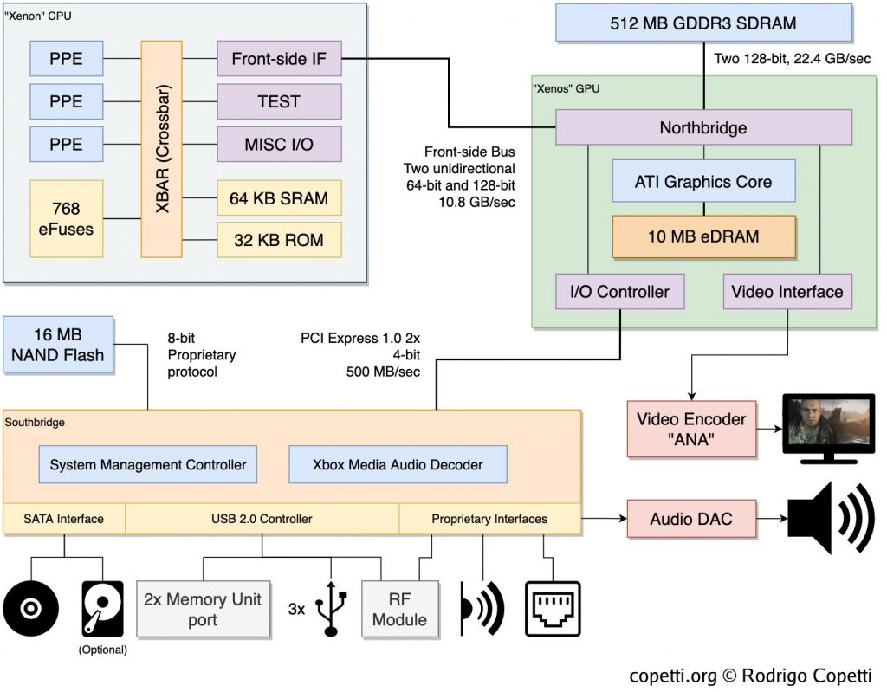</figure>

The new installment in the console architecture series will provide additional insight into early 2000s technologies, with a focus on the emerging “multi-core” processor and the unorthodox symbiosis between the components that allowed engineers to solve seemingly unsolvable. problems.

<a href="https://youtu.be/IW5i9DjKT3U">Another report on testing in game development.</a>

<iframe allow="accelerometer; autoplay; clipboard-write; encrypted-media; gyroscope; picture-in-picture" allowfullscreen="" frameborder="0" height="315" src="https://www.youtube.com/embed/IW5i9DjKT3U" title="YouTube video player" width="560"></iframe>

Although, in general, nothing new, it will not be worse if you fix the main theses.

    Some testing is better than none at all.

    The profit from the tests will not be visible immediately.

    Making things public purely for the sake of testing is bad.

    You need to test at the place of logic: assertions, etc.

    Stress tests are cool. Helps to catch edge cases due to mass character.

    If you feel that maintaining tests takes too many resources, try changing the granularity.

<a href="https://newsletter.gamediscover.co/p/how-v-rising-reached-1-million-sales">How V Rising managed to collect over a million players in a week.</a>

<figure class="wp-block-image size-large">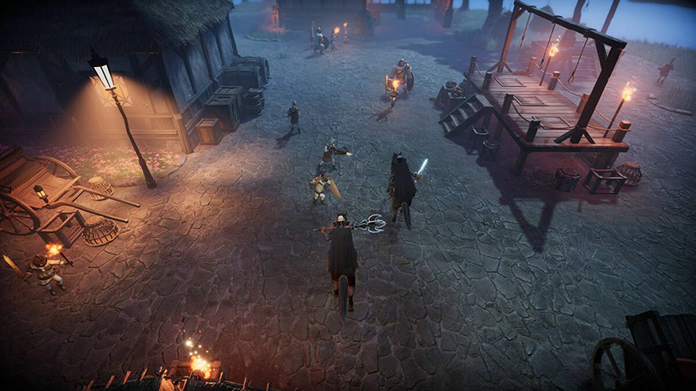</figure>

GameDiscoverCo talked to the developers and tried to figure out how they did it and whether it is possible to repeat this success.

<a href="https://youtu.be/9S_I-qD7fus">Some details about the creation of The Matrix Awakens tech demo on Unreal Engine 5.</a>

<iframe allow="accelerometer; autoplay; clipboard-write; encrypted-media; gyroscope; picture-in-picture" allowfullscreen="" frameborder="0" height="315" src="https://www.youtube.com/embed/9S_I-qD7fus" title="YouTube video player" width="560"></iframe>

You can also read the <a href="https://www.unrealengine.com/en-US/spotlights/behind-the-scenes-on-the-matrix-awakens-an-unreal-engine-5-experience">article on the Epic blog</a>.

<a href="https://80.lv/articles/creating-a-realistic-portrait-of-jinx-in-zbrush-maya-substance-3d/">Creating a realistic portrait of Jinx in ZBrush, Maya, and Substance 3D</a>.

<figure class="aligncenter size-large"></figure>

Character artist Joshua Gou/Wu shared a detailed description of the Jinx project, explained how her face and outfit were created and discussed the texturing and lighting processes.

<a href="https://youtu.be/MUDveGZIRaM">NVIDIA Renders Millions of Lights.</a>

<iframe allow="accelerometer; autoplay; clipboard-write; encrypted-media; gyroscope; picture-in-picture" allowfullscreen="" frameborder="0" height="315" src="https://www.youtube.com/embed/MUDveGZIRaM" title="YouTube video player" width="560"></iframe>

The video explains the ReSTIR method and shows comparison between the previous methods.

Additionally, it is shown how it interacts with upscaling techniques.

<a href="https://habr.com/ru/post/670438/">Quaternions for dummies.</a>

<figure class="aligncenter size-large">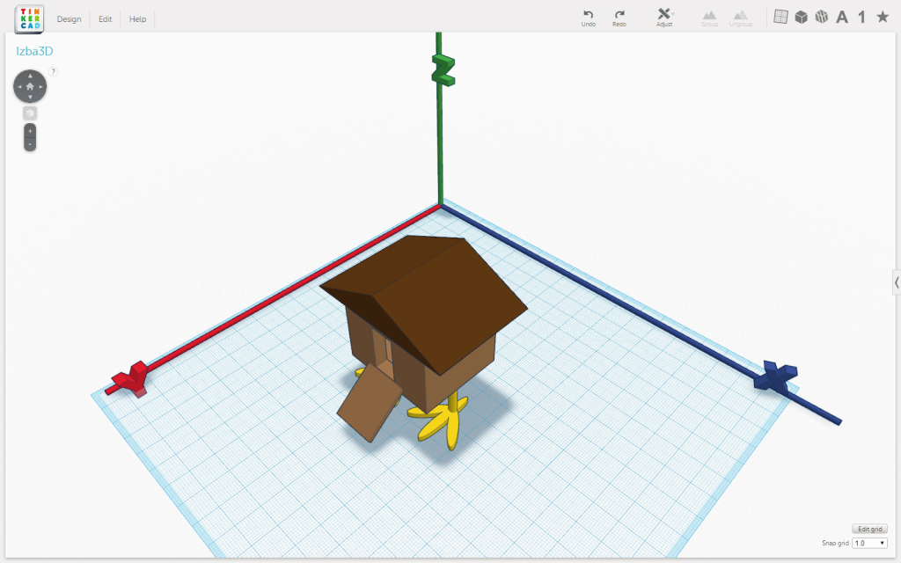</figure>

In the article, using a specific example, the features of using various methods for rotating a 3D object in space are considered. In particular, the application of Euler angles and quaternions is compared.

<a href="https://www.unrealengine.com/en-US/spotlights/dneg-creates-the-matrix-resurrections-dojo-scene-with-unreal-engine">A small breakdown of how the dojo scene was created for The Matrix Resurrections using the Unreal Engine.</a>

<iframe allow="accelerometer; autoplay; clipboard-write; encrypted-media; gyroscope; picture-in-picture" allowfullscreen="" frameborder="0" height="315" src="https://www.youtube.com/embed/HygVE6I9LxM" title="YouTube video player" width="560"></iframe>

More in the text.

<a href="https://www.deconstructoroffun.com/blog/2022/6/4/battle-passes-analysis">Battle Pass: Everything you need to know and more.</a>

<figure class="aligncenter size-large"></figure>

Battle Passes were first introduced in Valve’s Dota 2 and Team Fortress 2 and then popularized by Fortnite (which still has one of the most advanced and ever-improving designs ever). But they have long ceased to be exclusive to mid-core games and are now present in an ever-growing number of genres.

<a href="https://youtu.be/z5sjwqUten0">A good report about the open-source game Space Station 13.</a>

<iframe allowfullscreen="allowfullscreen" frameborder="0" height="315" src="https://www.youtube.com/embed/z5sjwqUten0" title="YouTube video player" width="560"></iframe>

Discussed the pros/cons of developing an open-source game and talked about interacting with the community.

<a href="https://www.gamedeveloper.com/design/deep-dive-cook-serve-forever-and-difficulty-levels">Deep Dive: Evolving User Interface and Difficulty Levels in Cook Serve Forever.</a>

<figure class="aligncenter size-large">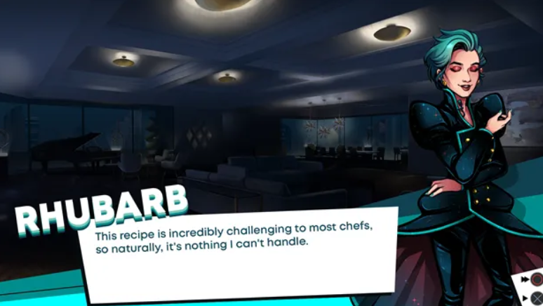</figure>

Creative Director David Galindo talks about how the Cook Serve Delicious franchise is opening itself up to a whole new audience of players in Cook Serve Forever.

<a href="https://80.lv/articles/working-culture-and-the-recruiting-process-at-the-molasses-flood/">Work culture and hiring process at The Molasses Flood.</a>

<figure class="aligncenter size-large"></figure>

Forrest Dowling from The Molasses Flood studio spoke about the organization of work in the company, explained the hiring process, and talked about the company’s approach to training and burnout management.

<a href="https://habr.com/ru/company/pixonic/blog/669858/">Advanced level design: movie techniques in games, core loops, and silhouettes.</a>

<figure class="aligncenter size-large">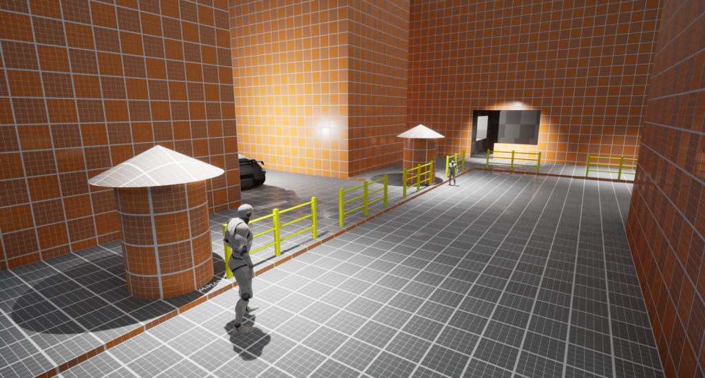</figure>

In a new article, the guys from Pixonic deduced several rules of level design, originating from movie techniques, talked about calculating metrics, working with cor-loop, as well as such seemingly simple things as silhouette and color.

<a href="https://www.unrealengine.com/en-US/developer-interviews/ghostwire-taps-into-the-charm-of-tokyo-to-deliver-a-compelling-experience">Ghostwire uses the charm of Tokyo to bring an unforgettable user experience.</a>

<figure class="aligncenter size-large"></figure>

Epic Games spoke with the team about the studio’s transition from id Tech to Unreal Engine, how the developers created an action game shrouded in horror but adventure, and the studio’s hopes for future technology.

<a href="http://c0de517e.blogspot.com/2022/06/real-time-rendering-past-present-and.html">Real-time rendering – past, present, and likely future.</a>

<figure class="aligncenter size-large">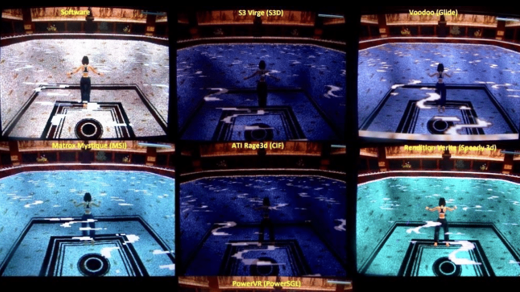</figure>

This presentation was a keynote at a private company event but may be helpful.

<a href="https://dtf.ru/gamedev/1215676-consistent-protiv-rendezvous-chem-otlichayutsya-podhody-dlya-heshirovaniya-dannyh-na-servere">Consistent versus Rendezvous – what is the difference between approaches for hashing data on the server.</a>

<figure class="aligncenter size-large">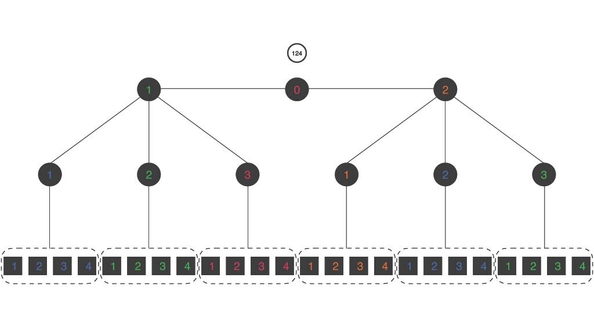</figure>

We redistribute the load on the servers and prevent the entire data storage system from collapsing.

<a href="https://youtu.be/fSbBsXbjxPo">Tutorial for beginners on working with lighting in Unreal Engine.</a>

<iframe allow="accelerometer; autoplay; clipboard-write; encrypted-media; gyroscope; picture-in-picture" allowfullscreen="" frameborder="0" height="315" src="https://www.youtube.com/embed/fSbBsXbjxPo" title="YouTube video player" width="560"></iframe>

William Faucher, a creator of educational content for artists and CGSpectrum mentor, has posted a new video demonstrating how light works in real life and how to implement this photorealistic effect in your projects.

<a href="https://blog.unity.com/games/updated-for-2021-lts-the-definitive-guide-to-lighting-in-the-high-definition-render-pipeline">Updated to 2021 LTS: A Complete Guide to Lighting in the High Definition Render Pipeline.</a>

<figure class="aligncenter size-large"></figure>

The book was created and published late last year to showcase HDRP’s physical lighting capabilities for creating high-quality lighting effects in games. The Unity team received positive feedback from users and has since updated the guide having included the key features of Unity 2021 LTS.

<a href="https://dtf.ru/mobile/1210051-istoriya-glu-mobile-kakogo-razrabotchika-priobrela-electronic-arts-za-2-4-milliarda">The history of Glu Mobile: which developer was acquired by Electronic Arts for $2.4 billion.</a>

<figure class="aligncenter size-large"></figure>

The first mobile online game, how publishers made money on Java games, the progenitor of Pokemon Go – all this and much more in a great material about a mobile company from San Francisco.

<a href="https://youtu.be/njRSYEe0Rfk">Why does a 3D artist need mathematics: recording a stream with Davyd Vidiger</a>.

<iframe allow="accelerometer; autoplay; clipboard-write; encrypted-media; gyroscope; picture-in-picture" allowfullscreen="" frameborder="0" height="315" src="https://www.youtube.com/embed/njRSYEe0Rfk" title="YouTube video player" width="560"></iframe>

The lead technical artist from UNIGINE spun vectors and spaces to talk about real problems using mathematics in 3D graphics.

<a href="https://blog.unity.com/games/growth-and-monetization-report-five-insights-to-help-you-achieve-scale-for-your-mobile-game">Unity Reveals Several Business Ideas for Mobile Game Developers.</a>

<figure class="aligncenter size-large"></figure>

In its first mobile analytics report, the Unity team delved into growth and monetization trends to offer guidance on how to approach topics such as sub-genre selection, soft launches, ad creatives, monetization mixes, ad implementation, and even benchmarking tests.

<a href="https://80.lv/articles/creating-a-short-film-entirely-in-unreal-engine/">A short film entirely created in Unreal Engine.</a>

<iframe allow="accelerometer; autoplay; clipboard-write; encrypted-media; gyroscope; picture-in-picture" allowfullscreen="" frameborder="0" height="315" src="https://www.youtube.com/embed/Kiey9JYy250" title="YouTube video player" width="560"></iframe>

Loic Scalbert talked about working on the Seeker project, shared how character animation was created, and talked about what makes Unreal Engine a great tool for filmmaking.

<a href="https://www.gamedeveloper.com/blogs/rewards-system-for-serious-games---how-a-revised-design-can-aid-in-their-development">Game reward system – how updated design can help in development.</a>

<figure class="aligncenter size-large">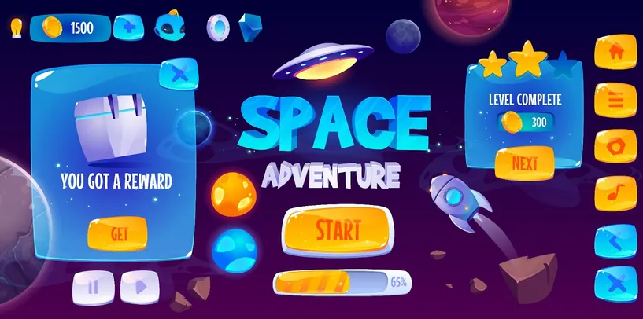</figure>

How can the reward system help their development? The article explores the reward system for recreational games, makes changes to it and highlights areas for improvement in educational games.

<a href="https://youtu.be/DQW8m16m1L4">Magic Bridge Tutorial in Houdini and Unreal Engine.</a>

<iframe allow="accelerometer; autoplay; clipboard-write; encrypted-media; gyroscope; picture-in-picture" allowfullscreen="" frameborder="0" height="315" src="https://www.youtube.com/embed/DQW8m16m1L4" title="YouTube video player" width="560"></iframe>

Tutorial creator and Houdini artist Simon Verstraete has released a new video on how to create a magic bridge with a formation effect using Houdini and Unreal Engine. This is just the first part of a two-part tutorial on working with Houdini. In the near future, Simon plans to release a second part devoted to working with the Unreal Engine.

<a href="https://youtu.be/JeUuk-g_Qws">How the episode Jibaro from Netflix’s Love, Death+Robots was created.</a>

<iframe allow="accelerometer; autoplay; clipboard-write; encrypted-media; gyroscope; picture-in-picture" allowfullscreen="" frameborder="0" height="315" src="https://www.youtube.com/embed/JeUuk-g_Qws" title="YouTube video player" width="560"></iframe>

Director Alberto Mielgo shared “behind the scenes” of the project.

<a href="https://80.lv/articles/creating-voxel-style-games-with-rpg-in-a-box/">Creating voxel games with RPG in a Box.</a>

<figure class="aligncenter size-large">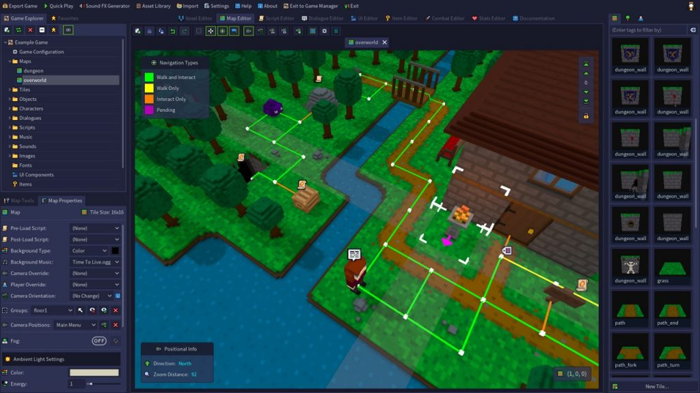</figure>

Justin Arnold spoke about the features of the RPG in a Box tool, explained why the system uses voxels and shared his plan for the program.

<a href="https://github.com/EmbarkStudios/kajiya/blob/main/docs/gi-overview.md">A new global lighting system in the Kajiya engine.</a>

<iframe allow="accelerometer; autoplay; clipboard-write; encrypted-media; gyroscope; picture-in-picture" allowfullscreen="" frameborder="0" height="315" src="https://www.youtube.com/embed/_1g-XhlI_5A" title="YouTube video player" width="560"></iframe>

Tomasz Stochastic demonstrated the new Kajiya global illumination system and spoke in detail about it.

<a href="https://80.lv/articles/recreating-gothic-architecture-in-substance-3d-unreal-engine-5/">Recreating Gothic architecture in Substance 3D and Unreal Engine 5.</a>

<figure class="aligncenter size-large"></figure>

Mika Kuwilsky talked about working on the Gothic Architecture project, shared the lighting setup, and explained how to solve the problem of repeating sections.

<a href="https://youtu.be/__dSLc7-Cpo">How to turn a 2D fractal into 3D.</a>

<iframe allow="accelerometer; autoplay; clipboard-write; encrypted-media; gyroscope; picture-in-picture" allowfullscreen="" frameborder="0" height="315" src="https://www.youtube.com/embed/__dSLc7-Cpo" title="YouTube video player" width="560"></iframe>

The video shows several ways to do this.

<em>We thank <a href="https://suvitruf.ru">Andrei Apanasik</a> for writing the original post and allowing us to publish it on our blog in English.</em>

